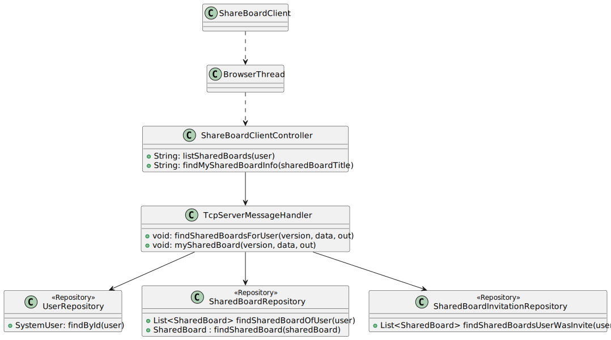
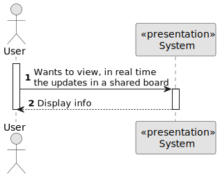
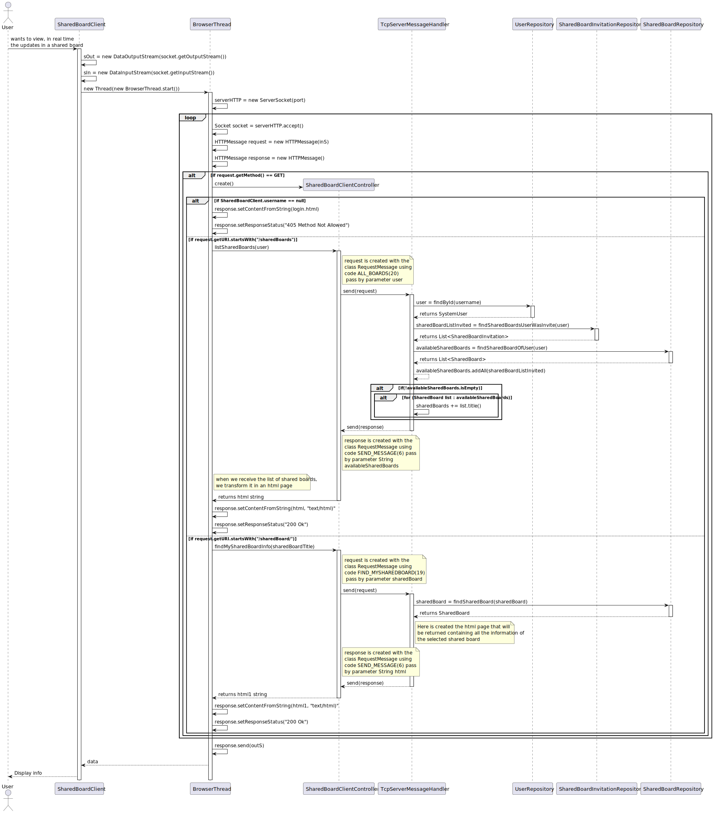
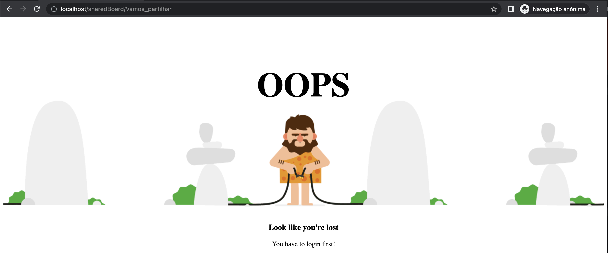
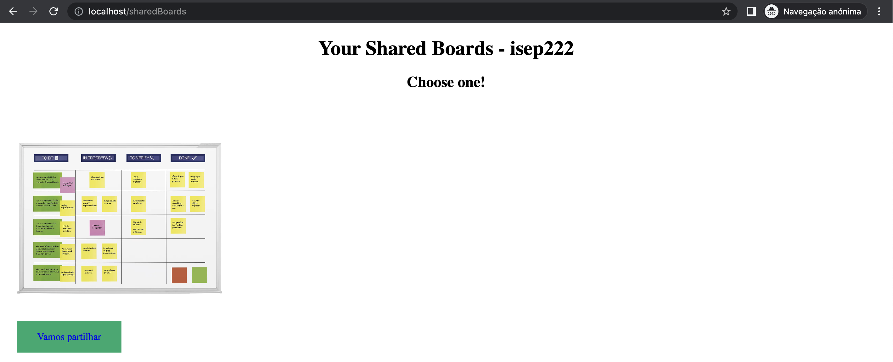
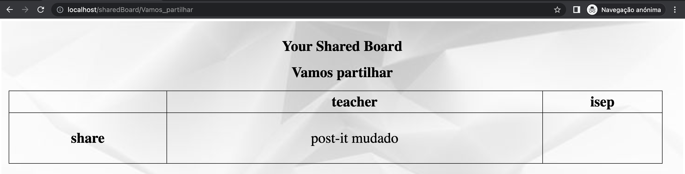
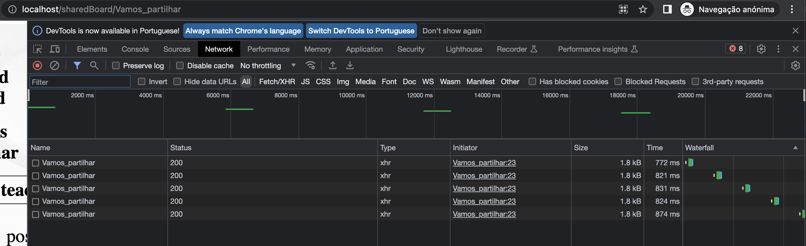

# US 3005 - As User, I want to view, in real-time, the updates in the shared boards

## 1. Context

Implement a functionality for a user to view, in real time, the updates in a shared board

## 2. Requirements

US 3005 - As User, I want to view, in real-time, the updates in the shared boards

This US has some specific acceptance criteria related to RCOMP and SCOMP:
- This functional part of the system has very specific technical requirements, particularly some concerns about synchronization problems.
In fact, several clients will try to concurrently update boards.
</br> As such, the solution design and implementation must be based on threads, condition variables and mutexes. Specific requirements will be provided in SCOMP.
The client app should implement an HTTP server to be able to generate the "views" of the boards. This should be done automatically, without the intervention of the users (i.e., without reload of the web page) by using AJAX.

## 3. Analysis

The user has to go to a browser and put: "localhost/sharedBoards" in order to be able to visualize the two shared boards. If he has not yet logged in,
a page will be shown indicating that he has to log in first. After this step, you will be able to see and select the desired one. When selected, they go
to a web browser like /sharedBoard/Board_title, where they will have access to the information on the board, in real time.

## 4. Design

### 4.1. Realization

This US allows the user to see, in real time, all his boards, those he created and those he was invited to, 
with any type of permission. When selecting the board you want to see, this is also constantly being updated.

#### 4.2.1. Class Diagram - CD



#### 4.2.2. System Sequence Diagram - SSD



#### 4.2.3. Sequence Diagram - SD



There are three options:
- If the person places the link to the list of shared boards and has not logged in, an html page is shown.
- When the user is already logged in, after placing the link, a request is made to list the user's shared boards, the returned list, which comes in a string, will be transformed into an html page.
- When the user selects the one he wants to see, we will fetch the information from the meme and the returned string already comes in the html format
### 4.4. Applied Patterns

* Controller
* Threads

### 4.5. Tests

*It wasn't done any tests to repositories methods, only for the domain level, because of not
being required at this stage to do so.*

## 5. Implementation

**Browser Thread:**
```` 
public class BrowserThread extends Thread{
    public static ServerSocket serverHTTP;
    Socket sock;
    DataInputStream inS;
    DataOutputStream outS;

    SharedBoardClientController sharedBoardClientController = new SharedBoardClientController();
    public void run() {
        try {
            serverHTTP = new ServerSocket(80);
        } catch (IOException e) {
            throw new RuntimeException(e);
        }
        while(true){
            try {
                sock = serverHTTP.accept();
            } catch (IOException e) {
                throw new RuntimeException(e);
            }
            try {
                outS = new DataOutputStream(sock.getOutputStream());
                inS = new DataInputStream(sock.getInputStream());
            } catch (IOException ex) {
                System.out.println("Thread error on data streams creation");
            }
            try {
                HTTPmessage request = new HTTPmessage(inS);
                HTTPmessage response = new HTTPmessage();
                // System.out.println(request.getURI());

                if (request.getMethod().equals("GET")) {
                    if(SharedBoardClient.userName == null){
                        response.setContentFromFile("base.app.sharedBoardApp/src/main/java/eapli/HTTP/www/login.html");
                        response.setResponseStatus("405 Method Not Allowed");
                    }
                    else if(request.getURI().startsWith("/sharedBoards")){
                        String user = String.format("%s", SharedBoardClient.userName);
                        String html = sharedBoardClientController.listSharedBoards(user);
                        response.setContentFromString(html, "text/html");
                        response.setResponseStatus("200 Ok");
                    }
                    else if(request.getURI().startsWith("/sharedBoard/")){
                        String uri = request.getURI();
                        int lastSlashIndex = uri.lastIndexOf("/");

                        if (lastSlashIndex != -1 && lastSlashIndex < uri.length() - 1) {
                            String sharedBoardTitle = uri.substring(lastSlashIndex + 1);
                            sharedBoardTitle = sharedBoardTitle.replace("_", " ");
                            String html1 = sharedBoardClientController.findMySharedBoardInfo(sharedBoardTitle);
                            response.setContentFromString(html1, "text/html");
                            response.setResponseStatus("200 Ok");
                        }
                    }
                    response.send(outS);
                    sock.close();
                }
            } catch (IOException e) {
                throw new RuntimeException(e);
            }
        }


    }
}

````

**Shared Board Client Controller:**
```` 
    public String listSharedBoards(String user) throws IOException {
        String data = String.format("%s", user);

        RequestMessage request = new RequestMessage(version, MessageCode.ALL_BOARDS, data);
        byte[] messageBytes = request.getBytes();
        sOut.writeInt(messageBytes.length);
        sOut.write(messageBytes);

        // Receive the server response
        int responseLength = sIn.readInt();
        byte[] responseBytes = sIn.readNBytes(responseLength);
        RequestMessage response = new RequestMessage(responseBytes);

        if(response.code() == 6){
            byte[] dataBytes = response.data();
            List<String> listToString = List.of(Convert.convertBytesToString(dataBytes).split("\n"));
            String html = mySharedBoards(listToString);
            return html;
        }
        else if (response.code() == 3){
            return null;
        }
        return null;
    }

    public static synchronized String mySharedBoards(List<String> sharedBoardsList) {
                String username = userName;
        String textHTML = "<!DOCTYPE html>\n" +
                "<html>\n" +
                "<head>\n" +
                "<meta name=\"viewport\" content=\"width=device-width, initial-scale=1\">\n" +
                "<style>" +
                CssReader.ReadFile(System.getProperty("user.dir") + "/base.app.sharedBoardApp/src/main/java/eapli/HTTP/www/listBoards.css") +
                "</style>" +
                "<script>" + CssReader.ReadFile(System.getProperty("user.dir") + "/base.app.sharedBoardApp/src/main/java/eapli/HTTP/www/ListBoardsAjax.js") + "</script>" +
                "</head>\n" +
                "<body onload=\"updateBoardsList()\"> \n" +
                "<div id=\"boards\">\n" +
                "<h1>Your Shared Boards - " + username +"</h1>\n" +
                "<h2>Choose one!</h2>\n" +
                "<div class=\"container\">";
        for (String boards : sharedBoardsList) {
            textHTML += "<div class=\"container\">" +
                    "  \n" +
                    "    <div class=\"text\"><a href=\"http://localhost/sharedBoard/" + boards.replace(" ", "_") + "\">" + boards + "</a></div>\n" +
                    "</div>\n";
        }

        textHTML += "</div>\n" +
                "</body>\n" +
                "</html>";

        return textHTML;
    }

    public String findMySharedBoardInfo(String sharedBoard) throws IOException {
        String data = String.format("%s", sharedBoard);

        RequestMessage request = new RequestMessage(version, MessageCode.FIND_MYSHAREDBOARD, data);
        byte[] messageBytes = request.getBytes();
        SharedBoardClient.sOut.writeInt(messageBytes.length);
        sOut.write(messageBytes);

        // Receive the server response
        int responseLength = sIn.readInt();
        byte[] responseBytes = sIn.readNBytes(responseLength);
        RequestMessage response = new RequestMessage(responseBytes);

        if(response.code() == 6){
            byte[] dataBytes = response.data();
            String htmlToString = Convert.convertBytesToString(dataBytes);
            return htmlToString;
        }
        else if (response.code() == 3){
            return null;
        }
        return null;
    }
````

**TcpServerMessageHandler:**

```` 
/**
     * Sends to the user the list of shared boards available to him
     * Shared boards that he create and shared boards he was invited to (with both permissions)
     *
     * @param version
     * @param data
     * @param out
     * @throws IOException
     */
    private void findSharedBoardsForUser(byte version, String data, DataOutputStream out) throws IOException {
        if (data != null) {
            SystemUser user = userRepository.findById(Username.valueOf(data));
            if (user == null) {
                String error = String.format("Owner not found!");
                sendErrorResponse(version, error, out);
            } else {
                List<SharedBoard> sharedBoardListInvited = (List<SharedBoard>) sharedBoardInvitationRepository.findSharedBoardsUserWasInvite(user);
                List<SharedBoard> availableSharedBoards = (List<SharedBoard>) sharedBoardRepository.findSharedBoardOfUser(user);

                availableSharedBoards.addAll(sharedBoardListInvited);

                if (!availableSharedBoards.isEmpty()) {
                    String sharedBoards = "";
                    for (SharedBoard list : availableSharedBoards) {
                        sharedBoards += list.title() + "\n";
                    }
                    sendMessage(version, out, sharedBoards);
                } else sendErrorResponse(version, "You have no shared boards!", out);
            }
        } else {
            sendErrorResponse(version, "Null data", out);
        }
    }


    public synchronized void mySharedBoard(byte version, String data, DataOutputStream out) throws IOException {
        SharedBoard sharedBoard = sharedBoardRepository.findSharedBoard(data);

        List<SharedBoardColumn> columns = sharedBoard.columns();
        List<Row> rows = sharedBoard.rows();
        String textHtml = "<!DOCTYPE html>" +
                "<html>" +
                "<head>" +
                "<meta charset=\"utf-8\">" +
                "<title>Shared Board</title>" +
                "<script>" + CssReader.ReadFile(System.getProperty("user.dir") + "/base.app.sharedBoardServer/src/main/java/eapli/BoardAjax.js") + "</script>" +
                "</head>" +
                "<body onload=\"updateBoard()\">" +
                "<div id=\"table\">" +
                "<h1> Your Shared Board </h1>" +
                "<h1>"+ sharedBoard.title() +"</h1>" +
                "<style>" +
                CssReader.ReadFile(System.getProperty("user.dir") + "/base.app.sharedBoardServer/src/main/java/eapli/viewBoard.css") +
                "</style>" +
                "<table>";


        textHtml += "<tr><td></td>";
        for (SharedBoardColumn column : columns) {
            textHtml += "<td><b>" + column.title() + "</b></td>";
        }
        textHtml += "</tr>";

        for(Row row: rows){
            textHtml += "<tr><td><b>" + row.title() + "</b></td>";
            for(SharedBoardColumn column : columns){
                Cell cell = cellRepository.findCell(row.title(), column.title());
                PostIt postIt = postItRepository.findPostIt(cell);
                if(postIt == null){
                    textHtml += "<td></td>";
                }
                else{
                    String content = postIt.content();
                    String img = "https://";

                    if(content.substring(0,Math.min(content.length(), 8)).equals(img)){
                        textHtml += "<td></td>";
                    }
                    else {
                        textHtml += "<td><div><p>" + postIt.content() + "</p></div></td>";
                    }
                }

            }

            textHtml += "</tr>";
        }

        textHtml += "</table></div></body></html>";

        sendMessage(version, out, textHtml);

    }
````


**List Board Ajax:**

```` 
function updateBoardsList(){
    let request = new XMLHttpRequest();
    let boards = document.getElementById("boards");

    request.onload = () => {
        boards.innerHTML = request.responseText;
        setTimeout(updateBoardsList, 5000);
    }

    request.ontimeout = () => {
        boards.innerHTML = "Server timeout, trying again...";
        setTimeout(updateBoardsList, 200);
    }

    request.onerror = () => {
        boards.innerHTML = "No server reply, trying again...";
        setTimeout(updateBoardsList, 5000);
    }

    request.open("GET", "/sharedBoards", true);
    request.timeout = 5000;
    request.send();
}
````

**Board Ajax:**

```` 
function updateBoard(){
    let request = new XMLHttpRequest();
    let boards = document.getElementById("table");

    request.onload = () => {
        boards.innerHTML = request.responseText;
        setTimeout(updateBoard, 5000);
    }

    request.ontimeout = () => {
        boards.innerHTML = "Server timeout, trying again...";
        setTimeout(updateBoard, 200);
    }

    request.onerror = () => {
        boards.innerHTML = "No server reply, trying again...";
        setTimeout(updateBoard, 5000);
    }
    let url = "/sharedBoard/".concat(location.href.split("sharedBoard/")[1]);

    request.open("GET", url, true);
    request.timeout = 5000;
    request.send();
}
````
## 6. Integration/Demonstration

As we can see below, as isep222, in this case, has not yet performed the login, the page mentioned above appears. 
After this step, we have access to the shared board that isep222 created, this page is also being updated.
When we select the title of the board, we have access to it and it is always being updated, as we can see in the inspect page.







## 7. Observations

*Access to the repository is always done in the same way.
For this reason, an example sequence diagram has been created to demonstrate this.
To exemplify, we list all existing questions in the repository of questions.*


*Like the repositories, the authentication part always follows the same order of ideas.
In this way, we perform a general SD that demonstrates the entire process. In the diagram, US 1008 is taken as an example,
as a Student, I want to request my enrollment in a course.*

