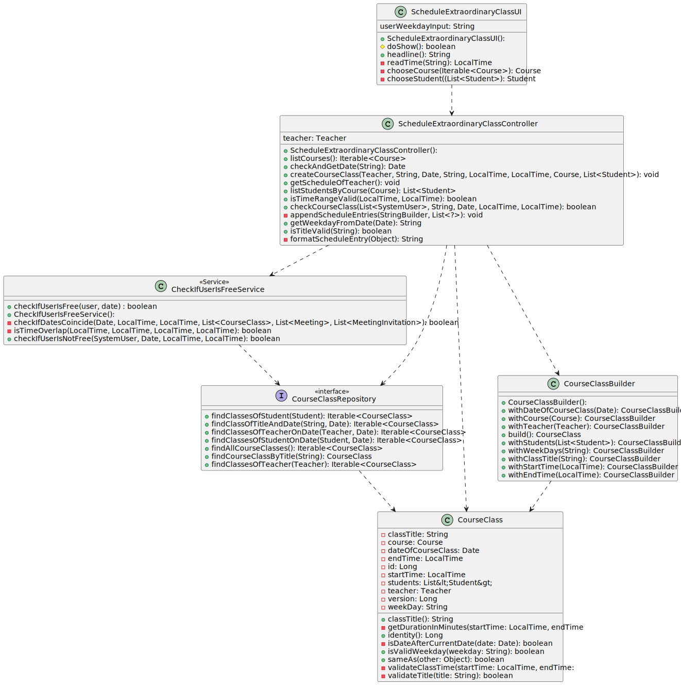
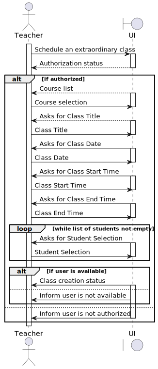
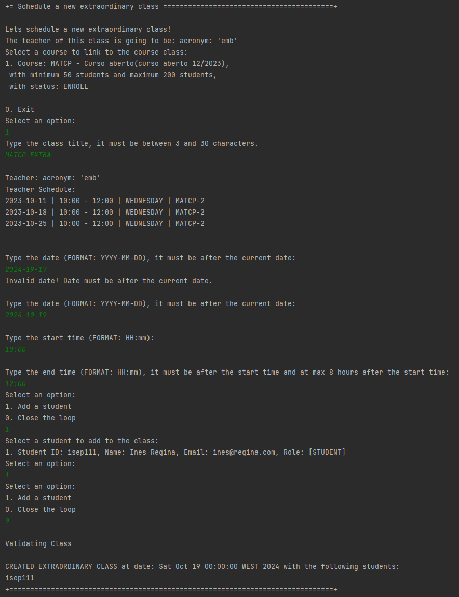
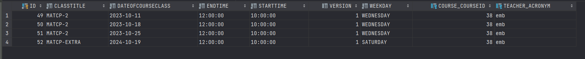
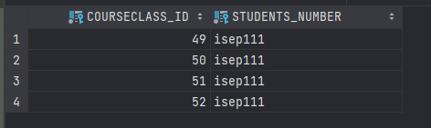

# US 1011 - As Teacher, I want to schedule an extraordinary class

## 1. Context

Implement a functionality for the teacher to schedule an extraordinary class.

## 2. Requirements

This US description is "As Teacher, I want to schedule an extraordinary class".
I need to have courses and teachers created and persisted in the system.

## 3. Analysis

To implement this US, the system asks for the Class information, validates it, it also asks for a Course to link to the class, the students will be chosen by the user, 
we'll only need a date since the class is not recurrent, when this is done we're going to verify if all the students/teacher are free in the specified date, if they are we're going to create the class,
if not we're going to ignore it or return an error message if the teacher is not free.

NOTES:
- The system has to validate all the classes and all the meetings any User has, and because of that it might take a while to create a class.
- Only Teachers can create extraordinary classes.

## 4. Design

### 4.1. Realization

This US consists of some steps, first we need to add a title, then select a course,
after that we need to select a date, then we need to select a start and end time.
The teacher is automatically added to the class, and the students are added from the course, then chose by the teacher.
We get the teacher from the user that is currently logged in, therefore we only allow teachers to create classes.
We also need to check if the teacher is free in the specified date, if not we're going to return an error message.
We also need to check if the students are free in the specified date, if not we're going to ignore them.


### 4.2. Diagrams

#### 4.2.1. Class Diagram - CD



#### 4.2.2. System Sequence Diagram - SSD



#### 4.2.3. Sequence Diagram - SD


### 4.3. Applied Patterns

Controller, Service and Builder.

### 4.4. Tests

**Utils:** *These were the variables used to create a class.*

```
final SystemUserBuilder userBuilder = UserBuilderHelper.builder();
    final TeacherBuilder teacherBuilder = new TeacherBuilder();
    final StudentBuilder studentBuilder = new StudentBuilder();

    final List<Student> students = new ArrayList<>();
    final SystemUser teacher1 = userBuilder
            .withUsername("Teacher")
            .withEmail("Teacher@email.com")
            .withPassword("Password1")
            .withName("TeacherFstName", "TeacherLstName")
            .withRoles(BaseRoles.TEACHER)
            .build();

    final SystemUser student1 = userBuilder
            .withUsername("Student")
            .withEmail("Student@email.com")
            .withPassword("Password1")
            .withName("StudentFstName", "StudentLstName")
            .withRoles(BaseRoles.STUDENT)
            .build();


    Teacher teacher = teacherBuilder.withSystemUser(teacher1).withAcronym("acr").build();
    Student student = studentBuilder.withSystemUser(student1).withMecanographicNumber("1212121").build();

    Course course = new CourseBuilder()
            .withCode("JAVA-1")
            .withName(new CourseName("course name"))
            .withDescription("course description")
            .hasMinStudents(10)
            .hasMaxStudents(20)
            .build();

    LocalDate today = LocalDate.now();
    LocalDate dateIn3Day = today.plusDays(3);
    Date date = Date.from(dateIn3Day.atStartOfDay().toInstant(java.time.ZoneOffset.UTC));

    LocalTime now = LocalTime.now();
    LocalTime after = now.plusHours(1);
```

**Test 1:** *Ensures we can't create a course without a teacher*

```
@org.junit.Test
    public void ensureCantCreateCourseClassWithNullTeacher() {

        students.add(student);

        Assertions.assertThrows(IllegalArgumentException.class, () -> {
            new CourseClass(null, "Class Title", date, "MONDAY", now, after, course, students);
        });
    }
````

**Test 2:** *Ensures we can't create a course without a title*

```
@org.junit.Test
    public void ensureCantCreateCourseClassWithNullClassTitle() {

        students.add(student);

        Assertions.assertThrows(IllegalArgumentException.class, () -> {
            new CourseClass(teacher, null, date, "MONDAY", now, after, course, students);
        });

    }
````

**Test 3:** *Ensures we can't create a course without a date*

```
@org.junit.Test
    public void ensureCantCreateCourseClassWithNullDate() {

        students.add(student);

        Assertions.assertThrows(IllegalArgumentException.class, () -> {
            new CourseClass(teacher, "Class Title", null, "MONDAY", now, after, course, students);
        });
    }
````

**Test 4:** *Verifies that we can't create a course without a weekday.*

```
@org.junit.Test
    public void ensureCantCreateCourseClassWithNullWeekDays() {

        students.add(student);

        Assertions.assertThrows(IllegalArgumentException.class, () -> {
            new CourseClass(teacher, "Class Title", date, null, now, after, course, students);
        });
    }
````

**Test 5:** *Verifies that we the title has to be between 3 and 30 chars.*

```
@org.junit.Test
public void ensureTitleMustBeBetween3And30Characters() {
students.add(student);
String weekDay = "MONDAY";

        Assertions.assertThrows(IllegalArgumentException.class, () -> {
            new CourseClass(teacher, "AB", date, weekDay, now, after, course, students);
        });

        Assertions.assertThrows(IllegalArgumentException.class, () -> {
            new CourseClass(teacher, "A Title That Exceeds Maximum Character Limit", date, weekDay, now, after, course, students);
        });

        Assertions.assertDoesNotThrow(() -> {
            new CourseClass(teacher, "Valid Title", date, weekDay, now, after, course, students);
        });
    }
````

**Test 6:** *Verifies that the dates are valid*

```
@org.junit.Test
public void ensureDateOfCourseClassMustBeAfterCurrentDate() {
students.add(student);
String weekDay = "MONDAY";
String classTitle = "Class Title";

        LocalDate today = LocalDate.now();
        LocalDate dateBefore = today.minusDays(3);
        LocalDate dateAfter = today.plusDays(3);
        Date pastDate = Date.from(dateBefore.atStartOfDay().toInstant(java.time.ZoneOffset.UTC));
        Date futureDate = Date.from(dateAfter.atStartOfDay().toInstant(java.time.ZoneOffset.UTC));

                Assertions.assertThrows(IllegalArgumentException.class, () -> {
                    new CourseClass(teacher, classTitle, pastDate, weekDay, now, after, course, students);
                });

        Assertions.assertDoesNotThrow(() -> {
            new CourseClass(teacher, classTitle, futureDate, weekDay, now, after, course, students);
        });
    }
````

**Test 7:** *Verifies that the start time is before the end time.*

```
@org.junit.Test
    public void ensureClassTimeMustBeValid() {
        students.add(student);
        String weekDay = "MONDAY";
        String classTitle = "Class Title";

        LocalTime invalidStartTime =  LocalTime.of(22, 59, 59); // create an invalid start time (23:59:59
                LocalTime invalidEndTime = LocalTime.of(0, 0, 0); // create an invalid end time (00:00:00)

                Assertions.assertThrows(IllegalArgumentException.class, () -> {
                    new CourseClass(teacher, classTitle, date, weekDay, invalidStartTime, after, course, students);
                });

        Assertions.assertThrows(IllegalArgumentException.class, () -> {
            new CourseClass(teacher, classTitle, date, weekDay, now, invalidEndTime, course, students);
        });

        Assertions.assertDoesNotThrow(() -> {
            new CourseClass(teacher, classTitle, date, weekDay, now, after, course, students);
        });
    }
````


## 5. Implementation

**ScheduleExtraordinaryClassUI:**

```
@Override
    protected boolean doShow() {
        try {

            Scanner scanner = new Scanner(System.in);

            List<SystemUser> systemUserList = new ArrayList<>();
            List<Student> extraordinaryStudents = new ArrayList<>();

            Course theCourse = null;
            String title = null;
            String dateString = null;
            LocalTime startTime = null;
            LocalTime endTime = null;


            if (authorizationService.isAuthenticatedUserAuthorizedTo(BaseRoles.TEACHER)) {
                System.out.println("Lets schedule a new extraordinary class!");

                Teacher teacher = theController.getTeacher();

                if (teacher == null) {
                    System.out.println("Login as a teacher to perform this action.");
                    return false;
                }

                System.out.println("The teacher of this class is going to be: " + teacher.acronym());

                Iterable<Course> coursesList = theController.listCourses();

                if (coursesList == null) {
                    System.out.println("There are no courses available. Please try again.");
                    return false;
                }

                theCourse = chooseCourse(coursesList);

                if (theCourse == null) {
                    System.out.println("There are no courses available. Please try again.");
                    return false;
                }

                List<Student> studentList = theController.listStudentsByCourse(theCourse);

                if (studentList.isEmpty()) {
                    System.out.println("There are no students in this course. Please try again.");
                    return false;
                }

                while (true) {
                    title = Console.readLine("Type the class title, it must be between 3 and 30 characters. ");
                    if (theController.isTitleValid(title)) {
                        break;
                    } else {
                        System.out.println("Invalid title! Title must be between 3 and 30 characters.");
                    }
                }

                theController.getScheduleOfTeacher();

                while (true) {
                    dateString = Console.readLine("\nType the date (FORMAT: YYYY-MM-DD), it must be after the current date:");
                    if (theController.checkAndGetDate(dateString) != null) {
                        break;
                    } else {
                        System.out.println("Invalid date! Date must be after the current date.");
                    }
                }

                while (true) {
                    startTime = readTime("\nType the start time (FORMAT: HH:mm): ");
                    endTime = readTime("\nType the end time (FORMAT: HH:mm), it must be after the start time and at max 8 hours after the start time:");
                    if (theController.isTimeRangeValid(startTime, endTime)) {
                        break;
                    } else {
                        System.out.println("Invalid time range! End time must be after the start time and the time range must be at max 8 hours, try again.");
                    }
                }

                Date date = theController.checkAndGetDate(dateString);
                String weekDay = theController.getWeekdayFromDate(date);

                boolean keepAddingStudents = true;

                while (keepAddingStudents) {
                    System.out.println("Select an option:");
                    System.out.println("1. Add a student");
                    System.out.println("0. Close the loop");

                    int option = scanner.nextInt();
                    scanner.nextLine(); // Consume the newline character

                    switch (option) {
                        case 1:
                            Student theStudent = chooseStudent(studentList);
                            if (theStudent != null) {
                                extraordinaryStudents.add(theStudent);
                                studentList.remove(theStudent); // Remove the selected student from the original list
                            }
                            break;
                        case 0:
                            keepAddingStudents = false;
                            break;
                        default:
                            System.out.println("Invalid option");
                    }
                }

                if (extraordinaryStudents.isEmpty()) {
                    System.out.println("No added students found. Please try again.");
                    return false;
                }

                systemUserList.add(teacher.user());
                for (Student student : extraordinaryStudents) {
                    systemUserList.add(student.user());
                }

                if (theController.checkCourseClass(systemUserList, title, date, startTime,endTime)) {
                    theController.createCourseClass(teacher, title, date, weekDay, startTime, endTime, theCourse, extraordinaryStudents);
                    System.out.println("\nCREATED EXTRAORDINARY CLASS at date: " + date.toString() + " with the following students:");
                    for (Student student : extraordinaryStudents) {
                        System.out.println(student.user().identity());
                    }
                } else {
                    System.out.println("\nIGNORED EXTRAORDINARY CLASS at date: " + date.toString());
                    System.out.println("There is already a class or meeting scheduled for this teacher at the date , or none of the students are free at this time.");
                }
            } else {
                System.out.println("You are not authorized to perform this action");
                return false;
            }
        } catch (IntegrityViolationException | ConcurrencyException ex) {
            LOGGER.error("Error performing the operation", ex);
            System.out.println(
                    "Unfortunately there was an unexpected error in the application. Please try again and if the problem persists, contact your system administrator.");
        }
        return true;
    }
```


**ScheduleExtraordinaryClassController:**

```

/**
 * The type Schedule extraordinary class controller.
 */
public class ScheduleExtraordinaryClassController {

   
    /**
     * List courses iterable.
     *
     * @return the iterable
     */
    @Transactional
    public Iterable<Course> listCourses(){
        authorizationService.ensureAuthenticatedUserHasAnyOf(BaseRoles.TEACHER);
        return courseRepository.findCourseWithEnrollStatus();
    }

    /**
     * List students by course list.
     *
     * @param course the course
     * @return the list
     */
    @Transactional
    public List<Student> listStudentsByCourse(Course course){
        authorizationService.ensureAuthenticatedUserHasAnyOf(BaseRoles.TEACHER);
        return enrollmentRepository.findUsersOfCourse(course);
    }

    /**
     * Gets weekday from date.
     *
     * @param date the date
     * @return the weekday from date
     */
    public String getWeekdayFromDate(Date date) {
        Calendar calendar = Calendar.getInstance();
        calendar.setTime(date);

        int dayOfWeek = calendar.get(Calendar.DAY_OF_WEEK);

        switch (dayOfWeek) {
            case Calendar.SUNDAY:
                return "SUNDAY";
            case Calendar.MONDAY:
                return "MONDAY";
            case Calendar.TUESDAY:
                return "TUESDAY";
            case Calendar.WEDNESDAY:
                return "WEDNESDAY";
            case Calendar.THURSDAY:
                return "THURSDAY";
            case Calendar.FRIDAY:
                return "FRIDAY";
            case Calendar.SATURDAY:
                return "SATURDAY";
            default:
                return "Invalid day";
        }
    }

    /**
     * Is title valid boolean.
     *
     * @param title the title
     * @return the boolean
     */
    public boolean isTitleValid(String title) {
        int minLength = 3;
        int maxLength = 30;
        int length = title.length();

        return length >= minLength && length <= maxLength;
    }

    /**
     * Check and get date date.
     *
     * @param date the date
     * @return the date
     */
    public Date checkAndGetDate(String date) {
        LocalDate currentDate = LocalDate.now();
        Date parsedStartDate = null;

        SimpleDateFormat format = new SimpleDateFormat("yyyy-MM-dd");

        try {
            parsedStartDate = format.parse(date);
            String formattedStartDate = format.format(parsedStartDate);
            if (!formattedStartDate.equals(date)) {
                // Invalid format, startDate does not match the expected format "YYYY-MM-DD"
                return null; // Or throw an exception if desired
            }
        } catch (ParseException e) {
            // Invalid format, unable to parse startDate
            return null; // Or throw an exception if desired
        }

        if (parsedStartDate.toInstant().atZone(ZoneId.systemDefault()).toLocalDate().isAfter(currentDate)) {
            return parsedStartDate;
        } else {
            return null; // Or throw an exception if desired
        }
    }

    /**
     * Gets schedule of teacher.
     */
    public void getScheduleOfTeacher() {
        SystemUser user = authorizationService.session().get().authenticatedUser();
        Teacher teacher = teacherRepository.findBySystemUser(user).orElse(null);
        if (teacher == null) {
            System.out.println("Teacher not found.");
            return;
        }

        List<CourseClass> teacherClasses = (List<CourseClass>) courseClassRepository.findClassesOfTeacher(teacher);
        List<Meeting> teacherMeetings = (List<Meeting>) meetingRepository.findMeetingOfUser(user);
        List<MeetingInvitation> teacherMeetingInvitations = (List<MeetingInvitation>) meetingInvitationRepository.findMeetingInvitationOfUserWithStatusAccepted(user);

        StringBuilder scheduleBuilder = new StringBuilder();
        appendScheduleEntries(scheduleBuilder, teacherClasses);
        appendScheduleEntries(scheduleBuilder, teacherMeetings);
        appendScheduleEntries(scheduleBuilder, teacherMeetingInvitations);

        String schedule = scheduleBuilder.toString();
        System.out.printf("%nTeacher: %s%n", teacher.identity());
        System.out.println("Teacher Schedule:");
        System.out.println(schedule);
    }

    private void appendScheduleEntries(StringBuilder scheduleBuilder, List<?> entries) {
        for (Object entry : entries) {
            String scheduleEntry = formatScheduleEntry(entry);
            scheduleBuilder.append(scheduleEntry).append(System.lineSeparator());
        }
    }

    private String formatScheduleEntry(Object entry) {
        if (entry instanceof CourseClass) {
            CourseClass courseClass = (CourseClass) entry;
            return String.format("%s | %s - %s | %s | %s", courseClass.getDateOfCourseClass(), courseClass.getStartTime(),
                    courseClass.getEndTime(), courseClass.getWeekDay(), courseClass.classTitle());
        } else if (entry instanceof Meeting) {
            Meeting meeting = (Meeting) entry;
            return String.format("%s | %s - %s | %s", meeting.getDate(), meeting.getStartTime(),
                    meeting.getEndTime(), meeting.organizer());
        } else if (entry instanceof MeetingInvitation) {
            MeetingInvitation meetingInvitation = (MeetingInvitation) entry;
            return String.format("%s | %s | %s | %s", meetingInvitation.identity(),
                    meetingInvitation.meetingInvitationStatus(), meetingInvitation.meeting().getDate(),meetingInvitation.meeting().organizer());
        }

        return "";
    }

    /**
     * Convert string to date date.
     *
     * @param dateString the date string
     * @return the date
     * @throws ParseException the parse exception
     */

    /**
     * Get teacher teacher.
     *
     * @return the teacher
     */
    public Teacher getTeacher(){
        SystemUser teacher;
        if (authorizationService.session().isPresent()) {
            teacher = this.authorizationService.session().get().authenticatedUser();
            return teacherRepository.findBySystemUser(teacher).get();
        }
        return null;
    }

    /**
     * Is time range valid boolean.
     *
     * @param startTime the start time
     * @param endTime   the end time
     * @return the boolean
     */
    public boolean isTimeRangeValid(LocalTime startTime, LocalTime endTime) {
        return endTime.isAfter(startTime) && Duration.between(startTime, endTime).toHours() <= 8;

    }

    /**
     * Check course class boolean.
     *
     * @param users             the users
     * @param title             the title
     * @param dateOfCourseClass the date of course class
     * @param startTime         the start time
     * @param endTime           the end time
     * @return the boolean
     */
    public boolean checkCourseClass(List<SystemUser> users, String title, Date dateOfCourseClass, LocalTime startTime, LocalTime endTime) {

        System.out.println("\nValidating Class");

        List<SystemUser> removedUsers = new ArrayList<>();

        int counter = 0;


        Iterator<SystemUser> iterator = users.iterator();
        while (iterator.hasNext()) {
            SystemUser user = iterator.next();

            if (user.hasAll(BaseRoles.TEACHER) && checkIfUserIsFreeService.checkIfUserIsNotFree(user, dateOfCourseClass, startTime, endTime)) {
                return false;
            } else if (user.hasAll(BaseRoles.STUDENT) && checkIfUserIsFreeService.checkIfUserIsNotFree(user, dateOfCourseClass, startTime, endTime)) {
                iterator.remove(); // Remove the user using the iterator
                removedUsers.add(user);
                counter++;
            }
        }

        if (users.size() == 1 && users.get(0).hasAll(BaseRoles.TEACHER)) {
            System.out.println("\nThere are no students available for the Class with title " + title + " on " + dateOfCourseClass + " at " + startTime + " - " + endTime + ".");
            return false;
        }


        if (counter > 0) {
            System.out.println("\nNumber of students removed from the Class with title " + title + " on " + dateOfCourseClass + " is " + counter + " students.");
            System.out.println("\nRemoved students:");
            for (SystemUser user : removedUsers) {

                System.out.printf("User identity: %s, User username: %s, User name: %s%n", user.identity(), user.username(), user.name());
            }
        }

        return true;
    }


    /**
     * Create course class.
     *
     * @param teacher           the teacher
     * @param title             the title
     * @param dateOfCourseClass the date of course class
     * @param weekDay           the week day
     * @param startTime         the start time
     * @param endTime           the end time
     * @param course            the course
     * @param students          the students
     */
    public void createCourseClass(Teacher teacher, String title, Date dateOfCourseClass, String weekDay, LocalTime startTime, LocalTime endTime, Course course, List<Student> students) {

        final CourseClass newCourseClass = new CourseClassBuilder().withTeacher(teacher).withClassTitle(title).withDateOfCourseClass(dateOfCourseClass).withCourse(course).withStudents(students).
                withWeekDays(weekDay).withStartTime(startTime).withEndTime(endTime).build();

        courseClassRepository.save(newCourseClass);
    }
```

**CheckIfUserIsFreeService:**

```
/**
     * Check if user is not free boolean.
     *
     * @param user      the user
     * @param date      the date
     * @param startTime the start time
     * @param endTime   the end time
     * @return the boolean
     */
    public boolean checkIfUserIsNotFree(SystemUser user, Date date, LocalTime startTime, LocalTime endTime) {
        List<CourseClass> courseClassList = new ArrayList<>();
        List<Meeting> meetingList = new ArrayList<>();
        List<MeetingInvitation> meetingInvitationList = new ArrayList<>();

        if (user.hasAll(BaseRoles.TEACHER)) {
            Optional<Teacher> optionalTeacher = teacherRepository.findBySystemUser(user);
            if (optionalTeacher.isPresent()) {
                Teacher teacher = optionalTeacher.get();
                courseClassList.addAll((Collection<? extends CourseClass>) courseClassRepository.findClassesOfTeacher(teacher));
                meetingList.addAll((Collection<? extends Meeting>) meetingRepository.findMeetingOfUser(teacher.user()));
                meetingInvitationList.addAll((Collection<? extends MeetingInvitation>) meetingInvitationRepository.findMeetingInvitationOfUserWithStatusAccepted(teacher.user()));
            } else {
                throw new IllegalArgumentException("TEACHER NOT FOUND WHEN CHECKING IF USER IS FREE");
            }
        }

        if (user.hasAll(BaseRoles.STUDENT)) {
            Student student = studentRepository.findBySystemUser(user);
            courseClassList.addAll((Collection<? extends CourseClass>) courseClassRepository.findClassesOfStudent(student));
            meetingList.addAll((Collection<? extends Meeting>) meetingRepository.findMeetingOfUser(student.user()));
            meetingInvitationList.addAll((Collection<? extends MeetingInvitation>) meetingInvitationRepository.findMeetingInvitationOfUserWithStatusAccepted(student.user()));
        }

        if (user.hasAny(BaseRoles.POWER_USER, BaseRoles.MANAGER)) {
            meetingList.addAll((Collection<? extends Meeting>) meetingRepository.findMeetingOfUser(user));
            meetingInvitationList.addAll((Collection<? extends MeetingInvitation>) meetingInvitationRepository.findMeetingInvitationOfUserWithStatusAccepted(user));
        }

        return checkIfDatesCoincide(date, startTime, endTime, courseClassList, meetingList, meetingInvitationList);
    }

    private boolean checkIfDatesCoincide(Date date, LocalTime startTime, LocalTime endTime,
                                         List<CourseClass> courseClassList, List<Meeting> meetingList,
                                         List<MeetingInvitation> meetingInvitationList) {
        for (CourseClass courseClass : courseClassList) {
            if (courseClass.getDateOfCourseClass().equals(date) && isTimeOverlap(startTime, endTime, courseClass.getStartTime(), courseClass.getEndTime())) {
                return true;
            }
        }

        for (Meeting meeting : meetingList) {
            if (meeting.getDate().equals(date) && isTimeOverlap(startTime, endTime, meeting.getStartTime(), meeting.getEndTime())) {
                return true;
            }
        }

        for (MeetingInvitation meetingInvitation : meetingInvitationList) {
            Meeting meeting = meetingInvitation.meeting();
            if (meeting.getDate().equals(date) && isTimeOverlap(startTime, endTime, meeting.getStartTime(), meeting.getEndTime())) {
                return true;
            }
        }

        return false;
    }

    private boolean isTimeOverlap(LocalTime startTime1, LocalTime endTime1, LocalTime startTime2, LocalTime endTime2) {
        return startTime1.isBefore(endTime2) && endTime1.isAfter(startTime2) ||
                startTime2.isBefore(endTime1) && endTime2.isAfter(startTime1) ||
                startTime1.equals(startTime2) && endTime1.equals(endTime2);
    }
```

**JpaCourseClassRepository:**

```
@Override
    public Iterable<CourseClass> findAllCourseClasses() {
        final TypedQuery<CourseClass> query = entityManager().createQuery(
                "SELECT courseClass FROM CourseClass courseClass",
                CourseClass.class);

        return query.getResultList();
    }

    @Override
    public CourseClass findCourseClassByTitle(String className) {
        TypedQuery<CourseClass> query = entityManager().createQuery(
                "SELECT courseClass FROM CourseClass courseClass WHERE courseClass.classTitle = :title", CourseClass.class);
        query.setParameter("title", className);

        try {
            return query.getSingleResult();
        } catch (NoResultException e) {
            return null; // CourseClass not found
        }
    }

    @Override
    public Iterable<CourseClass> findClassesOfStudent(Student studentToCheck) {
        List<CourseClass> coursesClassesStudent = new ArrayList<>();
        CourseClassRepository courseClassRepository = PersistenceContext.repositories().courseClassRepository();
        List<CourseClass> courseClasses = (List<CourseClass>) courseClassRepository.findAllCourseClasses();
        StudentRepository studentRepository = PersistenceContext.repositories().studentRepository();
        Student student = studentRepository.findByMecanographicNumber(studentToCheck.identity());
        for (CourseClass courseClass : courseClasses) {
            if (courseClass.getStudents().contains(student)) {
                coursesClassesStudent.add(courseClass);
            }
        }
        return coursesClassesStudent;
    }

    @Override
    public Iterable<CourseClass> findClassesOfStudentOnDate(Student studentToCheck, Date date) {
        List<CourseClass> coursesClassesStudent = new ArrayList<>();
        CourseClassRepository courseClassRepository = PersistenceContext.repositories().courseClassRepository();
        List<CourseClass> courseClasses = (List<CourseClass>) courseClassRepository.findAllCourseClasses();
        StudentRepository studentRepository = PersistenceContext.repositories().studentRepository();
        Student student = studentRepository.findByMecanographicNumber(studentToCheck.identity());
        for (CourseClass courseClass : courseClasses) {
            if (courseClass.getStudents().contains(student) && courseClass.getDateOfCourseClass().equals(date)) {
                coursesClassesStudent.add(courseClass);
            }
        }
        return coursesClassesStudent;
    }

    @Override
    public Iterable<CourseClass> findClassesOfTeacher(Teacher teacherToCheck) {
        List<CourseClass> coursesClassesTeacher = new ArrayList<>();
        CourseClassRepository courseClassRepository = PersistenceContext.repositories().courseClassRepository();
        List<CourseClass> courseClasses = (List<CourseClass>) courseClassRepository.findAllCourseClasses();
        for (CourseClass courseClass : courseClasses) {
            if (courseClass.getTeacher().identity().equals(teacherToCheck.identity())) {
                coursesClassesTeacher.add(courseClass);
            }
        }
        return coursesClassesTeacher;
    }

    @Override
    public Iterable<CourseClass> findClassesOfTeacherOnDate(Teacher teacherToCheck, Date date) {
        List<CourseClass> coursesClassesTeacher = new ArrayList<>();
        CourseClassRepository courseClassRepository = PersistenceContext.repositories().courseClassRepository();
        List<CourseClass> courseClasses = (List<CourseClass>) courseClassRepository.findAllCourseClasses();
        for (CourseClass courseClass : courseClasses) {
            if (courseClass.getTeacher().identity().equals(teacherToCheck.identity()) && courseClass.getDateOfCourseClass().equals(date)) {
                coursesClassesTeacher.add(courseClass);
            }
        }
        return coursesClassesTeacher;
    }

    @Override
    public Iterable<CourseClass> findClassOfTitleAndDate(String title, Date date) {

        List<CourseClass> coursesClassesTitleAndDate = new ArrayList<>();
        CourseClassRepository courseClassRepository = PersistenceContext.repositories().courseClassRepository();
        List<CourseClass> courseClasses = (List<CourseClass>) courseClassRepository.findAllCourseClasses();
        for (CourseClass courseClass : courseClasses) {
            if (courseClass.classTitle().equals(title) && courseClass.getDateOfCourseClass().equals(date)) {
                coursesClassesTitleAndDate.add(courseClass);
            }
        }
        return coursesClassesTitleAndDate;
    }
```

**CourseClassBuilder:**

```
private Teacher teacher;
    private String classTitle;
    private Date dateOfCourseClass;

    private String weekDay;

    private LocalTime startTime;

    private LocalTime endTime;
    private Course course;

    private List<Student> students;

    /**
     * With teacher course class builder.
     *
     * @param teacher the teacher
     * @return the course class builder
     */
    public CourseClassBuilder withTeacher(Teacher teacher) {
        Preconditions.nonNull(teacher, "Teacher cannot be null");
        this.teacher=teacher;
        return this;
    }

    /**
     * With class title course class builder.
     *
     * @param classTitle the class title
     * @return the course class builder
     */
    public CourseClassBuilder withClassTitle(String classTitle) {
        Preconditions.nonEmpty(classTitle, "Class title cannot be empty");
        this.classTitle = classTitle;
        return this;
    }

    /**
     * With date of course class course class builder.
     *
     * @param dateOfCourseClass the date of course class
     * @return the course class builder
     */
    public CourseClassBuilder withDateOfCourseClass(Date dateOfCourseClass) {
        Preconditions.nonNull(dateOfCourseClass, "Start date cannot be null");
        this.dateOfCourseClass = dateOfCourseClass;
        return this;
    }

    /**
     * With course course class builder.
     *
     * @param course the course
     * @return the course class builder
     */
    public CourseClassBuilder withCourse(Course course) {
        this.course = course;
        return this;
    }

    /**
     * With students course class builder.
     *
     * @param students the students
     * @return the course class builder
     */
    public CourseClassBuilder withStudents(List<Student> students) {
        // Optional: You can perform any additional validations or modifications here.
        // For simplicity, I assume the provided list is valid.
        // If not provided, an empty list will be used.
        this.students = students;
        return this;
    }

    /**
     * With week days course class builder.
     *
     * @param weekDays the week days
     * @return the course class builder
     */
    public CourseClassBuilder withWeekDays(String weekDays) {
        Preconditions.nonNull(weekDays, "Week days cannot be null");
        this.weekDay = weekDays;
        return this;
    }

    /**
     * With start time course class builder.
     *
     * @param startTime the start time
     * @return the course class builder
     */
    public CourseClassBuilder withStartTime(LocalTime startTime) {
        Preconditions.nonNull(startTime, "Start time cannot be null");
        this.startTime = startTime;
        return this;
    }

    /**
     * With end time course class builder.
     *
     * @param endTime the end time
     * @return the course class builder
     */
    public CourseClassBuilder withEndTime(LocalTime endTime) {
        Preconditions.nonNull(endTime, "End time cannot be null");
        this.endTime = endTime;
        return this;
    }

    @Override
    public CourseClass build() {
        Preconditions.nonNull(teacher, "Teacher cannot be null");
        Preconditions.nonNull(classTitle, "Class title cannot be null");
        Preconditions.nonNull(dateOfCourseClass, "Start date cannot be null");
        Preconditions.nonNull(course, "Course cannot be null");
        Preconditions.nonNull(weekDay, "Week days cannot be null");
        Preconditions.nonNull(startTime, "Start time cannot be null");
        Preconditions.nonNull(endTime, "End time cannot be null");


        return new CourseClass(teacher, classTitle, dateOfCourseClass, weekDay, startTime,  endTime, course, students);
    }
```

**CourseClass:**

```
public CourseClass(final Teacher teacher, final String classTitle, final Date dateOfCourseClass,final String weekDay, final LocalTime startTime, final LocalTime endTime ,
                       final Course course, final List<Student> students) {
        Preconditions.noneNull(classTitle, dateOfCourseClass, weekDay,startTime,endTime,course, students,teacher);
        Preconditions.ensure(validateTitle(classTitle), "The title must be between 3 and 30 characters");
        Preconditions.ensure(isDateAfterCurrentDate(dateOfCourseClass), "The date of the course class must be after the current date");
        Preconditions.ensure(validateClassTime(startTime, endTime), "The class time must be valid");
        Preconditions.ensure(isValidWeekday(weekDay), "The week days must be valid");

        this.teacher = teacher;
        this.classTitle = classTitle;
        this.weekDay = weekDay;
        this.startTime = startTime;
        this.endTime = endTime;
        this.course = course;
        this.students = students;
        this.dateOfCourseClass = dateOfCourseClass;
    }
```

## 6. Integration/Demonstration

Below we are creating an extraordinary class, linked to the course MATCP, we pass all the values and as you can see
we're going to instantiate just one class because its extraordinary, we can also check the teacher schedule!



Now, this is that same class on the H2 database with name MATCP-EXTRA



And all the students associated with that class, in this case isep111 with class 52




