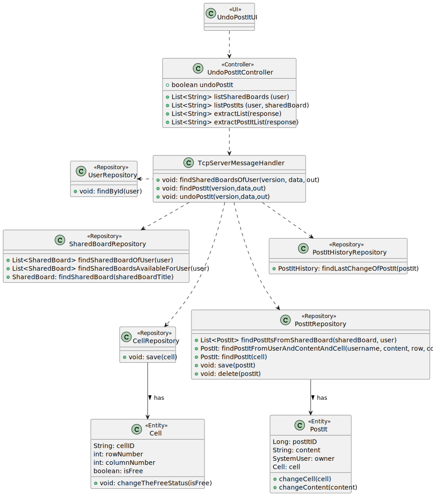
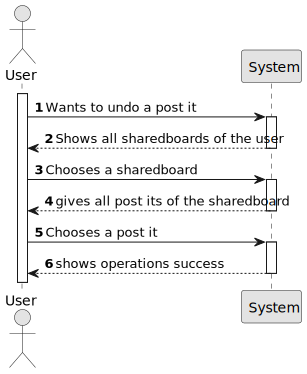

# US 3008 - As User, I want to undo the last change in a post-it

## 1. Context

Implement a functionality so that the user can undo the last change in a post-it.

## 2. Requirements

This US description is "As User, I want to undo the last change in a post-it".

• FRB06 - Undo Post-it Change A user undo the last change in a post-it

• NFR13 - Design and Implement Shared Board Synchronization This functional
part of the system has very specifc technical requirements, particularly some concerns
about synchronization problems. In fact, several clients will try to concurrently update
boards. As such, the solution design and implementation must be based on threads,
condition variables and mutexes. Specifc requirements will be provided in SCOMP.

## 3. Analysis

This US consists of an user undoing the last change in a post-it. To do this, the user
chooses a Shared Board, then a Post-it, and then the system undoes the last change in
that post-it.

## 4. Design

### 4.1. Realization

To do this US, the first step is to choose a Shared Board, this shared board must be owned or shared
with the user. Then, the user chooses a Post-it of that shared board. 
After that, the system undoes the last change in that post-it.

### 4.2. Diagrams

#### 4.2.1- Class Diagram - CD



#### 4.2.2. System Sequence Diagram - SSD



#### 4.2.3. Sequence Diagram - SD


#### 4.3. Applied Patterns

Controller and Service.

### 4.4. Tests

**Test Get Code From String:** *The tests below are included in the Request Message Test class
of tests and verifies that it transforms the string code well into what is associated with it.*
```
testCode = MessageCode.UNDO_POSTIT;
        result = 17;
        System.out.println("Código para " + testCode + ": " + result);
        byte expected17 = getCodeFromString(MessageCode.UNDO_POSTIT);
        Assert.assertEquals(result, expected17);
````

## 5. Implementation

**UndoPostItUI:**
```
protected boolean doShow() {
        try {
            List<String> listSharedBoards = theController.listSharedBoards(SharedBoardClient.userName);
            chooseSharedBoard("Select a shared board", listSharedBoards);

            if (SharedBoardClient.sharedBoard != null) {

                List<String> postItsList = theController.listPostIts(SharedBoardClient.userName, SharedBoardClient.sharedBoard);
                choosePostIt("Select a post it", postItsList);
                System.out.println("\nChecking...\n");
                if (SharedBoardClient.postIt != null) {
                    System.out.println("Undoing post-it " + SharedBoardClient.postIt + " on shared board " + SharedBoardClient.sharedBoard + "...");
                    theController.undoPostIt(SharedBoardClient.postIt);
                } else {
                    System.out.println("Null PostIt!");
                }
            } else {
                System.out.println("Null SharedBoard!");
            }
        } catch (IOException e) {
            throw new RuntimeException(e);
        }
        return false;
    }

    public String chooseSharedBoard(String message, List<String> sharedBoardList) {
        List<String> options = new ArrayList<>();
        for (String sharedBoard : sharedBoardList) {
            options.add(sharedBoard);
        }

        final SelectWidget<String> selector = new SelectWidget<>(message, options);
        selector.show();
        int selectedIndex = selector.selectedOption();

        if (selectedIndex == 0) {
            return null;
        } else if (selectedIndex > 0 && selectedIndex <= sharedBoardList.size()) {
            String sharedBoardName = sharedBoardList.get(selectedIndex - 1);
            SharedBoardClient.sharedBoard = sharedBoardName;
            return sharedBoardName;
        } else {
            System.out.println("Invalid Option!");
            return null;
        }
    }

    private String choosePostIt(String message, List<String> postItList) {

        final SelectWidget<String> selector = new SelectWidget<>(message, postItList);
        selector.show();
        int selectedIndex = selector.selectedOption();


        if (selectedIndex == 0) {
            return null;
        } else if (selectedIndex > 0 && selectedIndex <= postItList.size()) {
            String postIt = postItList.get(selectedIndex - 1);
            SharedBoardClient.postIt = postIt;
            return postIt;
        } else {
            System.out.println("Invalid Option!");
            return null;
        }
    }
```

**UndoPostItController:**
```
public List<String> listSharedBoards(String user) throws IOException {
        String data = String.format("%s", user);

        RequestMessage request = new RequestMessage(version, MessageCode.SHARED_BOARDS_OF_USER, data);
        byte[] messageBytes = request.getBytes();
        SharedBoardClient.sOut.writeInt(messageBytes.length);
        sOut.write(messageBytes);

        // Receive the server response
        int responseLength = sIn.readInt();
        byte[] responseBytes = sIn.readNBytes(responseLength);
        RequestMessage response = new RequestMessage(responseBytes);

        if(response.code() == 6){
            return extractList(response);
        }
        else if (response.code() == 3){
            throw new IllegalArgumentException(Convert.convertBytesToString(response.data()));
        }
        return null;
    }


    public List<String> listPostIts(String user, String sharedBoard) throws IOException {
        String data = String.format("%s;%s", user, sharedBoard);

        RequestMessage request = new RequestMessage(version, MessageCode.LIST_POSTITS, data);
        byte[] messageBytes = request.getBytes();
        SharedBoardClient.sOut.writeInt(messageBytes.length);
        sOut.write(messageBytes);

        // Receive the server response
        int responseLength = sIn.readInt();
        byte[] responseBytes = sIn.readNBytes(responseLength);
        RequestMessage response = new RequestMessage(responseBytes);

        if(response.code() == 6){
            return extractPostItList(response);
        }
        else if (response.code() == 3){
            throw new IllegalArgumentException(Convert.convertBytesToString(response.data()));
        }
        return null;
    }

    private List<String> extractPostItList(RequestMessage response) {
        byte[] dataBytes = response.data();

        List<String> postItListString = List.of(Convert.convertBytesToString(dataBytes).split("\n"));
        return postItListString;
    }

    public boolean undoPostIt(String postIt) throws IOException {
        String data = postIt;

        RequestMessage request = new RequestMessage(version, MessageCode.UNDO_POSTIT, data);
        byte[] messageBytes = request.getBytes();
        SharedBoardClient.sOut.writeInt(messageBytes.length);
        sOut.write(messageBytes);

        // Receive the server response
        int responseLength = sIn.readInt();
        byte[] responseBytes = sIn.readNBytes(responseLength);
        RequestMessage response = new RequestMessage(responseBytes);

        if(response.code() == 2){
            System.out.println("Post-It was undone!");
            return true;
        }
        else if (response.code() == 3){
            System.out.println("Couldn't undo the post-it");;
        }
        return false;
    }

    public List<String> extractList(RequestMessage response) {
        byte[] dataBytes = response.data();

        List<String> listToString = List.of(Convert.convertBytesToString(dataBytes).split("\n"));
        return listToString;
    }
````
**TcpServerMessageHandler:**
```
private void undoPostIt(byte version, String data, DataOutputStream out) throws IOException {
        if (data != null) {
            String[] info = data.split("-");
            String content = info[0];
            String user = info[1];
            String cell = info[2];
            String[] granularCell = cell.split("=>");
            String rowAndColumn = granularCell[0];
            String cellId = granularCell[1];
            String[] cellSplited = rowAndColumn.split(",");
            String row = cellSplited[0];
            String column = cellSplited[1];

            int c = Integer.parseInt(cellId);

            SharedBoardServer.addToLock(c);
            if (SharedBoardServer.lock.get(c).equals("Unlocked")) {
                SharedBoardServer.lock.replace(c, "Locked");
            }
            Map.Entry entry = SharedBoardServer.findEntry(c);
            synchronized (entry) {
                if (SharedBoardServer.lock.get(c).equals("Locked")) {

                    SystemUser username = userRepository.findById(Username.valueOf(user));
                    PostIt postIt = postItRepository.findPostItFromUserAndContentAndCell(username, content, row, column);
                    if (postIt == null) {
                        sendErrorResponse(version, "Post-It not found!", out);
                    }
                    PostItHistory lastPostItHistory = postItHistoryRepository.findLastChangeOfPostIt(postIt.getPostItID());
                    if (lastPostItHistory == null) {
                        postItRepository.delete(postIt);
                        System.out.println("Post-It Deleted because it has no previous history!");
                        sendSuccessResponse(version, out);
                    } else {
                        postIt.changeContent(lastPostItHistory.getOldDescription());
                        String newCell = (lastPostItHistory.getOldCell().identity()).toString();
                        int newCellPos = Integer.parseInt(newCell);
                        SharedBoardServer.addToLock(newCellPos);
                        Map.Entry entry2 = SharedBoardServer.findEntry(newCellPos);
                        synchronized (entry2) {
                            if (SharedBoardServer.lock.get(newCellPos).equals("Unlocked")) {
                                Cell cellNova = postIt.cell();

                                Cell cellOld = lastPostItHistory.getOldCell();
                                cellOld.changeTheFreeStatus(false);
                                cellOld = cellRepository.save(cellOld);
                                    postIt.changeCell(lastPostItHistory.getOldCell());
                                    postIt = postItRepository.save(postIt);

                                cellNova.changeTheFreeStatus(true);
                                cellRepository.save(cellNova);

                                    SharedBoardServer.lock.replace(newCellPos, "Locked");
                                System.out.println("Post-It Created!!");
                                sendSuccessResponse(version, out);
                            } else {
                                sendErrorResponse(version, "Cell already occupied", out);
                            }
                        }
                    }
                } else {
                    sendErrorResponse(version, "There is no post-it here", out);
                }
            }
        } else {
            sendErrorResponse(version, "Null data", out);
        }
    }
```


## 6. Integration/Demonstration

```
+= Shared Board Menu ==========================================================+

1. Test the connection
2. Create Shared Board
3. Share a Shared Board
4. Create Post It
5. View Shared Board History
6. Change Post It
7. Undo Post It
8. Archive Shared Board
0. Disconnect

Please choose an option
7

+= Undo Post-It ===============================================================+

Select a shared board
1. aosifjfpajsfao

0. Exit
   Select an option:
   1
   Select a post it
1. asofias-isep111-l2,g1=>94

0. Exit
   Select an option:
   1

Checking...

Undoing post-it asofias-isep111-l2,g1=>94 on shared board aosifjfpajsfao...
Post-It was undone!
+==============================================================================+
```
**Database:**

```
103,asofias,postiiiiiiiiit,2023-06-18 23:02:54.990000,0,91,91,101
104,asofias,asofias,2023-06-18 23:03:44.776000,0,94,91,101
105,ssssssstasafs,ssssssstasafs,2023-06-18 23:04:06.155000,0,91,92,102
```

## 7. Observations

*It is important to note that the diagrams did not represent the implementation of SCOMP, that is, all "locks" made and "synchronized" were ignored.
However, they exist for program synchronization to work and for two users can successfully access the application simultaneously.*
