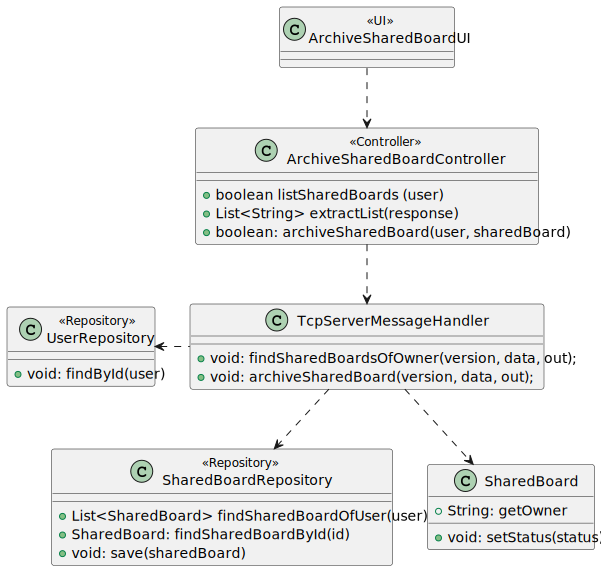
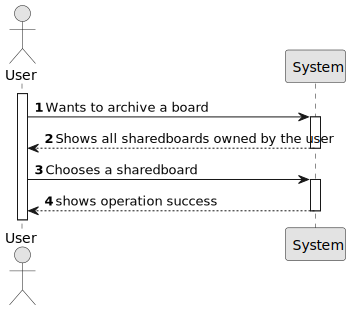
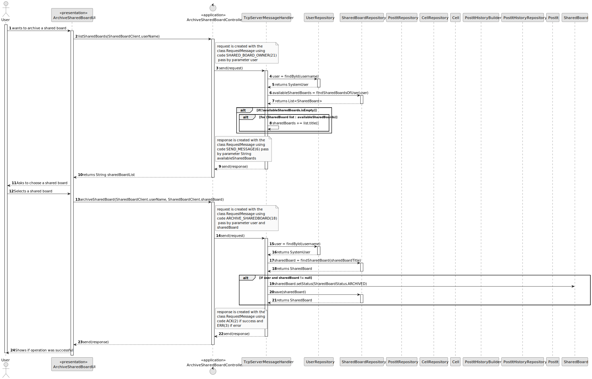

# US 3010 - As User, I want to archive a board I own

## 1. Context

Implement a functionality so that the user can archive a board that he owns.

## 2. Requirements

This US description is "As User, I want to undo the last change in a post-it".

• FRB08 - Archive Board The owner of a board can archive the board

• NFR13 - Design and Implement Shared Board Synchronization This functional
part of the system has very specifc technical requirements, particularly some concerns
about synchronization problems. In fact, several clients will try to concurrently update
boards. As such, the solution design and implementation must be based on threads,
condition variables and mutexes. Specifc requirements will be provided in SCOMP.

## 3. Analysis

This US consists of an user being able to archive a board that he owns. To do this, the user must
choose a board that he owns and then archive it. The system will then archive the board.

## 4. Design

### 4.1. Realization

To do this US, the first step is to choose a Shared Board. To do this, the user must choose a
Shared Board from a list of Shared Boards that he owns. After choosing the Shared Board the system
will archive it.

### 4.2. Diagrams

#### 4.2.1- Class Diagram - CD



#### 4.2.2. System Sequence Diagram - SSD



#### 4.2.3. Sequence Diagram - SD



#### 4.3. Applied Patterns

Controller and Service.

### 4.4. Tests

**Test Get Code From String:** *The tests below are included in the Request Message Test class
of tests and verifies that it transforms the string code well into what is associated with it.*
```
testCode = MessageCode.ARCHIVE_SHAREDBOARD;
        result = 18;
        System.out.println("Código para " + testCode + ": " + result);
        byte expected18 = getCodeFromString(MessageCode.ARCHIVE_SHAREDBOARD);
        Assert.assertEquals(result, expected18);
        
testCode = MessageCode.SHARED_BOARD_OWNER;
        result = 21;
        System.out.println("Código para " + testCode + ": " + result);
        byte expected21 = getCodeFromString(MessageCode.SHARED_BOARD_OWNER);
        Assert.assertEquals(result, expected21);

````

## 5. Implementation

**ArchiveSharedBoardUI:**
```
protected boolean doShow() {
        try {
            List<String> listSharedBoards = theController.listSharedBoards(SharedBoardClient.userName);
            chooseSharedBoard("Select a shared board", listSharedBoards);

            if (SharedBoardClient.sharedBoard != null) {
                System.out.println("Archiving Shared Board " + SharedBoardClient.sharedBoard);
                theController.archiveSharedBoard(SharedBoardClient.userName,SharedBoardClient.sharedBoard);
            } else {
                System.out.println("Null SharedBoard!");
            }
        } catch (IOException e) {
            throw new RuntimeException(e);
        }
        return false;
    }

    public String chooseSharedBoard(String message, List<String> sharedBoardList) {
        List<String> options = new ArrayList<>();
        for (String sharedBoard : sharedBoardList) {
            options.add(sharedBoard);
        }

        final SelectWidget<String> selector = new SelectWidget<>(message, options);
        selector.show();
        int selectedIndex = selector.selectedOption();

        if (selectedIndex == 0) {
            return null;
        } else if (selectedIndex > 0 && selectedIndex <= sharedBoardList.size()) {
            String sharedBoardName = sharedBoardList.get(selectedIndex - 1);
            SharedBoardClient.sharedBoard = sharedBoardName;
            return sharedBoardName;
        } else {
            System.out.println("Invalid Option!");
            return null;
        }
    }

    @Override
    public String headline() {
        return "Archive Shared Board";
    }
```

**ArchiveSharedBoardController:**
```
public List<String> listSharedBoards(String user) throws IOException {
        String data = String.format("%s", user);

        RequestMessage request = new RequestMessage(version, MessageCode.SHARED_BOARD_OWNER, data);
        byte[] messageBytes = request.getBytes();
        SharedBoardClient.sOut.writeInt(messageBytes.length);
        sOut.write(messageBytes);

        // Receive the server response
        int responseLength = sIn.readInt();
        byte[] responseBytes = sIn.readNBytes(responseLength);
        RequestMessage response = new RequestMessage(responseBytes);

        if(response.code() == 6){
            return extractList(response);
        }
        else if (response.code() == 3){
            throw new IllegalArgumentException(Convert.convertBytesToString(response.data()));
        }
        return null;
    }

    public boolean archiveSharedBoard(String username, String sharedBoard) throws IOException {
        String data = String.format("%s;%s", username, sharedBoard);

        RequestMessage request = new RequestMessage(version, MessageCode.ARCHIVE_SHAREDBOARD, data);
        byte[] messageBytes = request.getBytes();
        SharedBoardClient.sOut.writeInt(messageBytes.length);
        sOut.write(messageBytes);

        // Receive the server response
        int responseLength = sIn.readInt();
        byte[] responseBytes = sIn.readNBytes(responseLength);
        RequestMessage response = new RequestMessage(responseBytes);

        if(response.code() == 2){
            System.out.println("SharedBoard was Archived!");
            return true;
        }
        else if (response.code() == 3){
            throw new IllegalArgumentException(Convert.convertBytesToString(response.data()));
        }
        return false;
    }

    public List<String> extractList(RequestMessage response) {
        byte[] dataBytes = response.data();

        List<String> listToString = List.of(Convert.convertBytesToString(dataBytes).split("\n"));
        return listToString;
    }
````
**TcpServerMessageHandler:**
```
public void archiveSharedBoard(byte version, String data, DataOutputStream out) throws IOException {
        if (data != null) {
            String[] info = data.split(";");
            String user = info[0];
            String sharedBoardTitle = info[1];
            SystemUser username = userRepository.findById(Username.valueOf(user));
            SharedBoard sharedBoard = sharedBoardRepository.findSharedBoard(sharedBoardTitle);
            if (sharedBoard == null) {
                sendErrorResponse(version, "Shared Board not found!", out);
            }
            if (username == null) {
                sendErrorResponse(version, "User not found!", out);
            }
            if (sharedBoard.getOwner().equals(username)) {
                sharedBoard.setStatus(SharedBoardStatus.ARCHIVED);
                sharedBoardRepository.save(sharedBoard);
                sendSuccessResponse(version, out);
            } else {
                sendErrorResponse(version, "You are not the owner of this shared board!", out);
            }
        } else {
            sendErrorResponse(version, "Null data", out);
        }
    }
    
private void findSharedBoardsForOwner(byte version, String data, DataOutputStream out) throws IOException {
        if (data != null) {
            SystemUser user = userRepository.findById(Username.valueOf(data));
            if (user == null) {
                String error = String.format("Owner not found!");
                sendErrorResponse(version, error, out);
            } else {
                List<SharedBoard> availableSharedBoards = (List<SharedBoard>) sharedBoardRepository.findSharedBoardOfUser(user);

                if (!availableSharedBoards.isEmpty()) {
                    String sharedBoards = "";
                    for (SharedBoard list : availableSharedBoards) {
                        sharedBoards += list.title() + "\n";
                    }
                    sendMessage(version, out, sharedBoards);
                } else sendErrorResponse(version, "You have no shared boards!", out);
            }
        } else {
            sendErrorResponse(version, "Null data", out);
        }
}
```

## 6. Integration/Demonstration

```
+= Archive Shared Board =======================================================+

Select a shared board
1. aosifjfpajsfao

0. Exit
   Select an option:
   1
   Archiving Shared Board aosifjfpajsfao
   SharedBoard was Archived!
   +==============================================================================+
```

**Database:**
```
33,3,3,OPEN,sb_title,0,poweruser
89,2,2,ARCHIVED,aosifjfpajsfao,1,isep111
```
