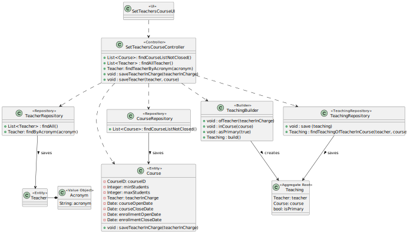
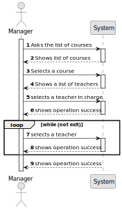
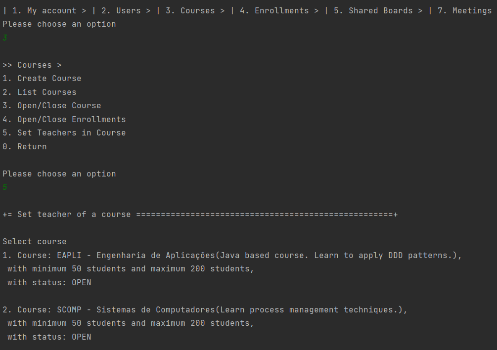
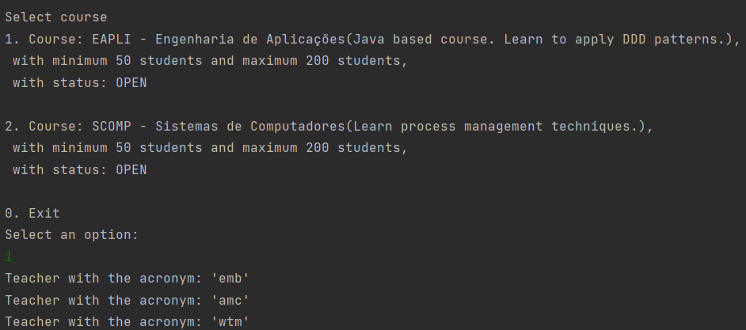
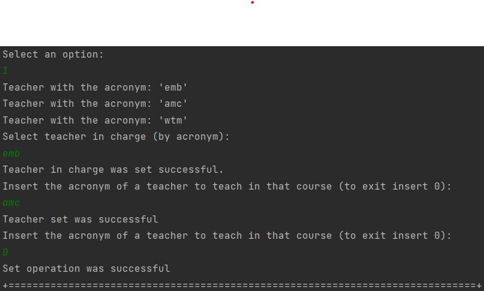
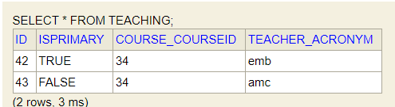

# US 1005

## 1. Context

*Implement a functionality that sets the teachers of a course*

## 2. Requirements

**US 1005 -** As a Manager, I want to set the teachers of a course

### 2.1 Dependencies
For this to happen the system may already have courses and teachers in the database. <br>
This US has dependencies on US´s 1002 and 1001.


## 3. Analysis

To implement this US, it was decided to first search all the courses that are not CLOSE and select one. After that a list of all the teachers was needed. In that list the manager chose a teacher in charge and then all the other teachers to teach in that course.
Notes:
* The courses available are only the ones without status CLOSE
* No teacher can be chosen twice

## 4. Design

### 4.1. Realization

In this US we search for the courses in the repository with a status different from CLOSE. <br>
After this we search for all the teachers of the system present in the teacher repository. <br>
We will select one teacher in charge by it´s acronym (only if it exists, in other words, only if it´s acronym is on the list of teachers provided). <br>
The other teachers will be chosen by it´s acronym until we insert a specific keyword ("0") that exits the loop. 

*Notes:*
* The teachers just as the teacher in charge are only available if they are in the list of teachers provided
* The same teacher cannot be chosen twice (that includes the teacher in charge)

### 4.2. Diagrams

#### 4.2.1 Class Diagram - CD



#### 4.2.2. System Sequence Diagram - SSD



#### 4.2.3 Sequence Diagram - SD


### 4.3. Applied Patterns

Controller and Builder

### 4.4. Tests

This US does not have any tests because it doesn't interact directly with the domain. And we don't test the access to the repositories.

## 5. Implementation

As we can see in the images bellow, US 1005 has been implemented. </br>

**Set Teachers Course Controller:**
*Note:*
- All accesses to the repositories were done correctly, they are just not indicated here.
```
public Iterable<Course> findCourseListNotClosed() {
  if (authorizationService.isAuthenticatedUserAuthorizedTo(BaseRoles.MANAGER)) {
  return courseRepository.findCourseListNotClosed();
  }
  return null;
  }

  public Iterable<Teacher> findAllTeacher() {
  if (authorizationService.isAuthenticatedUserAuthorizedTo(BaseRoles.MANAGER)) {
  return teacherRepository.findAll();
  }
  return null;
  }

  public Optional<Teacher> findTeacherAcronym(String acronym) {
  Optional<Teacher> teacher = null;
  if (authorizationService.isAuthenticatedUserAuthorizedTo(BaseRoles.MANAGER)) {
  teacher = teacherRepository.findByAcronym(new Acronym(acronym));
  }
  return teacher;
  }


    public boolean saveTeacherInCharge(Teacher teacherInCharge, Course course) {
            Teaching newTeaching = teachingRepository.findTeachingOfTeacherInCourse(teacherInCharge, course);
            newTeaching = new TeachingBuilder().ofTeacher(teacherInCharge).inCourse(course).asPrimary(true).build();
            course.saveTeacherInCharge(teacherInCharge);
            courseRepository.save(course);
            teachingRepository.save(newTeaching);
            return true;
    }

    public String saveTeacher(Teacher teacher, Course course) {
        Teaching newTeaching = teachingRepository.findTeachingOfTeacherInCourse(teacher, course);
        if (newTeaching == null) {
             newTeaching = new TeachingBuilder().ofTeacher(teacher).inCourse(course).asPrimary(false).build();
             teachingRepository.save(newTeaching);
             return "Teacher set was successful";
        } else
            return "Teacher already choosen";
    }
````
**Set Teahers Courses UI:**
````
 @Override
        protected boolean doShow() {
            Iterable<Course> coursesList = theController.findCourseListNotClosed();
            if (coursesList.iterator().hasNext()) {
                Course course = chooseCourse("Select course", coursesList);

                if (course != null) {
                    Iterable<Teacher> teacherList = theController.findAllTeacher();
                    List<Teacher> tempList = (List<Teacher>) teacherList;
                    Integer numberOfTeachers = tempList.size();

                    if (!teacherList.iterator().hasNext()) {
                        System.out.println("There are no teachers available!");
                    } else {
                        for (Teacher teachers : teacherList) {
                            System.out.println(teachers);
                        }

                        boolean b = false;
                        if (course.teacherInCharge() == null) {
                            while (!b) {
                                String acronym = Console.readLine("Select teacher in charge (by acronym):");
                                Optional<Teacher> teacherInCharge = theController.findTeacherAcronym(acronym);
                                if (teacherInCharge.isPresent()) {
                                    b = theController.saveTeacherInCharge(teacherInCharge.get(), course);
                                    numberOfTeachers--;
                                    System.out.println("Teacher in charge was set successful.");
                                } else {
                                    System.out.println("Acronym not valid.");
                                    b = false;
                                }
                            }
                        } else {
                            System.out.println("Course already has teacher in charge. You can only add teacher's that teach.");
                        }

                        String acronymTeacher = "1";
                        while (!acronymTeacher.equals("0") && numberOfTeachers > 0) {
                            acronymTeacher = Console.readLine("Insert the acronym of a teacher to teach in that course (to exit insert 0):");
                            if (!acronymTeacher.equals("0")) {
                                Optional<Teacher> teacher = theController.findTeacherAcronym(acronymTeacher);
                                if (teacher.isPresent()) {
                                    String msg = theController.saveTeacher(teacher.get(), course);
                                    numberOfTeachers--;
                                    System.out.println(msg);
                                } else {
                                    System.out.println("Acronym not valid.");
                                }
                            }
                        }
                    }
                    System.out.println("Set operation was successful");
                } else {
                    return false;
                }
            } else {
                System.out.println("There are no courses to list!");
            }
            return false;
        }


    @Override
    public String headline() {
        return "Set teacher of a course";
    }

    private Course chooseCourse(String message, Iterable<Course> courseList) {
        final SelectWidget<Course> selector = new SelectWidget<>(message, courseList);
        selector.show();
        return selector.selectedElement();
    }
````
**Jpa Course Repository:** *The method below is included in the Jpa Course Repository.
It is with this query that we will get the list of courses that are OPEN.*
````
    @Override
    public Iterable<Course> findCourseListNotClosed(){
        TypedQuery<Course> query = entityManager().createQuery(
                "SELECT c FROM Course c WHERE c.courseStatus != :status", Course.class);
        query.setParameter("status", CourseStatus.CLOSE);
        return query.getResultList();
    }
````

**Jpa Teaching Repository:** *The method below is included in the Jpa Teaching Repository.
It is with this query that we will get the teaching of a teacher in a certain course.*
````
    @Override
    public Teaching findTeachingOfTeacherInCourse(Teacher teacher, Course course) {
        TypedQuery<Teaching> query = entityManager().createQuery(
                "SELECT teaching FROM Teaching teaching WHERE teaching.teacher = :teacher AND teaching.course = :course",
                Teaching.class);
        query.setParameter("teacher", teacher);
        query.setParameter("course", course);
        try {
            return query.getSingleResult();
        } catch (NoResultException ex){
            return null; // returns null when there is no teaching with that teacher in that course
        }
    }
````

*In this section the team should present, if necessary, some evidencies that the implementation is according to the design. It should also describe and explain other important artifacts necessary to fully understand the implementation like, for instance, configuration files.*

*It is also a best practice to include a listing (with a brief summary) of the major commits regarding this requirement.*

## 6. Integration/Demonstration

The image below represents the list of courses available to a manager. In this case, all existing courses will be shown.
 </br>


Next, we find a list of teachers.



Next, we find the demonstration of the selection of one teacher in charge and teachers to teach in the course.


As we can see in the table Teaching, the teachers were inserted successfully:



*The next image shows the main commits carried out during the creation of US 1005. These include all the necessary classes for its implementation,
controller, UI, repository, Jpa repository, and others. It also includes some diagrams that are part of the documentation.*

*In this section the team should describe the efforts realized in order to integrate this functionality with the other parts/components of the system*

*It is also important to explain any scripts or instructions required to execute an demonstrate this functionality*

## 7. Observations

Access to the repository is always done in the same way.
For this reason, an example sequence diagram has been created to demonstrate this. To exemplify, we list all existing questions in the repository of questions.


Like the repositories, the authentication part always follows the same order of ideas.
In this way, we perform a general SD that demonstrates the entire process. In the diagram, US 1008 is taken as an example,
as a Student, I want to request my enrollment in a course.


*This section should be used to include any content that does not fit any of the previous sections.*

*The team should present here, for instance, a critical prespective on the developed work including the analysis of alternative solutioons or related works*

*The team should include in this section statements/references regarding third party works that were used in the development this work.*