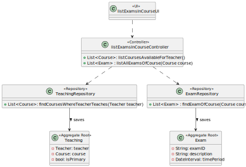
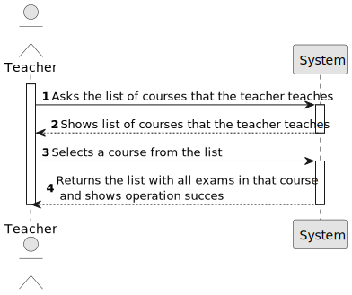
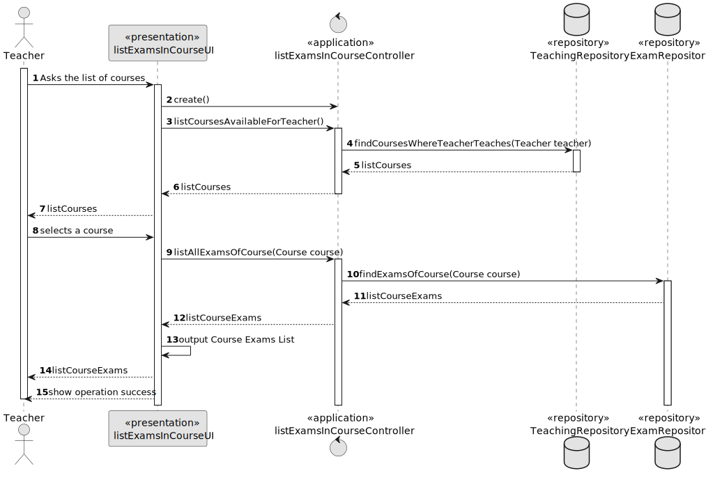
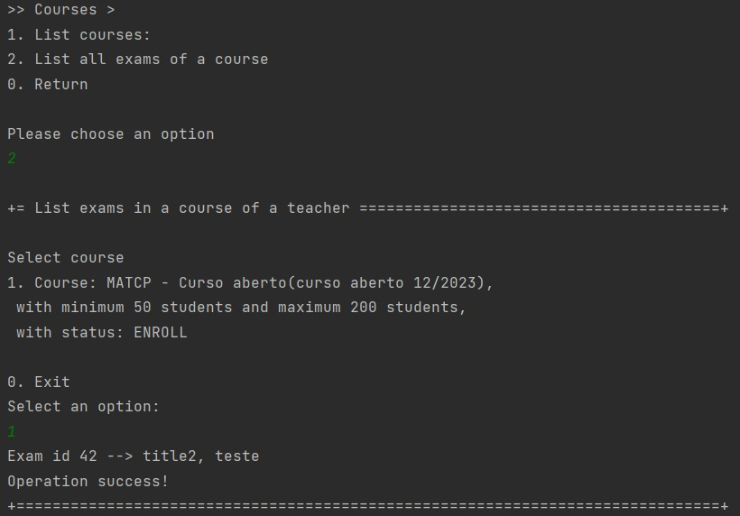
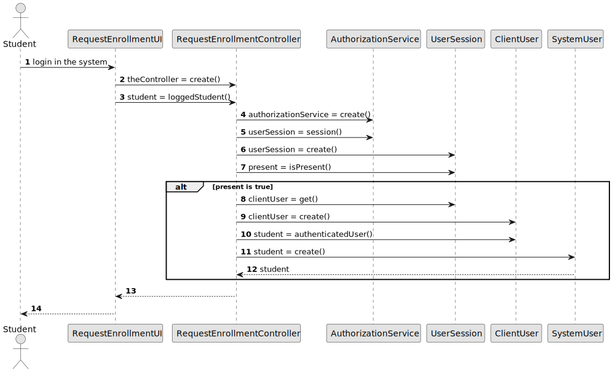

# US 2003

## 1. Context

*Implement a functionality that displays all exams from a course to a teacher*

## 2. Requirements

**US 2003 -** As a Teacher, I want to view a list of all exams in a course

### 2.1 Dependencies
For this to happen the system may already have exams and teachers in the database.
This US has dependencies on US´s 2008 and 1001.

## 3. Analysis
To implement this US, we search for all courses that a teacher has, ask to choose one and when its chosen we search for all the exams that are created with that course. <br>
Notes: 
* A teacher can only choose the courses that he teaches.
* All the exams with the selected course were considered.

## 4. Design

### 4.1. Realization

In this US we search for the courses in the repository (TeachingRepository) that belong to the teacher logged in the system and select one course. <br>
After this we search for all the exams of that selected course (in the ExamRepository).

*Notes:*
* The course available are only the ones where the teacher teaches.
* All exams were taken into account disregarding the status.

### 4.2. Diagrams

#### 4.2.1 Class Diagram - CD



#### 4.2.2. System Sequence Diagram - SSD



#### 4.2.3 Sequence Diagram - SD



### 4.3. Applied Patterns

Controller

### 4.4. Tests

This US does not have any tests because it doesn't interact directly with the domain. And we don't test the access to the repositories.

## 5. Implementation

**List Exams In Course Controller:**
*Note:*
- All accesses to the repositories were done correctly, they are just not indicated here.

```` 
 public Iterable<Course> listCoursesAvailableForTeacher(){
  return listAvailableCoursesController.listCoursesAvailableForTeacher();
  }

  public Iterable<Exam> listAllExamsOfCourse(Course course){
  return examRepository.findExamsOfCourse(course);

  }
````

**List Exams In Course UI:**
````
    @Override
    protected boolean doShow() {
        if (authorizationService.isAuthenticatedUserAuthorizedTo(BaseRoles.TEACHER)) {
            Iterable<Course> teacherCoursesList = controller.listCoursesAvailableForTeacher();
            if (teacherCoursesList.iterator().hasNext()) {
            Course course = chooseCourse("Select course", teacherCoursesList);
            if (course != null) {
            Iterable<Exam> teacherCourseExamsList = controller.listAllExamsOfCourse(course);
            if (teacherCourseExamsList.iterator().hasNext()) {
                for (Exam exam : teacherCourseExamsList) {
                    System.out.printf("Exam id %s --> %s, %s\n", exam.identity(), exam.title(), exam.description());
}
        } else {
             System.out.println("List of exams is empty");
             }
                 System.out.println("Operation success!");
        } else{
            return false;
        }
            } else {
             System.out.println("List of courses empty");}
        }
        return false;
    }
    @Override
    public String headline() {
    return "List exams in a course of a teacher";
    }

    private Course chooseCourse(String message, Iterable<Course> courseList){
        final SelectWidget<Course> selector = new SelectWidget<>(message, courseList);
        selector.show();
        return selector.selectedElement();
    }
````

**Jpa Teaching Repository:** *The method below is included in the Jpa Teaching Repository.
It is with this query that we will get the list of courses where the teacher teaches.*
````
    @Override
    public Iterable<Course> findCoursesWhereTeacherTeaches(Teacher teacher) {
        TypedQuery<Course> query = entityManager().createQuery(
                "SELECT teaching.course FROM Teaching teaching WHERE teaching.teacher = :teacher" ,
                Course.class);
        query.setParameter("teacher", teacher);
        return query.getResultList();
    }
````

**Jpa Exam Repository:** *The method below is included in the Jpa Exam Repository.
It is with this query that we will get the list of exams in a course.*
````
    @Override
    public Iterable<Exam> findExamsOfCourse(Course course) {
        TypedQuery<Exam> query = entityManager().createQuery(
                "SELECT exam FROM Exam exam WHERE exam.course = :course",
                Exam.class);
        query.setParameter("course", course);
        return query.getResultList();
    }
````

*In this section the team should present, if necessary, some evidencies that the implementation is according to the design. It should also describe and explain other important artifacts necessary to fully understand the implementation like, for instance, configuration files.*
*It is also a best practice to include a listing (with a brief summary) of the major commits regarding this requirement.*

## 6. Integration/Demonstration

The image below represents the list of exams of a course from a teacher. In this case, the courses available are only the ones where the teacher teaches.

 </br>


*In this section the team should describe the efforts realized in order to integrate this functionality with the other parts/components of the system*

*It is also important to explain any scripts or instructions required to execute an demonstrate this functionality*

## 7. Observations

Access to the repository is always done in the same way.
For this reason, an example sequence diagram has been created to demonstrate this. To exemplify, we list all existing questions in the repository of questions.


Like the repositories, the authentication part always follows the same order of ideas.
In this way, we perform a general SD that demonstrates the entire process. In the diagram, US 1008 is taken as an example,
as a Student, I want to request my enrollment in a course.




*This section should be used to include any content that does not fit any of the previous sections.*

*The team should present here, for instance, a critical prespective on the developed work including the analysis of alternative solutioons or related works*

*The team should include in this section statements/references regarding third party works that were used in the development this work.*