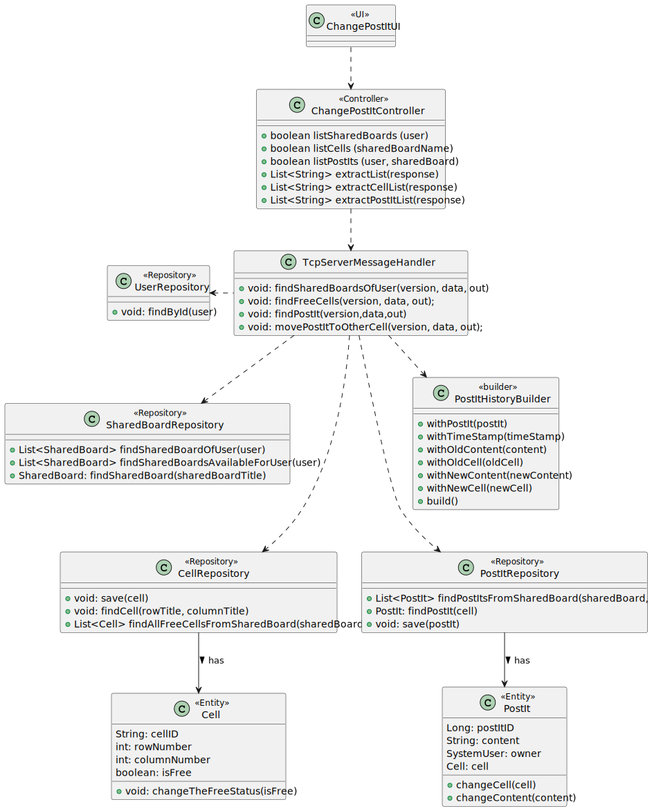
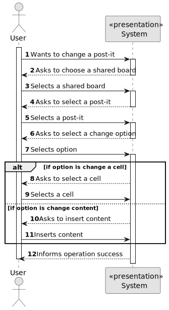
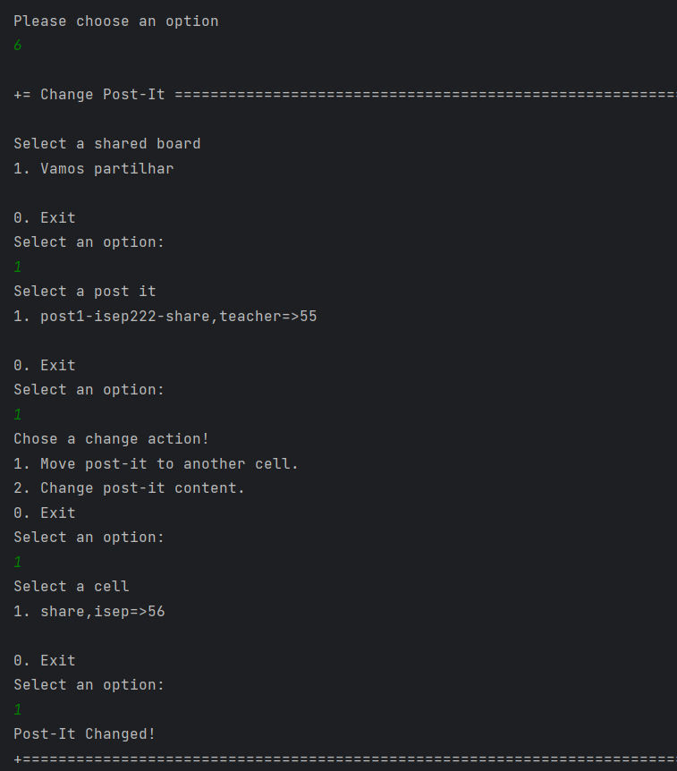
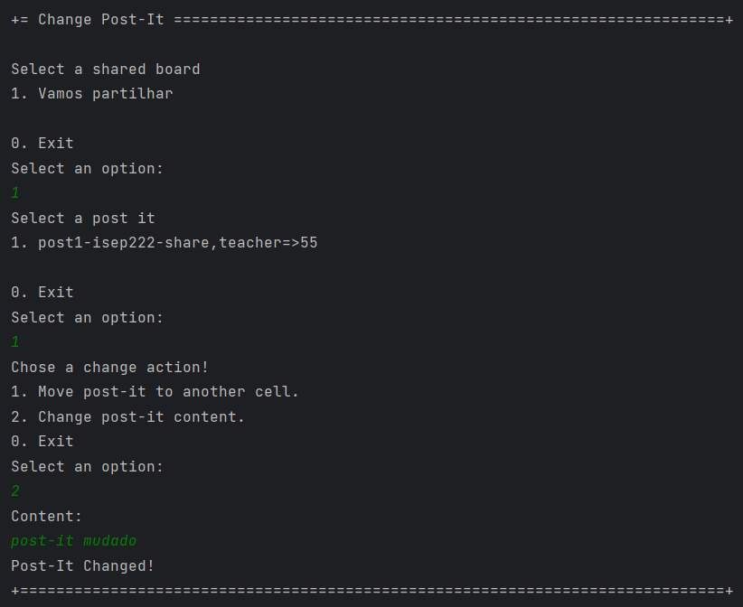
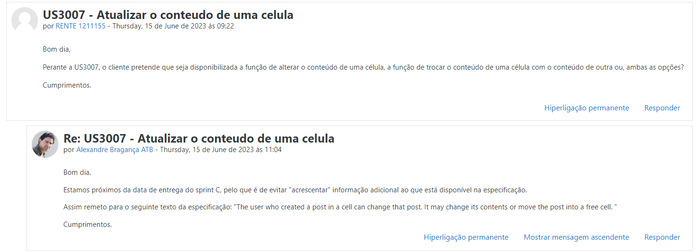

# US 3007 - As User, I want to change a post-it

## 1. Context

Implement a functionality for a user to change a post-it.

## 2. Requirements

US 3007 - As User, I want to change a post-it 

### Acceptance Criteria
This US has some specific acceptance criteria related to SCOMP:
- This functional part of the system has very specific technical requirements, particularly some concerns about synchronization problems.
In fact, several clients will try to concurrently update boards.
As such, the solution design and implementation must be based on threads, condition variables and mutexes. Specific requirements will be provided in SCOMP.

### Dependencies
This US has dependencies on US3006, because to be able to change a post-it, the post-it needs to exist.

## 3. Analysis

Regarding the business logic, the owner of a post-it can change it on that board

## 4. Design

### 4.1. Realization

This US was done on two different ways, in the normal menus, following EAPLI procedures, and in the shared board app,
following RCOMP/SCOMP procedures, but from a global perspective it searches for the board where the user has WRITE permission or the board that he created.
Next, it searches for the post-it's in te selected shared board that were created by him. 
The next step it's a matter of choice because he can choose to change the cell or content of the post-it.
In the case of the cell, it is necessary to choose a free cell in the shared board and then the change is concluded.
In the case of the content, after the user enters the content the post-it it´s changed.

###### 4.2.1. Class Diagram - CD



###### 4.2.2. System Sequence Diagram - SSD



###### 4.2.3. Sequence Diagram - SD


The key concepts behind this SD is the relation between the client, UI and Controller, and the Server, which is done trough codes.
The first step to change a post it is to list the shared board. The controller must "connect" to the server
to do so. Beyond the shared board it necessary to list the post-its for the user to select one.
After that that is two if statements: option is change cell and option is change content.
If the option is change cell, the system must check which cells are free, which is also done through the server, and then changes the post-it and saves it with the changes
If the option is change content, the system must ask the user the post it content and then connect to the server to change it and save on the repository.

### 4.4. Applied Patterns

* Controller
* Builder

### 4.5. Tests

*It wasn't done any tests to repositories methods, only for the domain level, because of not
being required at this stage to do so.*

## 5. Implementation

**ChangePostItUI:**
```` java
 private static final ChangePostItController controller = new ChangePostItController();

    @Override
    public String headline() {
        return "Change Post-It";
    }

    @Override
    protected boolean doShow() {
        try {
            List<String> listSharedBoards = controller.listSharedBoards(SharedBoardClient.userName);
            chooseSharedBoard("Select a shared board", listSharedBoards);

            if (SharedBoardClient.sharedBoard != null) {
                List<String> postItsList = controller.listPostIts(SharedBoardClient.userName, SharedBoardClient.sharedBoard);
                choosePostIt("Select a post it", postItsList);
                if (SharedBoardClient.postIt != null) {
                    System.out.println("Chose a change action!");
                    System.out.println("1. Move post-it to another cell.");
                    System.out.println("2. Change post-it content.");
                    System.out.println("0. Exit");

                    final int option = Console.readOption(1, 2, 0);

                    if (option == 0) {
                        return false;
                    }

                    switch (option) {
                        case 1:
                            List<String> cellsList = controller.listCells(SharedBoardClient.sharedBoard);
                            chooseCell("Select a cell", cellsList);
                            if (SharedBoardClient.cell != null) {
                                controller.movePostItToOtherCell(SharedBoardClient.postIt, SharedBoardClient.cell);
                            }
                            break;

                        case 2:
                            String content = Console.readNonEmptyLine("Content: ", "You must put content!");
                            while (content.length() <= 1 || content.length() > 500) {
                                System.out.println("Content must have characters but less than 500!");
                                content = Console.readNonEmptyLine("Content: ", "You must put content!");
                            }
                            controller.changeContentOfPostIt(SharedBoardClient.postIt, content);
                            break;

                        default:
                            System.out.println("Invalid option");
                    }
                }
            }
        } catch (IOException e) {
            throw new RuntimeException(e);
        }
        return false;
    }
    public String chooseSharedBoard(String message, List<String> sharedBoardList) {
        List<String> options = new ArrayList<>();
        for (String sharedBoard : sharedBoardList) {
            options.add(sharedBoard);
        }
        final SelectWidget<String> selector = new SelectWidget<>(message, options);
        selector.show();
        int selectedIndex = selector.selectedOption();

        if (selectedIndex == 0) {
            return null;
        } else if (selectedIndex > 0 && selectedIndex <= sharedBoardList.size()) {
            String sharedBoardName = sharedBoardList.get(selectedIndex - 1);
            SharedBoardClient.sharedBoard = sharedBoardName;
            return sharedBoardName;
        } else {
            System.out.println("Invalid Option!");
            return null;
        }
    }
    private String choosePostIt(String message, List<String> postItList) {
        if (!postItList.isEmpty()) {
            final SelectWidget<String> selector = new SelectWidget<>(message, postItList);
            selector.show();
            int selectedIndex = selector.selectedOption();
            if (selectedIndex == 0) {
                return null;
            } else if (selectedIndex > 0 && selectedIndex <= postItList.size()) {
                String postIt = postItList.get(selectedIndex - 1);
                SharedBoardClient.postIt = postIt;
                return postIt;
            } else {
                System.out.println("Invalid Option!");
                return null;
            }
        }else{
            System.out.println("No post-it's available");
            return null;}
    }
    private String chooseCell(String message, List<String> cellList) {
        if (!cellList.isEmpty()) {
            final SelectWidget<String> selector = new SelectWidget<>(message, cellList);
            selector.show();
            int selectedIndex = selector.selectedOption();

            if (selectedIndex == 0) {
                return null;
            } else if (selectedIndex > 0 && selectedIndex <= cellList.size()) {
                String cell = cellList.get(selectedIndex - 1);
                SharedBoardClient.cell = cell;
                return cell;
            } else {
                System.out.println("Invalid Option!");
                return null;
            }
        } else
            System.out.println("No cells available");
        return null;
    }
}
````

**ChangePostItController:**
```` java
 byte version = 1;

    public List<String> listSharedBoards(String user) throws IOException {
        String data = String.format("%s", user);

        RequestMessage request = new RequestMessage(version, MessageCode.SHARED_BOARDS_OF_USER, data);
        byte[] messageBytes = request.getBytes();
        SharedBoardClient.sOut.writeInt(messageBytes.length);
        sOut.write(messageBytes);

        // Receive the server response
        int responseLength = sIn.readInt();
        byte[] responseBytes = sIn.readNBytes(responseLength);
        RequestMessage response = new RequestMessage(responseBytes);

        if(response.code() == 6){
            return extractList(response);
        }
        else if (response.code() == 3){
            throw new IllegalArgumentException(Convert.convertBytesToString(response.data()));
        }
        return null;
    }

    public List<String> extractList(RequestMessage response) {
        byte[] dataBytes = response.data();

        List<String> listToString = List.of(Convert.convertBytesToString(dataBytes).split("\n"));
        return listToString;
    }

    public List<String> listPostIts(String user, String sharedBoard) throws IOException {
        String data = String.format("%s;%s", user, sharedBoard);

        RequestMessage request = new RequestMessage(version, MessageCode.LIST_POSTITS, data);
        byte[] messageBytes = request.getBytes();
        SharedBoardClient.sOut.writeInt(messageBytes.length);
        sOut.write(messageBytes);

        // Receive the server response
        int responseLength = sIn.readInt();
        byte[] responseBytes = sIn.readNBytes(responseLength);
        RequestMessage response = new RequestMessage(responseBytes);

        if(response.code() == 6){
            return extractPostItList(response);
        }
        else if (response.code() == 3){
            throw new IllegalArgumentException(Convert.convertBytesToString(response.data()));
        }
        return null;
    }

    private List<String> extractPostItList(RequestMessage response) {
        byte[] dataBytes = response.data();

        List<String> postItListString = List.of(Convert.convertBytesToString(dataBytes).split("\n"));
        return postItListString;
    }

    public List<String> listCells(String sharedBoardName) throws IOException {
        String data = String.format("%s", sharedBoardName);

        RequestMessage request = new RequestMessage(version, MessageCode.LIST_CELLS, data);
        byte[] messageBytes = request.getBytes();
        SharedBoardClient.sOut.writeInt(messageBytes.length);
        sOut.write(messageBytes);

        // Receive the server response
        int responseLength = sIn.readInt();
        byte[] responseBytes = sIn.readNBytes(responseLength);
        RequestMessage response = new RequestMessage(responseBytes);

        if(response.code() == 6){
            return extractCellList(response);
        }
        else if (response.code() == 3){
            throw new IllegalArgumentException(Convert.convertBytesToString(response.data()));
        }
        return null;
    }
    
    private List<String> extractCellList(RequestMessage response) {
        byte[] dataBytes = response.data();

        List<String> cellListString = List.of(Convert.convertBytesToString(dataBytes).split("\n"));
        return cellListString;
    }
    
    public boolean movePostItToOtherCell (String postIt, String cell) throws IOException {
        String data = String.format("%s;%s", postIt, cell);

        RequestMessage request = new RequestMessage(version, MessageCode.CHANGE_POSTIT_CELL, data);
        byte[] messageBytes = request.getBytes();
        SharedBoardClient.sOut.writeInt(messageBytes.length);
        sOut.write(messageBytes);

        // Receive the server response
        int responseLength = sIn.readInt();
        byte[] responseBytes = sIn.readNBytes(responseLength);
        RequestMessage response = new RequestMessage(responseBytes);

        if(response.code() == 2){
            System.out.println("Post-It Changed!");
            return true;
        }
        else if (response.code() == 3){
            System.out.println("Post-it was already moved...");
        }
        return false;
    }
    
    public boolean changeContentOfPostIt (String postIt, String content) throws IOException {
        String data = String.format("%s;%s", postIt, content);

        RequestMessage request = new RequestMessage(version, MessageCode.CHANGE_POSTIT_CONTENT, data);
        byte[] messageBytes = request.getBytes();
        SharedBoardClient.sOut.writeInt(messageBytes.length);
        sOut.write(messageBytes);

        // Receive the server response
        int responseLength = sIn.readInt();
        byte[] responseBytes = sIn.readNBytes(responseLength);
        RequestMessage response = new RequestMessage(responseBytes);

        if(response.code() == 2){
            System.out.println("Post-It Changed!");
            return true;
        }
        else if (response.code() == 3){
            System.out.println("Post-it was already changed...");
        }
        return false;
    }
````

**TcpServerMessageHandler:**

```` java
 private void movePostItToOtherCell(byte version, String data, DataOutputStream out) throws IOException {
        if (data != null) {

            String[] splited = data.split(";");
            String postIt = splited[0];
            String[] postItSplited = postIt.split("-");
            String oldContent = postItSplited[0];
            String oldCellAndId = postItSplited[2];
            String newCellAndId = splited[1];

            String[] celleId = oldCellAndId.split("=>");
            String oldCell = celleId[0];
            String cellId = celleId[1];

            String[] cellSplited = oldCell.split(",");
            String oldRow = cellSplited[0];
            String oldColumn = cellSplited[1];

            String[] newCelleId = newCellAndId.split("=>");
            String newCell = newCelleId[0];
            String newCellId = newCelleId[1];

            String[] cellSplitedNew = newCell.split(",");
            String newRow = cellSplitedNew[0];
            String newColumn = cellSplitedNew[1];

            int cellPos = Integer.parseInt(cellId);

            int newCellPos = Integer.parseInt(newCellId);

            SharedBoardServer.addToLock(cellPos);
            if (SharedBoardServer.lock.get(cellPos).equals("Unlocked")) {
                SharedBoardServer.lock.replace(cellPos, "Locked");
            }

            Map.Entry oldEntry = SharedBoardServer.findEntry(cellPos);


            synchronized (oldEntry) {

                if (SharedBoardServer.lock.get(cellPos).equals("Locked")) {
                    SharedBoardServer.addToLock(newCellPos);
                    Map.Entry entry = SharedBoardServer.findEntry(newCellPos);
                    synchronized (entry) {
                        if (SharedBoardServer.lock.get(newCellPos).equals("Unlocked")) {
                            Cell c = cellRepository.findCell(oldRow, oldColumn);
                            Cell c1 = cellRepository.findCell(newRow, newColumn);
                            PostIt p = postItRepository.findPostIt(c);

                            if (p != null) {
                                c1.changeTheFreeStatus(false);
                                c1 = cellRepository.save(c1);
                                Date timeStamp = Date.from(Instant.now());
                                PostItHistory postItHistory = new PostItHistoryBuilder()
                                        .withPostIt(p)
                                        .withTimeStamp(timeStamp)
                                        .withOldContent(p.content())
                                        .withOldCell(c)
                                        .withNewContent(p.content())
                                        .withNewCell(c1)
                                        .build();

                                postItHistory = postItHistoryRepository.save(postItHistory);
                                p.changeCell(c1);
                                c.changeTheFreeStatus(true);
                                c = cellRepository.save(c);

                                p = postItRepository.save(p);

                                SharedBoardServer.lock.replace(cellPos, "Unlocked");
                                SharedBoardServer.lock.replace(newCellPos, "Locked");

                                sendSuccessResponse(version, out);
                            } else {
                                sendErrorResponse(version, "Post-It is null", out);
                            }
                        } else {
                            sendErrorResponse(version, "This cell is not free anymore!", out);
                        }
                    }

                } else {
                    sendErrorResponse(version, "There is no post-it to change anymore!", out);
                }
            }
        } else {
            sendErrorResponse(version, "Data Null", out);
        }

    }

    private void changeContentOfPostIt(byte version, String data, DataOutputStream out) throws IOException {
        if (data != null) {
            String[] splited = data.split(";");
            String postIt = splited[0];
            String[] postItSplited = postIt.split("-");
            String postItCell = postItSplited[2];
            String oldContent = postItSplited[0];
            String newContent = splited[1];

            String[] celleId = postItCell.split("=>");
            String cellId = celleId[1];

            String oldCell = celleId[0];
            String[] cellSplited = oldCell.split(",");
            String row = cellSplited[0];
            String column = cellSplited[1];

                    Cell c = cellRepository.findCell(row, column);

                    PostIt p = postItRepository.findPostIt(c);

                        System.out.println("postit certo");
                        Date timeStamp = Date.from(Instant.now());
                        PostItHistory postItHistory = new PostItHistoryBuilder()
                                .withPostIt(p)
                                .withTimeStamp(timeStamp)
                                .withOldContent(p.content())
                                .withOldCell(p.cell())
                                .withNewContent(newContent)
                                .withNewCell(p.cell())
                                .build();
                        postItHistory = postItHistoryRepository.save(postItHistory);
                        p.changeContent(newContent);
                        p = postItRepository.save(p);

                        System.out.println("Post-It Changed!!");
                        sendSuccessResponse(version, out);


        } else {
            sendErrorResponse(version, "Data Null", out);
        }
    }
````

## 6. Integration/Demonstration

This demonstration below shows how the US is implemented

The image bellow shows the post-it before any changes: </br>


### Change the post-it cell

The image bellow shows the action of changing the cell of the post-it
Here we can see that it is necessary to choose a shared board, a free cell, a change action and a post-it </br>



Now, in the next image we will see that the operation seen before was implemented with success </br>


### Change the post-it content
Back to the fisrt post-it we will change it's content.

The image bellow shows the action of changing the content of the post-it
Here we can see that it is necessary to choose a shared board, a change action and a post-it, and it is necessary to insert a content </br>



Now, in the next image we will see that the operation seen before was implemented with success </br>


## 7. Observations

*Some requirements of the client* </br>


*Access to the repository is always done in the same way.
For this reason, an example sequence diagram has been created to demonstrate this.
To exemplify, we list all existing questions in the repository of questions.*


*Like the repositories, the authentication part always follows the same order of ideas.
In this way, we perform a general SD that demonstrates the entire process. In the diagram, US 1008 is taken as an example,
as a Student, I want to request my enrollment in a course.*


--------------------------------------------------------------------
#### Important Note ####

*It is important to note that the diagrams did not represent the implementation of SCOMP, that is, all "locks" made and "synchronized" were ignored. 
However, they exist for program synchronization to work and for two users can successfully access the application simultaneously.*