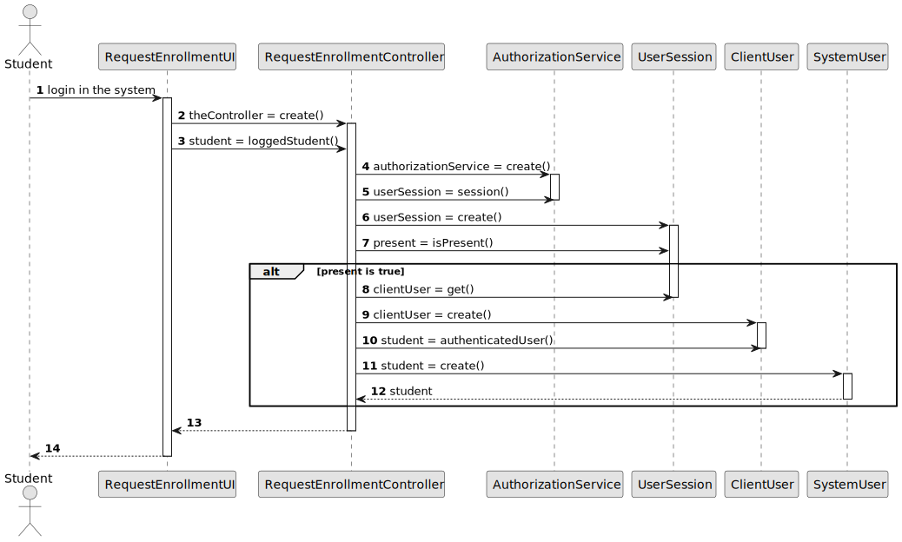

# US 1003 - As Manager, I want to open and close enrollments in courses

## 1. Context

*Implement a functionality for the manager to open and close enrollments in courses*

## 2. Requirements

**US 1003 -** As Manager, I want to open and close enrollments in courses

## 3. Analysis

* *For this US to be possible, it is necessary that, initially, there are courses created and, therefore, it depends on US1002 (As Manager, I want to create courses). 
In addition, we will only be able to open course enrollments in courses with open state, and therefore, before this operation can be carried out, a course must first be opened, 
which leads to a second dependency on US1004(As Manager, I want to open and close courses).*

* *To implement this US, it was defined that first the user would choose whether he wanted to open or close the enrollments 
in a course. After this selection, the system displays a list of courses available, according to the selected operation 
(if the option chosen was open, a list of courses in the "open" state will be returned, otherwise the list returned contains 
courses in the "enroll" state).* </br>

*Note:*
- Only managers are able to execute this functionality.
- When opening the enrollments, the system asks for a closing date.

## 4. Design

### 4.1. Realization

*According to the statement, The usual workflow related to the course can be illustrated as follows: </br>
event create (-> state close) -> event open (->state open) -> event open enrollments (-> state enroll) -> event close enrollments (-> state in progress) -> event close (-> state closed ). </br>
With this, if the chosen option is to open the enrollments, this operation can only be carried out in courses with state open, then a list of open courses will be shown. 
After selecting the desired course, a closing date for enrollments must be inserted, which must be after the present day and before the closing of the course itself. After this operation, the state of the course becomes enroll. </br>
When the option is to close enrollments, here there will no longer be the need to insert any type of date and the manager will have to choose the course from a list that only contains courses with state enroll. 
After this operation, the state of the course is in progress.</br>*

### 4.2. Diagrams

#### 4.2.1 Class Diagram - CD


#### 4.2.2. System Sequence Diagram - SSD


#### 4.2.3 Sequence Diagram - SD


- Initially, the user wants to either open or close enrollments for a course. The system asks which of the actions you want to do and the manager selects what he wants.
- If he wants to open it, the system will show the list of courses whose status is open, the user selects and the enrollments are open.
- If he wants to close it, the system will show the list of courses whose status is enroll, the user selects it and the enrollments are closed.

### 4.3. Applied Patterns

### 4.4. Tests

**Test 1:** *Verifies that it is not possible to open enrollments in a course because course status is not OPEN.*

```
@org.junit.Test
    public void shouldNotOpenEnrollmentsForCourseWithNotOpenStatus() {
        Date endDateEnroll = stringToDate("22/02/2024");

        Course course = new Course(courseCode, courseName, description, minStudents, maxStudents);

        course.openEnrollments(endDateEnroll);
        CourseStatus expected = CourseStatus.ENROLL;
        CourseStatus actual = course.courseStatus();

        Assertions.assertNotEquals(expected, actual);
    }
````

**Test 2:** *Verifies that it is not possible to close enrollments in a course because course status is not ENROLL.*

```
@org.junit.Test
    public void shouldNotCloseEnrollmentsForCourseWithNotENROLLStatus() {
        Date endDateCourse = stringToDate("22/02/2024");


        Course course = new Course(courseCode, courseName, description, minStudents, maxStudents);

        course.openCourse(endDateCourse);
        CourseStatus expected = CourseStatus.IN_PROGRESS;
        CourseStatus actual = course.courseStatus();

        Assertions.assertNotEquals(expected, actual);
    }
````

**Test 3:** *Verifies the course status when enrollments are open.*

```
@org.junit.Test
    public void testCourseStatusWhenOpenEnrollments() {
        Date endDateCourse = stringToDate("22/02/2024");
        Date endDateEnrollments = stringToDate("22/09/2023");

        Course course = new Course(courseCode, courseName, description, minStudents, maxStudents);

        course.openCourse(endDateCourse);
        course.openEnrollments(endDateEnrollments);
        CourseStatus expected = CourseStatus.ENROLL;
        CourseStatus actual = course.courseStatus();

        Assertions.assertEquals(expected, actual);
    }
````

**Test 4:** *Verifies the course status when enrollments are closed.*

```
@org.junit.Test
    public void testCourseStatusWhenCloseEnrollments() {
        Date endDateCourse = stringToDate("22/02/2024");
        Date endDateEnrollments = stringToDate("22/09/2023");

        Course course = new Course(courseCode, courseName, description, minStudents, maxStudents);

        course.openCourse(endDateCourse);
        course.openEnrollments(endDateEnrollments);
        course.closeEnrollments();
        CourseStatus expected = CourseStatus.IN_PROGRESS;
        CourseStatus actual = course.courseStatus();

        Assertions.assertEquals(expected, actual);
    }
````

## 5. Implementation


**Change Enrollments Status Controller:** 
*The methods below, list the courses only with the status open so that enrollments can be opened in it 
and also list only the courses with the enroll status when we want to close the enrollments of a course.
This is where you also have the validation of the closing date of the enrollments.*

```
public class ChangeEnrollmentsStatusController {

    private AuthorizationService authorizationService = AuthzRegistry.authorizationService();

    private CourseRepository courseRepository = PersistenceContext.repositories().courseRepository();

    /**
     * This method returns the list of courses with Open Status.
     * Enrollments are available to be open if, and only if, the course is Open, otherwise it's not possible.
     *
     * @return list of courses with Open status
     */
    @Transactional
    public Iterable<Course> listOpenCourses(){
        authorizationService.ensureAuthenticatedUserHasAnyOf(BaseRoles.MANAGER);
        return courseRepository.findCourseWithOpenStatus();
    }

    /**
     * This method opens enrollments in a course.
     * It consists of changing the course status do 'Enroll' and the close date to
     * the date passed as parameter, and saves the course in the repository
     * @param course
     * @param endDateEnroll
     */
    @Transactional
    public boolean openEnrollments(Course course, Date endDateEnroll){

        authorizationService.ensureAuthenticatedUserHasAnyOf(BaseRoles.MANAGER);

        if(endDateEnroll.after(course.closeCourseDate()) || endDateEnroll.before(Date.from(Instant.now()))){
            return false;
        }

        course.openEnrollments(endDateEnroll);
        courseRepository.save(course);
        return true;
    }


    /**
     * This method returns the list of courses with Enroll Status.
     * Enrollments are available to be closed if, and only if, the course has an enroll status, otherwise it's not possible.
     *
     * @return list of courses with Enroll status
     */

    public Iterable<Course> listEnrollCourses(){
        authorizationService.ensureAuthenticatedUserHasAnyOf(BaseRoles.MANAGER);
        return courseRepository.findCourseWithEnrollStatus();
    }

    /**
     * This method closes enrollments in a course.
     * It consists of changing the course status do 'IN_PROGRESS' and the close date to
     * the system date, and saves the course in the repository
     * @param course
     */
    @Transactional
    public void closeEnrollments(Course course){

        authorizationService.ensureAuthenticatedUserHasAnyOf(BaseRoles.MANAGER);

        course.closeEnrollments();

        courseRepository.save(course);
    }
}
````

**Jpa Course Repository:** *The two methods below are included in the Jpa Course Repository. 
It is with these queries that we will get the list of necessary courses depending on the chosen operation.*

```
@Override
    public Iterable<Course> findCourseWithOpenStatus() {
        final TypedQuery<Course> course = entityManager().createQuery(
                ("SELECT course FROM Course course WHERE course.courseStatus = :status"),
                Course.class);
        course.setParameter("status", CourseStatus.OPEN);
        return course.getResultList();
    }

    @Override
    public Iterable<Course> findCourseWithEnrollStatus() {
        final TypedQuery<Course> course = entityManager().createQuery(
                ("SELECT course FROM Course course WHERE course.courseStatus = :status"),
                Course.class);
        course.setParameter("status", CourseStatus.ENROLL);
        return course.getResultList();
    }

````

**Change Enrollments Status UI:** *The code represented is an excerpt from the UI. Before them, the user is asked what operation he wants to do. 
If it is open, the 1st method is called, openEnrollments(), otherwise closeEnrollments() will be called. 
The "chooseCourse" method is used regardless of the option and serves to select the desired course from the list presented.*

```
private void openEnrollments(){
        final Iterable<Course> openCoursesList = this.theController.listOpenCourses();
        if(!openCoursesList.iterator().hasNext())
            System.out.println("There are no courses available to be open!");
        else {
            Course theCourse = chooseCourse("Select a course to open the enrollments:", openCoursesList);

            if (theCourse != null) {
                Date closeDate;
                boolean validDate = false;
                while (!validDate) {
                    closeDate = Console.readDate("Insert the enrollments closing date: dd/MM/yyyy", "dd/MM/yyyy");
                    validDate = theController.openEnrollments(theCourse, closeDate);
                    if (!validDate){
                        System.out.printf("The closing date for enrollments should be before %s and after today!" +
                                        "\nPlease try again.\n", theCourse.closeCourseDate());
                    } else {
                        System.out.printf("Operation successful. Enrollments for course %s were opened.", theCourse.courseCode());
                    }
                }
            }
        }
    }

    private void closeEnrollments(){
        final Iterable<Course> enrollCoursesList = this.theController.listEnrollCourses();
        if(!enrollCoursesList.iterator().hasNext())
            System.out.println("There are no courses available to be closed!");

        else {
            Course theCourse = chooseCourse("Select a course to close the enrollments:", enrollCoursesList);

            if (theCourse != null) {
                try {
                    theController.closeEnrollments(theCourse);
                    System.out.println("The enrollments for this course were closed!!");
                } catch (final ConcurrencyException | IntegrityViolationException exMerge) {
                    System.out.println("The Course has been changed or deleted by other user. Please try again.");
                }
            }
        }
    }


    private Course chooseCourse(String message, Iterable<Course> courseList){
        final SelectWidget<Course> selector = new SelectWidget<>(message, courseList);
        selector.show();
        return selector.selectedElement();
    }

````

**Course**: 
- The openEnrollments method checks if the course status is "OPEN," and if so, it updates the course status to "ENROLL" 
and sets open enrollments date to the current date, and the close enrollments date to the date provided by the manager. 
If the course status is already "ENROLL," a message is displayed indicating that the enrollments are already open. 
If the course status is neither "OPEN" nor "ENROLL," a message is displayed indicating that it is unable to open enrollments for that course.
- The closeEnrollments method checks if the course status is "ENROLL", and if so, it updates the course status to "IN_PROGRESS" 
and sets the close enrollments date to the current date. If the course status is already "IN_PROGRESS," a message is displayed indicating that the 
enrollments are already closed. If the course status is neither "ENROLL" nor "IN_PROGRESS," a message is displayed indicating that it is unable to close enrollments for that course.

```
/**
     * This method is used in US 1003, and it's used to open enrollments in a course.
     * Notes:
     * - Enrollments can only be open if course is also open.
     * - When opening enrollments, it must be defined an opening date (time of system)
     * and a close date, inserted by the user
     *
     * @param endDateEnroll - Calendar date when the enrollments in the chosen course will close
     */
    public void openEnrollments(Date endDateEnroll) {
        if (courseStatus.equals(CourseStatus.OPEN)) {
            this.courseStatus = CourseStatus.ENROLL;
            this.openEnrollmentsDate = Date.from(Instant.now());
            this.closeEnrollmentsDate = endDateEnroll;
        } else if (courseStatus.equals(CourseStatus.ENROLL)) {
            System.out.println("Enrollment for this course are already open.");
        } else {
            System.out.println("Unable to open enrollment for this course.");
        }
    }

    /**
     * This method is used in US 1003, and it's used to close enrollments in a course.
     * Notes:
     * - Enrollments can only be close if course has an enroll status.
     * - When closing the enrollments in a course, the system must set the close date to the time of the system
     *
     */
    public void closeEnrollments() {
        if (courseStatus.equals(CourseStatus.ENROLL)) {
            this.courseStatus = CourseStatus.IN_PROGRESS;
            this.closeEnrollmentsDate = Date.from(Instant.now());
        } else if (courseStatus.equals(CourseStatus.IN_PROGRESS)) {
            System.out.println("Enrollment for this course are already closed.");
        } else {
            System.out.println("Unable to close enrollment for this course.");
        }
    }

````
## 6. Integration/Demonstration

*As we can see in the images below, US 1003 has been implemented. It is important to note that, when opening enrollments for a course,
their closing date cannot be later than the closing date of the course itself (and before the present day). This validation is done, as shown in the image below.*
 </br>

*The image below shows how the date of close enrollments is inserted by the manager instead of null, as it is initially by default.* </br>
 </br>


*When closing the enrollments of a course, it is no longer necessary to enter dates, if the initially defined closing date is not the same as
the "current" date, the date becomes the current one at the time of closing the enrollments.*
 </br>

*In this image, as previously indicated, the closing date of the enrollments becomes the date on which that operation was actually carried out. (In this case, it was on Friday, May 19).* </br>
 </br>

## 7. Observations
*The image below was taken from the project statement. integrator and shows the usual workflow of a course, previously mentioned.*


*Access to the repository is always done in the same way. 
For this reason, an example sequence diagram has been created to demonstrate this. To exemplify, we list all existing questions in the repository of questions.*


*Like the repositories, the authentication part always follows the same order of ideas. 
In this way, we perform a general SD that demonstrates the entire process. In the diagram, US 1008 is taken as an example, 
as a Student, I want to request my enrollment in a course.*


