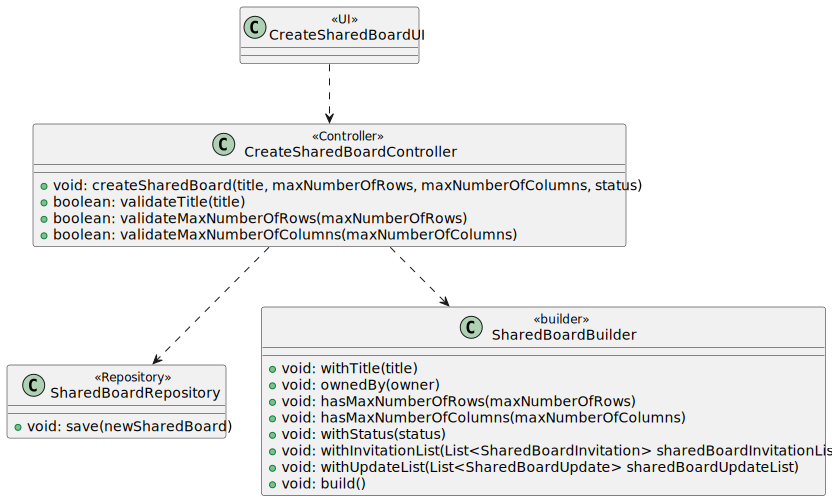
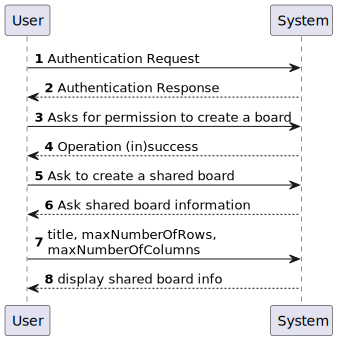
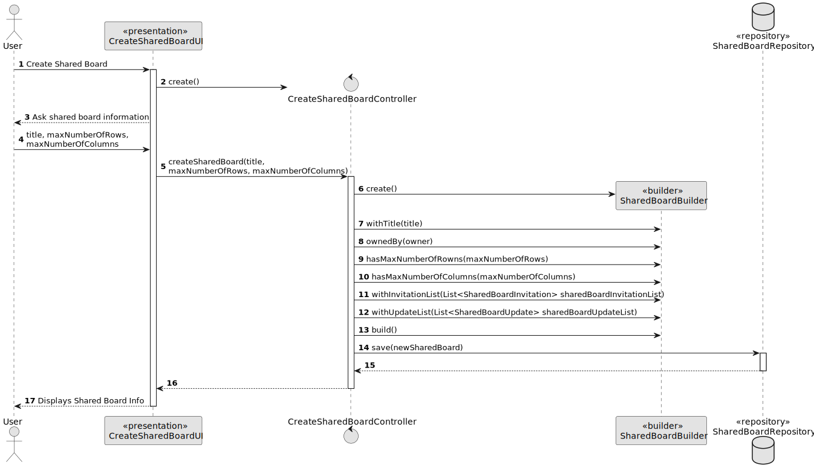
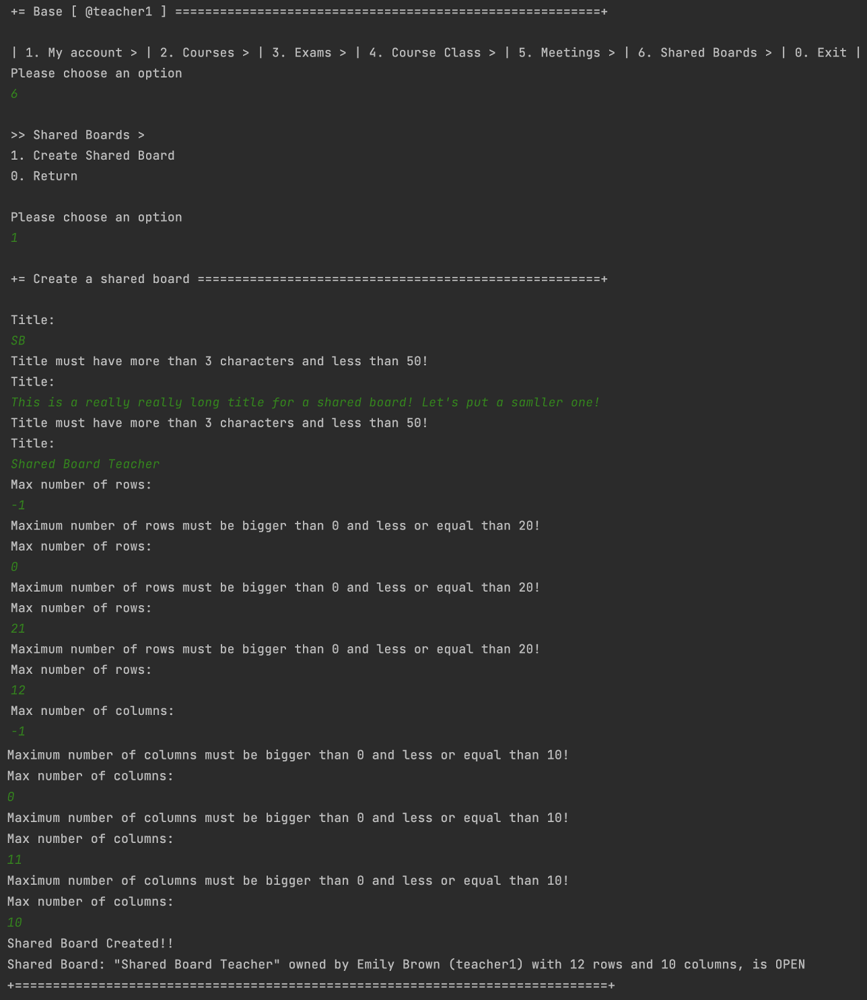
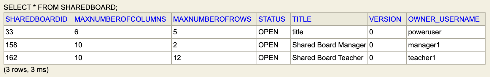

# US 3002 - As User, I want to create a board

## 1. Context

*Implement a functionality that allows every user to create a shared board.*

## 2. Requirements

**US 3002 -** As User, I want to create a board

## 3. Analysis

*To implement this US, the user is asked to enter the basic information of a shared board, title, number of rows and number of columns. </br>
When it is created, the owner will be the user who is logged in and its status becomes OPEN. Both Invitation and Update list are null.*

## 4. Design
### 4.1. Realization

*The first step of this US is to ask the user for the necessary information to create a valid shared board. As information is requested, it is validated and, if it is invalid, 
feedback is shown to the creator of the shared board (for example, if the user enters a title with less than 3 characters or more than 50, he will see the following message: 
"Title must have more than 3 characters and less than 50!" and a title will be asked again, until it is valid!).*

### 4.2. Class Diagram



#### 4.2.2. System Sequence Diagram - SSD



#### 4.2.3 Sequence Diagram - SD


- The user wants to create a shared board. The system asks for the necessary information to carry out the action and the user enters it. 
- After receiving the information, the shared board is created with a builder

### 4.3. Applied Patterns
* Controller
* Builder

### 4.4. Tests
#### 4.4.1 Shared Board Tests

**Test 1:** *Verifies that it is not possible to create a shared boards with zero number of rows and columns.*

```
@Test
    public void testFailedCauseMaxNumberOfRowsAndColumnsAre0(){
        Assertions.assertThrows(IllegalArgumentException.class, () ->
                {new SharedBoard("Shared Board Title Test", null, 0, 0, null, null);}
        );
    }
````

**Test 2:** *Verifies that it is not possible to create a shared boards with more than 20 rows.*

```
@Test
    public void testFailedCauseMaxNumberOfRowsIsBiggerThan20(){
        Assertions.assertThrows(IllegalArgumentException.class, () ->
                {new SharedBoard("Shared Board Title Test", null, 21, 5, null, null);}
        );
    }
````

**Test 3:** *Verifies that it is not possible to create a shared boards with more than 10 columns.*

```
@Test
    public void testFailedCauseMaxNumberOfColumnsIsBiggerThan10(){
        Assertions.assertThrows(IllegalArgumentException.class, () ->
                {new SharedBoard("Shared Board Title Test", null, 5, 11, null, null);}
        );
    }
````

#### Shared Board Builder Tests

**Utils:** *These were the variables used to create a shared board*

```
final SystemUserBuilder userBuilder1 = UserBuilderHelper.builder();
    final SystemUser owner = userBuilder1
            .withUsername("owner")
            .withPassword("Password1")
            .withName("ownerFstName", "ownerlSTname")
            .withEmail("owner@gmail.com")
            .withRoles(BaseRoles.STUDENT)
            .build();

    final String title = "title";

    final Integer maxNumberOfRows = 12;

    final Integer maxNumberOfColumns = 8;
    final SharedBoardBuilder sharedBoardBuilder = new SharedBoardBuilder();
```


**Test 1:** *Verifies that it is possible to create a shared board.*

```
@Test
    public void ensureCanBuildSharedBoardWithTitleOwnerNrOfRowsAndColumnsInvitationAndUpdateList() {
        SharedBoardBuilder builder = new SharedBoardBuilder();
        SharedBoard actual = builder
                .withTitle(title)
                .ownedBy(owner)
                .hasMaxNumberOfRows(12)
                .hasMaxNumberOfColumns(8)
                .withInvitationList(null)
                .withUpdateList(null)
                .build();

        SharedBoard expected = new SharedBoard(title, owner, maxNumberOfRows, maxNumberOfColumns, null, null);

        Assertions.assertTrue(expected.sameAs(actual));
    }
````

**Test 2:** *Verifies that it is not possible to create a shared board with a null title.*

```
@Test
    public void ensureCannotBuildWithNullTitle() {
        Assertions.assertThrows(IllegalArgumentException.class, () -> {
            sharedBoardBuilder.withTitle(null).ownedBy(owner). hasMaxNumberOfRows(maxNumberOfRows).hasMaxNumberOfColumns(maxNumberOfColumns)
                    .withInvitationList(null).withUpdateList(null).build();
        });
    }
````

**Test 3:** *Verifies that it is not possible to create a shared board with a null maxNumberOfColumns.*

```
@Test
    public void ensureCannotBuildWithNullNumberOfColumns() {
        Assertions.assertThrows(IllegalArgumentException.class, () -> {
            sharedBoardBuilder.withTitle(title).ownedBy(owner).hasMaxNumberOfRows(maxNumberOfRows).hasMaxNumberOfColumns(null)
                    .withInvitationList(null).withUpdateList(null).build();
        });
    }
````

## 5. Implementation

**Create Shared Board Controller:** *The methods below create the shared board and do all the necessary validations so that it is valid*

```
public SharedBoard createSharedBoard(String title, Integer maxNumberOfRows, Integer maxNumberOfColumns){
        SystemUser user = null;
        if (authorizationService.session().isPresent()) {
            user = this.authorizationService.session().get().authenticatedUser();
        }

        final SharedBoard newSharedBoard = new SharedBoardBuilder().withTitle(title)
                .ownedBy(user)
                .hasMaxNumberOfRows(maxNumberOfRows)
                .hasMaxNumberOfColumns(maxNumberOfColumns)
                .withInvitationList(null)
                .withUpdateList(null)
                .build();

        sharedBoardRepository.save(newSharedBoard);
        return newSharedBoard;
    }

    /**
     * This method validates the title of the shared board entered by the user who is creating it.
     * This must be at least 3 characters long and can only be a maximum of 50 characters long.
     * @param title
     * @return title validation
     */
    public boolean validateTitle(String title){
        if(title.length() < 3 || title.length() > 50){
            return false;
        }
        return true;
    }
    /**
     * This method validates the maximum number of lines that the created shared board can have.
     * It must have more than zero lines and cannot exceed 20.
     * @param maxNumberOfRows
     * @return number of rows validation
     */
    public boolean validateMaxNumberOfRows(Integer maxNumberOfRows){
        if(maxNumberOfRows <= 0 || maxNumberOfRows > 20){
            return false;
        }
        return true;
    }

    /**
     * This method validates the maximum number of columns that the created shared board can have.
     * It must have more than zero columns and cannot exceed 10.
     * @param maxNumberOfColumns
     * @return number of columns validation
     */
    public boolean validateMaxNumberOfColumns(Integer maxNumberOfColumns){
        if(maxNumberOfColumns <= 0 || maxNumberOfColumns > 10){
            return false;
        }
        return true;
    }
}
````

**Create Shared Board UI:** 
*The class shown below is where the user is asked for all the information needed to create a shared board. 
Here we call the controller validation methods, referred to above.*

```
public class CreateSharedBoardUI extends AbstractUI {

    private static final Logger LOGGER = LogManager.getLogger(CreateSharedBoardUI.class);

    private AuthorizationService authorizationService = AuthzRegistry.authorizationService();;

    private CreateSharedBoardController theController = new CreateSharedBoardController();
    @Override
    protected boolean doShow() {

        String title = null;
        boolean titleValid = false;
        while (!titleValid) {
            title = Console.readLine("Title: ");
            titleValid = theController.validateTitle(title);
            if (!titleValid) {
                System.out.println("Title must have more than 3 characters and less than 50!");
            }
        }

        Integer maxNumberOfRows = null;
        boolean maxNumberOfRowsValid = false;
        while (!maxNumberOfRowsValid) {
            maxNumberOfRows = Console.readInteger("Max number of rows: ");
            maxNumberOfRowsValid = theController.validateMaxNumberOfRows(maxNumberOfRows);
            if (!maxNumberOfRowsValid) {
                System.out.println("Maximum number of rows must be bigger than 0 and less or equal than 20!");
            }
        }
        Integer maxNumberOfColumns = null;
        boolean maxNumberOfColumnsValid = false;
        while (!maxNumberOfColumnsValid) {
            maxNumberOfColumns = Console.readInteger("Max number of columns: ");
            maxNumberOfColumnsValid = theController.validateMaxNumberOfColumns(maxNumberOfColumns);
            if (!maxNumberOfColumnsValid) {
                System.out.println("Maximum number of columns must be bigger than 0 and less or equal than 10!");
            }
        }

        try {
            SharedBoard sharedBoard = theController.createSharedBoard(title, maxNumberOfRows, maxNumberOfColumns);
            System.out.println("Shared Board Created!!");
            System.out.printf(String.valueOf(sharedBoard));
            System.out.println("");
        }
        catch (final IntegrityViolationException e) {
            System.out.println("A shared board with that name already exists!");
        }
        catch (final ConcurrencyException e) {
            LOGGER.error("Error performing the operation", e);
            System.out.println("Unfortunately, there was an unexpected error in the application. " +
                    "Please try again, and if the problem persists, contact your system administrator.");
        }
        return false;
    }

    @Override
    public String headline() {
        return "Create a shared board";
    }
}
````

**Shared Board Builder:**

```
public SharedBoardBuilder withTitle(final String title) {
            this.title = title;
            return this;
        }

        public SharedBoardBuilder ownedBy(SystemUser owner) {
            this.owner = owner;
            return this;
        }

        public SharedBoardBuilder hasMaxNumberOfRows(final Integer maxNumberOfRows) {
            this.maxNumberOfRows = maxNumberOfRows;
            return this;
        }

        public SharedBoardBuilder hasMaxNumberOfColumns(final Integer maxNumberOfColumns) {
            this.maxNumberOfColumns = maxNumberOfColumns;
            return this;
        }

    public SharedBoardBuilder withInvitationList(final List<SharedBoardInvitation> sharedBoardInvitationList) {
        this.sharedBoardInvitationList = null;
        return this;
    }

    public SharedBoardBuilder withUpdateList(final List<SharedBoardUpdate> sharedBoardUpdateList) {
        this.sharedBoardUpdateList = null;
        return this;
    }

        @Override
        public SharedBoard build() {

            Preconditions.noneNull(title, maxNumberOfRows, maxNumberOfColumns);
            Preconditions.ensure( maxNumberOfRows <= Integer.parseInt(Application.settings().getProperty("sharedBoardMaxNumberOfRows"))
                    && maxNumberOfColumns <= Integer.parseInt(Application.settings().getProperty("sharedBoardMaxNumberOfColumns")));

            theSharedBoard = new SharedBoard(title,
                    owner,
                    maxNumberOfRows,
                    maxNumberOfColumns,
                    sharedBoardInvitationList,
                    sharedBoardUpdateList);

            return theSharedBoard;
        }
````
**App Settings and ecafeteria.sample.properties:**

```
//ecafeteria.sample.properties
sharedBoardMaxNumberOfRows = 10;
sharedBoardMaxNumberOfColumns = 20;

//App Settings
private static final String SHAREDBOARD_ROWS = "sharedBoardMaxNumberOfRows";
private static final String SHAREDBOARD_COLUMNS = "sharedBoardMaxNumberOfColumns";

private void setDefaultProperties() {
    this.applicationProperties.setProperty(REPOSITORY_FACTORY_KEY, "eapli.base.persistence.jpa.JpaRepositoryFactory");
    this.applicationProperties.setProperty(UI_MENU_LAYOUT_KEY, "horizontal");
    this.applicationProperties.setProperty(PERSISTENCE_UNIT_KEY, "eapli" + ".base");
    // define 20 as default max number os rows and 10 as default max number of columns
    this.applicationProperties.setProperty(SHAREDBOARD_ROWS, "20");
    this.applicationProperties.setProperty(SHAREDBOARD_COLUMNS, "10");

    }
````

## 6. Integration/Demonstration

*As we can see in the two images below, US 3002 has been implemented. The proper validations were made as shown in the images below.
Initially, the user, in this case teacher1, tries to create a shared board with the same name as one that already exists. This is not possible, as the title of each shared board is unique.
The user cannot exceed 50 characters in the title of the shared frame and also cannot put a title with less than 3 characters. 
As for the number of lines, these cannot exceed 20 lines, and we can only have a maximum of 10 columns.
Both cannot be less than or equal to zero.* </br>

 </br>

 </br>

*The next image represents the table in the database, as expected!*
 </br>

## 7. Observations

*Access to the repository is always done in the same way.
For this reason, an example sequence diagram has been created to demonstrate this. To exemplify, we list all existing questions in the repository of questions.*


*Like the repositories, the authentication part always follows the same order of ideas.
In this way, we perform a general SD that demonstrates the entire process. In the diagram, US 1008 is taken as an example,
as a Student, I want to request my enrollment in a course.*

