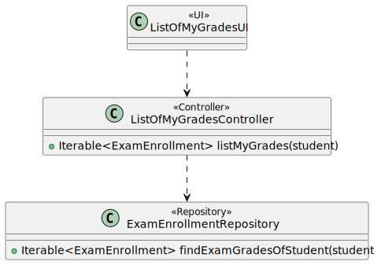
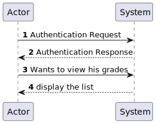
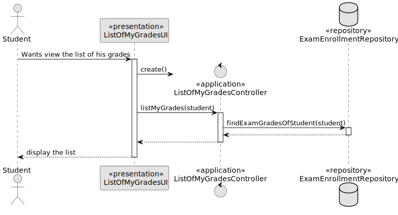
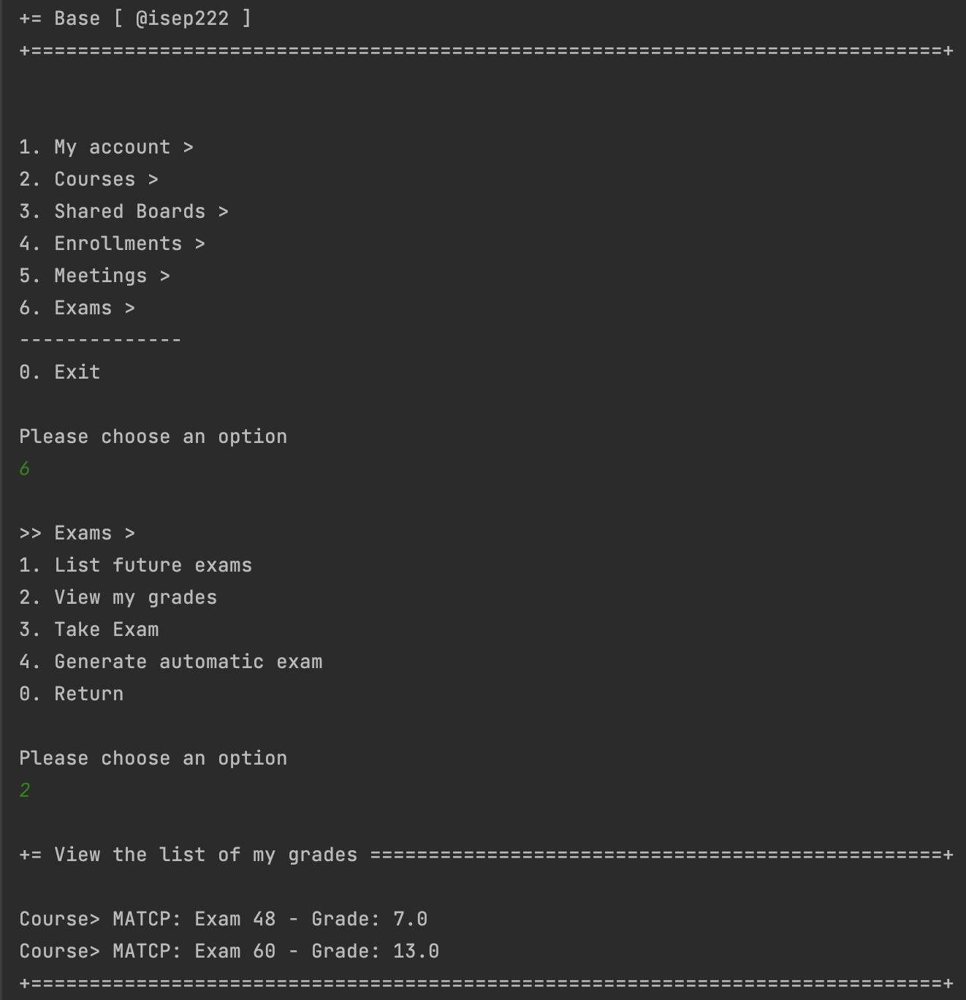
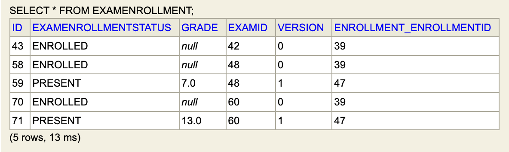

# US 2005 - As Student, I want to view a list of my grades

## 1. Context

*Implement a functionality that allows the student to see his grades*

## 2. Requirements

**US 2005 -** As Student, I want to view a list of my grades

## 3. Analysis

*For this US to be possible, the student must complete at least one exam, which has already received the grade.
If the student has not received any grade, the same will be indicated.* </br>

*Note:*
- Only students are able to execute this functionality.
- This US does not include the score for automated exams as scores for these are not saved.

## 4. Design

### 4.1. Realization
*This US has several dependencies. For it to be possible, initially the student has to be enrolled in the course where he wants to take the exam (US 1007 or US 1008), 
the only way to have access to the same exams after the professors create them (US 2001). After these steps, the student chooses the exam he wants to take, takes it 
and is evaluated (Note: the grades shown do not include those of the formative exams, since these are shown to the student at the time and are not saved afterwards). 
Thus, the student will already have notes to be able to visualize.*

### 4.2. Diagrams

#### 4.2.1 Class Diagram - CD



#### 4.2.2. System Sequence Diagram - SSD



#### 4.2.3 Sequence Diagram - SD


- The student wants to see the list of his grades. The system will retrieve the grades associated with the logged-in student from the exam enrollment repository.

### 4.3. Applied Patterns

* Controller

### 4.4. Tests

*It wasn't done any tests to repositories methods, only at the domain level, because of not being required at this stage to do so.*


## 5. Implementation

**List Of My Grades UI:**

```
public class ListOfMyGradesUI extends AbstractUI {

    private AuthorizationService authorizationService = AuthzRegistry.authorizationService();
    private StudentRepository studentRepository = PersistenceContext.repositories().studentRepository();
    private ListOfMyGradesController theController = new ListOfMyGradesController();

    @Override
    protected boolean doShow() {
        Iterable<ExamEnrollment> listGrades = theController.listMyGrades(studentRepository.findBySystemUser(authorizationService.session().get().authenticatedUser()));
        if(!listGrades.iterator().hasNext()){
            System.out.println("You don´t have any grades available!");
        }
        else{
            for(ExamEnrollment examEnrollment : listGrades){
                System.out.printf("Course> %s: Exam %d - Grade: %s\n", examEnrollment.enrollment().course().courseCode(), examEnrollment.examID(), examEnrollment.examGrade());
            }
        }
        return false;
    }

    @Override
    public String headline() {
        return "View the list of my grades";
    }
}
````


**List Of My Grades Controller:**

```
public class ListOfMyGradesController {

    private AuthorizationService authorizationService = AuthzRegistry.authorizationService();

    private ExamEnrollmentRepository examEnrollment = PersistenceContext.repositories().examEnrollmentRepository();

    private UserRepository userRepository = PersistenceContext.repositories().userRepository();

    public Iterable<ExamEnrollment> listMyGrades(Student student){
        authorizationService.ensureAuthenticatedUserHasAnyOf(BaseRoles.STUDENT);
        return examEnrollment.findExamGradesOfStudent(student);
    }
}
````

**Jpa Exam Enrollment Repository:** *This method returns the list of exam enrollment of a student*

```
@Override
    public Iterable<ExamEnrollment> findExamGradesOfStudent(Student student) {
        TypedQuery<ExamEnrollment> query = entityManager().createQuery(
                "SELECT examEnrollment FROM ExamEnrollment examEnrollment  WHERE examEnrollment.enrollment.student = :student",
                ExamEnrollment.class);
        query.setParameter("student", student);
        return query.getResultList();
    }
````

## 6. Integration/Demonstration

*In order to demonstrate how well it works, we had to initially enroll the student in the course where he/she would take the exam(s), 
in this case, MATCP. Then teacher1 created two exams in the mentioned course and, in this way, as the student is enrolled in the same he has access to these. 
He proceeded to carry out the same and was evaluated. This way we can already have access to the notes and they are listed below:*


*As expected, the notes are saved in the database.*


## 7. Observations

*Access to the repository is always done in the same way.
For this reason, an example sequence diagram has been created to demonstrate this. To exemplify, we list all existing questions in the repository of questions.*


*Like the repositories, the authentication part always follows the same order of ideas.
In this way, we perform a general SD that demonstrates the entire process. In the diagram, US 1008 is taken as an example,
as a Student, I want to request my enrollment in a course.*


