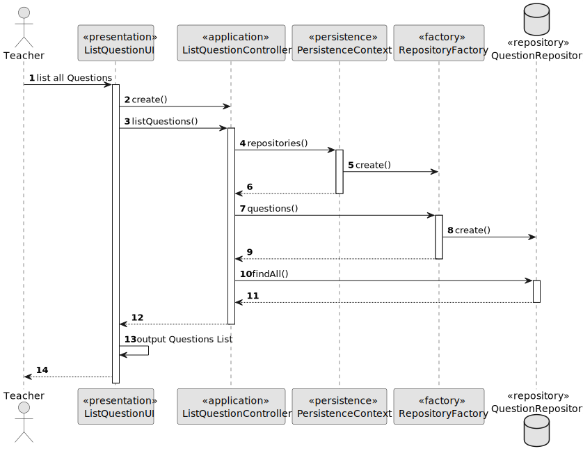

# US 1007 - As Manager, I want to enroll students in bulk by importing their data using a csv file

## 1. Context

Implement a functionality for the manager to enroll students in bulk by importing a csv file.

## 2. Requirements

This US descprition is "As Manager, I want to enroll students in bulk by importing their data using a csv file".
This US must enroll students in a course, and for this to happen, the system may have data in the repositories.

## 3. Analysis

To implement this US, the system asks for the file path and then, if the file is valid, bulks enroll students.
The csv file has two columns, one with the student identification, which is the mecanographic number, and other 
with the course identification, which is its name.
Notes:
- When creating an enrollment, the systems sets the status as 'ACCEPTED'
- The system only creates the enrollment in a course if the course status is 'ENROLL'
- When trying to create an enrollment, the system searches for an enrollment with the same identity (same student and course) and if it exists (either 'UNDER_APPRECIATION' or 'ACCEPTED'), it doesn't regist the enrollment from the csv.

## 4. Design

### 4.1. Realization

This US consists of three mains steps. First is import file, then the file must be validated, and if valid, we then
proceed to process the data and create the enrollments.
For each line on the file, the system will search for the student, by its mecanographic number, and for the course,
by its name, in the repositories, and if they are valid (exist), it will create an enrollment, with status 'ACCEPTED'.
Notes:
- It was created a csv file, which is in this folder, that has data (courses and students) persisted in bootstrap.

### 4.2. Diagrams

#### 4.2.1. Class Diagram - CD


#### 4.2.2. System Sequence Diagram - SSD


#### 4.2.3. Sequence Diagram - SD


### 4.3. Applied Patterns

Controller, Service and Builder.

### 4.4. Tests

**Utils:** *These were the variables used to create a course for the enrollments 
            and the method to open course enrollemnts*

```
final SystemUserBuilder userBuilder = UserBuilderHelper.builder();
final SystemUser student1 = userBuilder
    .withUsername("Student")
    .withEmail("Student@email.com")
    .withPassword("Password1")
    .withName("StudentFstName", "StudentLstName")
    .withRoles(BaseRoles.STUDENT)
    .build();

Course course = new CourseBuilder()
    .withCode("JAVA-1")
    .withName(new CourseName("course name"))
    .withDescription("course description")
    .hasMinStudents(10)
    .hasMaxStudents(20)
    .build();

private void openCourseEnrollments(Course course){
    course.openCourse(Date.from(Instant.now().plus(Duration.ofDays(90))));
    course.openEnrollments(Date.from(Instant.now().plus(Duration.ofDays(30))));
}
```

**Test 1:** *Verifies than an enrollment was successfully created, with valid variables.*

```
@Test
public void ensureCanCreateEnrollmentWithEnrollmentStatusStudentCourseGradeExamEnrollment() {
    openCourseEnrollments(course);
    Enrollment actual = new EnrollmentBuilder()
        .withEnrollmentStatus(EnrollmentsStatus.ACCEPTED)
        .ofStudent(student)
        .inCourse(course)
        .build();

    Enrollment expected = new Enrollment(EnrollmentsStatus.ACCEPTED, student, course);

    Assertions.assertTrue(expected.sameAs(actual));
}
````

**Test 2:** *Ensures an enrollment was not created because the course was not in status 'ENROLL'*

```
@Test
public void ensureCannotBuildWithNullEnrollStatus() {
    openCourseEnrollments(course);
    Assertions.assertThrows(IllegalArgumentException.class, () -> {
        new Enrollment(null, student, course);
    });
}
````

**Test 3:** *Verifies than an enrollment was not created because the student is null.*

```
@Test
public void ensureCannotBuildWithNullStudent() {
    openCourseEnrollments(course);
    Assertions.assertThrows(IllegalArgumentException.class, () -> {
        new Enrollment(EnrollmentsStatus.ACCEPTED, null, course);
    });
}
````

**Test 4:** *Verifies than an enrollment was not created because the course is null.*

```
@Test
public void ensureCannotBuildWithNullCourse() {
    openCourseEnrollments(course);
    Assertions.assertThrows(IllegalArgumentException.class, () -> {
        new Enrollment(EnrollmentsStatus.ACCEPTED, student, null);
    });
}
````

## 5. Implementation

**BulkEnrollStudentsUI:**

```
private BulkEnrollStudentsController controller = new BulkEnrollStudentsController();

@Override
protected boolean doShow() {
    String path = Console.readLine("Insert file path. \nFile must have only two columns" +
            ", the first named 'Student', which contains the student's mecanographic number " +
            ", and the second named 'Course', which contains the course's name:");

    File file = controller.importFile(path);

    boolean fileIsValid = controller.validateFile(file);

    if (fileIsValid) {
        System.out.println("Processing data...");
        Integer enrollmentsCreated = controller.bulkEnrollStudents(file);
        System.out.printf("Operation successful. %d enrollments created.\n", enrollmentsCreated);
    } else {
        System.out.println("File not valid.");
    }

    return true;
}
```


**BulkEnrollStudentsController:**

```
/**
 * This method is used to validate a file for bulk enrollment.
 * The file must meet the following criteria:
 * - The first sharedBoardColumn must be named "Student" and have the student's mecanographic numbers.
 * - The second sharedBoardColumn must be named "Course" and have the course's mecanographic number.
 *
 * @param file - file to be validated
 * @return file validation
 */
public boolean validateFile(File file) {
    authorizationService.ensureAuthenticatedUserHasAnyOf(BaseRoles.MANAGER);
    return svc.validateFile(file);
}

/**
 * This method receives a file, already validated, and processes the data, from the service.
 * It creates an enrollment if:
 * - the student mecanographic number and course codes are valid,
 * - the course status is 'ENROLL'
 * - there isn't already an enrollment with the same student and course
 *
 * @param file - file with the data
 * @return number of enrollments created
 */
public Integer bulkEnrollStudents(File file) {
    authorizationService.ensureAuthenticatedUserHasAnyOf(BaseRoles.MANAGER);
    return svc.bulkEnrollStudents(file);
}
```


**BulkEnrollStudentsService:**

```
private StudentRepository studentRepository = PersistenceContext.repositories().studentRepository();

private CourseRepository courseRepository = PersistenceContext.repositories().courseRepository();

private EnrollmentRepository enrollmentRepository = PersistenceContext.repositories().enrollmentRepository();

/**
 * This method receives a path and imports the file relative to that path.
 *
 * @param path - file path
 * @return file imported from path
 */
public File importFile(String path) {
    File file = new File(path);
    if (!file.exists()) {
        System.err.println("File does not exist: " + path);
        return null;
    }
    return file;
}

/**
 * This method receives a file and validates it regarding this US implementation.
 * Notes:
 * - The file must have more than 1 line (header)
 * - The first two columns must be relative to the data needed:
 * - The first sharedBoardColumn must be named "Student" and have the student's mecanographic numbers.
 * - The second sharedBoardColumn must be named "Course" and have the course's mecanographic number.
 *
 * @param file - file to be validated
 * @return file validation
 */
public boolean validateFile(File file) {
    if (file == null) {
        return false;
    }

    try (Scanner scanner = new Scanner(file)) {
        if (!scanner.hasNextLine()) {
            return false;
        }

        String headerRow = scanner.nextLine();
        String[] columns = headerRow.split(";");

        if (columns.length != 2
                || !columns[0].toLowerCase().equals("student")
                || !columns[1].toLowerCase().equals("course")) {
            return false;
        }
    } catch (IOException e) {
        return false;
    }

    return true;
}

/**
 * This method receives a file, already validated, and processes the data.
 * It creates an enrollment if:
 * - the student mecanographic number and course codes are valid,
 * - the course status is 'ENROLL'
 * - there isn't already an enrollment with the same student and course
 *
 * @param file - file with the data
 * @return number of enrollments created
 */
public Integer bulkEnrollStudents(File file) {
    Integer enrollmentsCreated = 0;

    try {
        Scanner scanner = new Scanner(file);
        scanner.nextLine(); // Skip the first row

        while (scanner.hasNextLine()) {
            String line = scanner.nextLine();
            String[] columns = line.split(";");
            MecanographicNumber studentMecanographicNumber = new MecanographicNumber(columns[0].trim());
            String courseCode = columns[1].trim();

            try {
                Student student = studentRepository.findByMecanographicNumber(studentMecanographicNumber);
                Course course = courseRepository.findByCode(courseCode);

                if (student != null && course != null
                        && course.courseStatus().equals(CourseStatus.ENROLL)
                        && enrollmentRepository.findStudentEnrollmentInCourse(student, course) == null) {
                    Enrollment enrollment = new EnrollmentBuilder()
                            .withEnrollmentStatus(EnrollmentsStatus.ACCEPTED)
                            .ofStudent(student)
                            .inCourse(course)
                            .build();
                    enrollmentRepository.save(enrollment);
                    enrollmentsCreated++;
                }
            } catch (Exception e) {
                e.printStackTrace();
            }
        }
        scanner.close();
    } catch (Exception e) {
        e.printStackTrace();
    }

    return enrollmentsCreated;
}
```

**JpaStudentRepository:**

```
@Override
public Student findByMecanographicNumber(final MecanographicNumber mecanographicNumber) {
    TypedQuery<Student> query = entityManager().createQuery(
        "SELECT student FROM Student student WHERE student.mecanographicNumber = :mecanographicNumber",
        Student.class);
    query.setParameter("mecanographicNumber", mecanographicNumber);
    try {
        return query.getSingleResult();
    } catch (NoResultException ex) {
        return null;
    }
}
```

**JpaCourseRepository:**

```
@Override
public Course findByCode(String courseCode) {
    TypedQuery<Course> query = entityManager().createQuery(
        "SELECT course FROM Course course WHERE course.courseCode = :code", Course.class);
    query.setParameter("code", courseCode);

    try {
        return query.getSingleResult();
    } catch (NoResultException e) {
        return null; // Course not found
    }
}
```

**JpaEnrollmentRepository:**

```
@Override
public Enrollment findStudentEnrollmentInCourse(Student student, Course course) {
    TypedQuery<Enrollment> query = entityManager().createQuery(
        "SELECT enrollment FROM Enrollment enrollment WHERE enrollment.student = :student OR enrollment.course = :course " +
        "AND (enrollment.enrollmentsStatus = :acceptedStatus AND enrollment.enrollmentsStatus = :underAppreciationStatus)",
        Enrollment.class);
    query.setParameter("student", student);
    query.setParameter("course", course);
    query.setParameter("acceptedStatus", EnrollmentsStatus.ACCEPTED);
    query.setParameter("underAppreciationStatus", EnrollmentsStatus.UNDER_APPRECIATION);

    try {
        return query.getSingleResult();
    } catch (NoResultException ex) {
        return null;
    }
}
```

**EnrollmentBuilder:**

```
private EnrollmentsStatus enrollmentsStatus;
private Student student;
private Course course;

public EnrollmentBuilder withEnrollmentStatus(EnrollmentsStatus enrollmentsStatus) {
    this.enrollmentsStatus = enrollmentsStatus;
    return this;
}

public EnrollmentBuilder ofStudent(Student student) {
    this.student = student;
    return this;
}

public EnrollmentBuilder inCourse(Course course) {
    this.course = course;
    return this;
}

public Enrollment build() {
    Preconditions.noneNull(enrollmentsStatus, student, course);
    return new Enrollment(enrollmentsStatus, student, course);
}
```

**Enrollment:**

```
public Enrollment(final EnrollmentsStatus enrollmentsStatus, final Student student,
                  final Course course) {
    Preconditions.noneNull(enrollmentsStatus, student, course);

    if (course.courseStatus().equals(CourseStatus.ENROLL)) {
        this.enrollmentsStatus = enrollmentsStatus;
        this.student = student;
        this.course = course;
    }
}
```

## 6. Integration/Demonstration

To demonstrate this US, we can first go to repositories and check which courses are in status enroll (the data in the bulk
will only create enrollments for courses where status is open):


Below, there is the csv imported (on this folder). There are 3 rows that are related to enroll 
a student on EAPLI and 3 to MATCP, so, in this case, as there isn't any enrollments saved on the repository,
6 enrollments must be created, 2 of them related to the same student (isep333):


Now, this is a brief demonstration of opening a course:


After this, let's check the repository (Course ID 34 belongs to EAPLI and 38 to MATCP):


## 7. Observations

*Access to the repository is always done in the same way.
For this reason, an example sequence diagram has been created to demonstrate this.
To exemplify, we list all existing questions in the repository of questions.*



*Like the repositories, the authentication part always follows the same order of ideas.
In this way, we perform a general SD that demonstrates the entire process. In the diagram, US 1008 is taken as an example,
as a Student, I want to request my enrollment in a course.*

