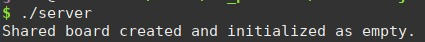
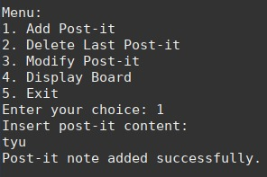
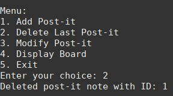
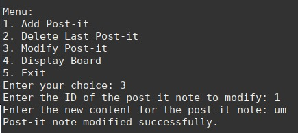
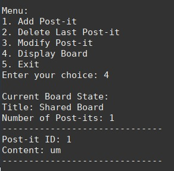

# US 3003 -  As Project Manager, I want the team to "explore" the synchronization problems related to the shyncronization of shared boards

## 1. Context

*Implement a functionality that explores the shyncronization of shared boards *

## 2. Requirements

*US-3003:* As Project Manager, I want the team to "explore" the synchronization problems related to the shyncronization of shared boards and design a conceptual solution based on practical evidence.

### Acceptance Criteria

This functional part of the system has very specific technical requirements, particularly some concerns about synchronization problems.
In fact, several clients will try to concurrently update boards. As such, to explore and study this concurrency scenario a "model" of a solution must be implemented and evaluated in C, using processes and semaphores.
Specific requirements will be provided in SCOMP.

## 3. Analysis

To implement this US, it was taken in consideration the algorithms learned in SCOMP classes, mainly the "Problema do Produtor/Consumidor".
Notes:
* Two different users can access the shared board at the same time but can't do the operation at the same time.
* Shared board it is created by the server

## 4. Design

### 4.1. Realization

In this US we use shared memory and semaphores to simulate the synchronization of a shared board. For that we created two programs. </br>
First of all, the shared board is created, and it is empty. This happens in the first program (server.c) </br>
Then the users can add post it, delete post it, change post it or just display the current state of the shared board, this is a responsibility of the second program (user.c).

## 5. Implementation

## server.c

```
#include <stdio.h>
#include <stdlib.h>
#include <unistd.h>
#include <fcntl.h>
#include <sys/mman.h>
#include <string.h>
#include <semaphore.h>

#define BOARD_SIZE 50
#define SHARED_MEM_NAME "/shared_mem"
#define CONTENT_SIZE 100

typedef struct {
int id;
char content[CONTENT_SIZE];
} PostIt;

typedef struct {
char title[CONTENT_SIZE];
int count;
PostIt postits[BOARD_SIZE];
} SharedBoard;

int main() {
int i;


    int fd = shm_open(SHARED_MEM_NAME, O_CREAT | O_RDWR, S_IRUSR | S_IWUSR);
    
    if (fd == -1) {
        perror("Erro no shm_open\n");
        exit(1);
    }
    
    int size = sizeof(SharedBoard);
    
    if (ftruncate(fd, size) == -1) {
        perror("Erro no ftruncate\n");
        exit(1);
    }
    

    // Map the shared memory object into the address space
    SharedBoard* sharedBoard = (SharedBoard*)mmap(NULL, size, PROT_READ | PROT_WRITE, MAP_SHARED, fd, 0);
    if (sharedBoard == MAP_FAILED) {
        perror("mmap");
        exit(1);
    }
    
    
    
    // Initialize the shared board as empty
	for (i = 0; i < BOARD_SIZE; i++) {
		sharedBoard->postits[i].id = 0;
		memset(sharedBoard->postits[i].content, 0, sizeof(sharedBoard->postits[i].content));
	}
    
    
	sharedBoard->count = 0;
    printf("Shared board created and initialized as empty.\n");

/*while(1)
sleep(1);

*/
return 0;
}
```


## user.c

```
#include <stdio.h>
#include <stdlib.h>
#include <string.h>
#include <fcntl.h>
#include <sys/stat.h>
#include <semaphore.h>
#include <unistd.h>
#include <sys/mman.h>
#include <errno.h>

#define SHARED_MEM_NAME "/shared_mem"
#define SEMAPHORE_NAME "/semaphore"
#define EMPTY_SLOTS_NAME "/empty_slots"
#define FULL_SLOTS_NAME "/full_slots"
#define CONTENT_SIZE 100
#define BOARD_SIZE 50

typedef struct {
int id;
char content[CONTENT_SIZE];
} PostIt;

typedef struct {
char title[CONTENT_SIZE];
int count;
PostIt postits[BOARD_SIZE];
} SharedBoard;

void addPostIt(SharedBoard* sharedBoard) {
sem_t* semaphore = sem_open(SEMAPHORE_NAME, O_RDWR);
sem_t* emptySlots = sem_open(EMPTY_SLOTS_NAME, O_RDWR);
sem_t* fullSlots = sem_open(FULL_SLOTS_NAME, O_RDWR);

    if (semaphore == SEM_FAILED || emptySlots == SEM_FAILED || fullSlots == SEM_FAILED) {
        perror("sem_open");
        exit(1);
    }

    sem_wait(emptySlots);  // Aguarda um slot vazio disponível

    sem_wait(semaphore);

    int postItId = sharedBoard->count + 1;

    if (sharedBoard->count >= BOARD_SIZE) {
        printf("The board is full. Cannot add more post-it notes.\n");

        sem_post(fullSlots);  // Indica que um slot preenchido está disponível
        sem_post(semaphore);

        sem_close(semaphore);
        sem_close(emptySlots);
        sem_close(fullSlots);
        return;
    }

// Add the post-it note to the board
PostIt *newPostIt = &sharedBoard->postits[sharedBoard->count];
newPostIt->id = sharedBoard->count + 1;


    // Get user input for the post-it content
	char content[CONTENT_SIZE];
	do{
        printf("Insert post-it content:\n");
        scanf("%s", content);
        
        if(sizeof(content)<=0){
			printf("Error reading content.\n");
			
			}
		}while(sizeof(content)<=0);
        
	strcpy(newPostIt->content, content);
	
    //increment the count of post its on the board
    sharedBoard->count++;	

    printf("Post-it note added successfully.\n");

    sem_post(fullSlots);  // Indica que um slot preenchido está disponível
    sem_post(semaphore);

    sem_close(semaphore);
    sem_close(emptySlots);
    sem_close(fullSlots);
}

void deleteLastPostIt(SharedBoard* sharedBoard) {
sem_t* semaphore = sem_open(SEMAPHORE_NAME, O_RDWR);
sem_t* emptySlots = sem_open(EMPTY_SLOTS_NAME, O_RDWR);
sem_t* fullSlots = sem_open(FULL_SLOTS_NAME, O_RDWR);

    if (semaphore == SEM_FAILED || emptySlots == SEM_FAILED || fullSlots == SEM_FAILED) {
        perror("sem_open");
        exit(1);
    }

    sem_wait(fullSlots);  // Aguarda um slot preenchido disponível

    sem_wait(semaphore);

    if (sharedBoard->count <= 0) {
        printf("The board is empty. No post-it notes available.\n");

        sem_post(emptySlots);  // Indica que um slot vazio está disponível
        sem_post(semaphore);

        sem_close(semaphore);
        sem_close(emptySlots);
        sem_close(fullSlots);
        return;
    }

    sharedBoard->count--;

    printf("Deleted post-it note with ID: %d\n", sharedBoard->postits[sharedBoard->count].id);

    sem_post(emptySlots);  // Indica que um slot vazio está disponível
    sem_post(semaphore);

    sem_close(semaphore);
    sem_close(emptySlots);
    sem_close(fullSlots);
}

void modifyPostIt(SharedBoard* sharedBoard) {
sem_t* semaphore = sem_open(SEMAPHORE_NAME, O_RDWR);
sem_t* emptySlots = sem_open(EMPTY_SLOTS_NAME, O_RDWR);
sem_t* fullSlots = sem_open(FULL_SLOTS_NAME, O_RDWR);

    if (semaphore == SEM_FAILED || emptySlots == SEM_FAILED || fullSlots == SEM_FAILED) {
        perror("sem_open");
        exit(1);
    }

    sem_wait(fullSlots);  // Aguarda um slot preenchido disponível

    sem_wait(semaphore);

    if (sharedBoard->count <= 0) {
        printf("The board is empty. No post-it notes available.\n");

        sem_post(emptySlots);  // Indica que um slot vazio está disponível
        sem_post(semaphore);

        sem_close(semaphore);
        sem_close(emptySlots);
        sem_close(fullSlots);
        return;
    }

    int postItId;
    printf("Enter the ID of the post-it note to modify: ");
    scanf("%d", &postItId);

    int found = 0;
    for (int i = 0; i < sharedBoard->count; i++) {
        if (sharedBoard->postits[i].id == postItId) {
            printf("Enter the new content for the post-it note: ");
            scanf(" %[^\n]", sharedBoard->postits[i].content);
            found = 1;
            break;
        }
    }

    if (!found) {
        printf("Post-it note with ID %d not found.\n", postItId);
    } else {
        printf("Post-it note modified successfully.\n");
    }

    sem_post(fullSlots);  // Indica que um slot preenchido está disponível
    sem_post(semaphore);

    sem_close(semaphore);
    sem_close(emptySlots);
    sem_close(fullSlots);
}

void displayBoard(SharedBoard* sharedBoard) {
sem_t* semaphore = sem_open(SEMAPHORE_NAME, O_RDWR);
sem_t* emptySlots = sem_open(EMPTY_SLOTS_NAME, O_RDWR);

    if (semaphore == SEM_FAILED || emptySlots == SEM_FAILED) {
        perror("sem_open");
        exit(1);
    }

    sem_wait(emptySlots);  // Aguarda um slot vazio disponível

    sem_wait(semaphore);

    printf("\nCurrent Board State:\n");
    printf("Title: %s\n", sharedBoard->title);
    printf("Number of Post-its: %d\n", sharedBoard->count);
    printf("------------------------------\n");
    for (int i = 0; i < sharedBoard->count; i++) {
        printf("Post-it ID: %d\n", sharedBoard->postits[i].id);
        printf("Content: %s\n", sharedBoard->postits[i].content);
        printf("------------------------------\n");
    }

    sem_post(emptySlots);  // Indica que um slot vazio está disponível
    sem_post(semaphore);

    sem_close(semaphore);
    sem_close(emptySlots);
}

int main() {
int fd = shm_open(SHARED_MEM_NAME, O_RDWR, S_IRUSR | S_IWUSR);
if (fd == -1) {
perror("shm_open");
exit(1);
}

    if (ftruncate(fd, sizeof(SharedBoard)) == -1) {
        perror("ftruncate");
        exit(1);
    }

    SharedBoard* sharedBoard = (SharedBoard*)mmap(NULL, sizeof(SharedBoard), PROT_READ | PROT_WRITE, MAP_SHARED, fd, 0);
    if (sharedBoard == MAP_FAILED) {
        perror("mmap");
        exit(1);
    }

    strcpy(sharedBoard->title, "Shared Board");
    

    sem_t* semaphore = sem_open(SEMAPHORE_NAME, O_CREAT | O_RDWR, 0666, 1);
    sem_t* emptySlots = sem_open(EMPTY_SLOTS_NAME, O_CREAT | O_RDWR, 0666, BOARD_SIZE);
    sem_t* fullSlots = sem_open(FULL_SLOTS_NAME, O_CREAT | O_RDWR, 0666, 0);

    if (semaphore == SEM_FAILED || emptySlots == SEM_FAILED || fullSlots == SEM_FAILED) {
        perror("sem_open");
        exit(1);
    }

    int choice;
    while (1) {
        printf("\nMenu:\n");
        printf("1. Add Post-it\n");
        printf("2. Delete Last Post-it\n");
        printf("3. Modify Post-it\n");
        printf("4. Display Board\n");
        printf("5. Exit\n");
        printf("Enter your choice: ");
        scanf("%d", &choice);

        switch (choice) {
            case 1:
                addPostIt(sharedBoard);
                break;
            case 2:
                deleteLastPostIt(sharedBoard);
                break;
            case 3:
                modifyPostIt(sharedBoard);
                break;
            case 4:
                displayBoard(sharedBoard);
                break;
            case 5:
                sem_close(semaphore);
                sem_close(emptySlots);
                sem_close(fullSlots);
                //sem_unlink(SEMAPHORE_NAME);
                //sem_unlink(EMPTY_SLOTS_NAME);
                //sem_unlink(FULL_SLOTS_NAME);
                //munmap(sharedBoard, sizeof(SharedBoard));
                close(fd);
                //shm_unlink(SHARED_MEM_NAME);
                printf("Exiting...\n");
                exit(0);
            default:
                printf("Invalid choice. Please try again.\n");
        }
    }

    return 0;
}
```

## 6. Integration/Demonstration

### server.c
The image bellow shows the server.c program working



### user.c
In the next images we can see the user.c program working

Here it adds a post it:



Delets post it



Modifies a post it



Displays the shared board

