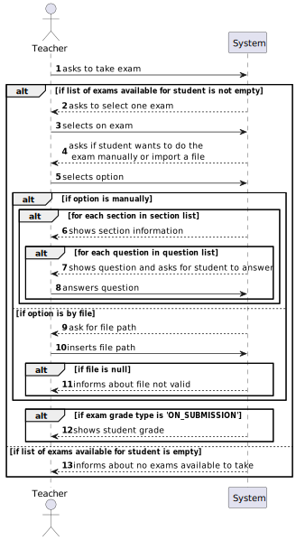

# US 2004 - As Student, I want to take an exam

## 1. Context

Implement a functionality for the student to take an exam.

## 2. Requirements

This US descprition is "As Student, I want to take an exam".

This US has some specific acceptance criterias related to LPROG:
- (...) The feedback and grade of the exam should be automatically calculated by a parser based on the grammar defined for exams structure.

## 3. Analysis

This US consists of the student taking an exam. Before actually showing the student the exam and asking for answers,
the system must display the exams available for the student logged in the system and ask to select one.
Then, the student takes the exam, which can be done manually (by the menus) or by a file (this part implements
the LPROG funcionality). When finished, the system displays the grade, if the feedback and grade type are
'ON_SUBMISSION'.

## 4. Design

### 4.1. Realization

To do this US, the first step is to access the exam enrollment repository to find the exams available for the student
to take. If the list is empty the system informs about no exams available for student to take, if not, the system asks
to select one exam and then to select one option to do the exam - manually/by file:
- Manually: The system displays, on loop, each section and its questions, while asking for answers. 
- By File : The systems asks for a file path, and if valid, it uses the TakeExamEvalVisitor, which corrects the exam 
based on a grammar, with parsers, and returns the grade obtained.

After finishing the exam, if the grade type is 'ON_SUBMISSION', the system displays to the student the grade,
if not, it saves the grade in the exam enrollment of the student in the exam selected and informs about no grade being
returned ('NONE') or being returned later ('AFTER_CLOSING').

Note:
- It was created a common UI and controller that receives an exam and does all the process of showing it to the student
and also get the answers because of US 2009, which is similar.

### 4.2. Diagrams

#### 4.2.1- Class Diagram - CD


#### 4.2.2. System Sequence Diagram - SSD



#### 4.2.3. Sequence Diagram - SD


To do this US, as said previously, it was created a Common Take Exam component, with
its respective UI, Controller and Service, to be used in another US.

The TakeExamUI accesses the repository to find the exams available for this student
to take and then ask to choose an exam. 

After that, it calls that common UI, which
does all the process of showing the exam, getting the answers and correcting them,
and then returns the grade.
If the option is to take the exam by file, the system imports the file and then,
while using the ANTLR tools, corrects it.

#### 4.3. Applied Patterns

Controller and Service.

### 4.4. Tests

*It wasn't done any tests to repositories methods, only for the domain level, because of not 
being required at this stage to do so.*

## 5. Implementation

**TakeExamUI:**
```
private static TakeExamController controller = new TakeExamController();

@Override
protected boolean doShow() {
    Iterable<Exam> examsAvailableList = controller.findExamsAvailableForStudentToTake();

    if (examsAvailableList.iterator().hasNext()){
        Exam exam = chooseExam(examsAvailableList);
        if (exam != null) {
            Grade grade = CommonTakeExamUI.takeExam(exam);
            controller.saveStudentGradeInExam(exam, grade);
            if (exam.header().gradeType().equals(GradeType.ON_SUBMISSION)) {
                System.out.printf("Final exam grade: %s%n", grade);
            } else if (exam.header().gradeType().equals(GradeType.AFTER_CLOSING)){
                System.out.println("Exam grade will be returned when the exam closes.");
            } else if (exam.header().gradeType().equals(GradeType.NONE)){
                System.out.println("No exam grade will be returned for this exam.");
            }
        }
    } else {
        System.out.println("No exams available to take.");
    }
    return false;
}

/**
* Method used to show the list of exams available for the student to take and
* ask to choose one option.
*
* @return exam selected
*/
private Exam chooseExam(Iterable<Exam> examsList) {
    final SelectWidget<Exam> selector = new SelectWidget<>("Select an exam to take:", examsList);
    selector.show();
    return selector.selectedElement();
}
```

**TakeExamController:**
```
private AuthorizationService authorizationService = AuthzRegistry.authorizationService();
private StudentRepository studentRepository = PersistenceContext.repositories().studentRepository();
private ExamEnrollmentRepository examEnrollmentRepository = PersistenceContext.repositories().examEnrollmentRepository();
private ExamRepository examRepository = PersistenceContext.repositories().examRepository();
    
/**
 * This method finds the exams available for the student to take,
 * which are the exam in which he has an exam enrollment with
 * status 'ENROLLED'
 *
 * @return exams available for student to take
 */
public Iterable<Exam> findExamsAvailableForStudentToTake() {
    if (authorizationService.isAuthenticatedUserAuthorizedTo(BaseRoles.STUDENT)) {
        Student student = studentRepository.findBySystemUser(authorizationService.session().get().authenticatedUser());

        Iterable<Long> examsIDs = examEnrollmentRepository.findIdsOfExamAvailableForStudentToTake(student);
        return findExamsWithExamsIds(examsIDs);
    }
    return null;
}

/**
 * This method receives a list of exam IDs, from the method findExamsAvailableForStudentToTake() and
 * returns a list with exams, after finding each exam corresponding to each ID.
 *
 * @param examsIDs - list of exam IDs to find exams of
 * @return list of exams
 */
private Iterable<Exam> findExamsWithExamsIds(Iterable<Long> examsIDs) {
    List<Exam> exams = new ArrayList<>();

    for (Long examId : examsIDs) {
        Optional<Exam> exam = examRepository.findById(examId);
        if (exam.isPresent()) {
            exams.add(exam.get());
        }
    }

    return exams;
}

/**
 * This method saves the grade of the student logged in the system in the exam enrollment
 * related to that student in the exam taken and also changes its status to
 *
 * @param exam - exam to change grade of
 * @param grade - grade obtained by student in the given exam
 */
public void saveStudentGradeInExam(Exam exam, Grade grade) {
    if (authorizationService.isAuthenticatedUserAuthorizedTo(BaseRoles.STUDENT)) {
        Student student = studentRepository.findBySystemUser(authorizationService.session().get().authenticatedUser());
        Optional<ExamEnrollment> examEnrollmentOpt = examEnrollmentRepository.findExamEnrollOfStudentInExam(student, exam);
        if (examEnrollmentOpt.isPresent()) {
            ExamEnrollment examEnrollment = examEnrollmentOpt.get();
            examEnrollment.changeExamGrade(grade);
            examEnrollment.changeExamEnrollmentStatusToPresent();
            examEnrollmentRepository.save(examEnrollment);
        }
    }
}
````

**JpaExamEnrollmentRepository:**
```
@Override
public Optional<ExamEnrollment> findExamEnrollOfStudentInExam(Student student, Exam exam) {
    TypedQuery<ExamEnrollment> query = entityManager().createQuery(
        "SELECT examEnrollment FROM ExamEnrollment examEnrollment" +
                    " WHERE examEnrollment.enrollment.student = :student" +
                    " AND examEnrollment.examID = :examID",
            ExamEnrollment.class);
    query.setParameter("student", student);
    query.setParameter("examID", exam.examID());
    return Optional.ofNullable(query.getSingleResult());    
}
````

**JpaExamRepository:**
```
@Override
public Optional<Exam> findById(Long id) {
    TypedQuery<Exam> query = entityManager().createQuery(
            "SELECT exam FROM Exam exam WHERE exam.examID = :id",
            Exam.class);
    query.setParameter("id", id);
return Optional.ofNullable(query.getSingleResult());
}
````

**CommonTakeExamUI:**
```
private static CommonTakeExamController controller = new CommonTakeExamController();

protected static Grade takeExam(Exam exam) {
    System.out.println("1. Take Manual Exam");
    System.out.println("2. Take Exam by File");
    System.out.println("0. Exit");

    final int option = Console.readOption(1, 2, 0);

    Grade grade = null;
    try {
        switch (option) {
            case 1:
                grade = takeManualExam(exam);
                break;
            case 2:
                grade = takeExamByFile(exam);
                break;
            default:
                System.out.println("No valid option selected.");
                break;
        }
    } catch (IntegrityViolationException | ConcurrencyException ex) {
        LOGGER.error("Error performing the operation", ex);
        System.out.println("Unfortunately, there was an unexpected error in the application. " +
            "Please try again, and if the problem persists, contact your system administrator.");
    } catch (IOException e) {
        throw new RuntimeException(e);
    }
    System.out.println("Exam finished.");
    return grade;
}

protected static Grade takeManualExam(Exam exam) {
    Float grade = 0F;
    List<Section> sectionList = exam.sections();

    for (int i = 0; i < sectionList.size(); i++) {
        Section section = sectionList.get(i);
        System.out.println();
        System.out.printf("Section %d - %s:%n", i + 1, section.description());

        List<Question> questionList = section.questions();
        for (int j = 0; j < questionList.size(); j++) {
            Question question = questionList.get(j);
            System.out.printf("Question %d - %s%n", j + 1, question);
            String studentAnswer = askForStudentAnswer(question);
            boolean correctStudentAnswer = controller.correctQuestion(question, studentAnswer);
            if (correctStudentAnswer) {
                grade += question.quotation();
            }
        }
    }

    return new Grade(grade);
}

private static String askForStudentAnswer(Question question) {
    if (question.questionType().equals(QuestionType.MATCHING)) {
        return askForMatchingAnswer();
    } else if (question.questionType().equals(QuestionType.MISSING_WORD)) {
        return askfForMissingWordAnswer();
    } else if (question.questionType().equals(QuestionType.MULTIPLE_CHOICE)) {
        return askForMultipleChoiceAnswer();
    } else if (question.questionType().equals(QuestionType.SHORT)) {
        return askForShortAnswer();
    } else if (question.questionType().equals(QuestionType.NUMERIC)) {
        return askForNumericAnswer();
    } else if (question.questionType().equals(QuestionType.TRUE_OR_FALSE)) {
        return askForTrueOrFalseAnswer();
    }

    return "";
}

private static String askForMatchingAnswer() {
    return Console.readLine("Answer this question with the following structure: (example: " +
            "leftOption1->rightOption2, leftOption2->rightOption1)");
}

private static String askfForMissingWordAnswer() {
    return Console.readLine("Answer this question with the following structure: " +
            "option1, option2");
}

private static String askForMultipleChoiceAnswer() {
    return Console.readLine("Type the correct answer:");
}

private static String askForShortAnswer() {
    return Console.readLine("Type your answer:");
}

private static String askForNumericAnswer() {
    return Console.readLine("Type your answer:");
}

private static String askForTrueOrFalseAnswer() {
    return Console.readLine("Answer with True/False:");
}

protected static Grade takeExamByFile(Exam exam) throws IOException {
    showExam(exam);

    String path = Console.readLine("Insert file path:");
    File file = controller.importFile(path);

    Grade grade = null;
    if (file.exists()) {
        grade = controller.correctExamByFile(exam, file);
    }

    return grade;
}

private static void showExam(Exam exam) {
    List<Section> sectionList = exam.sections();
    for (int i = 0; i < sectionList.size(); i++) {
        Section section = sectionList.get(i);
        System.out.println();
        System.out.printf("Section %d - %s:%n", i + 1, section.description());

        List<Question> questionList = section.questions();
        for (int j = 0; j < questionList.size(); j++) {
            Question question = questionList.get(j);
            System.out.printf("Question %d - %s%n", j + 1, question);
        }
    }
}
````

**CommonTakeExamController:**
```
private CommonTakeExamService svc = new CommonTakeExamService();

/**
 * This method receives a path and imports the file relative to that path.
 *
 * @param path - file path
 * @return file imported from path
 */
public File importFile(String path) {
    return svc.importFile(path);
}

/**
 * This method receives a question and a student answer
 * and checks if the student answer is correct. It's used
 * when the student answers the exam by the menus.
 *
 * @param question - question to correct
 * @param studentAnswer - student answer for that question
 * @return true, if questions is correct, or false, if not
 */
public boolean correctQuestion(Question question, String studentAnswer) {
    return svc.correctQuestion(question, studentAnswer);
}

/**
 * This method corrects an exam by the file imported and returns the grade obtained.
 *
 * @param exam - exam that student took
 * @param file - file with the student exam's realization
 * @return grade obtained from the file
 */
public Grade correctExamByFile(Exam exam, File file) throws IOException {
    return svc.correctExamByFile(exam, file);
}
````

**CommonTakeExamService:**
```
/**
 * This method receives a path and imports the file relative to that path.
 *
 * @param path - file path
 * @return file imported from path
 */
public File importFile(String path) {
    File file = new File(path);
    if (!file.exists()) {
        System.err.println("File does not exist: " + path);
        return null;
    }
    return file;
}

/**
 * This method receives a question and a student answer
 * and checks if the student answer is correct. It's used
 * when the student answers the exam by the menus.
 *
 * @param question      - question to correct
 * @param studentAnswer - student answer for that question
 * @return true, if questions is correct, or false, if not
 */
public boolean correctQuestion(Question question, String studentAnswer) {
    return studentAnswer.replace(" ", "")
            .equalsIgnoreCase(question.answer().replace(" ", ""));
}

/**
 * This method corrects an exam by the file imported and returns the grade obtained.
 *
 * @param exam - exam that student took
 * @param file - file with the student exam's realization
 * @return grade obtained from the file
 */
public Grade correctExamByFile(Exam exam, File file) throws IOException {
    TakeExamLexer lexer = new TakeExamLexer(CharStreams.fromFileName(file.getPath()));
    CommonTokenStream tokens = new CommonTokenStream(lexer);
    TakeExamParser parser = new TakeExamParser(tokens);
    ParseTree tree = parser.stat();
    TakeExamEvalVisitor visitor = new TakeExamEvalVisitor();

    return visitor.correctExam(tree, exam);
}
````

**TakeExamEvalVisitor:**
```
private Exam exam;
private int sectionCount = 0;
private Section examSection;
private Float grade = 0F;

public Grade correctExam(ParseTree tree, Exam exam) {
    this.exam = exam;
    visit(tree);
    return new Grade(grade);
}

@Override
public Integer visitStructure(TakeExamParser.StructureContext ctx) {
    return super.visitStructure(ctx);
}

@Override
public Integer visitSection(TakeExamParser.SectionContext ctx) {
    if (exam.sections().size() > sectionCount) {
        examSection = exam.sections().get(sectionCount);
        sectionCount++;
    }

    return super.visitSection(ctx);
}

@Override
public Integer visitQuestion(TakeExamParser.QuestionContext ctx) {
    if (examSection.questions().size() > Integer.parseInt(ctx.NUM().getText())) {
        Question examQuestion = examSection.questions().get(Integer.parseInt(ctx.NUM().getText()) - 1);
        String studentAnswer = ctx.questionAnswer().getText();
        if (studentAnswer.replace(" ", "")
                .equalsIgnoreCase(examQuestion.answer().replace(" ", ""))) {
            grade += examQuestion.quotation();
        }
    }
    return super.visitQuestion(ctx);
}
````

**TakeExam.g4:**
```
grammar TakeExam;

stat: INIT structure INIT;

structure: section+;

section: TEXT TWO_DOTS sectionStructure;

sectionStructure: question+;

question: NUM DOT questionAnswer SEPARATOR;

questionAnswer: TEXT
    | TEXT ARROW questionAnswer
    | questionAnswer ',' questionAnswer
    | TEXT ',' questionAnswer
    | NUM;

INIT: '"' ;
INITQUESTION: '??' ;
SEPARATOR: ';' ;
NUM: [0-9]+;
TEXT: [A-Za-z0-9]+;
ARROW: '->';
SECTIONOPEN: '<<' ;
SECTIONCLOSE: '>>' ;
TWO_DOTS: ':';
DOT: '.';
WS : [ \t\r\n]+ -> skip ;
```

## 6. Integration/Demonstration

This student is only enrolled in MATCP and the only exam created is related to MATCP, which is why there is only one option
(the other exam was created on the bootsrap).

Let's first have a look into the take exam manually functionality:
```
>> Exams >
1. List future exams
2. View my grades
3. Take Exam
4. Generate automatic exam
5. Take automatic exam
0. Return 

Please choose an option
3

+= Take Exam ==================================================================+

Select an exam to take:
1. Exam with title: title2, with description: teste, with status: CREATED, with open date:2023-07-30 and close date:2023-08-01

2. Exam with title: exam, with description: exam, with status: CREATED, with open date:2023-10-29 and close date:2023-11-01

0. Exit
Select an option: 
2
1. Take Manual Exam
2. Take Exam by File
0. Exit
Select an option: 
1

Section 1 - section1:
Question 1 - Matching Question: match the translation
cao        - cat       
gato       - dog       

Answer this question with the following structure: (example: leftOption1->rightOption2, leftOption2->rightOption1)
cao->dog, cat->gato

Question 2 - Matching Question: match the translation
porco      -  pig      
 baleia    -  whale    

Answer this question with the following structure: (example: leftOption1->rightOption2, leftOption2->rightOption1)
porco->pig, baleia->whale

Section 2 - section2:
Question 1 - Multiple Choice Question: how tall is the everest
1. 100metros
2.  2000metros
3.  7000metros

Type the correct answer:
7000metros

Question 2 - Missing Word Question: FILL *** GAP FOR *** PHRASE
1. the - that - these
2. the - that - this - these

Answer this question with the following structure: option1, option2
the,these

Question 3 - Numeric Question: How tall is the everest

Type your answer:
2000

Question 4 - Short Question: What is the everest

Type your answer:
a city

Question 5 - True/False Question: Is the everest tall

Answer with True/False:
True

Exam finished.
No exam grade will be returned for this exam.
```

Even though the grade type is 'NONE', which is why the student got that message, the grade
was saved on the repository:


Let's first have a look into the take exam manually functionality, uploading this file:
```
"
section1:
    1. cao->dog, gato->cat;
    2. porco->pig, baleia->whale;
section2:
    1. 7000metros;
    2. the,these;
    3. 2000;
    4. city;
    5. True;
"
```

This is how the functionality works:
```
>> Exams >
1. List future exams
2. View my grades
3. Take Exam
4. Generate automatic exam
5. Take automatic exam
0. Return 

Please choose an option
3

+= Take Exam ==================================================================+

Select an exam to take:
1. Exam with title: title2, with description: teste, with status: CREATED, with open date:2023-07-30 and close date:2023-08-01

2. Exam with title: exam123, with description: update teste, with status: CREATED, with open date:2023-10-29 and close date:2023-11-01

0. Exit
Select an option: 
2
1. Take Manual Exam
2. Take Exam by File
0. Exit
Select an option: 
2

Section 1 - section1:
Question 1 - Matching Question: match the translation
cao        - cat       
gato       - dog       

Question 2 - Matching Question: match the translation
porco      - pig       
baleia     - whale     


Section 2 - section2:
Question 1 - Multiple Choice Question: how tall is the everest?
1. 100metros
2. 2000metros
3. 7000metros

Question 2 - Missing Word Question: FILL *** GAP FOR *** PHRASE
1. the - that - these
2. the - that - this - these

Question 3 - Numeric Question: How tall is the everest?

Question 4 - Short Question: What is the everest?

Question 5 - True/False Question: Is the everest tall?

Insert file path:
takeexam.txt
Exam finished.
No exam grade will be returned for this exam.
+==============================================================================+
```

Even though the grade type is 'NONE', which is why the student got that message, the grade
was saved on the repository:


## 7. Observations

*Access to the repository is always done in the same way.
For this reason, an example sequence diagram has been created to demonstrate this.
To exemplify, we list all existing questions in the repository of questions.*


*Like the repositories, the authentication part always follows the same order of ideas.
In this way, we perform a general SD that demonstrates the entire process. In the diagram, US 1008 is taken as an example,
as a Student, I want to request my enrollment in a course.*

