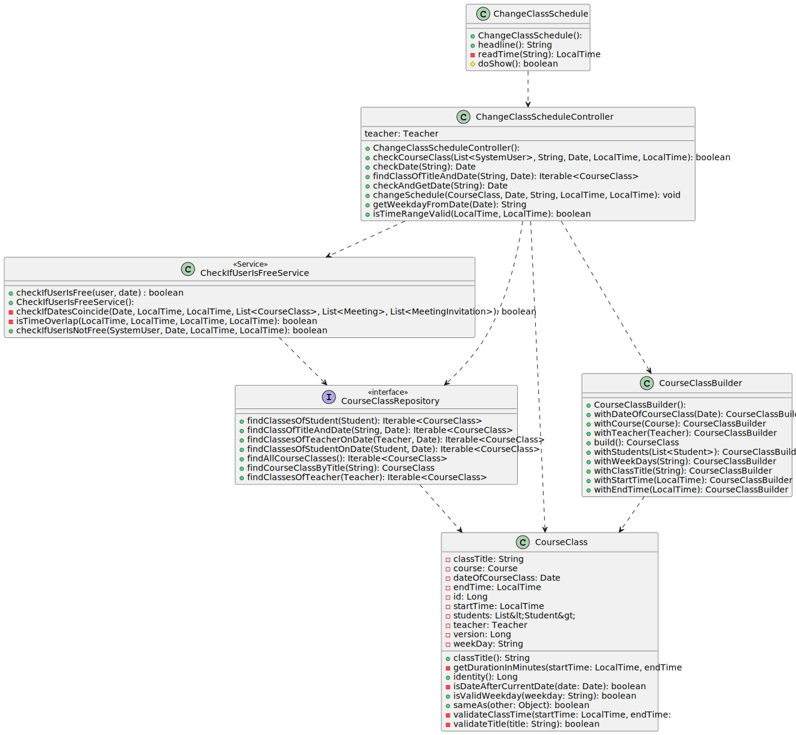
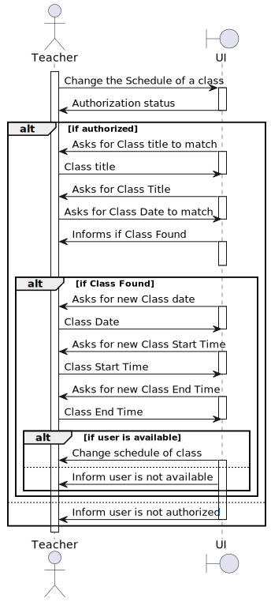
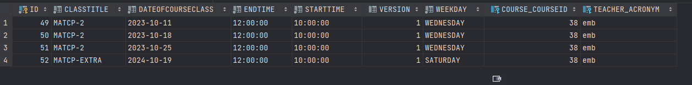
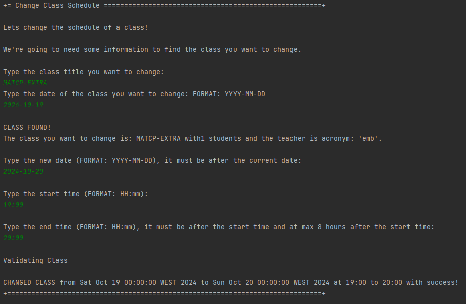
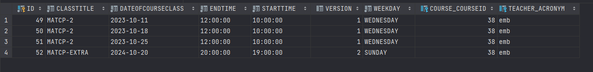

# US 1012 - As Teacher, I want to change the schedule of a class.

## 1. Context

Implement a functionality for the teacher to change the schedule of a class

## 2. Requirements

This US description is "As Teacher, I want to change the schedule of a class.".
I need to have courses and teachers created and persisted in the system.

## 3. Analysis

To implement this US, we need to have a class created, and we need to have a teacher logged in.
After that we have to ask for any identification of the class, this will let us know which class we want to change.
Then we need to ask for the new date, and the new time, and then we need to check if the teacher/students are in the specified date.

NOTES:
- The system has to validate all the classes and all the meetings any User has, and because of that it might take a while check.
- Only Teachers can change the schedule of a class.

## 4. Design

### 4.1. Realization

This US consists of some steps, first we need to add a title, then add a date.
The system will try to find the class with those attributes, if it finds it, it will ask for the new date and time.
We also need to check if the teacher is free in the specified date, if not we're going to return an error message.
We also need to check if the students are free in the specified date, if not we're going to ignore them.
If the teacher and the students are free, we're going to change the date and time of the class.

### 4.2. Diagrams

#### 4.2.1. Class Diagram - CD



#### 4.2.2. System Sequence Diagram - SSD



#### 4.2.3. Sequence Diagram - SD


### 4.3. Applied Patterns

Controller, Service and Builder.

### 4.4. Tests

**Utils:** *These were the variables used to create a class.*

```
final SystemUserBuilder userBuilder = UserBuilderHelper.builder();
    final TeacherBuilder teacherBuilder = new TeacherBuilder();
    final StudentBuilder studentBuilder = new StudentBuilder();

    final List<Student> students = new ArrayList<>();
    final SystemUser teacher1 = userBuilder
            .withUsername("Teacher")
            .withEmail("Teacher@email.com")
            .withPassword("Password1")
            .withName("TeacherFstName", "TeacherLstName")
            .withRoles(BaseRoles.TEACHER)
            .build();

    final SystemUser student1 = userBuilder
            .withUsername("Student")
            .withEmail("Student@email.com")
            .withPassword("Password1")
            .withName("StudentFstName", "StudentLstName")
            .withRoles(BaseRoles.STUDENT)
            .build();


    Teacher teacher = teacherBuilder.withSystemUser(teacher1).withAcronym("acr").build();
    Student student = studentBuilder.withSystemUser(student1).withMecanographicNumber("1212121").build();

    Course course = new CourseBuilder()
            .withCode("JAVA-1")
            .withName(new CourseName("course name"))
            .withDescription("course description")
            .hasMinStudents(10)
            .hasMaxStudents(20)
            .build();

    LocalDate today = LocalDate.now();
    LocalDate dateIn3Day = today.plusDays(3);
    Date date = Date.from(dateIn3Day.atStartOfDay().toInstant(java.time.ZoneOffset.UTC));

    LocalTime now = LocalTime.now();
    LocalTime after = now.plusHours(1);
```

**Test 1:** *Ensures we can't create a course without a teacher*

```
@org.junit.Test
    public void ensureCantCreateCourseClassWithNullTeacher() {

        students.add(student);

        Assertions.assertThrows(IllegalArgumentException.class, () -> {
            new CourseClass(null, "Class Title", date, "MONDAY", now, after, course, students);
        });
    }
````

**Test 2:** *Ensures we can't create a course without a title*

```
@org.junit.Test
    public void ensureCantCreateCourseClassWithNullClassTitle() {

        students.add(student);

        Assertions.assertThrows(IllegalArgumentException.class, () -> {
            new CourseClass(teacher, null, date, "MONDAY", now, after, course, students);
        });

    }
````

**Test 3:** *Ensures we can't create a course without a date*

```
@org.junit.Test
    public void ensureCantCreateCourseClassWithNullDate() {

        students.add(student);

        Assertions.assertThrows(IllegalArgumentException.class, () -> {
            new CourseClass(teacher, "Class Title", null, "MONDAY", now, after, course, students);
        });
    }
````

**Test 4:** *Verifies that we can't create a course without a weekday.*

```
@org.junit.Test
    public void ensureCantCreateCourseClassWithNullWeekDays() {

        students.add(student);

        Assertions.assertThrows(IllegalArgumentException.class, () -> {
            new CourseClass(teacher, "Class Title", date, null, now, after, course, students);
        });
    }
````

**Test 5:** *Verifies that we the title has to be between 3 and 30 chars.*

```
@org.junit.Test
public void ensureTitleMustBeBetween3And30Characters() {
students.add(student);
String weekDay = "MONDAY";

        Assertions.assertThrows(IllegalArgumentException.class, () -> {
            new CourseClass(teacher, "AB", date, weekDay, now, after, course, students);
        });

        Assertions.assertThrows(IllegalArgumentException.class, () -> {
            new CourseClass(teacher, "A Title That Exceeds Maximum Character Limit", date, weekDay, now, after, course, students);
        });

        Assertions.assertDoesNotThrow(() -> {
            new CourseClass(teacher, "Valid Title", date, weekDay, now, after, course, students);
        });
    }
````

**Test 6:** *Verifies that the dates are valid*

```
@org.junit.Test
public void ensureDateOfCourseClassMustBeAfterCurrentDate() {
students.add(student);
String weekDay = "MONDAY";
String classTitle = "Class Title";

        LocalDate today = LocalDate.now();
        LocalDate dateBefore = today.minusDays(3);
        LocalDate dateAfter = today.plusDays(3);
        Date pastDate = Date.from(dateBefore.atStartOfDay().toInstant(java.time.ZoneOffset.UTC));
        Date futureDate = Date.from(dateAfter.atStartOfDay().toInstant(java.time.ZoneOffset.UTC));

                Assertions.assertThrows(IllegalArgumentException.class, () -> {
                    new CourseClass(teacher, classTitle, pastDate, weekDay, now, after, course, students);
                });

        Assertions.assertDoesNotThrow(() -> {
            new CourseClass(teacher, classTitle, futureDate, weekDay, now, after, course, students);
        });
    }
````

**Test 7:** *Verifies that the start time is before the end time.*

```
@org.junit.Test
    public void ensureClassTimeMustBeValid() {
        students.add(student);
        String weekDay = "MONDAY";
        String classTitle = "Class Title";

        LocalTime invalidStartTime =  LocalTime.of(22, 59, 59); // create an invalid start time (23:59:59
                LocalTime invalidEndTime = LocalTime.of(0, 0, 0); // create an invalid end time (00:00:00)

                Assertions.assertThrows(IllegalArgumentException.class, () -> {
                    new CourseClass(teacher, classTitle, date, weekDay, invalidStartTime, after, course, students);
                });

        Assertions.assertThrows(IllegalArgumentException.class, () -> {
            new CourseClass(teacher, classTitle, date, weekDay, now, invalidEndTime, course, students);
        });

        Assertions.assertDoesNotThrow(() -> {
            new CourseClass(teacher, classTitle, date, weekDay, now, after, course, students);
        });
    }
````


## 5. Implementation

**ChangeClassSchedule:**

```
@Override
    protected boolean doShow() {
        try {

            Scanner scanner = new Scanner(System.in);

            LocalTime startTime = null;
            LocalTime endTime = null;

            if (authorizationService.isAuthenticatedUserAuthorizedTo(BaseRoles.TEACHER)) {

                List<SystemUser> systemUserList = new ArrayList<>();

                System.out.println("Lets change the schedule of a class!");
                System.out.println("\nWe're going to need some information to find the class you want to change.");

                String title = Console.readLine("\nType the class title you want to change:");

                System.out.println("Type the date of the class you want to change: FORMAT: YYYY-MM-DD");
                String dateString = scanner.nextLine();

                Date date = theController.checkDate(dateString);

                Iterable<CourseClass> courseClass = theController.findClassOfTitleAndDate(title, date);

                if (!courseClass.iterator().hasNext()) {
                    System.out.println("\nCLASS NOT FOUND! Please try again.");
                    return false;
                } else {
                    System.out.println("\nCLASS FOUND!");
                    CourseClass theClass = courseClass.iterator().next();

                    List<Student> students = theClass.getStudents();

                    if (students.isEmpty()){
                        System.out.println("\nCLASS WAS FOUND BUT HAS NO STUDENTS ASSIGNED! Please try again.");
                        return false;
                    }

                    System.out.println("The class you want to change is: " + theClass.classTitle() + " with" +
                            theClass.getStudents().size() + " students and the teacher is " +
                            theClass.getTeacher().acronym() + ".");

                    Teacher teacher = theClass.getTeacher();

                    if (teacher == null) {
                        System.out.println("\nCLASS WAS FOUND BUT HAS NO TEACHER ASSIGNED! Please try again.");
                        return false;
                    }

                    while (true) {
                        dateString = Console.readLine("\nType the new date (FORMAT: YYYY-MM-DD), it must be after the current date:");
                        if (theController.checkAndGetDate(dateString) != null) {
                            break;
                        } else {
                            System.out.println("Invalid start date! Start date must be after the current date.");
                        }
                    }

                    while (true) {
                        startTime = readTime("\nType the start time (FORMAT: HH:mm): ");
                        endTime = readTime("\nType the end time (FORMAT: HH:mm), it must be after the start time and at max 8 hours after the start time:");
                        if (theController.isTimeRangeValid(startTime, endTime)) {
                            break;
                        } else {
                            System.out.println("Invalid time range! End time must be after the start time and the time range must be at max 8 hours, try again.");
                        }
                    }

                    Date newDate = theController.checkAndGetDate(dateString);
                    String weekDay = theController.getWeekdayFromDate(newDate);

                    systemUserList.add(teacher.user());
                    for (Student student : students) {
                        systemUserList.add(student.user());
                    }

                    if (theController.checkCourseClass(systemUserList, title, newDate, startTime, endTime)) {
                        theController.changeSchedule(theClass, newDate, weekDay, startTime, endTime);
                        System.out.println("\nCHANGED CLASS from " + date.toString() + " to " + newDate.toString() + " at " + startTime + " to " + endTime + " with success!");
                    }else {
                        System.out.println("\nCLASS NOT CHANGED!");
                        System.out.println("There is already a class scheduled for this teacher at the date , or none of the students are free at this time.");
                    }
                }
            } else {
                System.out.println("You are not authorized to perform this operation.");
                return false;
            }

        } catch (IntegrityViolationException | ConcurrencyException ex) {
            LOGGER.error("Error performing the operation", ex);
            System.out.println(
                    "Unfortunately there was an unexpected error in the application. Please try again and if the problem persists, contact your system administrator.");
        }

        return false;
    }
```


**ChangeClassScheduleController:**

```

/**
 * The type Change class schedule controller.
 */
public class ChangeClassScheduleController

   
    /**
     * Find class of title and date iterable.
     *
     * @param title the title
     * @param date  the date
     * @return the iterable
     */
    public Iterable<CourseClass> findClassOfTitleAndDate(String title, Date date) {
        return courseClassRepository.findClassOfTitleAndDate(title, date);
    }

    /**
     * Convert string to date date.
     *
     * @param date the date
     * @return the date
     * @throws ParseException the parse exception
     */
    public Date checkDate(String date) {
        LocalDate currentDate = LocalDate.now();
        Date parsedStartDate = null;

        SimpleDateFormat format = new SimpleDateFormat("yyyy-MM-dd");

        try {
            parsedStartDate = format.parse(date);
            String formattedStartDate = format.format(parsedStartDate);
            if (!formattedStartDate.equals(date)) {
                // Invalid format, startDate does not match the expected format "YYYY-MM-DD"
                return null; // Or throw an exception if desired
            }
        } catch (ParseException e) {
            // Invalid format, unable to parse startDate
            return null; // Or throw an exception if desired
        }

        return parsedStartDate;

    }

    /**
     * Is time range valid boolean.
     *
     * @param startTime the start time
     * @param endTime   the end time
     * @return the boolean
     */
    public boolean isTimeRangeValid(LocalTime startTime, LocalTime endTime) {
        return endTime.isAfter(startTime) && Duration.between(startTime, endTime).toHours() <= 8;

    }

    /**
     * Check and get date date.
     *
     * @param date the date
     * @return the date
     */
    public Date checkAndGetDate(String date) {
        LocalDate currentDate = LocalDate.now();
        Date parsedStartDate = null;

        SimpleDateFormat format = new SimpleDateFormat("yyyy-MM-dd");

        try {
            parsedStartDate = format.parse(date);
            String formattedStartDate = format.format(parsedStartDate);
            if (!formattedStartDate.equals(date)) {
                // Invalid format, startDate does not match the expected format "YYYY-MM-DD"
                return null; // Or throw an exception if desired
            }
        } catch (ParseException e) {
            // Invalid format, unable to parse startDate
            return null; // Or throw an exception if desired
        }

        if (parsedStartDate.toInstant().atZone(ZoneId.systemDefault()).toLocalDate().isAfter(currentDate)) {
            return parsedStartDate;
        } else {
            return null; // Or throw an exception if desired
        }
    }

    /**
     * Get teacher teacher.
     *
     * @return the teacher
     */
    Teacher getTeacher() {
        SystemUser teacher;
        if (authorizationService.session().isPresent()) {
            teacher = this.authorizationService.session().get().authenticatedUser();
            return teacherRepository.findBySystemUser(teacher).get();
        }
        return null;
    }

    /**
     * Change schedule.
     *
     * @param courseClass  the course class
     * @param newDate      the new date
     * @param weekDay      the week day
     * @param newStartTime the new start time
     * @param newEndTime   the new end time
     */
    public void changeSchedule(CourseClass courseClass, Date newDate, String weekDay, LocalTime newStartTime, LocalTime newEndTime) {

        courseClass.setDateOfCourseClass(newDate);
        courseClass.setStartTime(newStartTime);
        courseClass.setEndTime(newEndTime);
        courseClass.setWeekDay(weekDay);

        courseClassRepository.save(courseClass);
    }

    /**
     * Check course class boolean.
     *
     * @param users             the users
     * @param title             the title
     * @param dateOfCourseClass the date of course class
     * @param startTime         the start time
     * @param endTime           the end time
     * @return the boolean
     */
    public boolean checkCourseClass(List<SystemUser> users, String title, Date dateOfCourseClass, LocalTime startTime, LocalTime endTime) {

        System.out.println("\nValidating Class");

        List<SystemUser> removedUsers = new ArrayList<>();

        int counter = 0;

        Iterator<SystemUser> iterator = users.iterator();
        while (iterator.hasNext()) {
            SystemUser user = iterator.next();

            if (user.hasAll(BaseRoles.TEACHER) && checkIfUserIsFreeService.checkIfUserIsNotFree(user, dateOfCourseClass, startTime, endTime)) {
                return false;
            } else if (user.hasAll(BaseRoles.STUDENT) && checkIfUserIsFreeService.checkIfUserIsNotFree(user, dateOfCourseClass, startTime, endTime)) {
                iterator.remove(); // Remove the user using the iterator
                removedUsers.add(user);
                counter++;
            }
        }

        if (users.size() == 1 && users.get(0).hasAll(BaseRoles.TEACHER)) {
            System.out.println("\nThere are no students available for the Class with title " + title + " on " + dateOfCourseClass + " at " + startTime + " - " + endTime + ".");
            return false;
        }

        if (counter > 0) {
            System.out.println("\nNumber of students removed from the Class with title " + title + " on " + dateOfCourseClass + " is " + counter + " students.");
            System.out.println("\nRemoved students:");
            for (SystemUser user : removedUsers) {

                System.out.printf("User identity: %s, User username: %s, User name: %s%n", user.identity(), user.username(), user.name());
            }
        }

        return true;
    }

    /**
     * Gets weekday from date.
     *
     * @param date the date
     * @return the weekday from date
     */
    public String getWeekdayFromDate(Date date) {
        Calendar calendar = Calendar.getInstance();
        calendar.setTime(date);

        int dayOfWeek = calendar.get(Calendar.DAY_OF_WEEK);

        switch (dayOfWeek) {
            case Calendar.SUNDAY:
                return "SUNDAY";
            case Calendar.MONDAY:
                return "MONDAY";
            case Calendar.TUESDAY:
                return "TUESDAY";
            case Calendar.WEDNESDAY:
                return "WEDNESDAY";
            case Calendar.THURSDAY:
                return "THURSDAY";
            case Calendar.FRIDAY:
                return "FRIDAY";
            case Calendar.SATURDAY:
                return "SATURDAY";
            default:
                return "Invalid day";
        }
    }
```

**CheckIfUserIsFreeService:**

```
/**
     * Check if user is not free boolean.
     *
     * @param user      the user
     * @param date      the date
     * @param startTime the start time
     * @param endTime   the end time
     * @return the boolean
     */
    public boolean checkIfUserIsNotFree(SystemUser user, Date date, LocalTime startTime, LocalTime endTime) {
        List<CourseClass> courseClassList = new ArrayList<>();
        List<Meeting> meetingList = new ArrayList<>();
        List<MeetingInvitation> meetingInvitationList = new ArrayList<>();

        if (user.hasAll(BaseRoles.TEACHER)) {
            Optional<Teacher> optionalTeacher = teacherRepository.findBySystemUser(user);
            if (optionalTeacher.isPresent()) {
                Teacher teacher = optionalTeacher.get();
                courseClassList.addAll((Collection<? extends CourseClass>) courseClassRepository.findClassesOfTeacher(teacher));
                meetingList.addAll((Collection<? extends Meeting>) meetingRepository.findMeetingOfUser(teacher.user()));
                meetingInvitationList.addAll((Collection<? extends MeetingInvitation>) meetingInvitationRepository.findMeetingInvitationOfUserWithStatusAccepted(teacher.user()));
            } else {
                throw new IllegalArgumentException("TEACHER NOT FOUND WHEN CHECKING IF USER IS FREE");
            }
        }

        if (user.hasAll(BaseRoles.STUDENT)) {
            Student student = studentRepository.findBySystemUser(user);
            courseClassList.addAll((Collection<? extends CourseClass>) courseClassRepository.findClassesOfStudent(student));
            meetingList.addAll((Collection<? extends Meeting>) meetingRepository.findMeetingOfUser(student.user()));
            meetingInvitationList.addAll((Collection<? extends MeetingInvitation>) meetingInvitationRepository.findMeetingInvitationOfUserWithStatusAccepted(student.user()));
        }

        if (user.hasAny(BaseRoles.POWER_USER, BaseRoles.MANAGER)) {
            meetingList.addAll((Collection<? extends Meeting>) meetingRepository.findMeetingOfUser(user));
            meetingInvitationList.addAll((Collection<? extends MeetingInvitation>) meetingInvitationRepository.findMeetingInvitationOfUserWithStatusAccepted(user));
        }

        return checkIfDatesCoincide(date, startTime, endTime, courseClassList, meetingList, meetingInvitationList);
    }

    private boolean checkIfDatesCoincide(Date date, LocalTime startTime, LocalTime endTime,
                                         List<CourseClass> courseClassList, List<Meeting> meetingList,
                                         List<MeetingInvitation> meetingInvitationList) {
        for (CourseClass courseClass : courseClassList) {
            if (courseClass.getDateOfCourseClass().equals(date) && isTimeOverlap(startTime, endTime, courseClass.getStartTime(), courseClass.getEndTime())) {
                return true;
            }
        }

        for (Meeting meeting : meetingList) {
            if (meeting.getDate().equals(date) && isTimeOverlap(startTime, endTime, meeting.getStartTime(), meeting.getEndTime())) {
                return true;
            }
        }

        for (MeetingInvitation meetingInvitation : meetingInvitationList) {
            Meeting meeting = meetingInvitation.meeting();
            if (meeting.getDate().equals(date) && isTimeOverlap(startTime, endTime, meeting.getStartTime(), meeting.getEndTime())) {
                return true;
            }
        }

        return false;
    }

    private boolean isTimeOverlap(LocalTime startTime1, LocalTime endTime1, LocalTime startTime2, LocalTime endTime2) {
        return startTime1.isBefore(endTime2) && endTime1.isAfter(startTime2) ||
                startTime2.isBefore(endTime1) && endTime2.isAfter(startTime1) ||
                startTime1.equals(startTime2) && endTime1.equals(endTime2);
    }
```

**JpaCourseClassRepository:**

```
@Override
    public Iterable<CourseClass> findAllCourseClasses() {
        final TypedQuery<CourseClass> query = entityManager().createQuery(
                "SELECT courseClass FROM CourseClass courseClass",
                CourseClass.class);

        return query.getResultList();
    }

    @Override
    public CourseClass findCourseClassByTitle(String className) {
        TypedQuery<CourseClass> query = entityManager().createQuery(
                "SELECT courseClass FROM CourseClass courseClass WHERE courseClass.classTitle = :title", CourseClass.class);
        query.setParameter("title", className);

        try {
            return query.getSingleResult();
        } catch (NoResultException e) {
            return null; // CourseClass not found
        }
    }

    @Override
    public Iterable<CourseClass> findClassesOfStudent(Student studentToCheck) {
        List<CourseClass> coursesClassesStudent = new ArrayList<>();
        CourseClassRepository courseClassRepository = PersistenceContext.repositories().courseClassRepository();
        List<CourseClass> courseClasses = (List<CourseClass>) courseClassRepository.findAllCourseClasses();
        StudentRepository studentRepository = PersistenceContext.repositories().studentRepository();
        Student student = studentRepository.findByMecanographicNumber(studentToCheck.identity());
        for (CourseClass courseClass : courseClasses) {
            if (courseClass.getStudents().contains(student)) {
                coursesClassesStudent.add(courseClass);
            }
        }
        return coursesClassesStudent;
    }

    @Override
    public Iterable<CourseClass> findClassesOfStudentOnDate(Student studentToCheck, Date date) {
        List<CourseClass> coursesClassesStudent = new ArrayList<>();
        CourseClassRepository courseClassRepository = PersistenceContext.repositories().courseClassRepository();
        List<CourseClass> courseClasses = (List<CourseClass>) courseClassRepository.findAllCourseClasses();
        StudentRepository studentRepository = PersistenceContext.repositories().studentRepository();
        Student student = studentRepository.findByMecanographicNumber(studentToCheck.identity());
        for (CourseClass courseClass : courseClasses) {
            if (courseClass.getStudents().contains(student) && courseClass.getDateOfCourseClass().equals(date)) {
                coursesClassesStudent.add(courseClass);
            }
        }
        return coursesClassesStudent;
    }

    @Override
    public Iterable<CourseClass> findClassesOfTeacher(Teacher teacherToCheck) {
        List<CourseClass> coursesClassesTeacher = new ArrayList<>();
        CourseClassRepository courseClassRepository = PersistenceContext.repositories().courseClassRepository();
        List<CourseClass> courseClasses = (List<CourseClass>) courseClassRepository.findAllCourseClasses();
        for (CourseClass courseClass : courseClasses) {
            if (courseClass.getTeacher().identity().equals(teacherToCheck.identity())) {
                coursesClassesTeacher.add(courseClass);
            }
        }
        return coursesClassesTeacher;
    }

    @Override
    public Iterable<CourseClass> findClassesOfTeacherOnDate(Teacher teacherToCheck, Date date) {
        List<CourseClass> coursesClassesTeacher = new ArrayList<>();
        CourseClassRepository courseClassRepository = PersistenceContext.repositories().courseClassRepository();
        List<CourseClass> courseClasses = (List<CourseClass>) courseClassRepository.findAllCourseClasses();
        for (CourseClass courseClass : courseClasses) {
            if (courseClass.getTeacher().identity().equals(teacherToCheck.identity()) && courseClass.getDateOfCourseClass().equals(date)) {
                coursesClassesTeacher.add(courseClass);
            }
        }
        return coursesClassesTeacher;
    }

    @Override
    public Iterable<CourseClass> findClassOfTitleAndDate(String title, Date date) {

        List<CourseClass> coursesClassesTitleAndDate = new ArrayList<>();
        CourseClassRepository courseClassRepository = PersistenceContext.repositories().courseClassRepository();
        List<CourseClass> courseClasses = (List<CourseClass>) courseClassRepository.findAllCourseClasses();
        for (CourseClass courseClass : courseClasses) {
            if (courseClass.classTitle().equals(title) && courseClass.getDateOfCourseClass().equals(date)) {
                coursesClassesTitleAndDate.add(courseClass);
            }
        }
        return coursesClassesTitleAndDate;
    }
```

**CourseClassBuilder:**

```
private Teacher teacher;
    private String classTitle;
    private Date dateOfCourseClass;

    private String weekDay;

    private LocalTime startTime;

    private LocalTime endTime;
    private Course course;

    private List<Student> students;

    /**
     * With teacher course class builder.
     *
     * @param teacher the teacher
     * @return the course class builder
     */
    public CourseClassBuilder withTeacher(Teacher teacher) {
        Preconditions.nonNull(teacher, "Teacher cannot be null");
        this.teacher=teacher;
        return this;
    }

    /**
     * With class title course class builder.
     *
     * @param classTitle the class title
     * @return the course class builder
     */
    public CourseClassBuilder withClassTitle(String classTitle) {
        Preconditions.nonEmpty(classTitle, "Class title cannot be empty");
        this.classTitle = classTitle;
        return this;
    }

    /**
     * With date of course class course class builder.
     *
     * @param dateOfCourseClass the date of course class
     * @return the course class builder
     */
    public CourseClassBuilder withDateOfCourseClass(Date dateOfCourseClass) {
        Preconditions.nonNull(dateOfCourseClass, "Start date cannot be null");
        this.dateOfCourseClass = dateOfCourseClass;
        return this;
    }

    /**
     * With course course class builder.
     *
     * @param course the course
     * @return the course class builder
     */
    public CourseClassBuilder withCourse(Course course) {
        this.course = course;
        return this;
    }

    /**
     * With students course class builder.
     *
     * @param students the students
     * @return the course class builder
     */
    public CourseClassBuilder withStudents(List<Student> students) {
        // Optional: You can perform any additional validations or modifications here.
        // For simplicity, I assume the provided list is valid.
        // If not provided, an empty list will be used.
        this.students = students;
        return this;
    }

    /**
     * With week days course class builder.
     *
     * @param weekDays the week days
     * @return the course class builder
     */
    public CourseClassBuilder withWeekDays(String weekDays) {
        Preconditions.nonNull(weekDays, "Week days cannot be null");
        this.weekDay = weekDays;
        return this;
    }

    /**
     * With start time course class builder.
     *
     * @param startTime the start time
     * @return the course class builder
     */
    public CourseClassBuilder withStartTime(LocalTime startTime) {
        Preconditions.nonNull(startTime, "Start time cannot be null");
        this.startTime = startTime;
        return this;
    }

    /**
     * With end time course class builder.
     *
     * @param endTime the end time
     * @return the course class builder
     */
    public CourseClassBuilder withEndTime(LocalTime endTime) {
        Preconditions.nonNull(endTime, "End time cannot be null");
        this.endTime = endTime;
        return this;
    }

    @Override
    public CourseClass build() {
        Preconditions.nonNull(teacher, "Teacher cannot be null");
        Preconditions.nonNull(classTitle, "Class title cannot be null");
        Preconditions.nonNull(dateOfCourseClass, "Start date cannot be null");
        Preconditions.nonNull(course, "Course cannot be null");
        Preconditions.nonNull(weekDay, "Week days cannot be null");
        Preconditions.nonNull(startTime, "Start time cannot be null");
        Preconditions.nonNull(endTime, "End time cannot be null");


        return new CourseClass(teacher, classTitle, dateOfCourseClass, weekDay, startTime,  endTime, course, students);
    }
```

**CourseClass:**

```
public CourseClass(final Teacher teacher, final String classTitle, final Date dateOfCourseClass,final String weekDay, final LocalTime startTime, final LocalTime endTime ,
                       final Course course, final List<Student> students) {
        Preconditions.noneNull(classTitle, dateOfCourseClass, weekDay,startTime,endTime,course, students,teacher);
        Preconditions.ensure(validateTitle(classTitle), "The title must be between 3 and 30 characters");
        Preconditions.ensure(isDateAfterCurrentDate(dateOfCourseClass), "The date of the course class must be after the current date");
        Preconditions.ensure(validateClassTime(startTime, endTime), "The class time must be valid");
        Preconditions.ensure(isValidWeekday(weekDay), "The week days must be valid");

        this.teacher = teacher;
        this.classTitle = classTitle;
        this.weekDay = weekDay;
        this.startTime = startTime;
        this.endTime = endTime;
        this.course = course;
        this.students = students;
        this.dateOfCourseClass = dateOfCourseClass;
    }
```

## 6. Integration/Demonstration

Below we can see the classes that are in the database



Now we are going to change the schedule of the class MATCP-EXTRA



Checking the database...



As you can see the changes were successful


