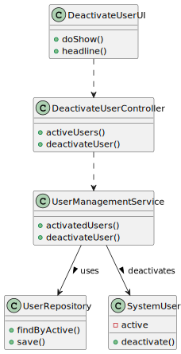
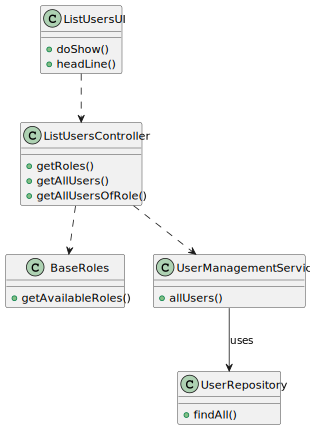
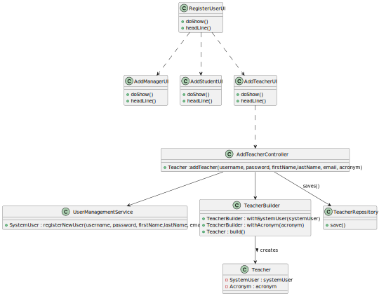
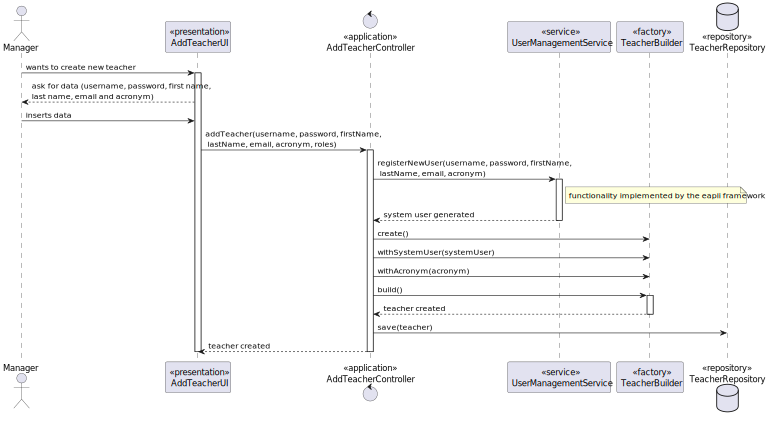
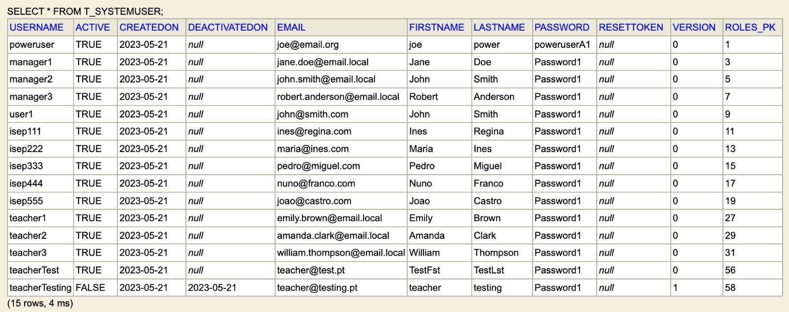

# US 1001 - As Manager, I want to be able to register, disable/enable, and list users of the system

## 1. Context

*Implement functionalities for the managers to manage users*

## 2. Requirements

**US 1001** - As Manager, I want to be able to register, disable/enable, and list users of the system (Teachers and Students, as well as Managers)

## 3. Analysis

It was used the Project "eapli.base" which uses the framework "EapliFramework" the functionalities to disable users,
create system users and list users were already implemented.
- The "Manager" is an entity of type SystemUser
- The "Student" class is basically the same as the previous "ClientUser", which consisted of a SystemUser and 
a MecanographicNumber
- The "Teacher" class follows the same idea as the "Student", only changing the MecanographicNumber for an Acronym.
For this class, it wasn't considered the possibility to make signup requests, only the manager can create teachers.

There were some problems regarding the update of the "EapliFramework", which should implement the "Enable Users"
functionlity, which is missing, as we have no permission to edit the files from the framework in the code.

## 4. Design

### 4.1. Realization

As most of the functionalities were implement from the "EapliFramework". As said above, the only class that was created
was the "Teacher", which follows the same idea as the "Student", but doesn't need the signup request, and therefore, all
the classes and methods that participate in that functionality.
Regarding the "Student", it was only done some refactors to align the code with the domain. All the SignupRequest and
watch dogs classes were keep as they were.
For the "Teacher", it was created a new class, which is similar to the "Student". The main difference is the Acronym,
which replaces the Mecanographic Number. Regarding the code, it is pretty simple, the UI asks for the data needed, and 
the controller, asks the User Management Service, a functionality implemented by the eapli framework, which returns
a SystemUser. Then, the controller creates the Teacher (the SystemUser and an Acronym) using the TeacherBuilder and
saves the teacher created on the repository.

### 4.2. Diagrams

As most of the functionalities were implement from the "EapliFramework", there was no need to desing and present the
diagrams corresponding to those classes and methods, only the Class Diagrams, to have a basic desing example
which means the only class for which was created a sequence diagram was for the "Teacher".
(As said above, the
"Student" follows exactly the same ideas as the previous "ClientUser", it was only done some refactor to align the
code with the domain).

#### 4.2.1 - List Users



#### 4.2.2 - Disable Users



#### 4.2.3 - Register Teacher

###### 4.2.3.1 - Class Diagram - CD



###### 4.2.3.2 - Sequence Diagram - SD



###### 4.2.3.3 - System Sequence Diagram - SSD


### 4.3. Applied Patterns

Controller, Service and Builder.

### 4.4. Tests

It wasn't done any tests for this US, as most of the funcionalities used are implemented from the eapli framework.

## 5. Implementation

In this point, it's presented the classes corresponding for each user type (SystemUser, Teacher and Student), and the
classes that create the Teacher, which was the only methods created.

**SystemUser:**

```
@Entity
@Table(
    name = "T_SYSTEMUSER"
)
public class SystemUser implements AggregateRoot<Username>, DTOable<GeneralDTO>, Visitable<GeneralDTO>, Serializable {
    private static final long serialVersionUID = 1L;
    @Version
    private Long version;
    @EmbeddedId
    private Username username;
    private Password password;
    private Name name;
    private EmailAddress email;
    @OneToOne(
        cascade = {CascadeType.ALL},
        optional = false,
        fetch = FetchType.EAGER
    )
    private RoleSet roles;
    @Temporal(TemporalType.DATE)
    private Calendar createdOn;
    private boolean active;
    @Temporal(TemporalType.DATE)
    private Calendar deactivatedOn;
    private String resetToken;
````


**Student:**

```
@Entity
@Table(name = "Student")
public class Student implements AggregateRoot<MecanographicNumber> {

    @Version
    private Long version;

    @EmbeddedId
    private MecanographicNumber mecanographicNumber;

    @ManyToMany
    List<CourseClass> classesAttended;

    /**
     * cascade = CascadeType.NONE as the systemUser is part of another aggregate
     */
    @OneToOne()
    private SystemUser systemUser;
```


**Teacher:**

```
@Entity
@Table(name = "Teacher")
public class Teacher implements AggregateRoot<Acronym> {

    @Version
    private Long version;

    @EmbeddedId
    private Acronym acronym;

    /**
     * cascade = CascadeType.NONE as the systemUser is part of another aggregate
     */
    @OneToOne()
    private SystemUser systemUser;
```


**AddTeacherUI:**

```
@Override
protected boolean doShow() {
    final String username = Console.readLine("Username: ");
    final String password = Console.readLine("Password: ");
    final String firstName = Console.readLine("First Name: ");
    final String lastName = Console.readLine("Last Name: ");
    final String email = Console.readLine("E-Mail: ");
    final String acronym = Console.readLine("Acronym: ");
    final Set<Role> roles = new HashSet<>();
    roles.add(BaseRoles.TEACHER);

    try {
        this.controller.addTeacher(username, password, firstName, lastName, email, acronym, roles);
    } catch (final IntegrityViolationException | ConcurrencyException e) {
        System.out.println("That username is already in use.");
    }

    return false;
}

@Override
public String headline() {
    return "Add Teacher";
}
````

**AddTeacherController:**

```
private final AuthorizationService authz = AuthzRegistry.authorizationService();
private final UserManagementService userSvc = AuthzRegistry.userService();
private final TeacherRepository teacherRepository = PersistenceContext.repositories().teacherRepository();

public Teacher addTeacher(final String username, final String password, final String firstName,
                        final String lastName, final String email,
						final String acronym, final Set<Role> roles) {
    authz.ensureAuthenticatedUserHasAnyOf(BaseRoles.POWER_USER, BaseRoles.MANAGER);

	SystemUser systemUser =  userSvc.registerNewUser(username, password, firstName, lastName, email, roles, CurrentTimeCalendars.now());

	final Teacher teacher = new TeacherBuilder().withSystemUser(systemUser).withAcronym(acronym).build();

	return this.teacherRepository.save(teacher);
}
````

**TeacherBuilder:**

```
private SystemUser systemUser;
private Acronym acronym;

public TeacherBuilder withSystemUser(final SystemUser systemUser) {
    this.systemUser = systemUser;
    return this;
}

public TeacherBuilder withAcronym(final Acronym acronym) {
    this.acronym = acronym;
    return this;
}

public TeacherBuilder withAcronym(final String acronym) {
    this.acronym = new Acronym(acronym);
    return this;
}

@Override
public Teacher build() {
    // since the factory knows that all the parts are needed it could throw
    // an exception. however, we will leave that to the constructor
    return new Teacher(this.systemUser, this.acronym);
}
````

## 6. Integration/Demonstration

This is a brief demo of the create teacher funcionality (create manager/student is similar, and as it is implemented
from the eapli framework, it wasn't inserted in the readme):

 </br>

This is the list users functionality, already with the new teacher created:

 </br>

This is the disable users functionality:
 </br>

This is the repository, after creating the new teacher and disable him (attribute 'active' as false).
 </br>

## 7. Observations

*Access to the repository is always done in the same way.
For this reason, an example sequence diagram has been created to demonstrate this. To exemplify, we list all existing questions in the repository of questions.*


*Like the repositories, the authentication part always follows the same order of ideas.
In this way, we perform a general SD that demonstrates the entire process. In the diagram, US 1008 is taken as an example,
as a Student, I want to request my enrollment in a course.*

