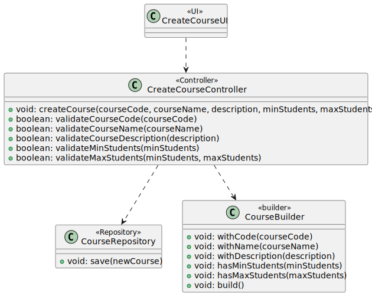
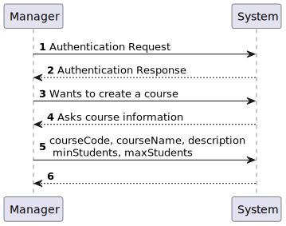
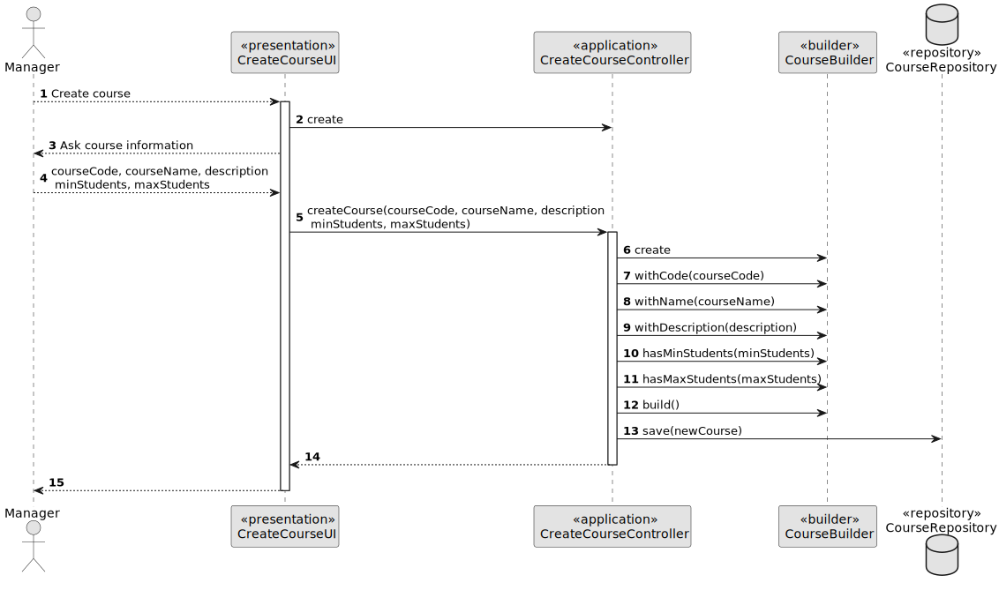
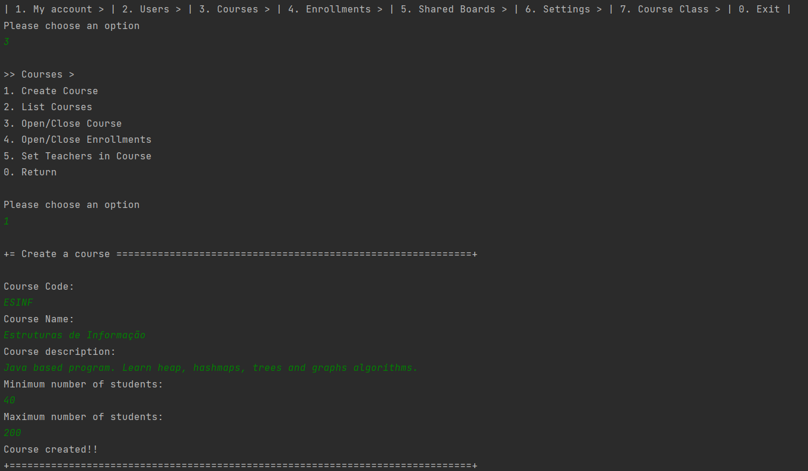
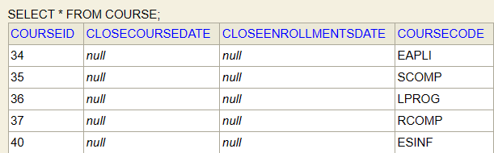

# US 1002 - As Manager, I want to create courses

## 1. Context

*Implement a functionality for the manager to create courses*

## 2. Requirements

**US 1002 -** As Manager, I want to create courses

## 3. Analysis

*To implement this US, the system asks the manager all the information about the new course (course code, course name, a small description, min and max number of students).
The teacher in charge is defined in US 1005.*
*Note:*
- When creating a course, the course status is close.
- Only managers are able to execute this functionality.

## 4. Design

### 4.1. Realization

*The first step of this US is to ask the user for the necessary information to create a valid course. 
As information is requested, it is validated and, if it is invalid, feedback is shown to the creator of the course 
(for example, if the manager enters a courseCode with less than 3 characters or more than 10, he will see the following message: 
"Course code must have more than 3 characters and less than 10!" and a course code will be asked again, until it is valid!).*
### 4.2. Class Diagram



#### 4.2.2. System Sequence Diagram - SSD



#### 4.2.3 Sequence Diagram - SD



### 4.3. Applied Patterns

* Controller
* Builder

### 4.4. Tests

### Course Tests
**Test 1:** *Verifies the course status when the course it's created*

```
@org.junit.Test
    public void testCourseStatusWhenCreated() {
        Course course = new Course(courseCode, courseName, description, minStudents, maxStudents);

        CourseStatus expected = CourseStatus.CLOSE;
        CourseStatus actual = course.courseStatus();

        Assertions.assertEquals(expected, actual);
    }
````

**Test 2:** *Verifies that it is not possible to create a course with a course code with less than 4 characters.*

```
@org.junit.Test(expected = IllegalArgumentException.class)
    public void ensureCourseCodeMustNotHaveLengthLessThan3() {
        System.out.println("Course code must have more than three characters!!");
        new Course("ct", courseName, description, minStudents, maxStudents);
    }
````

**Test 3:** *Verifies that it is not possible to create a courses with a negative value of maximum students.*

```
@org.junit.Test(expected = IllegalArgumentException.class)
    public void ensureMaxStudentsMustNotBeNegative() {
        System.out.println("Min Student can't be negative");
        new Course(courseCode, courseName, description, minStudents, -1);
    }
````

**Test 4:** *Verifies that it is not possible to create a course with a maximum number of students smaller than the minimum number of students.*

```
@org.junit.Test(expected = IllegalArgumentException.class)
    public void ensureMaxStudentsIsMoreThanMinStudents() {
        System.out.println("Max students must be more then min students");
        new Course(courseCode, courseName, description, 10, 9);
    }
````

#### Course Builder Tests

**Test 1:** *Verifies that is possible to create a course.*

```
@Test
    public void ensureCanBuildCourseWithCodeNameDescriptionMinMaxStudentsTeacherInCharge(){
        CourseBuilder builder = new CourseBuilder();
        Course actual = builder
                .withCode("JAVA-1")
                .withName(CourseName.valueOf("Eapli-22/23"))
                .withDescription("Java programming")
                .hasMinStudents(15)
                .hasMaxStudents(25)
                .build();

        Course expected = new Course("JAVA-1", new CourseName("Eapli-22/23"), "Java programming", 15, 25);
        Assertions.assertEquals(expected, actual);
    }
````


**Test 2:** *Verifies that ii is not possible to create a course with a null code.*
```
@Test
    public void ensureCannotBuildWithNullCode(){
        Assertions.assertThrows(IllegalArgumentException.class, () -> {
            new Course(null, new CourseName("Eapli-22/23"), "Java programming", 15, 25);
        });
    }
````

**Test 3:** *Verifies that ii is not possible to create a course with a null description.*
```
@Test
    public void ensureCannotBuildWithNullDescription(){
        Assertions.assertThrows(IllegalArgumentException.class, () -> {
            new Course("JAVA-1", new CourseName("Eapli-22/23"), null, 15, 25);
        });
    }
````

**Test 4:** *Verifies that it is not possible to create a course with null Max students.*
```
@Test
    public void ensureCannotBuildWithNullMaxStudents(){
        Assertions.assertThrows(IllegalArgumentException.class, () -> {
            new Course(null, new CourseName("Eapli-22/23"), "Java programming", 15, null);
        });
    }
````

## 5. Implementation

**Create Course Controller:** *The methods below create the course and do all the necessary validations so that it is valid*

```
public void createCourse(String courseCode, CourseName courseName, String description, Integer minStudents, Integer maxStudents){
        final Course newCourse = new CourseBuilder().withCode(courseCode)
                .withName(courseName)
                .withDescription(description)
                .hasMinStudents(minStudents)
                .hasMaxStudents(maxStudents).build();

        courseRepository.save(newCourse);
    }

    /**
     * This method validates the course code of the course that is going to be created.
     * It must have more than 3 characters and less than 50 characters.
     * @param courseCode
     * @return courseCode validation
     */
    public boolean validateCourseCode(String courseCode){
        if(courseCode.length() <= 3 || courseCode.length() > 10){
            return false;
        }
        return true;
    }

    /**
     * This method validates the course name of the course that is going to be created.
     * It must have more than 3 characters and less than 30 characters.
     * @param courseName
     * @return courseName validation
     */
    public boolean validateCourseName(CourseName courseName){
        if(courseName.length() <= 3 || courseName.length() > 30){
            return false;
        }
        return true;
    }

    /**
     * This method validates the course description of the course that is going to be created.
     * It must have more than 10 characters and less than 150 characters.
     * @param description
     * @return description validation
     */
    public boolean validateCourseDescription(String description){
        if(description.length() <= 10 || description.length() > 150){
            return false;
        }
        return true;
    }

    /**
     * This method validates the course minStudents of the course that is going to be created.
     * It can´t negative or zero.
     * @param minStudents
     * @return minStudents validation
     */
    public boolean validateMinStudents(Integer minStudents){
        if(minStudents <= 0){
            return false;
        }
        return true;
    }

    /**
     * This method validates the course maxStudents of the course that is going to be created.
     * It can´t negative or zero.
     * It can´t be less than the minimum students.
     * @param maxStudents
     * @return maxStudents validation
     */
    public boolean validateMaxStudents(Integer minStudents, Integer maxStudents){
        if(maxStudents <= 0){
            return false;
        } else if(minStudents > maxStudents){
            return false;
        }
        return true;
    }
````

**Create Course UI:**
*The class shown below is where the user is asked for all the information needed to create a course.
Here we call the controller validation methods, referred to above.*

```
public class CreateCourseUI extends AbstractUI {

    private static final Logger LOGGER = LogManager.getLogger(CreateCourseUI.class);

    private AuthorizationService authorizationService = AuthzRegistry.authorizationService();;

    private CreateCourseController theController = new CreateCourseController();

    @Override
    protected boolean doShow() {
        String courseCode = null;
        boolean courseCodeValid = false;
        while (!courseCodeValid) {
            courseCode = Console.readLine("Course Code: ");
            courseCodeValid = theController.validateCourseCode(courseCode);
            if (!courseCodeValid) {
                System.out.println("Course code must have more than 3 characters and less than 10!");
            }
        }

        CourseName courseName = null;
        boolean courseNameValid = false;
        while (!courseNameValid) {
            courseName = CourseName.valueOf(Console.readLine("Course Name: "));
            courseNameValid = theController.validateCourseName(CourseName.valueOf(String.valueOf(courseName)));
            if (!courseNameValid) {
                System.out.println("Course name must have more than 3 characters and less than 30!");
            }
        }

        String description = null;
        boolean descriptionValid = false;
        while (!descriptionValid) {
            description = Console.readLine("Course Description: ");
            descriptionValid = theController.validateCourseDescription(description);
            if (!descriptionValid) {
                System.out.println("Course description must have more than 10 characters and less than 150!");
            }
        }

        Integer minStudents = null;
        boolean minStudentsValid = false;
        while (!minStudentsValid) {
            minStudents = Console.readInteger("Minimum students: ");
            minStudentsValid = theController.validateMinStudents(minStudents);
            if (!minStudentsValid) {
                System.out.println("You have to have a positive number of minimum students!");
            }
        }

        Integer maxStudents = null;
        boolean maxStudentsValid = false;
        while (!maxStudentsValid) {
            maxStudents = Console.readInteger("Maximum Students: ");
            maxStudentsValid = theController.validateMaxStudents(minStudents, maxStudents);

            if (!maxStudentsValid) {
                System.out.println("You have to have a positive number of maximum students and it can be less than the minimum students!");
            }
        }

        try {
            theController.createCourse(courseCode, courseName, description, minStudents, maxStudents);
            System.out.println("Course created!!");
        } catch (final IntegrityViolationException e) {
            System.out.println("That course already exists!");
        } catch (final ConcurrencyException e) {
            LOGGER.error("Error performing the operation", e);
            System.out.println(
                    "Unfortunately there was an unexpected error in the application. Please try again and if the problem persists, contact your system admnistrator.");
        }
        return false;
    }

    @Override
    public String headline() {
        return "Create a course";
    }
}
````

**Course Builder:** 

```
public CourseBuilder withCode(final String courseCode) {
this.courseCode = courseCode;
return this;
}

    public CourseBuilder withName(final String courseName) {
        this.courseName = new CourseName(courseName);
        return this;
    }

    public CourseBuilder withName(final CourseName courseName) {
        this.courseName = courseName;
        return this;
    }

    public CourseBuilder withDescription(final String description) {
        this.description = description;
        return this;
    }

    public CourseBuilder hasMinStudents(final Integer minStudents) {
        this.minStudents = minStudents;
        return this;
    }

    public CourseBuilder hasMaxStudents(final Integer maxStudents) {
        this.maxStudents = maxStudents;
        return this;
    }

    @Override
    public Course build() {

        Preconditions.noneNull(courseCode, courseName, description, minStudents, maxStudents);

        theCourse = new Course(courseCode,
                courseName,
                description,
                minStudents,
                maxStudents);

        return theCourse;
    }
````

## 6. Integration/Demonstration

*The image below represents the implementation in question. All the necessary information is requested in this case from a manager, the only one who can carry out this function.*
 </br>

*The next image represents the table in the database, as expected!*
 </br>

## 7. Observations

*Access to the repository is always done in the same way.
For this reason, an example sequence diagram has been created to demonstrate this. To exemplify, we list all existing questions in the repository of questions.*


*Like the repositories, the authentication part always follows the same order of ideas.
In this way, we perform a general SD that demonstrates the entire process. In the diagram, US 1008 is taken as an example,
as a Student, I want to request my enrollment in a course.*

