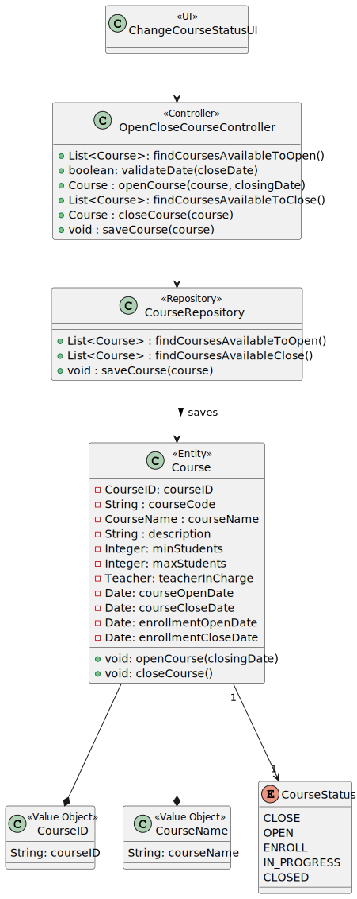
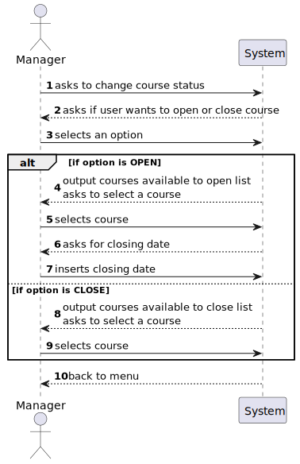
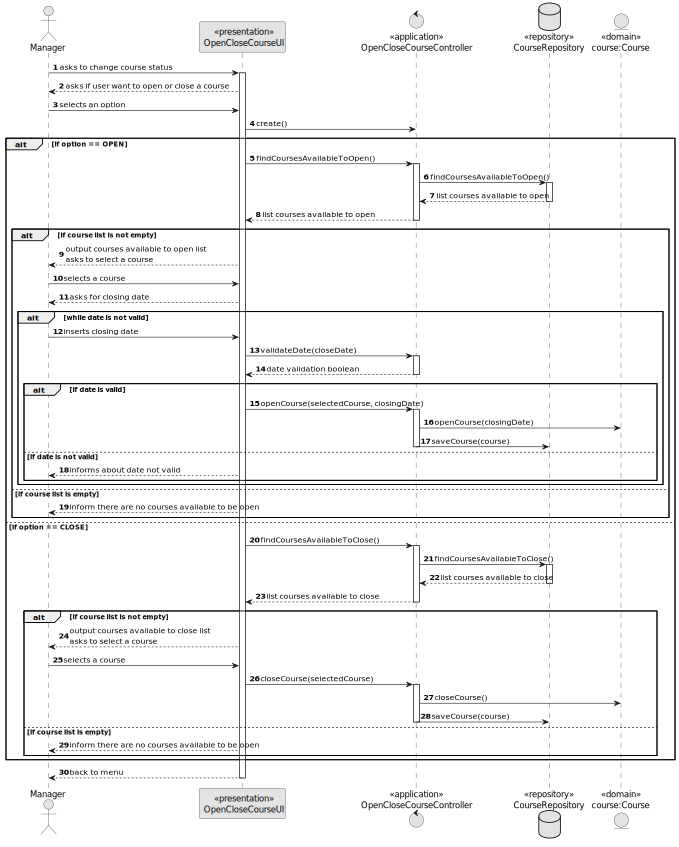
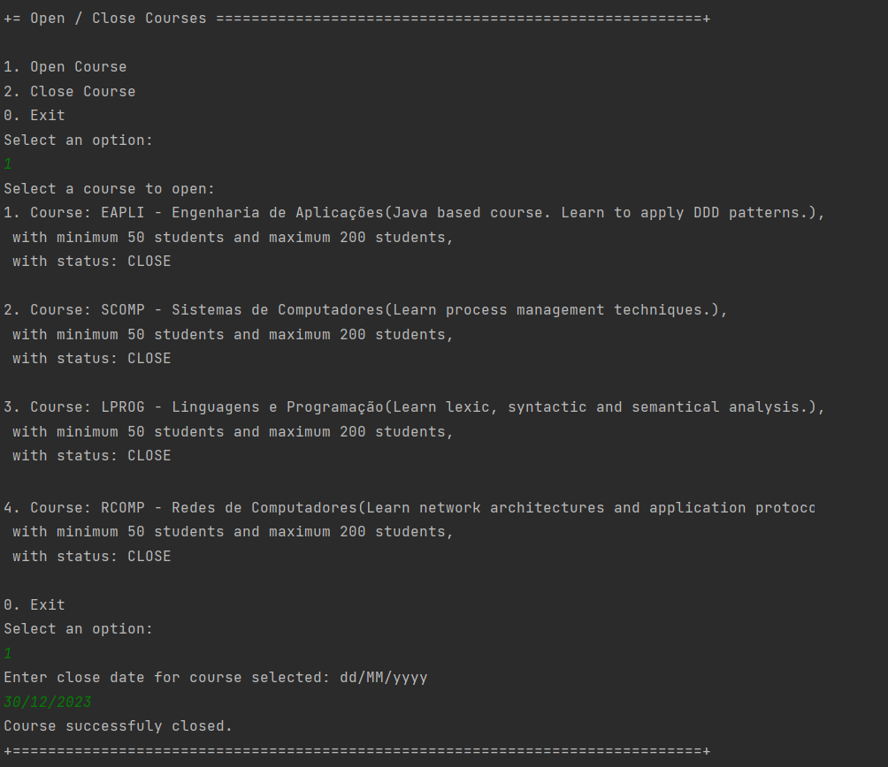
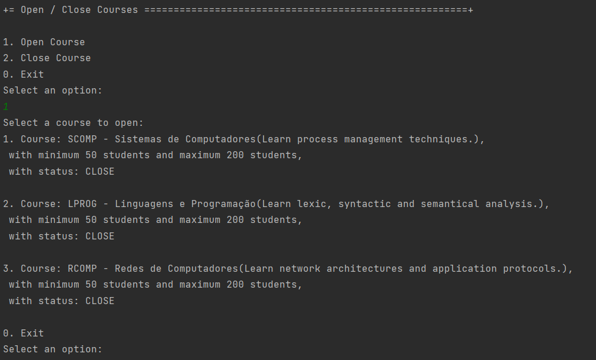
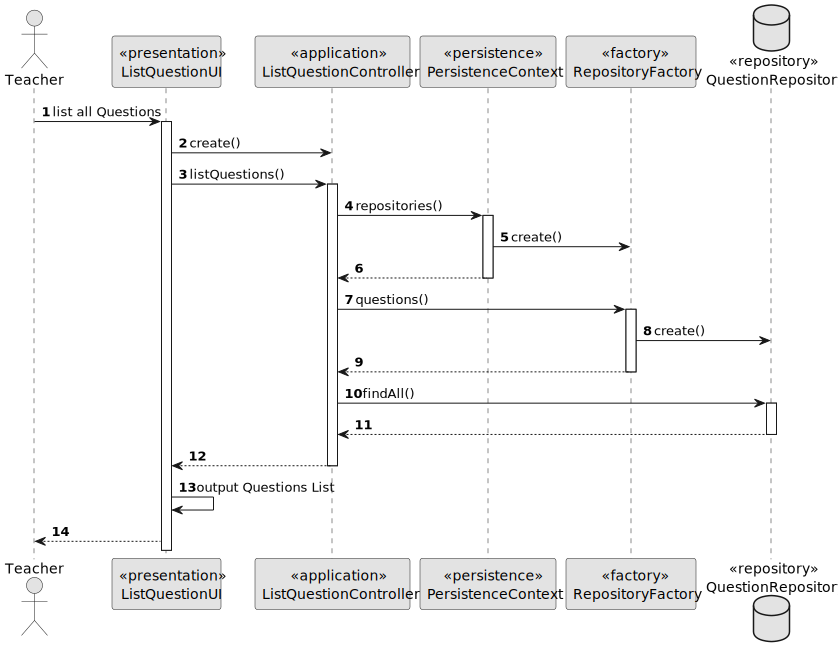

# US 1004 - As Manager, I want to open and close courses

## 1. Context

Implement a functionality for the manager to open and close courses.

## 2. Requirements

This US descprition is "As Manager, I want to open and close courses". For this to happen, the system may already
have courses in the database. In terms of US's, US 1002, that should implement the create course funcionality,
must be implemented.

## 3. Analysis

To implement this US, it was decided that first the user would choose if he wanted to open or close courses.
Then, the system output the list, respective to what the user selected, and, in case the user selected he
wanted to open a course, the system asks for a closing date.

Notes:

- A course can only be open when it's closed and if it's open date is null (which means the
course has not been opened yet).
- A course can be closed if in any state, unless it is already closed.
- It was decided to let the manager close a course before the actual closing date.
- When opening a course, the system asks for an open date. When closing the course, the system updates
  the close date with the system dat.e

## 4. Design

### 4.1. Realization

This US is divided into two main functionalities. In the "Open Course" functionality, the system must ask the user
which course he wants to open, from a list of courses available to be open, and then ask for a close date
(while also validating the date inserted). In the "Close Course" functionality, the system must ask the user
which course he wants to close, from a list of courses available to be close (when updating the status, the close
date is updated to the system date).

### 4.2. Diagrams

#### 4.2.1. Class Diagram - CD



#### 4.2.2. System Sequence Diagram - SSD



#### 4.2.3. Sequence Diagram - SD



### 4.3. Applied Patterns

Controller.

### 4.4. Tests

**Utils:** *These were the variables used to create the course and the method to parse a string and convert to Date.*

```
final String courseCode = "TEST-1";
final CourseName courseName = new CourseName("Test Course");
final String description = "This is a open enrollments in a course test ";
final Integer minStudents = 15;
final Integer maxStudents = 25;

private Date stringToDate(String dateString) {
    SimpleDateFormat dateFormat = new SimpleDateFormat("dd/MM/yyyy");
    dateFormat.setLenient(false);
    try {
        return dateFormat.parse(dateString);
    } catch (Exception e) {
        return null;
    }
}
```

**Test 1:** *Verifies that the course can be open when it's status is 'CLOSE' 
            and with a valid date (later than system date) *

```
@org.junit.Test
public void canOpenCourseWithCloseStatusAndValidDate() {
    /* When creating a course, the status is 'CLOSE' */
    Course course = new Course(courseCode, courseName, description, minStudents, maxStudents);
    Date closeDate = stringToDate("30/12/2024");
    course.openCourse(closeDate);

    CourseStatus expected = CourseStatus.OPEN;
    CourseStatus actual = course.courseStatus();

    Assertions.assertEquals(expected, actual);
}
````

**Test 2:** *Verifies that the course cannot be open with an invalid date (date before system date)*

```
@org.junit.Test
public void cannotOpenCourseWithInvalidDate() {
    /* When creating a course, the status is 'CLOSE' */
    Course course = new Course(courseCode, courseName, description, minStudents, maxStudents);
    Date closeDate = stringToDate("01/01/2020");
    course.openCourse(closeDate);

    CourseStatus expected = CourseStatus.OPEN;
    CourseStatus actual = course.courseStatus();

    Assertions.assertNotEquals(expected, actual);
}
````


**Test 3:** *Verifies that the course cannot be open when already opened (check if date was updated)*

```
@org.junit.Test
public void cannotOpenCourseWithOpenStatus() {
    /* In this case, the course will be open first with a date, and then
    it will be tried to open it again with a new date, which won't change. */
    Course course = new Course(courseCode, courseName, description, minStudents, maxStudents);
    Date closeDate = stringToDate("30/12/2024");
    course.openCourse(closeDate);

    Date newCloseDate = stringToDate("01/01/2025");
    course.openCourse(newCloseDate);

    Date expected = newCloseDate;
    Date actual = course.closeCourseDate();

    Assertions.assertNotEquals(expected, actual);
}
````


## 5. Implementation

**OpenCloseCourseUI:**

```
private OpenCloseCourseController controller = new OpenCloseCourseController();
    
@Override
protected boolean doShow() {
    System.out.println("1. Open Course");
    System.out.println("2. Close Course");
    System.out.println("0. Exit");

    final int option = Console.readOption(1, 2, 0);

    try {
        switch (option) {
            case 1:
                openCourse();
                break;
            case 2:
                closeCourse();
                break;
            default:
                System.out.println("No valid option selected.");
                break;
        }
    } catch (IntegrityViolationException | ConcurrencyException ex) {
        LOGGER.error("Error performing the operation", ex);
        System.out.println("Unfortunatelly there was an unexpected error in the application. Please try again and if the problem persists, contact your system admnistrator.");
    }
    return true;
}

private void openCourse() {
    final Iterable<Course> openCoursesList = controller.findCoursesAvailableToOpen();

    if (!openCoursesList.iterator().hasNext())
        System.out.println("There are no courses available to be opened.!");
    else {
        Course course = chooseCourse("Select a course to open:", openCoursesList);

        if (course != null) {
            boolean validDate = false;
            while (!validDate) {
            final Date closeDate = Console.readDate("Enter close date for course selected: dd/MM/yyyy", "dd/MM/yyyy");

            validDate = controller.validateDate(closeDate);
            if (!validDate) {
                System.out.println("Close course date must be later than today.");
                } else {
                    controller.openCourse(course, closeDate);
                    System.out.println("Course successfuly closed.");
                }
            }
        }
    }
}

private void closeCourse() {
    final Iterable<Course> closedCoursesList = controller.findCoursesAvailableToClose();

    if (!closedCoursesList.iterator().hasNext())
        System.out.println("There are no courses available to be closed.!");
    else {
        Course theCourse = chooseCourse("Choose a course to close:", closedCoursesList);

        if (theCourse != null) {
            controller.closeCourse(theCourse);
        }
    }
}

/**
* Method used to show course list and select one coruse.
*
* @param message - message to be printed to the user, asking to select a course
* @param courseList - course list to choose from
* @return course selected
*/
private Course chooseCourse(String message, Iterable<Course> courseList) {
    final SelectWidget<Course> selector = new SelectWidget<>(message, courseList);
    selector.show();
    return selector.selectedElement();
}
```

**OpenCloseCourseController:**

```
private AuthorizationService authorizationService = AuthzRegistry.authorizationService();
private CourseRepository courseRepository = PersistenceContext.repositories().courseRepository();

/**
 * This method accesses the course repository and returns the list of courses available to be open.
 * A course is available to be open if, and only if, it is close, otherwise it's not possible,
 * and if it has not be open yet (no course close date).
 *
 * @return iterable with the courses available to be opened
 */
public Iterable<Course> findCoursesAvailableToOpen() {
    authorizationService.ensureAuthenticatedUserHasAnyOf(BaseRoles.MANAGER);

    return courseRepository.findCoursesAvailableToOpen();
}

/**
 * This method validates the course close date.
 * The date is valid if it is later than the system date.
 *
 * @param closeDate - course close date inserted by the user
 * @return date validation
 */
public boolean validateDate(Date closeDate){
    if (!closeDate.before(Date.from(Instant.now()))) {
        return true;
    }
    return false;
}

/**
 * This method opens a course, which consists of changing the course status to 'OPEN'
 * and the close date to the date passed as a parameter, and saves the course in the repository.
 *
 * @param course - course to be opened
 * @param closeDate - course close date
 */
public void openCourse(Course course, Date closeDate) {
    authorizationService.ensureAuthenticatedUserHasAnyOf(BaseRoles.MANAGER);

    course.openCourse(closeDate);
    saveCourse(course);
}

/**
 * This method accesses the course repository and returns the list of courses where the student can enroll.
 * A course is available to be closed if in any state, except if already closed.
 *
 * @return iterable with the courses available to be closed
 */
public Iterable<Course> findCoursesAvailableToClose() {
    authorizationService.ensureAuthenticatedUserHasAnyOf(BaseRoles.MANAGER);

    return courseRepository.findCoursesAvailableToClose();
}

/**
 * This method closes a course, which consists of changing the course status to 'CLOSE'
 * and the close date to the system date, and saves the course in the repository.
 *
 * @param course - course to be closed
 */
public void closeCourse(Course course) {
    authorizationService.ensureAuthenticatedUserHasAnyOf(BaseRoles.MANAGER);

    course.closeCourse();
    saveCourse(course);
}

/**
 * This method saves the course, with the new status, in the course repository.
 *
 * @param course - course to be saved
 */
private void saveCourse(Course course) {
    courseRepository.save(course);
}
```

**JpaCourseRepository:**

```
@Override
public Iterable<Course> findCoursesAvailableToOpen(){
    TypedQuery<Course> query = entityManager().createQuery(
        "SELECT course FROM Course course WHERE course.courseStatus = :status" +
        " AND course.openCourseDate IS NULL", Course.class);
    query.setParameter("status", CourseStatus.CLOSE);

    return query.getResultList();
}

@Override
public Iterable<Course> findCoursesAvailableToClose(){
    TypedQuery<Course> query = entityManager().createQuery(
        "SELECT course FROM Course course WHERE course.courseStatus != :status", Course.class);
    query.setParameter("status", CourseStatus.CLOSE);

    return query.getResultList();
}
```

**Course:**

```
/**
 * This method is used in US 1004, and it's used to open a course.
 *
 * Notes:
 * - A course can only be open if closed.
 * - When opening a course, it must be defined an opening date (system date)
 * and a close date inserted by the user (must be later than the system date)
 *
 * @param closeCourseDate - date when the course will close
 */
public void openCourse(Date closeCourseDate) {
    if (courseStatus.equals(CourseStatus.CLOSE) && closeCourseDate.after(Date.from(Instant.now()))) {
        this.courseStatus = CourseStatus.OPEN;
        this.openCourseDate = Date.from(Instant.now());
        this.closeCourseDate = closeCourseDate;
    }
}

/**
 * This method is used in US 1004, and it's used to close a course.
 *
 * Notes:
 * - A course can be closed if in any state, except if already closed.
 * - When closing a course, the system must set the close date to the time of the system
 */
public void closeCourse() {
    if (!courseStatus.equals(CourseStatus.CLOSE)) {
        this.courseStatus = CourseStatus.CLOSE;
        this.closeCourseDate = Date.from(Instant.now());
    }
}
```


## 6. Integration/Demonstration

To demostrate this US, first we can start with the repository, before opening a new course:


Now, this is a brief demonstration of the menus of opening a course:



After opening a course, if we try to open another one next, the course open should not appear on the list:



After creating the course, here is the repository, with the new course created, with status as 'CLOSED':


## 7. Observations

*Access to the repository is always done in the same way.
For this reason, an example sequence diagram has been created to demonstrate this.
To exemplify, we list all existing questions in the repository of questions.*



*Like the repositories, the authentication part always follows the same order of ideas.
In this way, we perform a general SD that demonstrates the entire process. In the diagram, US 1008 is taken as an example,
as a Student, I want to request my enrollment in a course.*

