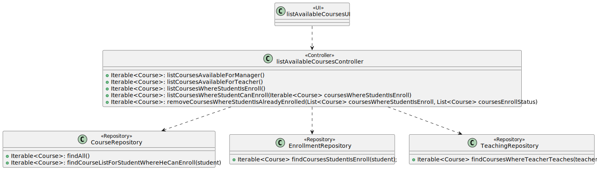

# US 1006 - As User, I want to list all the courses that are available to me

## 1. Context

*Implement a functionality that displays the available courses for the user*

## 2. Requirements

**US 1006 -** As User, I want to list all the courses that are available to me

## 3. Analysis

* *For this US to be possible, it is necessary that, initially, there are courses created and, therefore, it depends on US1002 (As Manager, I want to create courses).
For courses to be presented to the teacher, they must be included in a course, so it depends on US 1005 (As Manager, I want to set the teachers of a course).
As for the list of courses for a student, we must have access to a list of courses with enroll status, US 1003 (As Manager, I want to open and close enrollments in courses) 
and to a list where they are already enrolled, needing from US 1007 (As Manager, I want to enroll students in bulk by importing their data using a csv file).*

To implement this US, it was defined that, after the user enters the system, we would get his role.
- If this were Manager, the entire list of existing courses would be displayed.
- If it were a Teacher, the courses in which he teaches would appear.
- When it comes to a student, the courses that he is enrolled in and those that he can enroll will be displayed.

## 4. Design

### 4.1. Realization

*This US "has 3 parts". This happens because, for each different role and user, different lists of courses will be generated. 
The only exception is when a manager asks for the listing, because all existing courses in the system will always be shown.
When it comes to a teacher making this request, the list will vary, as they do not all teach the same course.
Students will have access to two lists, one that indicates the courses where they have already registered and another that has courses that can be enrolled.*

### 4.2. Diagrams

#### 4.2.1 Class Diagram - CD



#### 4.2.2. System Sequence Diagram - SSD


#### 4.2.3 Sequence Diagram - SD

*Since this use case has three distinct situations, three sequence diagrams were created. The first diagram is a general diagram of the order of ideas of this US.*
- The manager's diagram is relatively simple, since for this the available list will be a list with all the existing courses.
- A separate SD was created for the teacher, since this user will only be shown the courses where he teaches. In this way, we will have to go to the teachingRepository to fetch this information.
- The last SD created refers to a request to view a student's courses. According to the client, a student must be shown the courses he is already enrolled in and those he can enroll in. In this way, we have to access two repositories,
EnrollmentRepository to access the courses that he is already enrolled in and the courseRepository to access those that can be enrolled. </br>
- Note: To show the list of courses that a student can enroll in, all courses in which the student is already enrolled and that have enroll status are removed.

**General Sequence Diagram** </br>
 </br>

**Sequence Diagram for a manager** </br>
 </br>

**Sequence Diagram for a Teacher** </br>
 </br>

**Sequence Diagram for a Student** </br>
 </br>


### 4.3. Applied Patterns
* Controller

### 4.4. Tests

*It wasn't done any tests to repositories methods, only at the domain level, because of not being required at this stage to do so.*

## 5. Implementation

**List Available Courses Controller:**
*Depending on the role of the user who is logged in, the action to be taken will be different as previously indicated. 
When the user is a student, in order to obtain the courses that can be enrolled, it is necessary to remove from the list of courses 
with enroll status those in which the user is already enrolled.*
*Note:*
- All accesses to the repositories were done correctly, they are just not indicated here.

```
@Transactional
    public Iterable<Course> listCoursesAvailableForManager() {
        if (authorizationService.isAuthenticatedUserAuthorizedTo(BaseRoles.MANAGER)) {
            return courseRepository.findAll();
        }
        return null;
    }

    public Iterable<Course> listCoursesAvailableForTeacher() {
        if (authorizationService.isAuthenticatedUserAuthorizedTo(BaseRoles.TEACHER)) {
            if (authorizationService.session().isPresent()) {
                Teacher teacher = teacherRepository.findBySystemUser(authorizationService.session().get().authenticatedUser()).get();
                return teachingRepository.findCoursesWhereTeacherTeaches(teacher);
            }
        }
        return null;
    }

    public Iterable<Course> listCoursesWhereStudentIsEnroll() {
        if (authorizationService.isAuthenticatedUserAuthorizedTo(BaseRoles.STUDENT)) {
            if (authorizationService.session().isPresent()) {
                Student student = studentRepository.findBySystemUser(authorizationService.session().get().authenticatedUser()).get();
                return enrollmentRepository.findCoursesStudentIsEnroll(student);
            }
        }
        return null;
    }

    public Iterable<Course> listCoursesWhereStudentCanEnroll(Iterable<Course> coursesWhereStudentIsEnroll) {
        if (authorizationService.isAuthenticatedUserAuthorizedTo(BaseRoles.STUDENT)) {
            if (authorizationService.session().isPresent()) {
                Student student = studentRepository.findBySystemUser(authorizationService.session().get().authenticatedUser()).get();
                Iterable<Course> coursesInEnrollStatus = courseRepository.findCourseListForStudentWhereHeCanEnroll(student);
                return removeCoursesWhereStudentIsAlreadyEnrolled((List<Course>) coursesWhereStudentIsEnroll, (List<Course>) coursesInEnrollStatus);
            }
        }
        return null;
    }

    private Iterable<Course> removeCoursesWhereStudentIsAlreadyEnrolled(List<Course> coursesWhereStudentIsEnroll, List<Course> coursesEnrollStatus) {
        List<Course> coursesToEnroll = new ArrayList<>(coursesEnrollStatus);

        for (Course enrolledCourse : coursesWhereStudentIsEnroll) {
            coursesToEnroll.removeIf(course -> course.sameAs(enrolledCourse));
        }

        return coursesToEnroll;
    }
````

**List Available Courses UI:**
*The UI, depending on the logged in user, will fetch the methods corresponding to the controller. 
If any of these lists are empty, a message is shown to the user ("There are no courses available for you!")*

```
@Override
    protected boolean doShow() {
        if(authorizationService.isAuthenticatedUserAuthorizedTo(BaseRoles.MANAGER)) {
            Iterable<Course> coursesList = theController.listCoursesAvailableForManager();
            if(coursesList.iterator().hasNext()) {
                for (Course course : coursesList) {
                    System.out.printf("%s - %s\n", course.courseCode(), course.courseName());
                }
            } else {
                System.out.println("There are no available courses for you!");
            }
        }
        else if(authorizationService.isAuthenticatedUserAuthorizedTo(BaseRoles.TEACHER)) {
            Iterable<Course> coursesList = theController.listCoursesAvailableForTeacher();
            if(coursesList.iterator().hasNext()) {
                for (Course course : coursesList) {
                    System.out.printf("%s - %s\n", course.courseCode(), course.courseName());
                }
            } else {
                System.out.println("There are no available courses for you!");
            }
        }
        else if(authorizationService.isAuthenticatedUserAuthorizedTo(BaseRoles.STUDENT)){
            Iterable<Course> enrolledList = theController.listCoursesWhereStudentIsEnroll();
            Iterable<Course> canEnrollList = theController.listCoursesWhereStudentCanEnroll(enrolledList);

            System.out.println("Courses where you are already enrolled:");
            if(enrolledList.iterator().hasNext()) {
                for (Course courseHeIsEnroll : enrolledList) {
                    System.out.printf("%s - %s\n", courseHeIsEnroll.courseCode(), courseHeIsEnroll.courseName());
                }
            } else {
                System.out.println("There are no available courses for you!");
            }

            System.out.println("");
            System.out.println("Courses where you can enroll:");
            if (canEnrollList.iterator().hasNext()){
                for (Course courseHeCanEnroll : canEnrollList){
                        System.out.printf("%s - %s\n",courseHeCanEnroll.courseCode(), courseHeCanEnroll.courseName());
                    }
            } else {
                    System.out.println("There are no available courses for you!");
                }
            }
        return false;
    }
````

**Jpa Course Repository:** *The two methods below are included in the Jpa Course Repository.
It is with these queries that we will get the list of necessary courses depending on the logged user.*

```
public Iterable<Course> findAll(){
        final TypedQuery<Course> query = entityManager().createQuery(
                "SELECT course FROM Course course",
                Course.class);

        return query.getResultList();
    }

@Override
    public Iterable<Course> findCourseListForStudentWhereHeCanEnroll(Student student) {
        TypedQuery<Course> courseQuery = entityManager().createQuery(
                "SELECT course FROM Course course WHERE course.courseStatus = :status",
                Course.class);
        courseQuery.setParameter("status", CourseStatus.ENROLL);

        return courseQuery.getResultList();
    }
````

**Jpa Enrollment Repository:** *The method below is included in the Jpa Enrollment Repository.
It is with this query that we will get the list of courses where the student is already enroll.*

```
@Override
    public Iterable<Course> findCoursesStudentIsEnroll(Student student) {
        TypedQuery<Course> query = entityManager().createQuery(
                "SELECT enrollment.course FROM Enrollment enrollment WHERE enrollment.student = :student AND (enrollment.enrollmentsStatus = :acceptedStatus OR enrollment.enrollmentsStatus = :underAppreciationStatus)" ,
                Course.class);
        query.setParameter("student", student);
        query.setParameter("acceptedStatus", EnrollmentsStatus.ACCEPTED);
        query.setParameter("underAppreciationStatus", EnrollmentsStatus.UNDER_APPRECIATION);
        return query.getResultList();
    }
````

**Jpa Teaching Repository:** *The method below is included in the Jpa Teaching Repository.
It is with this query that we will get the list of courses available for a teacher.*

```
@Override
    public Iterable<Course> findCoursesWhereTeacherTeaches(Teacher teacher) {
        TypedQuery<Course> query = entityManager().createQuery(
                "SELECT teaching.course FROM Teaching teaching WHERE teaching.teacher = :teacher" ,
                Course.class);
        query.setParameter("teacher", teacher);
        return query.getResultList();
    }
````


## 6. Integration/Demonstration

**Manager** </br>
*The image below represents the list of courses available to a manager. In this case, all existing courses will be shown.*
 </br>


**Teacher** </br>
*Next, we find the demonstration of the list of courses for teachers. Previously, US 1005 was made, where we placed teacher1, emb, 
as teacher in charge (IS_PRIMARY) and teacher2, amc, as professor of this course. Therefore, as shown below, for these two users the 
EAPLI course (courseID = 34) will be shown, unlike teacher 3 who is not currently teaching any course.*


**Student** </br>
*Finally, we find the demonstration of the implementation of US 1006 when it comes to a student. Before presenting this data, we opened the enrollments 
of the EAPLI course and did the bulk enroll (US 1007) and then we opened the enrollments of another course, in this case, LPROG. </br> As seen in the database, 
only isep111, isep222 and isep555 students are enrolled in EAPLI (courseID = 34). In the two following images we see that, for isep111, the EAPLI course is indicated in the 
list of which he is already enrolled and the rest in the list where he can enroll. The same cannot be seen in the list of courses available to the student isep333, 
he is not enrolled in anything at the moment, and therefore a message is displayed explaining this and in the courses that he can enroll we have the addition of EAPLI.*


## 7. Observations

*In the following image we have a clarification about what is expected for this US by the customer.*


*Access to the repository is always done in the same way.
For this reason, an example sequence diagram has been created to demonstrate this. To exemplify, we list all existing questions in the repository of questions.*


*Like the repositories, the authentication part always follows the same order of ideas.
In this way, we perform a general SD that demonstrates the entire process. In the diagram, US 1008 is taken as an example,
as a Student, I want to request my enrollment in a course.*

