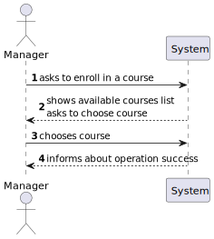
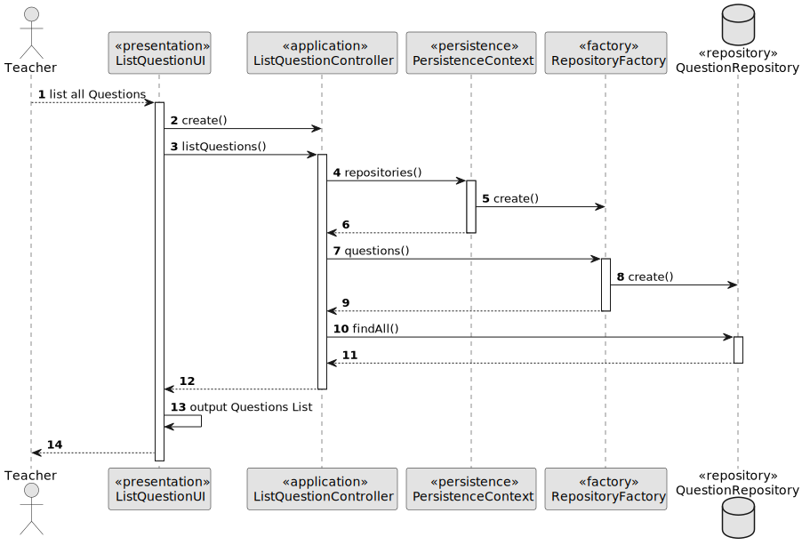

# US 1008 - As Student, I want to request my enrollment in a course

## 1. Context

Implement a functionality for the student to request an enrollment in a course.

## 2. Requirements

US 1008 - As Student, I want to request my enrollment in a course

## 3. Analysis

The first step in this US, is for the system to show the student the courses where he can enroll, which are the courses where the status is 'ENROLL'. 
Besides that, the system must remove from the list the courses where the student is already enrolled/already requested to enroll at (if the enrollment status is 'NOT_ACCEPTED', the user can request to enroll again).

Notes:
- The request is an object enrollment with status setted as 'UNDER_APPRECIATION'. The managers then may accept/reject the application.

## 4. Design

### 4.1. Realization

For the first step, the system must access the repositories (courses and enrollments) to get each list. Then, in a for each cycle, it removes the courses from the course list where the student is already enrolled/already requested to enroll at.
When creating the enrollment, the system sets the status as 'UNDER_APPRECIATION', the examEnrollment list is initialized, but empty, and the grade is null.

#### 4.2.1. Class Diagram - CD


#### 4.2.2. System Sequence Diagram - SSD



#### 4.2.3. Sequence Diagram - SD


### 4.3. Applied Patterns

* Controller
* Builder

### 4.4. Tests

**Utils:** *These were the necessary things to request an enrollment*

```
final SystemUserBuilder userBuilder1 = UserBuilderHelper.builder();
    final SystemUser student1 = userBuilder1
            .withUsername("student")
            .withPassword("Password1")
            .withName("studentFstName", "studentlSTname")
            .withEmail("student@gmail.com")
            .withRoles(BaseRoles.STUDENT)
            .build();
    final Student student = new StudentBuilder()
            .withSystemUser(student1)
            .withMecanographicNumber("1212121")
            .build();

    final Course course = new CourseBuilder()
            .withCode("JAVA-1")
            .withName(new CourseName("EAPLI"))
            .withDescription("Java Programming")
            .hasMinStudents(10)
            .hasMaxStudents(20)
            .build();
```

***Test 1:** Verifies that is not possible to request enrollments if enrollments status is null.*
```
@Test
    public void testFailedCauseEnrollmentStatusIsNull(){
        Assertions.assertThrows(IllegalArgumentException.class, () ->
                {new Enrollment(null, student, course);}
        );
    }
````

***Test 2:** Verifies that is not possible to request enrollments if student is null.*
```
@Test
    public void testFailedCauseStudentIsNull(){
        Assertions.assertThrows(IllegalArgumentException.class, () ->
                {new Enrollment(EnrollmentsStatus.UNDER_APPRECIATION, null, course);}
        );
    }
````

***Test 3:** Verifies that is not possible to request enrollments if course is null.*
```
@Test
    public void testFailedCauseCourseIsNull(){
        Assertions.assertThrows(IllegalArgumentException.class, () ->
                {new Enrollment(EnrollmentsStatus.ACCEPTED, student, null);}
        );
    }
````

## 5. Implementation

*In this section the team should present, if necessary, some evidencies that the implementation is according to the design. It should also describe and explain other important artifacts necessary to fully understand the implementation like, for instance, configuration files.*

*It is also a best practice to include a listing (with a brief summary) of the major commits regarding this requirement.*

**Request Enrollments UI:**
```
@Override
protected boolean doShow() {
Iterable<Course> enrolledList = theController1.listCoursesWhereStudentIsEnroll();
final Iterable<Course> enrollCoursesList = this.theController.listCoursesWhereStudentCanEnroll(enrolledList);

        if (!enrollCoursesList.iterator().hasNext())
            System.out.println("There are no courses available to request enrollments!");
        else {
            Course theCourse = chooseCourse("Select a course to request the enrollment:", enrollCoursesList);

            if (theCourse != null) {
                theController.createEnrollment(theCourse);
                System.out.println("Your request to enroll in this course was a success!!");
            }
        }
        return false;
    }

    /**
     * Method used to show course list and select one coruse.
     *
     * @param message - message to be printed to the user, asking to select a course
     * @param courseList - course list to choose from
     * @return course selected
     */
    private Course chooseCourse(String message, Iterable<Course> courseList) {
        final SelectWidget<Course> selector = new SelectWidget<>(message, courseList);
        selector.show();
        return selector.selectedElement();
    }
````

**Request Enrollments Controller:**
```
/**
     * This method accesses the repository and returns the list of courses where student can enroll, which
     * is of courses where the status is 'ENROLL', excluding those where the student is already enrolled at.
     *
     * @param coursesWhereStudentIsEnroll - course where student is enroll. This list comes from another controller.
     * @return list of courses where student can enroll
     */
    public Iterable<Course> listCoursesWhereStudentCanEnroll(Iterable<Course> coursesWhereStudentIsEnroll) {
        authorizationService.ensureAuthenticatedUserHasAnyOf(BaseRoles.STUDENT);

        Student student = studentRepository.findBySystemUser(authorizationService.session().get().authenticatedUser());
        Iterable<Course> coursesWhereStudentCanEnroll = courseRepository.findCourseListForStudentWhereHeCanEnroll(student);
        return removeCoursesWhereStudentIsAlreadyEnrolled((List<Course>) coursesWhereStudentIsEnroll, (List<Course>) coursesWhereStudentCanEnroll);
    }

    /**
     * This method removes the courses where the student is already enrolled from
     * the list of courses where he can enroll.
     *
     * @param coursesWhereStudentIsEnroll  - list of courses where student is enrolled
     * @param coursesWhereStudentCanEnroll - list of courses where student can enroll
     * @return
     */
    private Iterable<Course> removeCoursesWhereStudentIsAlreadyEnrolled(List<Course> coursesWhereStudentIsEnroll, List<Course> coursesWhereStudentCanEnroll) {
        List<Course> coursesToEnroll = new ArrayList<>(coursesWhereStudentCanEnroll);

        for (Course enrolledCourse : coursesWhereStudentIsEnroll) {
            coursesToEnroll.removeIf(course -> course.sameAs(enrolledCourse));
        }

        return coursesToEnroll;
    }

    /**
     * This method creates an enrollment request and saves it in the repository.
     * Notes:
     * - When creating an enrollment request, the status is 'UNDER_APPRECIATION'
     * - The student is the studeng related to the user logged in the system
     *
     * @param course - course for the enrollment
     */
    public void createEnrollment(Course course) {
        Student student = studentRepository.findBySystemUser(authorizationService.session().get().authenticatedUser());

        final Enrollment newEnrollment = new EnrollmentBuilder()
                .withEnrollmentStatus(EnrollmentsStatus.UNDER_APPRECIATION)
                .ofStudent(student)
                .inCourse(course).build();

        enrollmentRepository.save(newEnrollment);
    }
````

**Jpa Course Repository:**
```
@Override
public Iterable<Course> findCourseListForStudentWhereHeCanEnroll(Student student) {
TypedQuery<Course> courseQuery = entityManager().createQuery(
"SELECT course FROM Course course WHERE course.courseStatus = :status",
Course.class);
courseQuery.setParameter("status", CourseStatus.ENROLL);

        return courseQuery.getResultList();
    }
````

## 6. Integration/Demonstration
*Then we see the demonstration of this US. When an enrollment is ordered, the enrollment has the status "UNDER_APPRECIATION"*


## 7. Observations



*Like the repositories, the authentication part always follows the same order of ideas.
In this way, we perform a general SD that demonstrates the entire process. In the diagram, US 1008 is taken as an example,
as a Student, I want to request my enrollment in a course.*

