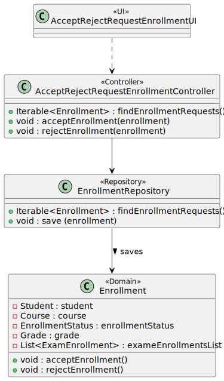
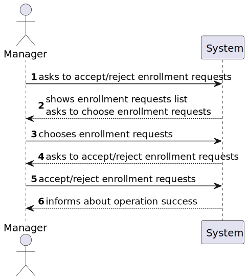
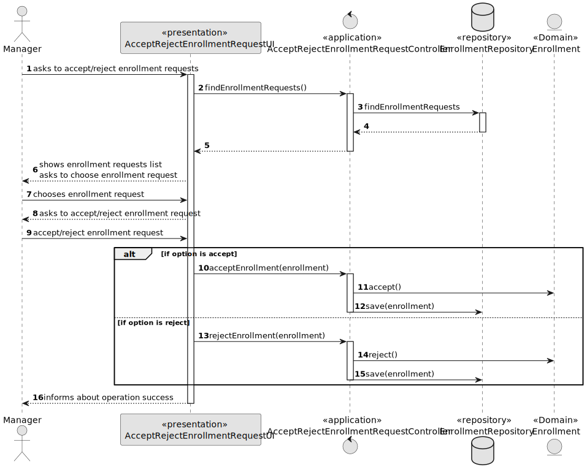
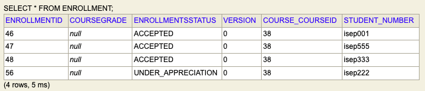
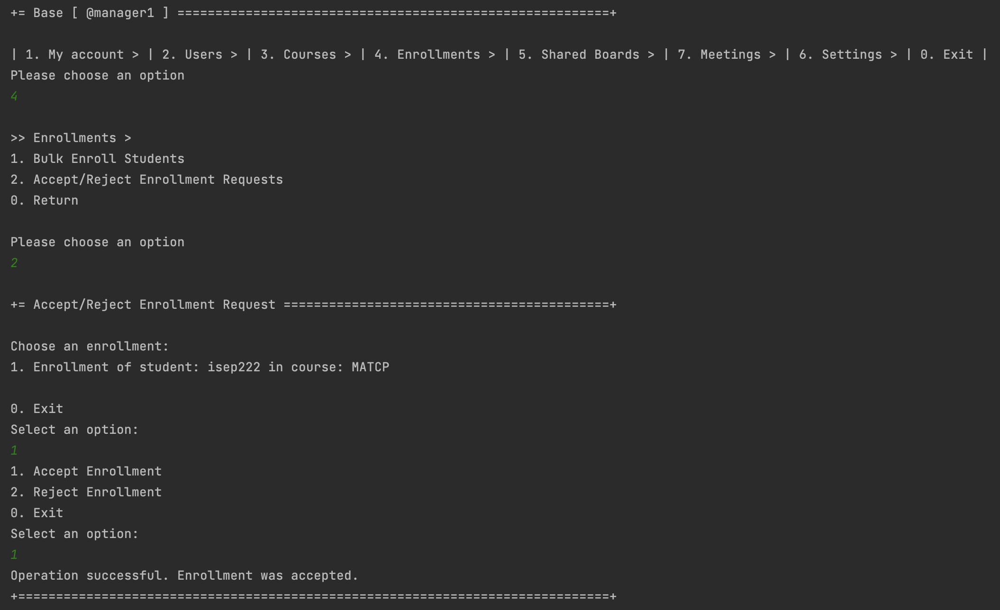
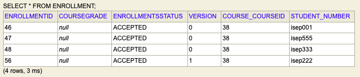
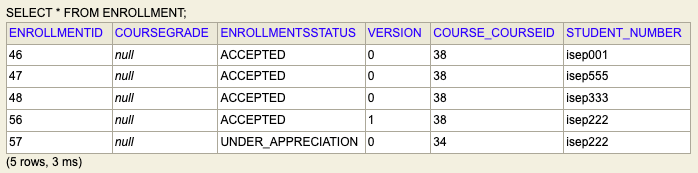
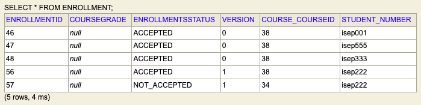

# US 1009 - As Manager, I want to approve or reject students applications to courses

## 1. Context

Implement a functionality for the manager to accept/reject enrollment requests.

## 2. Requirements

US 1009 - As Manager, I want to approve or reject students applications to courses

## 3. Analysis

*For this US to be useful, it depends on US 1008 (As Student, I want to request my enrollment in a course). 
You need this US since, initially, the existing enrollment requests are shown to the manager, that is, the enrollments 
whose status is 'UNDER_APPRECIATION'. If no students make any requests, the list will be empty.*

## 4. Design

### 4.1. Realization

For the first step, the system must access the repository (enrollments) to get the enrollment requests list (status as 'UNDER_APPRECIATION'), 
display the list and then ask the manager to choose an element. When this is done, the system must ask if the manager wants to accept/reject 
the enrollment request.
Notes:
- When accepting a enrollment request, the system must initialize the exam enrollments list (previously null).

#### 4.2.1. Class Diagram - CD



#### 4.2.2. System Sequence Diagram - SSD



#### 4.2.3. Sequence Diagram - SD



### 4.3. Applied Patterns

* Controller

### 4.4. Tests

***Test 1:** Test the enrollment status when we accept a enrollment request*

```
@org.junit.Test
    public void testEnrollmentStatusWhenAcceptEnrollment() {
        Enrollment enrollment = new Enrollment(EnrollmentsStatus.UNDER_APPRECIATION, student, course);

        enrollment.acceptEnrollment();
        EnrollmentsStatus expected = EnrollmentsStatus.ACCEPTED;
        EnrollmentsStatus actual = enrollment.enrollmentsStatus();

        Assertions.assertEquals(expected, actual);
    }

```

***Test 2:** Test the enrollment status when we reject a enrollment request*
```
@org.junit.Test
    public void testEnrollmentStatusWhenRejectEnrollment() {
        Enrollment enrollment = new Enrollment(EnrollmentsStatus.UNDER_APPRECIATION, student, course);

        enrollment.rejectEnrollment();
        EnrollmentsStatus expected = EnrollmentsStatus.NOT_ACCEPTED;
        EnrollmentsStatus actual = enrollment.enrollmentsStatus();

        Assertions.assertEquals(expected, actual);
    }
```

## 5. Implementation

**Accept / Reject Enrollment Request UI:**
```
@Override
    protected boolean doShow() {
        Iterable<Enrollment> enrollmentRequests = controller.findEnrollmentRequests();
        if(!enrollmentRequests.iterator().hasNext()){
            System.out.println("There are no enrollment requests!");
        }
        else {
            Enrollment enrollment = chooseEnrollment("Choose an enrollment:", enrollmentRequests);

            System.out.println("1. Accept Enrollment");
            System.out.println("2. Reject Enrollment");
            System.out.println("0. Exit");

            final int option = Console.readOption(1, 2, 0);

            try {
                switch (option) {
                    case 1:
                        controller.acceptEnrollment(enrollment);
                        System.out.println("Operation successful. Enrollment was accepted.");
                        break;
                    case 2:
                        controller.rejectEnrollment(enrollment);
                        System.out.println("Operation successful. Enrollment was rejected.");
                        break;
                    default:
                        System.out.println("No valid option selected.");
                        break;
                }
            } catch (IntegrityViolationException | ConcurrencyException ex) {
                LOGGER.error("Error performing the operation", ex);
                System.out.println(
                        "Unfortunatelly there was an unexpected error in the application. Please try again and if the problem persists, contact your system admnistrator.");
            }
        }
        return false;
    }

    /**
     * Method used to show enrollments list and select one enrollment.
     *
     * @param message - message to be printed to the user, asking to select a course
     * @param enrollmentsList - enrollments list to choose from
     * @return course selected
     */
    private Enrollment chooseEnrollment(String message, Iterable<Enrollment> enrollmentsList){
        final SelectWidget<Enrollment> selector = new SelectWidget<>(message, enrollmentsList);
        selector.show();
        return selector.selectedElement();
    }
```


**Accept / Reject Enrollment Request Controller:**
```
public class AcceptRejectEnrollmentRequestController {

    private AuthorizationService authorizationService = AuthzRegistry.authorizationService();

    private EnrollmentRepository enrollmentRepository = PersistenceContext.repositories().enrollmentRepository();

    /**
     * This method accesses the enrollment repository and returns the list of courses available
     * to be open, which are the courses where the status is 'UNDER_APPRECIATION'
     *
     * @return iterable of enrollment requets found
     */
    public Iterable<Enrollment> findEnrollmentRequests() {
        authorizationService.ensureAuthenticatedUserHasAnyOf(BaseRoles.MANAGER);
        return enrollmentRepository.findEnrollmentsRequests();
    }

    /**
     * This method accepts the enrollment (changes status to 'ACCEPTED')
     * and saves the object in the repository
     *
     * @param enrollment - enrollment to be accepted
     */
    public void acceptEnrollment(Enrollment enrollment) {
        authorizationService.ensureAuthenticatedUserHasAnyOf(BaseRoles.MANAGER);
        enrollment.acceptEnrollment();
        enrollmentRepository.save(enrollment);
    }

    /**
     * This method rejects the enrollment (changes status to 'NOT_ACCEPTED')
     * and saves the object in the repository
     *
     * @param enrollment - enrollment to be rejected
     */
    public void rejectEnrollment(Enrollment enrollment) {
        authorizationService.ensureAuthenticatedUserHasAnyOf(BaseRoles.MANAGER);
        enrollment.rejectEnrollment();
        enrollmentRepository.save(enrollment);
    }
}
```
* **Enrollment:** these two methods are found in the enrollment domain class. When an enrollment is accepted, 
* its status changes to being ACCEPTED, as opposed to rejecting it to NOT_ACCEPTED.*
```
public void acceptEnrollment() {
        this.enrollmentsStatus = EnrollmentsStatus.ACCEPTED;
    }

    public void rejectEnrollment() {
        this.enrollmentsStatus = EnrollmentsStatus.NOT_ACCEPTED;
    }
```

* **Jpa Enrollment Repository:** The method below returns, through a query, all enrollment requests for courses that exist, 
* that is, all enrollments whose status is UNDER_APPRECIATION*
```
@Override
public Iterable<Enrollment> findEnrollmentsRequests() {
    TypedQuery<Enrollment> query = entityManager().createQuery(
        "SELECT enrollment FROM Enrollment enrollment WHERE enrollment.enrollmentsStatus = :status",
        Enrollment.class
    );
    query.setParameter("status", EnrollmentsStatus.UNDER_APPRECIATION);
    return query.getResultList();
}
```

## 6. Integration/Demonstration
### Accept Enrollment
*Initially, through US1008, an enrollment request was made in matcp (courseID = 38), that is, its status was under appreciation. 
We proceed to accept the request, so the enrollment status changes to accepted, as verified in the database.*




### Reject Enrollment
*To demonstrate the functionality of rejecting enrollments in a course, we open the enrollments of the eapli course, courseID = 34 (US 1003), to, again, proceed to use US1008. 
We proceed to reject your request, so your status changes to not accepted, as verified in the database.*




## 7. Observations


*Like the repositories, the authentication part always follows the same order of ideas.
In this way, we perform a general SD that demonstrates the entire process. In the diagram, US 1008 is taken as an example,
as a Student, I want to request my enrollment in a course.*

