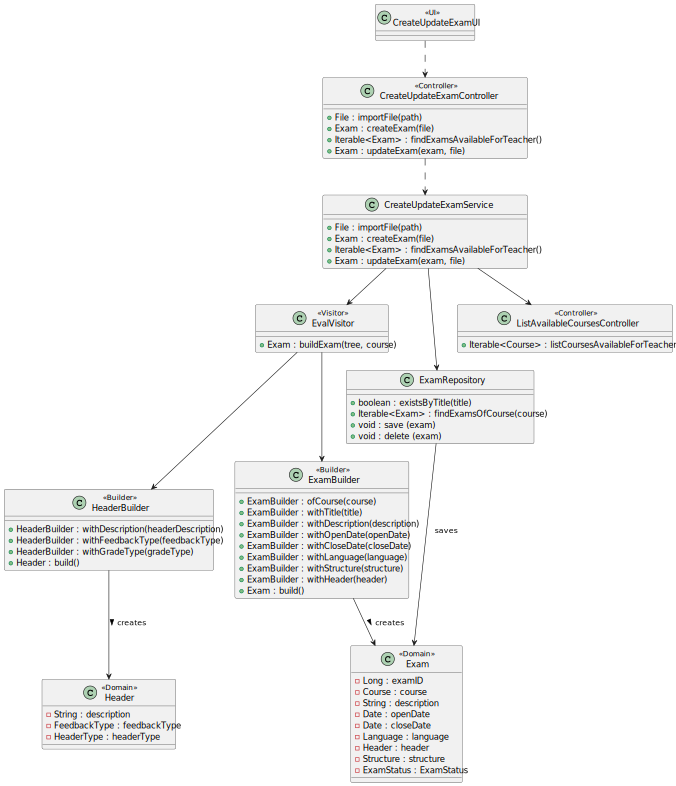
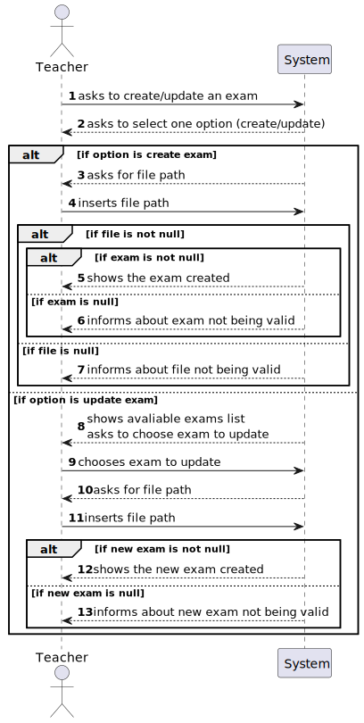
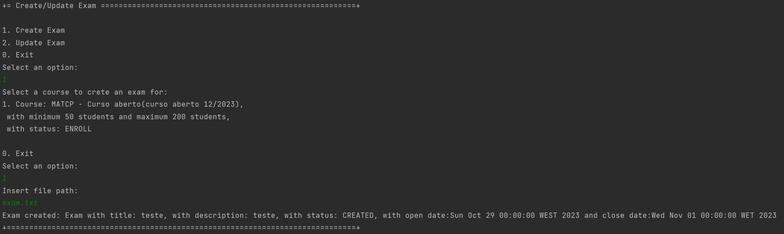
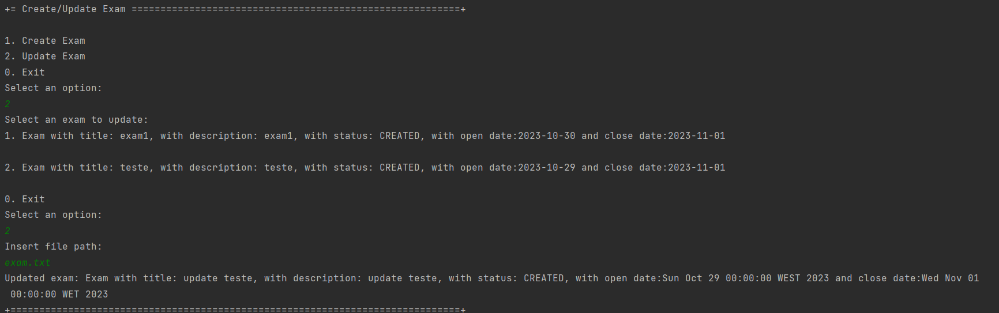

# US 2001 - As Teacher, I want to create/update an exam

## 1. Context

Implement a functionality for the teacher to create or update an exam.

## 2. Requirements

This US descprition is "As Teacher, I want to create/update an exam".

## 3. Analysis

This US consists of two functionalities, which are slightly different:
- If the teacher chooses to create an exam, the system only asks for the file to generate an exam and then 
tries to validate the text of the file. If valid, it generates an exam and saves it in the repository.
- If the teacher chooses to update an exam, the system asks for the teacher to choose an exam to update
and the file to generate the exam, tries to validate the text of the file, and if valid, generates a new exam
and updates the old one in the repository.

Notes:
- The teacher can update the exams of the course where he teaches and which status is 'CREATED'. If the status
is 'FINISHED', the teacher can't update the exam.
- The exam generation is done with ANTLR.

## 4. Design

### 4.1. Realization

To do this US, it was created a method to import a file (common to create/update),
and then, there is the two different functionalities:
- Create Exam: After importing the file, the system creates an exam (calls a generate exam method in the service, 
which validates the text from the file with a ANTLR grammar) and saves it on the repository. The system also creates
an exam enrollment for each student enrolled in the course of the exam.
- Update Exam: Regarding this functionality, before importing the file and generating an exam, the system
must list to the teacher the exams available for him to update. This consists of getting the list of course
where he teaches (this comes from another controller, previously created to another US), and then, getting the
list of exam of each course. After this, the system creates a new exam and updates the old one in the repository, and
also updates every exam enrollment associated with that exam.
- Exam generation: This is done with the ANTLR tools, regarding LPROG. It was created a grammar to validate the exam
and then implemented the visitors, to access the tree and create the object.

### 4.2. Diagrams

#### 4.2.1- Class Diagram - CD



#### 4.2.2. System Sequence Diagram - SSD



#### 4.2.3. Sequence Diagram - SD


#### 4.3. Applied Patterns

Controller, Service and Builder.

### 4.4. Tests

**Utils:** *These were the variables used to create a course for the enrollments
and the method to open course enrollemnts*

```
final ExamBuilder examBuilder = new ExamBuilder();

final Course course = new CourseBuilder()
        .withCode("JAVA-1")
        .withName(new CourseName("course name"))
        .withDescription("course description")
        .hasMinStudents(10)
        .hasMaxStudents(20)
        .build();

final String title = "title";

final String description = "description";

final Language language = new Language("teste");

final Structure structure = new Structure("teste");

final Header header = new Header("teste", FeedbackType.NONE, GradeType.NONE);

private Date stringToDate(String dateString) {
    SimpleDateFormat dateFormat = new SimpleDateFormat("dd/MM/yyyy");
    dateFormat.setLenient(false);
    try {
        return dateFormat.parse(dateString);
    } catch (Exception e) {
        return null;
    }
}
```

**Class Exam Tests:** *These were some example of tests done for the Exam class, it ensures no attribute can be null
and that the dates are correct (later than today, and close date after open date*

**Test 1:** *Verifies than an exam was not created becuase title is null.
It was done a test like this for each atttribute*

```
@Test
public void testFailedBecauseCourseIsNull() {
    Assertions.assertThrows(IllegalArgumentException.class, () ->
        {
            new Exam(null, title, description, stringToDate("30/10/2023"),
                    stringToDate("30/12/2023"), language, header, structure);
        }
    );
}
```

**Test 2:** *Verifies than an exam was not created becuase the open date is before system date.*

```
@Test
public void testFailedBecauseCloseDateIsBeforeOpenDate() {
    Assertions.assertThrows(IllegalArgumentException.class, () ->
        {
            new Exam(course, title, description, stringToDate("30/10/2024"),
                    stringToDate("30/12/2023"), language, header, structure);
            }
    );
}
```


**Test 3:** *Verifies than an exam was not created becuase the close date is before open date.*

```
@Test
public void testFailedBecauseOpenDateIsBeforeOpenDate() {
    Assertions.assertThrows(IllegalArgumentException.class, () ->
        {
            new Exam(course, title, description, stringToDate("30/01/2022"),
                    stringToDate("30/12/2023"), language, header, structure);
            }
    );
}
```

**Exam Builder Tests:** *These were some example of tests done for the Exam Builder, it ensures no attribute can be null
and that the dates are correct (later than today, and close date after open date*

**Test 1:** *Verifies than an exam was successfully created*

```
@Test
public void ensureExamWasSuccessfullyCreated(){
    Exam actual = examBuilder.ofCourse(course).withTitle(title).withDescription(description)
        .withOpenDate(stringToDate("30/10/2023")).withCloseDate(stringToDate("30/12/2023"))
        .withLanguage(language).withHeader(header).withStructure(structure).build();
    Exam expected = new Exam(course, title, description, stringToDate("30/10/2023"),
        stringToDate("30/12/2023"), language, header, structure);

    Assertions.assertTrue(expected.sameAs(actual));
}
````


**Test 2:** *Verifies than an exam was not created becuase title is null.
It was done a test like this for each atttribute*

```
@Test
public void testFailedBecauseCourseIsNull() {
    Assertions.assertThrows(IllegalArgumentException.class, () ->
        {
            examBuilder.ofCourse(null).withTitle(title).withDescription(description)
                .withOpenDate(stringToDate("30/10/2023")).withCloseDate(stringToDate("30/12/2023"))
                .withLanguage(language).withHeader(header).withStructure(structure).build();
        }
    );
}
```

**Test 3:** *Verifies than an exam was not created becuase the open date is before system date.*

```
@Test
public void testFailedBecauseCloseDateIsBeforeOpenDate() {
    Assertions.assertThrows(IllegalArgumentException.class, () ->
        {
            examBuilder.ofCourse(course).withTitle(title).withDescription(description)
                .withOpenDate(stringToDate("30/01/2023")).withCloseDate(stringToDate("30/12/2023"))
                .withLanguage(language).withHeader(header).withStructure(structure).build();
        }
    );
}
````


**Test 4:** *Verifies than an exam was not created becuase the close date is before open date.*

```
@Test
public void testFailedBecauseOpenDateIsBeforeOpenDate() {
    Assertions.assertThrows(IllegalArgumentException.class, () ->
        {
            examBuilder.ofCourse(course).withTitle(title).withDescription(description)
                .withOpenDate(stringToDate("30/10/2024")).withCloseDate(stringToDate("30/12/2023"))
                .withLanguage(language).withHeader(header).withStructure(structure).build();
        }
    );
}
````

## 5. Implementation

**CreateUpdateExamUI:**

```
@Override
protected boolean doShow() {
    System.out.println("1. Create Exam");
    System.out.println("2. Update Exam");
    System.out.println("0. Exit");

    final int option = Console.readOption(1, 2, 0);

    try {
        switch (option) {
            case 1:
                createExam();
                break;
            case 2:
                updateExam();
                break;
            default:
                System.out.println("No valid option selected.");
                break;
        }
    } catch (IntegrityViolationException | ConcurrencyException ex) {
        LOGGER.error("Error performing the operation", ex);
        System.out.println(
                "Unfortunatelly there was an unexpected error in the application. Please try again and if the problem persists, contact your system admnistrator.");
    } catch (IOException e) {
        throw new RuntimeException(e);
    }
    return true;
}

private void createExam() throws IOException {
    Course course = chooseCourse();
    if (course != null) {
        String path = Console.readLine("Insert file path:");
        File file = controller.importFile(path);

        if (file != null) {
            Exam exam = controller.createExam(course, file);
            if (exam != null) {
                System.out.printf("Exam created: %s\n", exam);
            } else {
                System.out.println("Exam not valid. Try again.");
            }
        } else {
            System.out.println("File not valid. Try again.");
        }
    } else {
        System.out.println("No courses available for you to create exams for.");
    }
}

private void updateExam() throws IOException {
    Exam exam = chooseExam();

    if (exam != null) {
        String path = Console.readLine("Insert file path:");
        File file = controller.importFile(path);

        if (file != null) {
            Exam newExam = controller.updateExam(exam, file);
            if (exam != null) {
                System.out.printf("Updated exam: %s\n", newExam);
            } else {
                System.out.println("Exam not valid. Try again.");
            }
        } else {
            System.out.println("File not valid. Try again.");
        }
    } else {
        System.out.println("No exams available for you to update.");
    }
}

/**
 * Method used to show the list of courses available for the teacher to create an exam for.
 *
 * @return course selected
 */
private Course chooseCourse() {
    Iterable<Course> coursesList = controller.findCoursesAvailableForTeacher();
    if (coursesList.iterator().hasNext()) {
        final SelectWidget<Course> selector = new SelectWidget<>("Select a course to crete an exam for:", coursesList);
        selector.show();
        return selector.selectedElement();
    } else {
        System.out.println("No courses available to create exams.");
    }
    return null;
}

/**
 * Method used to show the list of exams available for teacher and select one exam to update.
 *
 * @return exam selected
 */
private Exam chooseExam() {
    Iterable<Exam> examsList = controller.findExamsAvailableForTeacher();
    if (examsList.iterator().hasNext()) {
        final SelectWidget<Exam> selector = new SelectWidget<>("Select an exam to update:", examsList);
        selector.show();
        return selector.selectedElement();
    } else {
        System.out.println("No courses available to create exams.");
    }
    return null;
}
```

**CreateUpdateExamController:**

```
private CreateUpdateExamService svc = new CreateUpdateExamService();

public File importFile(String path) {
    return svc.importFile(path);
}

public Iterable<Course> findCoursesAvailableForTeacher() {
    return svc.findCoursesAvailableForTeacher();
}

public Exam createExam(Course course, File file) throws IOException {
    return svc.createExam(course, file);
}

public Iterable<Exam> findExamsAvailableForTeacher() {
    return svc.findExamsAvailableForTeacher();
}

public Exam updateExam(Exam exam, File file) throws IOException {
    return svc.updateExam(exam, file);
}
```

**CreateUpdateExamService:**

```
/**
 * This method receives a path and imports the file relative to that path.
 *
 * @param path - file path
 * @return file imported from path
 */
public File importFile(String path) {
    File file = new File(path);
    if (!file.exists()) {
        System.err.println("File does not exist: " + path);
        return null;
    }
    return file;
}

/**
 * This method finds the courses available for the teacher to create an exam for,
 * which are the courses where he teaches. This method calls a controller previously
 * used in another US, that returns this list.
 *
 * @return iterable of course available for teacher to create an exam for
 */
public Iterable<Course> findCoursesAvailableForTeacher() {
    return listAvailableCoursesController.listCoursesAvailableForTeacher();
}

/**
 * This method creates an exam from an imported file. The exam is generated
 * by the generateExam(exam) method.
 *
 * @param file - file to generate the exam
 */
public Exam createExam(Course course, File file) throws IOException {
    Exam exam = generateExam(course, file);

    if (exam != null && !examRepository.existsByTitle(exam.title()) && examHasQuotationOf20(exam)) {
        examRepository.save(exam);
        createExamEnrollments(examRepository.findExamByTitle(exam.title()).get());
        return exam;
    }

    return null;
}

/**
 * This method calculates the total quotation of an exam and returns true
 * if it is 20 or false, if not
 *
 * @param exam - exam to calculate the quotation of
 * @return true, if quotation is 20, or false, if not
 */
private boolean examHasQuotationOf20(Exam exam) {
    Long quotation = 0L;
    for (Section section : exam.sections()) {
        for (Question question : section.questions()) {
            quotation += question.quotation();
        }
    }
    return quotation == 20;
}

/**
 * This method creates an exam enrollment for each enrollment for the course of this exam.
 *
 * @param exam - exam to create exam enrollments for
 */
private void createExamEnrollments(Exam exam) {
    Iterable<Enrollment> enrollmentsOfCourse = enrollmentRepository.findEnrollmentsOfCourse(exam.course());
    for (Enrollment enrollment : enrollmentsOfCourse) {
        ExamEnrollment examEnrollment = new ExamEnrollmentBuilder().ofExam(exam.examID())
                .ofEnrollment(enrollment).withExamEnrollmentStatus(ExamEnrollmentStatus.ENROLLED).build();
        examEnrollmentRepository.save(examEnrollment);
    }
}

/**
 * This method finds the exams available for a teacher to update, which are the exams of the courses
 * where he teaches that can be updated (status is 'CREATED', not 'FINISHED')
 *
 * @return iterable of exams available for teacher to update
 */
public Iterable<Exam> findExamsAvailableForTeacher() {
    Iterable<Course> coursesForTeacher = listAvailableCoursesController.listCoursesAvailableForTeacher();
    List<Exam> examsAvailableForTeacher = new ArrayList<>();

    for (Course course : coursesForTeacher) {
        Iterable<Exam> examsOfCourse = examRepository.findExamsOfCourse(course);
        for (Exam exam : examsOfCourse) {
            if (exam.examStatus().equals(ExamStatus.CREATED)) {
                examsAvailableForTeacher.add(exam);
            }
        }
    }

    return examsAvailableForTeacher;
}

/**
 * This method updates an exam choosen by the teacher. First, it calls the generateExam(exam)
 * method, that generates an exam from the file imported, and then updates on the repository
 * the exam choosen.
 *
 * @param exam - exam to be updated
 * @param file - file to generate the exam
 */
public Exam updateExam(Exam exam, File file) throws IOException {
    Exam newExam = generateExam(exam.course(), file);

    if (newExam != null && examHasQuotationOf20(newExam)) {
        deleteExam(exam);
        examRepository.save(newExam);
        createExamEnrollments(examRepository.findExamByTitle(newExam.title()).get());
    }
    return newExam;
}

/**
 * This method deletes an exam and every exam enrollment associated with it.
 *
 * @param exam - exam to delete references of
 */
private void deleteExam(Exam exam) {
    Iterable<ExamEnrollment> examEnrollmentsOfExam = examEnrollmentRepository.findExamEnrollsOfExam(exam);
    for (ExamEnrollment examEnrollment : examEnrollmentsOfExam) {
        examEnrollmentRepository.delete(examEnrollment);
    }
    examRepository.delete(exam);
}

/**
 * This method generates an Exam, after validating the file import with the grammar from ANTLR.
 *
 * @param file - file to generate exam
 * @return exam generated
 */
private Exam generateExam(Course course, File file) throws IOException {
    ExamLexer lexer = new ExamLexer(CharStreams.fromFileName(file.getPath()));
    CommonTokenStream tokens = new CommonTokenStream(lexer);
    ExamParser parser = new ExamParser(tokens);
    ParseTree tree = parser.stat();
    EvalVisitor visitor = new EvalVisitor();

    return visitor.buildExam(tree, course);
}
```

**Exam.g4:**

```
grammar Exam;

stat: INIT title SEPARATOR description SEPARATOR openDate SEPARATOR closeDate SEPARATOR language SEPARATOR header SEPARATOR structure INIT;

title: TEXT;

description: TEXT;

openDate: date;

closeDate: date;

date: NUM SLASH NUM SLASH NUM;

language: TEXT;

header: headerDescription SEPARATOR feedbackType SEPARATOR gradeType;

headerDescription: TEXT;

feedbackType: 'NONE' | 'ON_SUBMISSION' | 'AFTER_CLOSING';

gradeType: 'NONE' | 'ON_SUBMISSION' | 'AFTER_CLOSING';

structure : section+;

section: SECTIONOPEN TEXT SEPARATOR sectionStructure SECTIONCLOSE;

sectionStructure: question+;

question: INITQUESTION questiontype INITQUESTION;

questiontype: NUM SEPARATOR matching
        | NUM SEPARATOR missingWord
        | NUM SEPARATOR multipleChoice
        | NUM SEPARATOR numeric
        | NUM SEPARATOR short
        | NUM SEPARATOR trueOrFalse
        ;

quotation: NUM;

matching: 'MatchingQuestion' SEPARATOR matchingText SEPARATOR matchingAnswers SEPARATOR quotation;

matchingText: TEXT SEPARATOR matchingOption SEPARATOR matchingOption;

matchingOption: TEXT ',' matchingOption
    | TEXT
    ;

matchingAnswers: matchingAnswer ',' matchingAnswer
    | matchingAnswer
    ;

matchingAnswer: TEXT ARROW TEXT;


missingWord: 'MissingWordQuestion' SEPARATOR missingWordText SEPARATOR missingWordAnswer SEPARATOR quotation;

missingWordText: mwText SEPARATOR missingWordOptions;

mwText: GAPSPACE TEXT mwText
    | TEXT GAPSPACE mwText
    | TEXT GAPSPACE
    | GAPSPACE TEXT
    | TEXT GAPSPACE TEXT
    ;

missingWordOptions: missingWordOption ',' missingWordOption
    | missingWordOption;

missingWordOption: TEXT '-' missingWordOption
    | TEXT
    ;

missingWordAnswer: TEXT;


multipleChoice: 'MultipleChoiceQuestion' SEPARATOR multipleChoiceText SEPARATOR multipleChoiceAnswer SEPARATOR quotation;

multipleChoiceText: TEXT QUESTION? SEPARATOR multipleChoiceOption;

multipleChoiceOption: TEXT ',' multipleChoiceOption
    | TEXT
    ;

multipleChoiceAnswer: TEXT;


numeric: 'NumericQuestion' SEPARATOR numericText SEPARATOR numericAnswer SEPARATOR quotation;

numericText: TEXT QUESTION?;

numericAnswer: NUM;


short: 'ShortQuestion' SEPARATOR shortText SEPARATOR shortAnswer SEPARATOR quotation;

shortText: TEXT QUESTION? ;

shortAnswer: TEXT;


trueOrFalse: 'TrueFalseQuestion' SEPARATOR trueOrFalseText SEPARATOR trueOrFalseAnswer SEPARATOR quotation;

trueOrFalseText: TEXT QUESTION? ;

trueOrFalseAnswer: 'True'
    |'False'
    ;


INIT: '"' ;
INITQUESTION: '??' ;
SEPARATOR: ';' ;
SECTIONOPEN: '<<' ;
SECTIONCLOSE: '>>' ;
NUM: [0-9]+;
TEXT: [A-Za-z0-9 ]+;
SLASH: '/';
ARROW: '->';
GAPSPACE: '***';
QUESTION:'?';
WS : [ \t\r\n]+ -> skip ;
```

## 6. Integration/Demonstration

To demonstrate this US, we can first go to the repository and check which exams are already created:


Now, this is a brief demonstration of creating an exam (the teacher logged in only teaches 'MATCP'):

String used:
"teste;teste;30/10/2023;01/11/2023;teste;teste;NONE;ON_SUBMISSION;<<section1;??1;MatchingQuestion;match the translation;1;cao->dog,gato->cat;2??>>;<<section2;??1;MultipleChoiceQuestion;how tall is the everest;100metros,2000metros,7000metros;3;5??;??2;MissingWordQuestion;FILL***GAP;the;this;2??>>"



After creating the exam, it is now saved in the repository:


If we now try to update the exam, the system will show the two exams available for the teacher (both exams are related
to 'MATCP') and the teacher can insert a new file with the updated exam:



After updating the exam, the new exam replaced the old exam:


## 7. Observations


*Access to the repository is always done in the same way.
For this reason, an example sequence diagram has been created to demonstrate this.
To exemplify, we list all existing questions in the repository of questions.*


*Like the repositories, the authentication part always follows the same order of ideas.
In this way, we perform a general SD that demonstrates the entire process. In the diagram, US 1008 is taken as an example,
as a Student, I want to request my enrollment in a course.*

