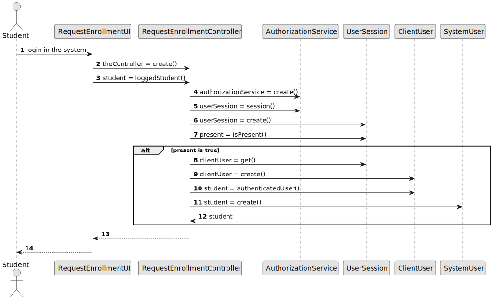

# US 2002

## 1. Context

*Implement a functionality that displays the future exams of a student*

## 2. Requirements

**US 2002 -** As a Student, I want to view a list of my future exams

### 2.1 Dependencies
For this to happen the system may already have exams and students in the database. <br>
This US has dependencies on US´s 2008 and 1001.

## 3. Analysis

To implement this US it was necessary to get the enrollments of the exams that the student was enrolled in. Then check the status of the exam and if the exam has not been taken yet, then it was added to the list of future exams.

## 4. Design

### 4.1. Realization
In this US we search for the exam enrollments that had the status ENROLLED in the repository (ExamEnrollmentRepository) that belong to the student logged in the system. <br>
After that we looked into the returned list of exam enrollments and search for the ones where the exam associated had status CREATED (ExamRepository). <br>
Finally, the exams that corresponded to these expectations were added to a list and that list was returned and showed to the system user.

*Notes:*
* Only the exam enrollments with status ENROLLED were taken into account.
* Only the exams with status CREATED were taken into account.

### 4.2. Diagrams

#### 4.2.1 Class Diagram - CD


#### 4.2.2. System Sequence Diagram - SSD


#### 4.2.3 Sequence Diagram - SD


### 4.3. Applied Patterns

Controller

### 4.4. Tests

This US does not have any tests because it doesn't interact directly with the domain. And we don't test the access to the repositories.

## 5. Implementation

**List Future Exams Controller:**
*Note:*
- All accesses to the repositories were done correctly, they are just not indicated here.

 ````
 public List<Exam> findListStudentFutureExams(){
  if (authorizationService.isAuthenticatedUserAuthorizedTo(BaseRoles.STUDENT)) {
  Student student = studentRepository.findBySystemUser(authorizationService.session().get().authenticatedUser());
  List<Exam> studentFutureExams = svc.findListStudentFutureExams(student);
  return studentFutureExams;
  }
  return null;
  }
  `````

**List Future Exams Service:**
*Note:*
- All accesses to the repositories were done correctly, they are just not indicated here.
````
  public List<Exam> findListStudentFutureExams(Student student){
  Iterable<ExamEnrollment> studentExamsEnrollments = examEnrollmentRepository.findStudentExamEnrollmentsWithEnrolledStatus(student);
  List<Exam> studentFutureExams = new ArrayList<>();
  for(ExamEnrollment examEnrollment : studentExamsEnrollments){
  Exam exam = examRepository.findById((examEnrollment.examID())).get();
  if(exam.examStatus().equals(ExamStatus.CREATED)){
  studentFutureExams.add(exam);
  }
  }
  return studentFutureExams;
  }
  ````
**List Future Exams UI:**
````
    protected boolean doShow() {
    if (authorizationService.isAuthenticatedUserAuthorizedTo(BaseRoles.STUDENT)) {
    List<Exam> studentFutureExams = controller.findListStudentFutureExams();
    if(!studentFutureExams.isEmpty()) {
    for (Exam exam : studentFutureExams) {
    System.out.printf("Exam id %s --> %s, %s\n",exam.identity(), exam.title(), exam.description());
    }
    } else {
    System.out.println("There are no future exams");
    }
    }

        return false;
    }
````
**Jpa Exam Enrollment Repository:** *The method below is included in the Jpa Exam Enrollment Repository.
It is with this query that we will get the list of future exams.*

```
    @Override
    public Iterable<ExamEnrollment> findStudentExamEnrollmentsWithEnrolledStatus(Student student) {
        TypedQuery<ExamEnrollment> query = entityManager().createQuery(
                "SELECT examEnrollment FROM ExamEnrollment examEnrollment  WHERE examEnrollment.examEnrollmentStatus = : status AND examEnrollment.enrollment.student =: student" ,
                ExamEnrollment.class);
        query.setParameter("student", student);
        query.setParameter("status", ExamEnrollmentStatus.ENROLLED);
        return query.getResultList();
        }
```       
        
*In this section the team should present, if necessary, some evidencies that the implementation is according to the design. It should also describe and explain other important artifacts necessary to fully understand the implementation like, for instance, configuration files.*

*It is also a best practice to include a listing (with a brief summary) of the major commits regarding this requirement.*

## 6. Integration/Demonstration

The image bellow represents the list of all the exams that a student still needs to do.

 </br>


*In this section the team should describe the efforts realized in order to integrate this functionality with the other parts/components of the system*

*It is also important to explain any scripts or instructions required to execute an demonstrate this functionality*

## 7. Observations

Access to the repository is always done in the same way.
For this reason, an example sequence diagram has been created to demonstrate this. To exemplify, we list all existing questions in the repository of questions.


Like the repositories, the authentication part always follows the same order of ideas.
In this way, we perform a general SD that demonstrates the entire process. In the diagram, US 1008 is taken as an example,
as a Student, I want to request my enrollment in a course.



*This section should be used to include any content that does not fit any of the previous sections.*

*The team should present here, for instance, a critical prespective on the developed work including the analysis of alternative solutioons or related works*

*The team should include in this section statements/references regarding third party works that were used in the development this work.*