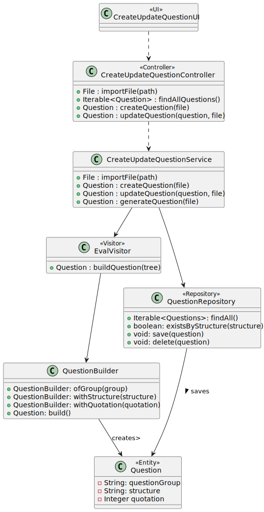
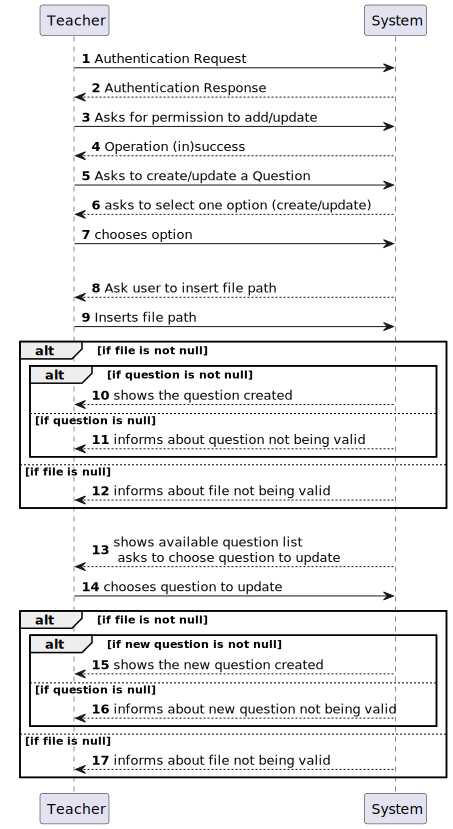
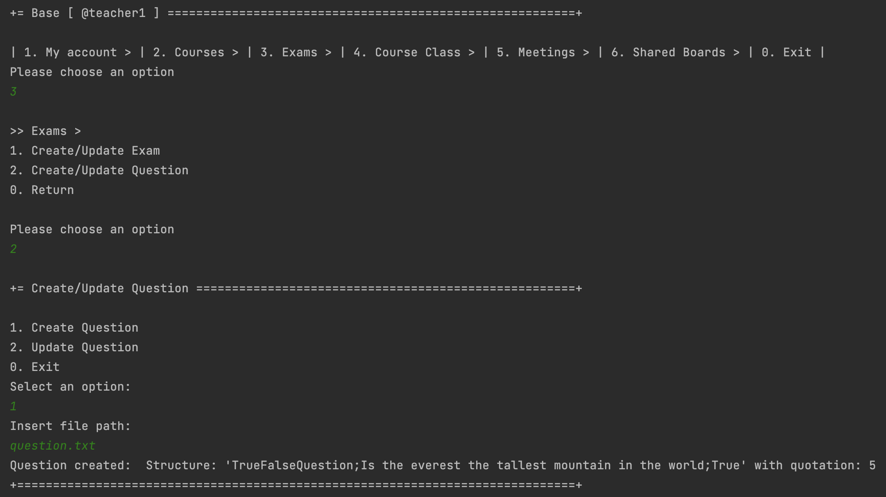
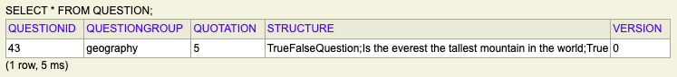
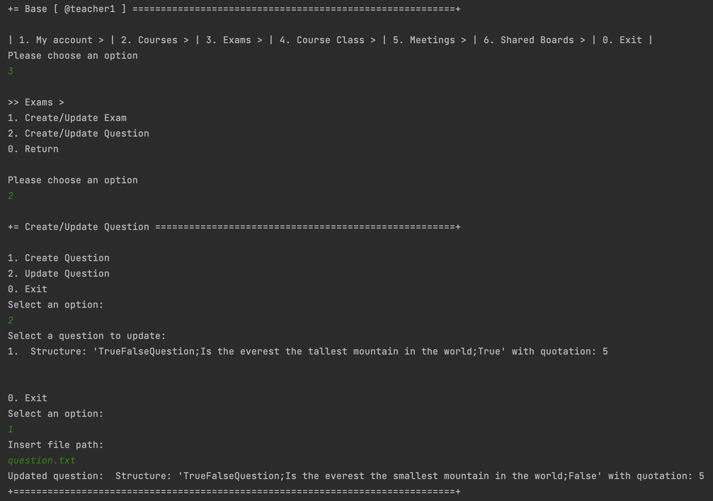
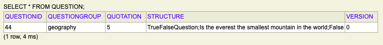

# US 2007 - As Teacher I want to add/update exam questions to a repository of exam questions to be used in automatic formative exams

## 1. Context

*Implement a functionality for the teacher to add and update exam questions to a repository of exam questions to be used in automatic formative exams*

## 2. Requirements

**US 2007 -** As Teacher I want to add/update exam questions to a repository of exam questions to be used in automatic formative exams

- 2007.1. This includes only the specification of single questions to be used only in automatic formative exams, not on regular exams.

- 2007.2. The support for exams (its design, feedback and grading) must follow specific technical requirements, specified in LPROG.

- 2007.3.  The ANTLR tool should be used (https://www.antlr.org/).

## 3. Analysis

This US consists of two functionalities, which are slightly different:
- If the teacher chooses to create a question, the system only asks for the file to generate a question and then
  tries to validate the text of the file. If valid, it generates a question and saves it in the repository.
- If the teacher chooses to update a question, the system asks for the teacher to choose a question to update
  and the file to generate the question, tries to validate the text of the file, and if valid, generates a new question
  and updates the old one in the repository.

The question is divided into three parts, group, structure and quotation. The group serves to identify the topic of the question, for example, geography, English, etc..
The question structure includes:
- the question type(matching, select missing Word, multiple Choice, numeric, short or true or False|)
- the question itself
- eventually, options
- the correct answer
- The quotation is indicated at the end
  Here is an example of a valid question:

```
  ??
  fillgap; // group
  //structure
  MissingWordQuestion; // question tipe
  Complete the sentence; // question itself
  Um *** e uma estrutura de controlo que permite a execucao repetida de um bloco de codigo enquanto uma condicao especificada for verdadeira; 
  objeto, laco, grafo, servico; // options
  laco; // correct answer
  2
  ?? // quotation
````
Notes:
- The question generation is done with ANTLR.


## 4. Design

### 4.1. Realization

To do this US, it was created a method to import a file (common to create/update),
and then, there is the two different functionalities:
- Create Question: After importing the file, the system creates a questionm (calls a generate question method in the service,
  which validates the text from the file with a ANTLR grammar) and saves it on the repository.
- Update Question: Regarding this functionality, before importing the file and generating a question, the system
  must list to the teacher the questions available for him to update. This consists of getting the list of all existing question in the repository.
  After this, the system creates a new question and updates the old one in the repository.
- Question generation: This is done with the ANTLR tools, regarding LPROG. It was created a grammar to validate the question
  and then implemented the visitors, to access the tree values and create the object.

### 4.2. Diagrams

#### 4.2.1 Class Diagram - CD



#### 4.2.2. System Sequence Diagram - SSD



#### 4.2.3 Sequence Diagram - SD


- The user wants to create or update a question. The system asks which action you want and the user selects it.
- If you want to create it, you are asked to insert a file containing the question you want to add and, through ANTRL, this is validated and saved in the repository. At the end it is shown to the teacher.
- If you want to update, the system shows the list that contains all the questions in the repository and asks you to select the one you want to change. Once selected, the teacher is similar to creating a question, 
with the difference that the previous question is eliminated and the updated one becomes a new question.

### 4.3. Applied Patterns

* Controller
* Service
* Builder

### 4.4. Tests

**Test 1:** *Verifies than a question was successfully created*

```
@Test
    public void ensureQuestionWasSuccessfullyCreated(){
        Question actual = questionBuilder.ofGroup("group").withStructure("structure").withQuotation(8).build();
        Question expected = new Question("group", "structure", 8);

        Assertions.assertTrue(expected.sameAs(actual));
    }
````

**Test 2:** *Verifies that it is not possible to create a question with null group.*

```
@Test
    public void testFailedBecauseGroupIsNull() {
        Assertions.assertThrows(IllegalArgumentException.class, () ->
                {
                    questionBuilder.ofGroup(null).withStructure("structure").withQuotation(8).build();
                }
        );
    }
````

**Test 3:** *Verifies that it is not possible to create a question with null structure.*
```
@Test
    public void testFailedBecauseStructureIsNull() {
        Assertions.assertThrows(IllegalArgumentException.class, () ->
                {
                    questionBuilder.ofGroup("group").withStructure(null).withQuotation(8).build();
                }
        );
    }
````

**Test 4:** *Verifies that it is not possible to create a question with null quotation.*
```
@Test
    public void testFailedBecauseQuotationIsNull() {
        Assertions.assertThrows(IllegalArgumentException.class, () ->
                {
                    questionBuilder.ofGroup("group").withStructure("structure").withQuotation(null).build();
                }
        );
    }
````


```
@Test(expected = IllegalArgumentException.class)
public void ensureNullIsNotAllowed() {
	Example instance = new Example(null, null);
}
````

```
@Test(expected = IllegalArgumentException.class)
public void ensureNullIsNotAllowed() {
	Example instance = new Example(null, null);
}
````

```
@Test(expected = IllegalArgumentException.class)
public void ensureNullIsNotAllowed() {
	Example instance = new Example(null, null);
}
````

## 5. Implementation

**Create Update Question UI:** 
*the methods below can be found in Create Update Question UI Before these methods we have a menu that asks the user,
in this case a teacher, to choose whether he wants to create or update questions.*

```
private void createQuestion() throws IOException {
        String path = Console.readLine("Insert file path:");
        File file = controller.importFile(path);

        if (file != null) {
            Question question = controller.createQuestion(file);
            if (question != null) {
                System.out.printf("Question created: %s", question);
            } else {
                System.out.println("Question not valid. Try again.");
            }
        } else {
            System.out.println("File not valid. Try again.");
        }
    }

    private void updateQuestion() throws IOException {
        Question question = chooseQuestion();
        if(question != null) {
            String path = Console.readLine("Insert file path:");
            File file = controller.importFile(path);

            if (file != null) {
                Question newQuestion = controller.updateQuestion(question, file);
                if (question != null) {
                    System.out.printf("Updated question: %s", newQuestion);
                } else {
                    System.out.println("Question not valid. Try again.");
                }
            } else {
                System.out.println("File not valid. Try again.");
            }
        }
    }

    /**
     * Method used to show the list of all existing questions
     *
     * @return question selected
     */
    private Question chooseQuestion() {
        Iterable<Question> questionList = controller.findAllQuestions();
        if (questionList.iterator().hasNext()) {
            final SelectWidget<Question> selector = new SelectWidget<>("Select a question to update:", questionList);
            selector.show();
            return selector.selectedElement();
        } else {
            System.out.println("No questions available!");
        }
        return null;
    }
````


**Create Update Question Controller:**

```
public class CreateUpdateQuestionController {
    private CreateUpdateQuestionService svc = new CreateUpdateQuestionService();

    private QuestionRepository questionRepository = PersistenceContext.repositories().questionRepository();

    public File importFile(String path){
        return svc.importFile(path);
    }

    public Iterable<Question> findAllQuestions() {
        return questionRepository.findAll();
    }

    public Question createQuestion(File file) throws IOException {
        return svc.createQuestion(file);
    }


    public Question updateQuestion(Question question, File file) throws IOException {
        return svc.updateQuestion(question, file);
    }
}

````

**Create Update Question Service:** 

```
public class CreateUpdateQuestionService {
    private QuestionRepository questionRepository = PersistenceContext.repositories().questionRepository();


    /**
     * This method receives a path and imports the file relative to that path.
     *
     * @param path - file path
     * @return file imported from path
     */
    public File importFile(String path) {
        File file = new File(path);
        if (!file.exists()) {
            System.err.println("File does not exist: " + path);
            return null;
        }
        return file;
    }

    /**
     * This method creates a question from an imported file. The question is generated
     * by the generateQuestion method.
     *
     * @param file - file to generate the question
     */
    public Question createQuestion(File file) throws IOException {
        Question question = generateQuestion(file);
        if(!questionRepository.existsByStructure(question.structure())) {
            questionRepository.save(question);
            return question;
        }
        return null;
    }

    /**
     * This method updates a question choosen by the teacher. First, it calls the generateQuestion
     * method, that generates a question from the file imported, and then updates on the repository
     * the question choosen.
     *
     * @param question - question to be updated
     * @param file - file to generate the question
     */
    public Question updateQuestion(Question question, File file) throws IOException {
        Question newQuestion = generateQuestion(file);

        if (newQuestion != null) {
            questionRepository.delete(question);
            questionRepository.save(newQuestion);
        }
        return newQuestion;
    }

    /**
     * This method generates a Question, after validating the file import with the grammar from ANTLR.
     *
     * @param file - file to generate question
     * @return question generated
     */
    private Question generateQuestion(File file) throws IOException {
        QuestionLexer lexer = new QuestionLexer(CharStreams.fromFileName(file.getPath()));
        CommonTokenStream tokens = new CommonTokenStream(lexer);
        QuestionParser parser = new QuestionParser(tokens);
        ParseTree tree = parser.question();
        EvalVisitor visitor = new EvalVisitor();

        return visitor.builQuestion(tree);
    }
}
````

**Jpa Question Repository:**
*The first method is used when the teacher wants to update an existing question.
The second serves to guarantee that we can save the question itself or if it already exists.*
```
public Iterable<Question> findAll(){
        final TypedQuery<Question> query = entityManager().createQuery(
                "SELECT question FROM Question question",
                Question.class);

        return query.getResultList();
    }

    @Override
    public boolean existsByStructure(String structure) {
        TypedQuery<Long> query = entityManager().createQuery(
                "SELECT COUNT(question) FROM Question question WHERE question.structure = :structure",
                Long.class);
        query.setParameter("structure", structure);
        Long count = query.getSingleResult();
        return count > 0;
    }
````

**Question Builder:**
```
public class QuestionBuilder {

    private String group;
    private String structure;
    private Integer quotation;

    public QuestionBuilder ofGroup(String group) {
        this.group = group;
        return this;
    }

    public QuestionBuilder withStructure(String structure) {
        this.structure = structure;
        return this;
    }

    public QuestionBuilder withQuotation(Integer quotation) {
        this.quotation = quotation;
        return this;
    }

    public Question build() {
        Preconditions.noneNull(group, structure, quotation);
        return new Question(group, structure, quotation);
    }
````

**Question.g4:**


```
grammar Question;

question: INITQUESTION group SEPARATOR structure SEPARATOR quotation INITQUESTION;

group : TEXT;

quotation : NUM;

structure: matching
| missingWord
| multipleChoice
| numeric
| short
| trueOrFalse
;

matching: 'MatchingQuestion' SEPARATOR TEXT SEPARATOR NUM SEPARATOR mqOption;

mqOption: TEXT ARROW TEXT ',' mqOption
| TEXT ARROW TEXT
;

missingWord: 'MissingWordQuestion' SEPARATOR mwText SEPARATOR mwOption SEPARATOR mwOption;

mwText: GAPSPACE TEXT mwText
| TEXT GAPSPACE mwText
| TEXT GAPSPACE
| GAPSPACE TEXT
| TEXT GAPSPACE TEXT
;

mwOption: TEXT ',' mwOption
| TEXT
;

multipleChoice: 'MultipleChoiceQuestion' SEPARATOR TEXT SEPARATOR mcOption SEPARATOR NUM;

mcOption: TEXT ',' mcOption
| TEXT
;

numeric: 'NumericQuestion' SEPARATOR TEXT SEPARATOR NUM;

short: 'ShortQuestion' SEPARATOR TEXT SEPARATOR TEXT;

trueOrFalse: 'TrueFalseQuestion' SEPARATOR TEXT SEPARATOR tfOption;

tfOption: 'True'
|'False'
;

INITQUESTION: '??' ;
SEPARATOR: ';' ;
NUM: [0-9]+;
TEXT: [A-Za-z0-9 ]+;
ARROW: '->';
GAPSPACE: '***';

````

## 6. Integration/Demonstration

*The images below demonstrate the implementation of the US in question.
the 1st shows the creation of a question, after inserting it inside a txt file, and then the same in the database, as expected.*
***String used:**??geography;TrueFalseQuestion;Is the everest the tallest mountain in the world;True;5??* </br>



*Here we are facing the action of updating a question. All existing questions in the repository are shown, in this case only 
the one that was previously created, and we proceed with the update, as shown in the database.* </br>
***String used:**??geography;TrueFalseQuestion;Is the everest the smallest mountain in the world;False;5??*



## 7. Observations

*Access to the repository is always done in the same way.
For this reason, an example sequence diagram has been created to demonstrate this. To exemplify, we list all existing questions in the repository of questions.*


*Like the repositories, the authentication part always follows the same order of ideas.
In this way, we perform a general SD that demonstrates the entire process. In the diagram, US 1008 is taken as an example,
as a Student, I want to request my enrollment in a course.*

