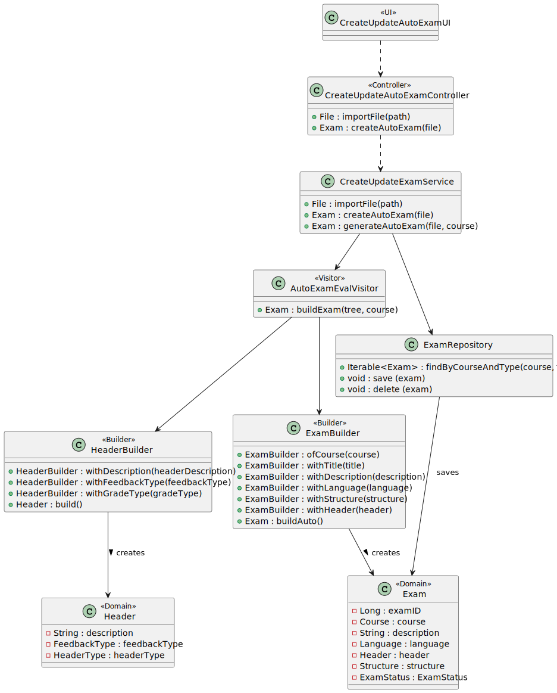
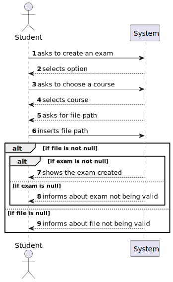

# US 2008 - As Teacher, I want to create/update automatic formative exams

## 1. Context

Implement a functionality for the teacher to create an automatic formative exam.

## 2. Requirements

This US descprition is "As Teacher, I want to create/update automatic formative exams".

## 3. Analysis

- If the teacher chooses to create an exam, the system only asks for the file to generate an exam and then
  tries to validate the text of the file. If valid, it generates an exam and saves it in the repository.


## 4. Design

### 4.1. Realization

To do this US, it was created a method to import a file (common to create/update),
and then, there is the two different functionalities:
- Create Exam: After importing the file, the system creates an exam (calls a generate exam method in the service,
  which validates the text from the file with a ANTLR grammar).
- Exam generation: This is done with the ANTLR tools, regarding LPROG. It was created a grammar to validate the exam
  and then implemented the visitors, to access the tree and create the object.

### 4.2. Diagrams

#### 4.2.1- Class Diagram - CD



#### 4.2.2. System Sequence Diagram - SSD



#### 4.2.3. Sequence Diagram - SD


#### 4.3. Applied Patterns

Controller, Service and Builder.

### 4.4. Tests

**Class Exam Tests:** *These were some example of tests done for the Exam class, it ensures no attribute can be null
and that the dates are correct (later than today, and close date after open date*

**Test 1:** *Verifies than an exam was not created becuase title is null.
It was done a test like this for each atttribute*

```
@Test
public void testFailedBecauseCourseIsNull() {
    Assertions.assertThrows(IllegalArgumentException.class, () ->
        {
            new Exam(null, title, description, stringToDate("30/10/2023"),
                    stringToDate("30/12/2023"), language, header, structure);
        }
    );
}
```

**Exam Builder Tests:** *These were some example of tests done for the Exam Builder, it ensures no attribute can be null
and that the dates are correct (later than today, and close date after open date*

**Test 1:** *Verifies than an exam was successfully created*

```
@Test
public void ensureExamWasSuccessfullyCreated(){
    Exam actual = examBuilder.ofCourse(course).withTitle(title).withDescription(description)
        .withOpenDate(stringToDate("30/10/2023")).withCloseDate(stringToDate("30/12/2023"))
        .withLanguage(language).withHeader(header).withStructure(structure).build();
    Exam expected = new Exam(course, title, description, stringToDate("30/10/2023"),
        stringToDate("30/12/2023"), language, header, structure);

    Assertions.assertTrue(expected.sameAs(actual));
}
````


**Test 2:** *Verifies than an exam was not created becuase title is null.
It was done a test like this for each atttribute*

```
@Test
public void testFailedBecauseCourseIsNull() {
    Assertions.assertThrows(IllegalArgumentException.class, () ->
        {
            examBuilder.ofCourse(null).withTitle(title).withDescription(description)
                .withOpenDate(stringToDate("30/10/2023")).withCloseDate(stringToDate("30/12/2023"))
                .withLanguage(language).withHeader(header).withStructure(structure).build();
        }
    );
}
```

## 5. Implementation

**CreateUpdateAutoExamUI:**

```
@Override
    protected boolean doShow() {
        System.out.println("1. Create Auto Exam");
        System.out.println("2. Check Auto Exam");
        System.out.println("0. Exit");

        final int option = Console.readInteger("Please choose an option");

        try {
            if (option == 1) {
                Exam exam = createAutoExam();
                if (exam!=null){
                    getExamInfo(exam);
                } else {
                    System.out.println("No exam created.");
                }
            } else if (option == 2) {
                Exam exam = controller.checkExam(Console.readLine("Insert exam id:"));
                getExamInfo(exam);
            } else {
                System.out.println("No valid option selected.");
            }
        } catch (IntegrityViolationException | ConcurrencyException ex) {
            LOGGER.error("Error performing the operation", ex);
            System.out.println(
                    "Unfortunatelly there was an unexpected error in the application. Please try again and if the problem persists, contact your system admnistrator.");
        } catch (IOException e) {
            throw new RuntimeException(e);
        }
        return true;
    }

    public Exam createAutoExam() throws IOException {
        Course course = chooseCourse();
        if (course != null) {
            String path = Console.readLine("Insert file path:");
            File file = controller.importFile(path);

            if (file != null) {
                Exam exam = controller.createAutoExam(course, file);
                if (exam != null) {
                    System.out.printf("Auto Exam created: %s\n", exam);
                    return exam;
                } else {
                    System.out.println("Exam not created. Quotation is not 20.");
                }
            } else {
                System.out.println("File not valid. Try again.");
            }
        } else {
            System.out.println("No courses available for you to create exams for.");
        }
        return null;
    }


    /**
     * Method used to show the list of courses available for the teacher to create an exam for.
     *
     * @return course selected
     */
    private Course chooseCourse() {
        Iterable<Course> coursesList = controller.findCoursesAvailableForStudent();
        if (coursesList.iterator().hasNext()) {
            final SelectWidget<Course> selector = new SelectWidget<>("Select a course to crete an exam for:", coursesList);
            selector.show();
            return selector.selectedElement();
        } else {
            System.out.println("No courses available to create exams.");
        }
        return null;
    }

    private void getExamInfo(Exam exam){
        for (int i = 0; i < exam.sections().size(); i++) {
            for (int j = 0; j < exam.sections().get(i).questions().size(); j++) {
                System.out.printf("\nSection %d, Type :%s Question %d: %s with quotation =%s\n", i + 1, exam.sections().get(i).questions().get(j).questionType(),j + 1 ,exam.sections().get(i).questions().get(j).question(), exam.sections().get(i).questions().get(j).quotation());
            }
        }
    }
```

**CreateUpdateAutoExamController:**

```
private CreateUpdateExamService svc = new CreateUpdateExamService();
    ExamRepository examRepository = PersistenceContext.repositories().examRepository();

    public File importFile(String path){
        return svc.importFile(path);
    }

    public Iterable<Course> findCoursesAvailableForStudent() {
        return svc.findCoursesAvailableForStudent();
    }

    public Exam createAutoExam(Course course, File file) throws IOException {
        return svc.createAutoExam(course, file);
    }
```

**CreateUpdateExamService:**

```
/**
 * This method receives a path and imports the file relative to that path.
 *
 * @param path - file path
 * @return file imported from path
 */
public File importFile(String path) {
    File file = new File(path);
    if (!file.exists()) {
        System.err.println("File does not exist: " + path);
        return null;
    }
    return file;
}

/**
 * This method finds the courses available for the teacher to create an exam for,
 * which are the courses where he teaches. This method calls a controller previously
 * used in another US, that returns this list.
 *
 * @return iterable of course available for teacher to create an exam for
 */
public Iterable<Course> findCoursesAvailableForTeacher() {
    return listAvailableCoursesController.listCoursesAvailableForTeacher();
}

public Exam createAutoExam(Course course, File file) throws IOException {
        Exam exam = generateAutoExam(course, file);

        if (examHasQuotationOf20(exam)) {
            return exam;
        }

        else return null;

    }

/**
 * This method calculates the total quotation of an exam and returns true
 * if it is 20 or false, if not
 *
 * @param exam - exam to calculate the quotation of
 * @return true, if quotation is 20, or false, if not
 */
private boolean examHasQuotationOf20(Exam exam) {
    Long quotation = 0L;
    for (Section section : exam.sections()) {
        for (Question question : section.questions()) {
            quotation += question.quotation();
        }
    }
    return quotation == 20;
}

 private Exam generateAutoExam(Course course, File file) throws IOException {
        AutoExamLexer lexer = new AutoExamLexer(CharStreams.fromFileName(file.getPath()));
        CommonTokenStream tokens = new CommonTokenStream(lexer);
        AutoExamParser parser = new AutoExamParser(tokens);
        ParseTree tree = parser.stat();
        AutoExamEvalVisitor visitor = new AutoExamEvalVisitor();

        return visitor.buildExam(tree, course);
    }
```

**AutoExam.g4:**

```
grammar AutoExam;

stat: INIT title SEPARATOR description SEPARATOR language SEPARATOR header SEPARATOR structure INIT;

title: TEXT;

description: TEXT;

language: TEXT;

header: headerDescription SEPARATOR feedbackType SEPARATOR gradeType;

headerDescription: TEXT;

feedbackType: 'ON_SUBMISSION';

gradeType: 'ON_SUBMISSION';

structure : section+;

section: SECTIONOPEN TEXT SEPARATOR sectionStructure SECTIONCLOSE;

sectionStructure: question+;

question: INITQUESTION questiontype INITQUESTION;

questiontype: NUM SEPARATOR matching
        | NUM SEPARATOR missingWord
        | NUM SEPARATOR multipleChoice
        | NUM SEPARATOR numeric
        | NUM SEPARATOR short
        | NUM SEPARATOR trueOrFalse
        ;

matching: 'MatchingQuestion';


missingWord: 'MissingWordQuestion';


multipleChoice: 'MultipleChoiceQuestion';


numeric: 'NumericQuestion';


short: 'ShortQuestion';


trueOrFalse: 'TrueFalseQuestion';


INIT: '"' ;
INITQUESTION: '??' ;
SEPARATOR: ';' ;
SECTIONOPEN: '<<' ;
SECTIONCLOSE: '>>' ;
NUM: [0-9]+;
TEXT: [A-Za-z0-9 ]+;
SLASH: '/';
ARROW: '->';
GAPSPACE: '***';
QUESTION:'?';
WS : [ \t\r\n]+ -> skip ;
```

## 6. Integration/Demonstration

```
+= Create/Update Auto Exam ====================================================+

1. Create Auto Exam
2. Check Auto Exam
0. Exit
   Please choose an option
   1
   Select a course to crete an exam for:
1. Course: MATCP - Curso aberto(curso aberto 12/2023),
   with minimum 50 students and maximum 200 students,
   with status: ENROLL

0. Exit
   Select an option:
   1
   Insert file path:
   autoexam.txt
   Auto Exam created: Exam with title: autoexam, with description: this is an autoexam, with status: CREATED, with open date:null and close date:null

Section 1, Type :SHORT Question 1: What is the capital of Portugal with quotation =3

Section 1, Type :MATCHING Question 2: Match the translation;cao,gato;cat,dog; with quotation =3

Section 1, Type :SHORT Question 3: What is the capital of Spain with quotation =2

Section 2, Type :MULTIPLE_CHOICE Question 1: How tall is Serra da Estrela?;100metros,2000metros,7000metros; with quotation =3

Section 2, Type :MISSING_WORD Question 2: Um * e uma estrutura de controlo que permite a * repetida de um bloco de codigo enquanto uma condicao especificada for verdadeira;objeto - laco - grafo - servico,execucao - gestao - repeticao - organizacao with quotation =3

Section 2, Type :NUMERIC Question 3: In what year did Argentina won their third World Cup?; with quotation =3

Section 2, Type :TRUE_OR_FALSE Question 4: Porto has 2 Champions Leagues?; with quotation =3
+==============================================================================+
```

