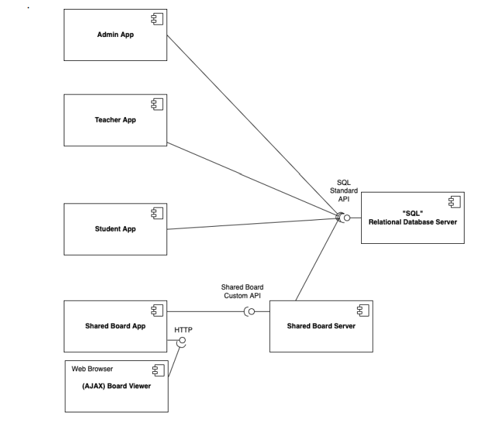

# US 3001

## 1. Context

*Implement a functionality that prepares the communication infrastruture for the shared boards *

## 2. Requirements

**US-3001:** As Project Manager, I want the team to prepare the communication infrastruture for the Shared Boards and the depoyment of the solution
### Acceptance Criteria

This functional part of the system has very specific technical requirements. It must follow a client-server architecture, where a client application is used to access the shared boards that should be implemented in a server. Communications between these two components must follow specific protocol described in a document from RCOMP ("Application Protocol"). Also, the client application can not access the relational database, it can only access the server application.
The solution should be deployed using several network nodes. It is expected that, at least, the relational database server and the shared board server be deployed in nodes different from localhost, preferably in the cloud.

## 3. Analysis 
This Us it's just a planning for what will need to be done in the next sprint.
The purpose of this application protocol is facilitating data exchanges between the Shared Board App
and the Shared Board Server network applications. </br>


It is request to plann the implementation of five fundamental message codes. So here is a prototype of the message codes.

````
public class MessageFormat {
private byte version;
private byte code;
private byte dLength1;
private byte dLength2;
private byte[] data;
 
  public MessageFormat(byte version, byte code, byte dLength1, byte dLength2, byte[] data) {
        this.version = version;
        this.code = code;
        this.dLength1 = dLength1;
        this.dLength2 = dLength2;
        this.data = data;
    }

    public byte getVersion() {
        return version;
    }

    public byte getCode() {
        return code;
    }

    public byte getDLength1() {
        return dLength1;
    }

    public byte getDLength2() {
        return dLength2;
    }

    public byte[] getData() {
        return data;
    }

    public int getDataLength() {
        return dLength1 + (dLength2 << 8);
    }

    public byte[] toBytes() {
            ByteBuffer buffer;
            int totalLength = 4 + getDataLength();

            if (code == 0 || code == 1 || code == 2) {
                buffer = ByteBuffer.allocate(totalLength);
                buffer.put(version);
                buffer.put(code);
                buffer.put(dLength1);
                buffer.put(dLength2);
            } else if (code == 3) {
                byte[] errorMessageBytes = data != null ? data : new byte[0];
                totalLength += errorMessageBytes.length;
                buffer = ByteBuffer.allocate(totalLength);
                buffer.put(version);
                buffer.put(code);
                buffer.put(dLength1);
                buffer.put(dLength2);
                buffer.put(errorMessageBytes);
            } else if (code == 4) {
                byte[] authRequestBytes = data != null ? data : new byte[0];
                totalLength += authRequestBytes.length;
                buffer = ByteBuffer.allocate(totalLength);
                buffer.put(version);
                buffer.put(code);
                buffer.put(dLength1);
                buffer.put(dLength2);
                buffer.put(authRequestBytes);
            } else {
                throw new IllegalArgumentException("Invalid code: " + code);
            }
````

Apart this we have in our app all we need to connect the Shared Board App and the Shared Board Server by a TCP connection. Just as it is seen in the figure:



