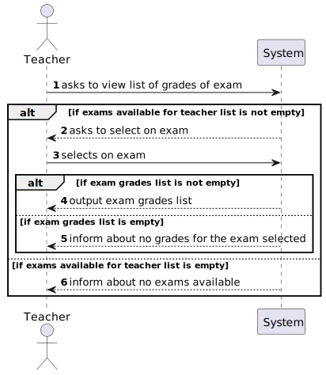

# US 2006 - As Teacher, I want to view a list of the grades of exams of my courses

## 1. Context

Implement a functionality for the teacher to view a list of grades of exams of his courses.

## 2. Requirements

This US descprition is "As Teacher, I want to view a list of the grades of exams of my courses".

## 3. Analysis

This US consists of showing the teacher the list of grades of exams in his courses. The teacher can
choose to view the grades of only one of his courses or for all of them.

## 4. Design

### 4.1. Realization

To do this US, the first step is to ask the teacher if he wants to see the grade of one of his courses
or for all of them. If the option is the first, the system must ask the teacher to select one course.
If the option is the second, the system must iterate the list of courses available, find the grades for
each one and display the information to the teacher.

### 4.2. Diagrams

#### 4.2.1- Class Diagram - CD


#### 4.2.2. System Sequence Diagram - SSD



#### 4.2.3. Sequence Diagram - SD


The first step is for the system to ask the teacher to select one option of the following:
- View grades for a specific course: the system must find the courses available for the teacher (this is
done using code from US 1006) and ask the teacher to choose one. After that, it accesses the exam enrollment
repository and finds the exam enrollments related to that course (the status must be 'PRESENT', which
naturally means that the student already took the exam and there is a grade to show to the teacher).
- View grades for all courses: the system must also find the courses available for the teacher (also
done using code from US 1006) and then find the exam enrollments, following the same idea (status),
for each course.

#### 4.3. Applied Patterns

Controller.

### 4.4. Tests

*It wasn't done any tests to repositories methods, only for the domain level, because of not 
being required at this stage to do so.*

## 5. Implementation

**ListExamGradesUI**:
```
private ListExamGradesController controller = new ListExamGradesController();

@Override
public String headline() {
    return "List Grades of Courses";
}

protected boolean doShow() {
    Iterable<Course> coursesAvailableList = controller.findCoursesAvailableForTeacher();

    if (coursesAvailableList.iterator().hasNext()) {
        System.out.println("1. View grades from a course");
        System.out.println("2. View grades from all courses available");
        System.out.println("0. Exit");

        final int option = Console.readOption(1, 2, 0);

        try {
            switch (option) {
                case 1:
                    Course course = chooseExam(coursesAvailableList);
                    viewGradesFromCourse(course);
                    break;
                case 2:
                    viewGradesFromAllCourses(coursesAvailableList);
                    break;
                default:
                    System.out.println("No valid option selected.");
                    break;
            }
        } catch (Exception e) {
            throw new RuntimeException(e);
        }
    } else {
        System.out.println("No exams available.");
    }
    return false;
}

/**
 * Method used to show the list of exams available for teacher and select one exam to update.
 *
 * @return exam selected
 */
private Course chooseExam(Iterable<Course> coursesList) {
    final SelectWidget<Course> selector = new SelectWidget<>("Select an exam to view grades list for:", coursesList);
    selector.show();
    return selector.selectedElement();
}

private void viewGradesFromCourse(Course course) {
    Iterable<ExamEnrollment> examGrades = controller.findExamEnrollsOfCourse(course);
    if (examGrades.iterator().hasNext()) {
        System.out.println();
        System.out.println("Grades of course selected:");
        for (ExamEnrollment examEnrollment : examGrades) {
            System.out.printf("-> Exam: %s - Student: %s, Grade: %s\n",
                    examEnrollment.examID(),
                    examEnrollment.enrollment().student().mecanographicNumber(),
                    examEnrollment.examGrade());
        }
    } else {
        System.out.println("No grades for the exam selected.");
    }
}

private void viewGradesFromAllCourses(Iterable<Course> coursesAvailableList) {
    int gradesCount = 0;
    System.out.println();
    for (Course course : coursesAvailableList) {
        Iterable<ExamEnrollment> examGrades = controller.findExamEnrollsOfCourse(course);
        if (examGrades.iterator().hasNext()) {
            System.out.printf("Grades of Course %s:\n", course.courseCode());
            for (ExamEnrollment examEnrollment : examGrades) {
                gradesCount++;
                System.out.printf("-> Exam: %s - Student: %s, Grade: %s\n",
                        examEnrollment.examID(),
                        examEnrollment.enrollment().student().mecanographicNumber(),
                        examEnrollment.examGrade());
            }
        }
    }

    if (gradesCount == 0) {
        System.out.println("No grades available or any course.");
    }
}
```

**ListExamGradesController**:
```
private AuthorizationService authorizationService = AuthzRegistry.authorizationService();
private ListAvailableCoursesController listAvailableCoursesController = new ListAvailableCoursesController();
private ExamEnrollmentRepository examEnrollmentRepository = PersistenceContext.repositories().examEnrollmentRepository();

/**
 * This method finds the exams available for the teacher logged in the system.
 *
 * @return iterable of exams available for the teacher logged in the system
 */
public Iterable<Course> findCoursesAvailableForTeacher() {
    return listAvailableCoursesController.listCoursesAvailableForTeacher();
}

/**
 * This method finds the exam enrolls of a given course.
 *
 * @param course - course to find exam enrolls of
 * @return list of exam enrolls of a given course
 */
public Iterable<ExamEnrollment> findExamEnrollsOfCourse(Course course) {
    if (authorizationService.isAuthenticatedUserAuthorizedTo(BaseRoles.TEACHER)) {
        return examEnrollmentRepository.findGradesOfCourse(course);
    }
    return null;
}
```

**JpaExamEnrollmentRepository**:
```
@Override
public Iterable<ExamEnrollment> findGradesOfCourse(Course course) {
    TypedQuery<ExamEnrollment> query = entityManager().createQuery(
        "SELECT examEnrollment FROM ExamEnrollment examEnrollment" +
        " WHERE examEnrollment.enrollment.course = :course" +
        " AND examEnrollment.examEnrollmentStatus = :status",
        ExamEnrollment.class);
    query.setParameter("course", course);
    query.setParameter("status", ExamEnrollmentStatus.PRESENT);

    return query.getResultList();
}
```

## 6. Integration/Demonstration

The teacher can list the exam grades for a specific course where he teaches:

```
+= List Grades of Courses =====================================================+

1. View grades from a course
2. View grades from all courses available
0. Exit
Select an option: 
1
Select an exam to view grades list for:
1. Course: MATCP - Curso aberto(curso aberto 12/2023),
 with minimum 50 students and maximum 200 students,
 with status: ENROLL

2. Course: LPROG - Linguagens e Programação(Learn lexic, syntactic and semantical analysis.),
 with minimum 50 students and maximum 200 students,
 with status: ENROLL

0. Exit
Select an option: 
1

Grades of course selected:
-> Exam: 42 - Student: isep111, Grade: 10.0
-> Exam: 53 - Student: isep111, Grade: 9.0
+==============================================================================+
```

The teacher can also check the grades for every course where he teachers:
```
+= List Grades of Courses =====================================================+

1. View grades from a course
2. View grades from all courses available
0. Exit
Select an option: 
2

Grades of Course MATCP:
-> Exam: 42 - Student: isep111, Grade: 10.0
-> Exam: 53 - Student: isep111, Grade: 9.0
Grades of Course LPROG:
-> Exam: 77 - Student: isep333, Grade: 7.0
+==============================================================================+
```

This is the information persisted in the exam enrollments repository, which is where the system
goes to find the grades:


## 7. Observations

*Access to the repository is always done in the same way.
For this reason, an example sequence diagram has been created to demonstrate this.
To exemplify, we list all existing questions in the repository of questions.*


*Like the repositories, the authentication part always follows the same order of ideas.
In this way, we perform a general SD that demonstrates the entire process. In the diagram, US 1008 is taken as an example,
as a Student, I want to request my enrollment in a course.*

