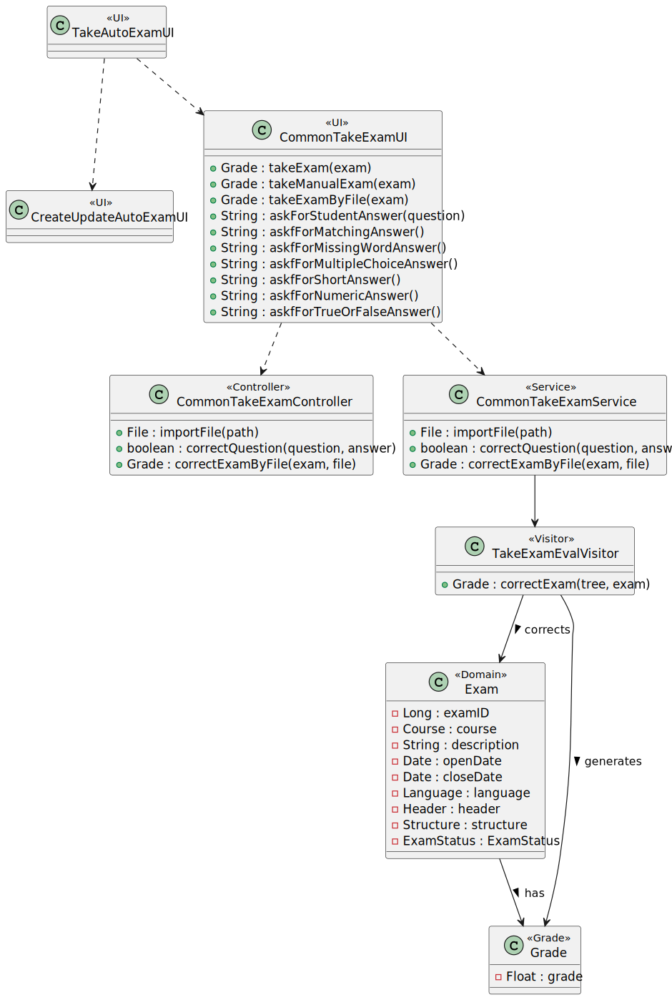
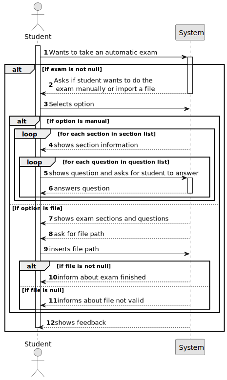
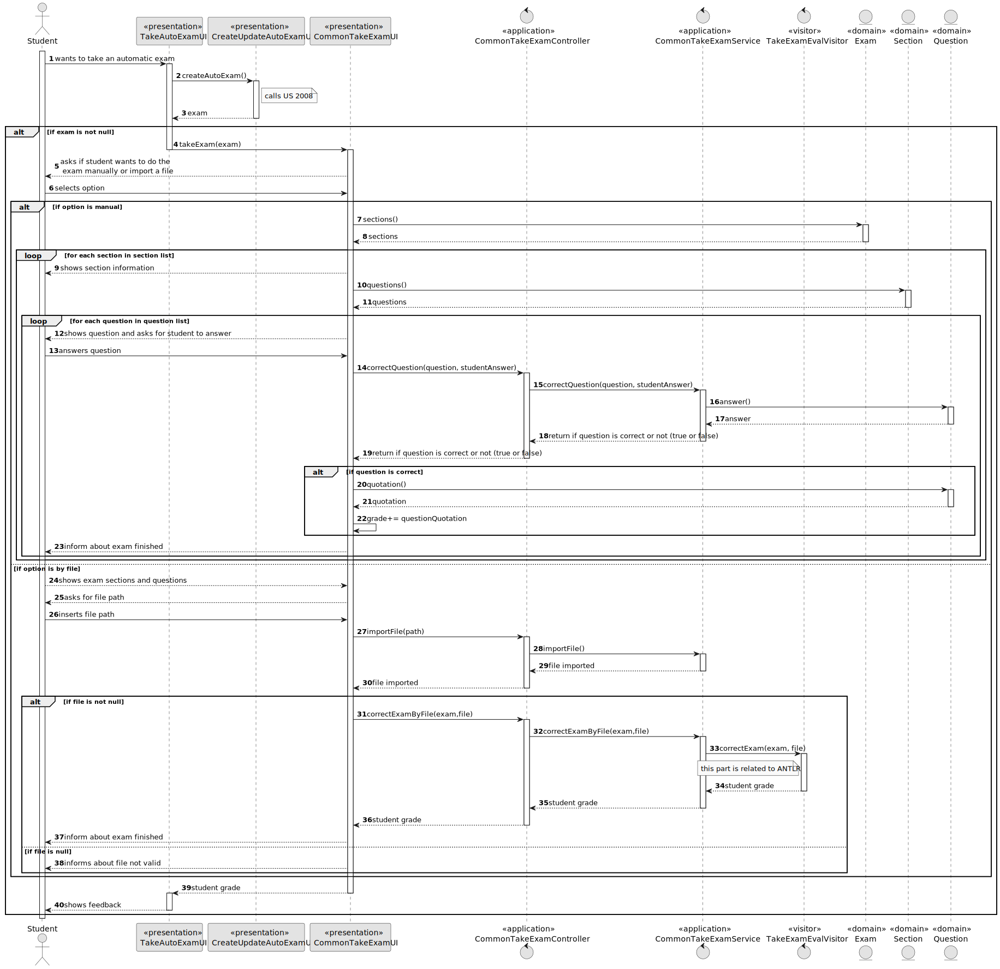
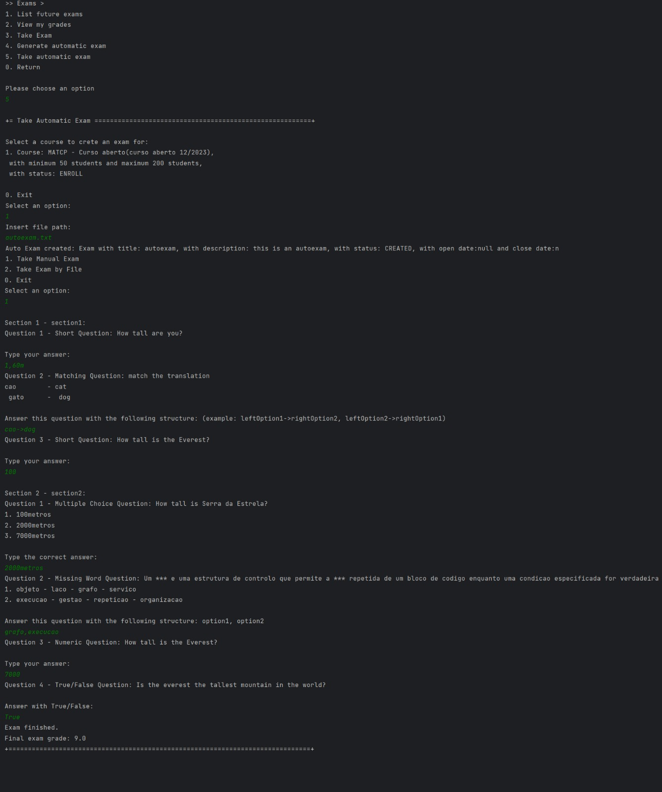
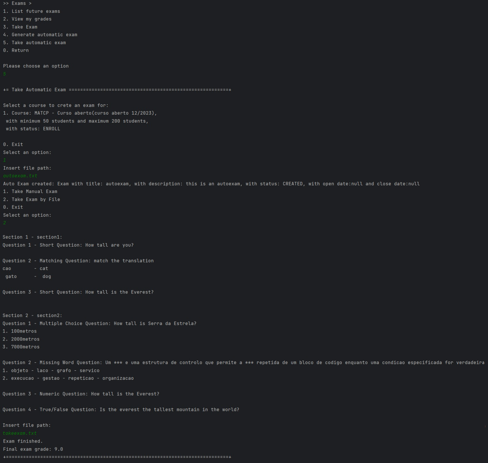
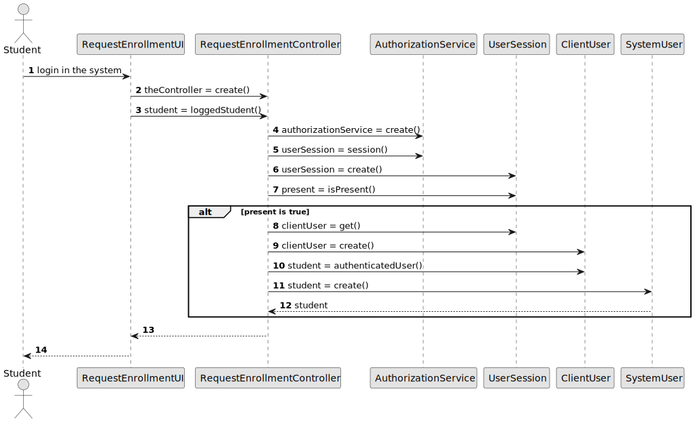

# US 2009 - As Student, I want to take an automatic formative exam

## 1. Context

*Implement a functionality that can make a student take an automatic formative exam.*

## 2. Requirements

**US 2009 -** As Student, I want to take an automatic formative exam

### 2.1 Dependencies
For this to happen the system may already be able to create an automatic formative exam. <br>
This US has dependencies on US's 2008 and US's 2007.


## 3. Analysis
In this US, the student wants to take an automatic formative exam.
This is an exam that it is generated automatically, which means, it gives the grade to the student instantly.
The difference between this exam and the normal exam is that this one it´s not saved in the database.

## 4. Design

### 4.1. Realization
To implement this US, it was decided to first call the US 2008, so it was possible to create an automatic formative exam.
Then it will be used a common method between the US 2009 and US 2004 to take the exam, excluding the part of saving the exam and the grade in the database

*Notes:*
* There are two options to take an exam: manual or by file
* The questions of the exam are the ones with null section (created in US 2007)

### 4.2. Diagrams

#### 4.2.1 Class Diagram - CD



#### 4.2.2. System Sequence Diagram - SSD



#### 4.2.3 Sequence Diagram - SD



* To do this US, as said previously, it is used a Common Take Exam component, with
its respective UI, Controller and Service that is common to US 2004
* First it is generated an exam by calling the CreateUpdateAutoExamUI
* After that, it calls that common UI, which does all the process of showing the exam, getting the answers and correcting them, and then returns the grade.
* If the option is to take the exam by file, the system imports the file and then, while using the ANTLR tools, corrects it.

### 4.3. Applied Patterns

Controller, Service

### 4.4. Tests

This US does not have any tests because it doesn't interact directly with the domain. And we don't test the access to the repositories.

## 5. Implementation

As we can see in the images bellow, US 2009 has been implemented. </br>

**Take Auto Exam UI:**

```` java
public class TakeAutoExamUI extends AbstractUI {

    private CreateUpdateAutoExamUI createUpdateAutoExamUI = new CreateUpdateAutoExamUI();

    @Override
    protected boolean doShow() {
        try {
            Exam exam = createUpdateAutoExamUI.createAutoExam();
            if (exam != null) {
                Grade grade = CommonTakeExamUI.takeExam(exam);
                if (grade != null) {
                    System.out.printf("Final exam grade: %s%n", grade);
                }
            }
        } catch (IOException e) {
            throw new RuntimeException(e);
        }
        return false;
    }

    @Override
    public String headline() {
        return "Take Automatic Exam";
    }
}
````

**Common Take Exam UI:**

```` java
 private static final Logger LOGGER = LoggerFactory.getLogger(AcceptRefuseSignupRequestUI.class);

    private static CommonTakeExamController controller = new CommonTakeExamController();

    protected static Grade takeExam(Exam exam) {

        System.out.println("1. Take Manual Exam");
        System.out.println("2. Take Exam by File");
        System.out.println("0. Exit");

        final int option = Console.readOption(1, 2, 0);

        Grade grade = null;
        try {
            switch (option) {
                case 1:
                    grade = takeManualExam(exam);
                    break;
                case 2:
                    grade = takeExamByFile(exam);
                    break;
                default:
                    System.out.println("No valid option selected.");
                    break;
            }
        } catch (IntegrityViolationException | ConcurrencyException ex) {
            LOGGER.error("Error performing the operation", ex);
            System.out.println(
                    "Unfortunatelly there was an unexpected error in the application. Please try again and if the problem persists, contact your system admnistrator.");
        } catch (IOException e) {
            throw new RuntimeException(e);
        }
        System.out.println("Exam finished.");
        return grade;
    }


    protected static Grade takeManualExam(Exam exam) {
        Float grade = 0F;
        List<Section> sectionList = exam.sections();

        for (int i = 0; i < sectionList.size(); i++) {
            Section section = sectionList.get(i);
            System.out.println();
            System.out.printf("Section %d - %s:%n", i + 1, section.description());

            List<Question> questionList = section.questions();
            for (int j = 0; j < questionList.size(); j++) {
                Question question = questionList.get(j);
                System.out.printf("Question %d - %s%n", j + 1, question);
                String studentAnswer = askForStudentAnswer(question);
                boolean correctStudentAnswer = controller.correctQuestion(question, studentAnswer);
                if (correctStudentAnswer) {
                    grade += question.quotation();
                }
            }
        }

        return new Grade(grade);
    }


    private static String askForStudentAnswer(Question question) {
        if (question.questionType().equals(QuestionType.MATCHING)) {
            return askForMatchingAnswer();
        } else if (question.questionType().equals(QuestionType.MISSING_WORD)) {
            return askfForMissingWordAnswer();
        } else if (question.questionType().equals(QuestionType.MULTIPLE_CHOICE)) {
            return askForMultipleChoiceAnswer();
        } else if (question.questionType().equals(QuestionType.SHORT)) {
            return askForShortAnswer();
        } else if (question.questionType().equals(QuestionType.NUMERIC)) {
            return askForNumericAnswer();
        } else if (question.questionType().equals(QuestionType.TRUE_OR_FALSE)) {
            return askForTrueOrFalseAnswer();
        }

        return "";
    }

    private static String askForMatchingAnswer() {
        return Console.readLine("Answer this question with the following structure: (example: " +
                "leftOption1->rightOption2, leftOption2->rightOption1)");
    }

    private static String askfForMissingWordAnswer() {
        return Console.readLine("Answer this question with the following structure: " +
                "option1, option2");
    }

    private static String askForMultipleChoiceAnswer() {
        return Console.readLine("Type the correct answer:");
    }

    private static String askForShortAnswer() {
        return Console.readLine("Type your answer:");
    }

    private static String askForNumericAnswer() {
        return Console.readLine("Type your answer:");
    }

    private static String askForTrueOrFalseAnswer() {
        return Console.readLine("Answer with True/False:");
    }

    protected static Grade takeExamByFile(Exam exam) throws IOException {
        showExam(exam);

        String path = Console.readLine("Insert file path:");
        File file = controller.importFile(path);

        Grade grade = null;
        if (file.exists()) {
            grade = controller.correctExamByFile(exam, file);
        }

        return grade;
    }

    private static void showExam(Exam exam) {
        List<Section> sectionList = exam.sections();
        for (int i = 0; i < sectionList.size(); i++) {
            Section section = sectionList.get(i);
            System.out.println();
            System.out.printf("Section %d - %s:%n", i + 1, section.description());

            List<Question> questionList = section.questions();
            for (int j = 0; j < questionList.size(); j++) {
                Question question = questionList.get(j);
                System.out.printf("Question %d - %s%n", j + 1, question);
            }
        }
    }
````

## 6. Integration/Demonstration

The image below shows a student creating an automatic exam and taking the exam generated by the menus.

 </br>

The image below shows a student creating an automatic exam and taking the exam generated by a file.

 </br>

## 7. Observations

Access to the repository is always done in the same way.
For this reason, an example sequence diagram has been created to demonstrate this. To exemplify, we list all existing questions in the repository of questions.


Like the repositories, the authentication part always follows the same order of ideas.
In this way, we perform a general SD that demonstrates the entire process. In the diagram, US 1008 is taken as an example,
as a Student, I want to request my enrollment in a course.



The diagram bellow is the one used in US 2008 to create an automative formative exam. 
The US 2008 is reused to implement the current US so to better understand the implementation of US 2009, it was made available in this READ.ME the diagram of US 2008.

 


*This section should be used to include any content that does not fit any of the previous sections.*

*The team should present here, for instance, a critical prespective on the developed work including the analysis of alternative solutioons or related works*

*The team should include in this section statements/references regarding third party works that were used in the development this work.*