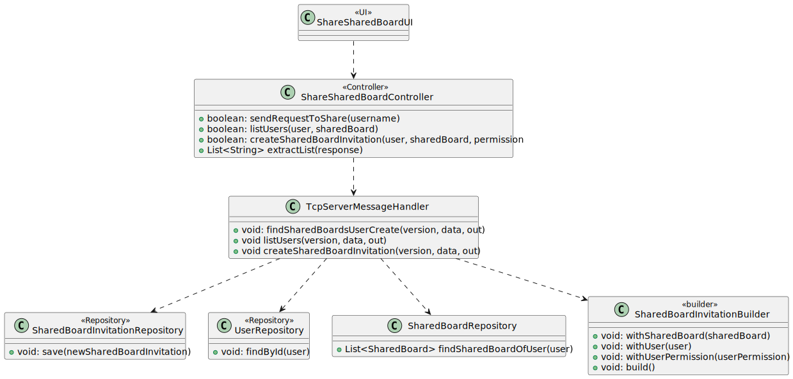
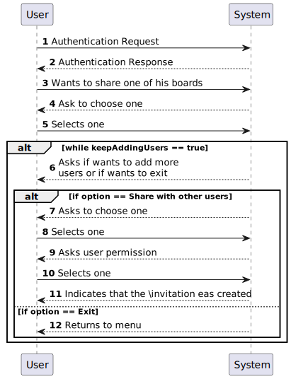
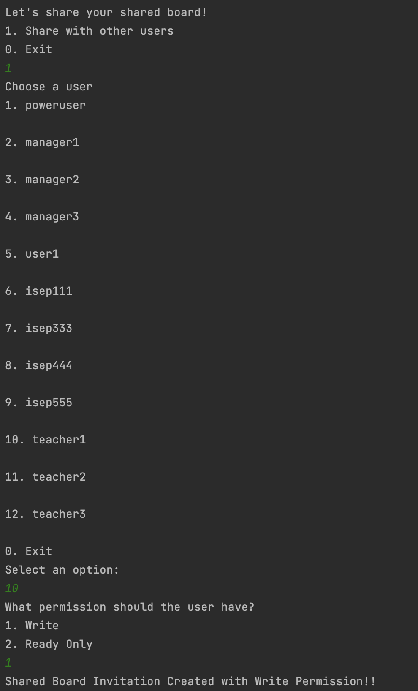
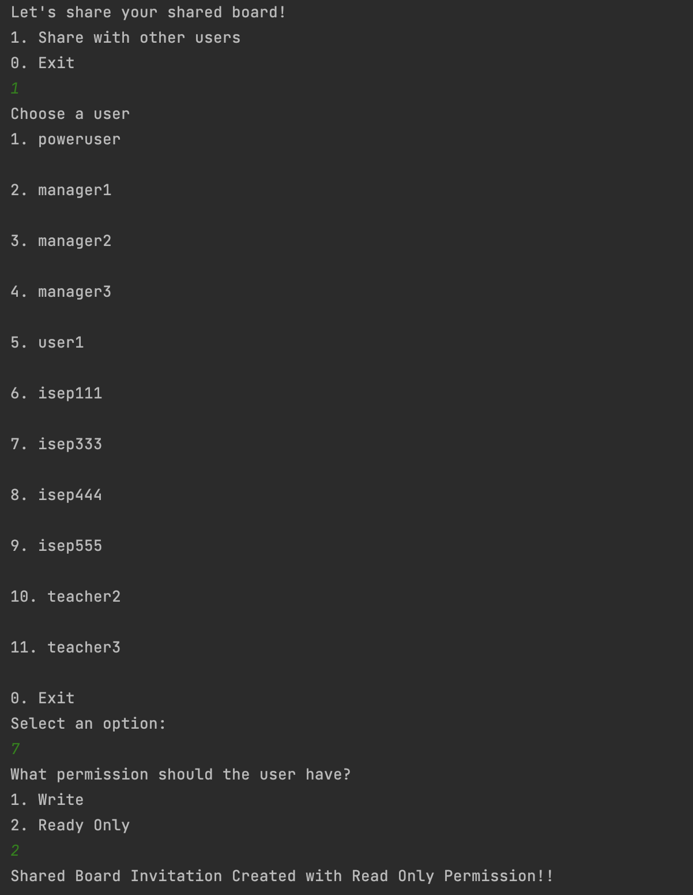
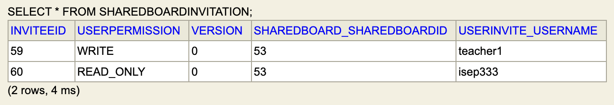
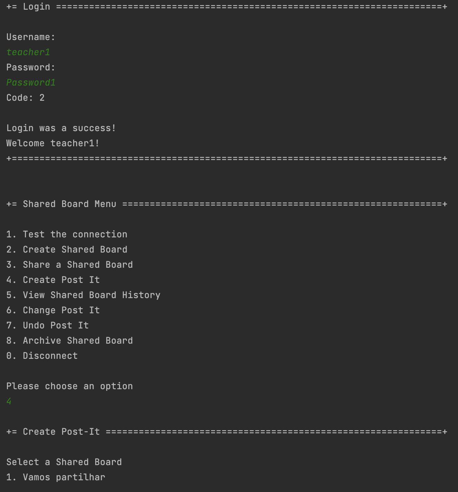
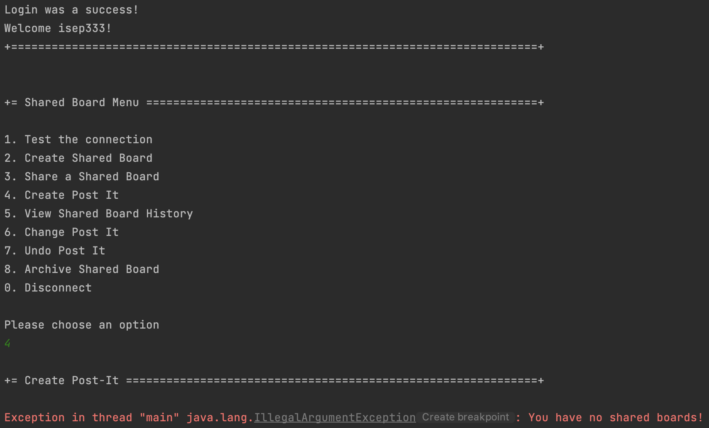
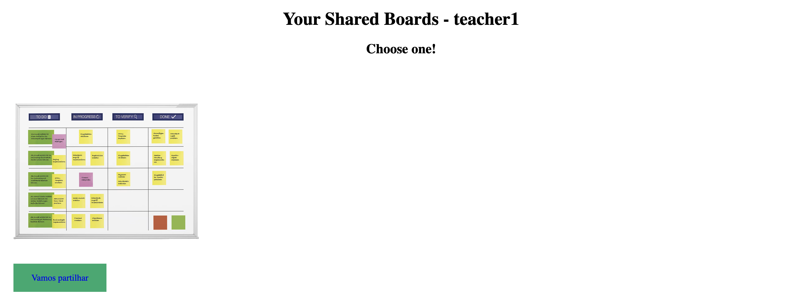
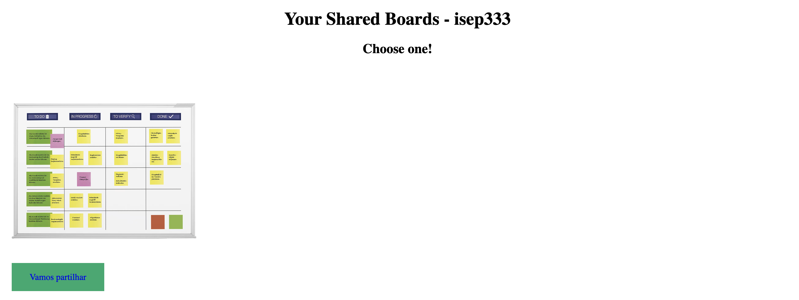
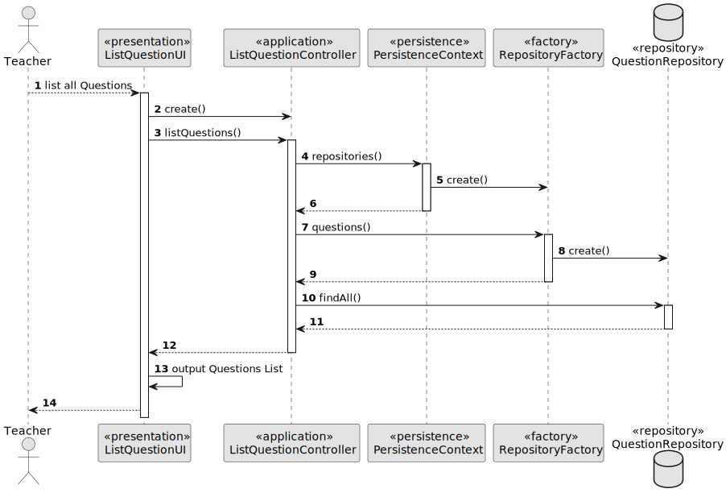

# US 3004 - As User, I want to share a board

## 1. Context

*Implement a functionality that allows any user to share his shared boards.*

## 2. Requirements

**US 3004 -** As User, I want to share a board

## 3. Analysis

*For the user to be able to share a shared board, initially he has to choose the one he wants to share. Next, he will see 
the list of system users, which no longer includes himself, and select a user. It assigns a type of permission, write or 
read only, and a shared board invitation is created, so the user selected already has access to the board. The previous action loops 
until the owner decides he doesn't want to invite anyone else. While selecting users, they no longer appear in the list of available users.*

## 4. Design

### 4.1. Realization

This US has been implemented in the shared board server and in the app. These two applications communicate with each other, that is, the app requests
information from the server and the latter, being the one with access to the database, returns the request. These requests are made through messages that include a code that characterizes each action.
- As indicated above, the owner needs access to the shared boards he created and which are open. Therefore, the app sends a message to the server with
  the code SHAREDBOARD_CREATE and the server, accessing the database, sends another message, this one with the code SEND_MESSAGE, which will return the desired list.
- A similar action happens with listing the users, but here the code that the app sends to the server becomes LIST_USERS.
- The last message sent by the app is to ask the server to create/save the shared board invitation in the database, using the SHARE_SHAREDBOARD code, if everything goes well, the app will receive an ACK, otherwise it will receive an ERR.

### 4.2. Diagrams

#### 4.2.1 Class Diagram - CD



#### 4.2.2. System Sequence Diagram - SSD



#### 4.2.3 Sequence Diagram - SD


- First the user makes a request to receive all the boards he created
- Next, you need access to all users to be able to share your board. The owner is removed from this list, and as you select the 
person you want to share with, you assign a permission and the selected person is removed from the list of available users. 
- For each user selected, a shared board invitation is created.

### 4.3. Applied Patterns

* Controller

### 4.4. Tests

**Test Get Code From String:** *The tests below are included in the Request Message Test class 
of tests and verifies that it transforms the string code well into what is associated with it.*
```
testCode = MessageCode.SHAREDBOARD_CREATE;
        result = 7;
        System.out.println("Código para " + testCode + ": " + result);
        byte expected7 = getCodeFromString(MessageCode.SHAREDBOARD_CREATE);
        Assert.assertEquals(result, expected7);
        
testCode = MessageCode.LIST_USERS;
        result = 10;
        System.out.println("Código para " + testCode + ": " + result);
        byte expected10 = getCodeFromString(MessageCode.LIST_USERS);
        Assert.assertEquals(result, expected10);
        
testCode = MessageCode.SHARE_SHAREDBOARD;
        result = 9;
        System.out.println("Código para " + testCode + ": " + result);
        byte expected9 = getCodeFromString(MessageCode.SHARE_SHAREDBOARD);
        Assert.assertEquals(result, expected9);
        
testCode = MessageCode.SEND_MESSAGE;
        result = 6;
        System.out.println("Código para " + testCode + ": " + result);
        byte expected6 = getCodeFromString(MessageCode.SEND_MESSAGE);
        Assert.assertEquals(result, expected6);
````

## 5. Implementation

**Shared Board App**
**UI:**

```
@Override
 protected boolean doShow() {
        try {
            List<String> sharedBoardList = theController.sendRequestToShare(SharedBoardClient.userName);

            chooseSharedBoard("Choose a Shared Board", sharedBoardList);

            if (SharedBoardClient.sharedBoard != null){
            boolean keepAddingUsers = true;
            while (keepAddingUsers) {
                Scanner scanner = new Scanner(System.in);

                System.out.println("Let's share your shared board!");
                System.out.println("1. Share with other users");
                System.out.println("0. Exit");

                final int option = scanner.nextInt();
                scanner.nextLine();
                switch (option) {
                    case 1:
                        List<String> userList = theController.listUsers(SharedBoardClient.userName, SharedBoardClient.sharedBoard);
                        chooseUser("Choose a user", userList);

                            System.out.println("What permission should the user have?");
                            System.out.println("1. Write");
                            System.out.println("2. Ready Only");

                            final int option1 = scanner.nextInt();

                            switch (option1) {
                                case 1:
                                    if(theController.createSharedBoardInvitation(SharedBoardClient.userNameInvited, SharedBoardClient.sharedBoard, String.valueOf(UserPermission.WRITE))){
                                        System.out.println("Shared Board Invitation Created with Write Permission!!");}
                                    break;

                                case 2:
                                    if(theController.createSharedBoardInvitation(SharedBoardClient.userNameInvited, SharedBoardClient.sharedBoard, String.valueOf(UserPermission.READ_ONLY))){
                                        System.out.println("Shared Board Invitation Created with Read Only Permission!!");}
                                    break;

                                default:
                                    System.out.println("Invalid Option!");
                                    break;
                            }
                            break;
                    case 0:
                        keepAddingUsers = false;
                        break;
                    default:
                        System.out.println("Invalid Option!");
                        break;
                }
            }
            }
        } catch (IOException e) {
            throw new RuntimeException(e);
        }
        return false;
    }

    /**
     * This method shows to the user all the shared boards that he created
     * @param message
     * @param sharedBoardList
     */
    public String chooseSharedBoard(String message, List<String> sharedBoardList) {
        List<String> options = new ArrayList<>();
        for (String sharedBoard : sharedBoardList) {
            options.add(sharedBoard);
        }

        final SelectWidget<String> selector = new SelectWidget<>(message, options);
        selector.show();
        int selectedIndex = selector.selectedOption();

        if (selectedIndex == 0) {
            return null;
        } else if (selectedIndex > 0 && selectedIndex <= sharedBoardList.size()) {
            String sharedBoardName = sharedBoardList.get(selectedIndex - 1);
            SharedBoardClient.sharedBoard = sharedBoardName;
            return sharedBoardName;
        } else {
            System.out.println("Invalid Option!");
            return null;
        }
    }

    /**
     * This method shows to the user all the available users to invite and asks to select one
     * @param message
     * @param userList
     */
    protected String chooseUser(String message, List<String> userList) {
        final SelectWidget<String> selector = new SelectWidget<>(message, userList);
        selector.show();
        int selectedIndex = selector.selectedOption();

        if(selectedIndex == 0){
            return null;
        }
        else if (selectedIndex > 0 && selectedIndex <= userList.size()) {
            String userNameInvited = userList.get(selectedIndex - 1);
            SharedBoardClient.userNameInvited = userNameInvited;
            return userNameInvited;
        } else {
            System.out.println("Invalid Option!");
            return null;
        }
    }
````


**Controller:** In this class, this is where the "communication" between the shred board server and the shared board app takes place. 
In order for us to share the shared board, we have to ask the server for some information. For each piece of information we ask for, 
there is an associated code that goes into the handling, as well as the data needed to obtain the expected results. As the server is the only one that has access to the database, the app "asks" and the server returns it.
- Initially, we need to obtain a list of the shared boards that we have created, in order to be able to select the one we want to share (action associated with the SHAREDBOARD_CREATE code);
- The user selects the desired one and now needs to view all the system users to choose from (action associated with the LIST_USERS code). The list you see no longer includes yourself! 
This action is in a loop until the owner decides he doesn't want to share with anyone else. As he selects people, the list he sees later no longer includes already selected users.
- When selecting the user to share, the owner is asked what permission this user should have, write or read only. Depending on the selection, a shared board invitation is created, which includes the shared board,
the user and the permission assigned to it (action associated with the SHARE_SHAREDBOARD code).

```
public List<String> sendRequestToShare (String user) throws IOException {
        String data = String.format("%s", user);

        RequestMessage request = new RequestMessage(version, MessageCode.SHAREDBOARD_CREATED, data);
        byte[] messageBytes = request.getBytes();
        SharedBoardClient.sOut.writeInt(messageBytes.length);
        sOut.write(messageBytes);

        // Receive the server response
        int responseLength = sIn.readInt();
        byte[] responseBytes = sIn.readNBytes(responseLength);
        RequestMessage response = new RequestMessage(responseBytes);

        if(response.code() == 6){
            List<String> sharedBoardList = extractList(response);
            return sharedBoardList;
        }
        else if (response.code() == 3){
            throw new IllegalArgumentException(Convert.convertBytesToString(response.data()));
        }
        return null;
    }

    public List<String> listUsers (String user, String sharedBoard) throws IOException {
        String data = String.format("%s;%s", user, sharedBoard);

        RequestMessage request = new RequestMessage(version, MessageCode.LIST_USERS, data);
        byte[] messageBytes = request.getBytes();
        SharedBoardClient.sOut.writeInt(messageBytes.length);
        sOut.write(messageBytes);

        // Receive the server response
        int responseLength = sIn.readInt();
        byte[] responseBytes = sIn.readNBytes(responseLength);
        RequestMessage response = new RequestMessage(responseBytes);

        if(response.code() == 6){
            List<String> usersList = extractList(response);
            return usersList;
        }
        else if (response.code() == 3){
            throw new IllegalArgumentException(Convert.convertBytesToString(response.data()));
        }
        return null;
    }


    public boolean createSharedBoardInvitation(String user, String sharedBoard, String permission) throws IOException{
        String data = String.format("%s;%s;%s", user, sharedBoard, permission);

        RequestMessage request = new RequestMessage(version, MessageCode.SHARE_SHAREDBOARD, data);
        byte[] messageBytes = request.getBytes();
        SharedBoardClient.sOut.writeInt(messageBytes.length);
        sOut.write(messageBytes);

        // Receive the server response
        int responseLength = sIn.readInt();
        byte[] responseBytes = sIn.readNBytes(responseLength);
        RequestMessage response = new RequestMessage(responseBytes);

        if(response.code() == 2){
            return true;
        }
        else if(response.code() == 3){
            throw new IllegalArgumentException(Convert.convertBytesToString(response.data()));
        }
        return false;
    }


    public List<String> extractList(RequestMessage response) {
        byte[] dataBytes = response.data();

        List<String> listToString = List.of(Convert.convertBytesToString(dataBytes).split("\n"));
        return listToString;
    }

````

**Shared Board Server**
**Tcp Message Handler:** *On the server side is where there is a connection to the database. Here, depending on the information
requested by the app (identified by the code), a different action will be performed. The message that is sent back to the app
must always be a String, so whenever necessary, we have to transform the result obtained into a string, on the app's side,
everything is untransformed again to a list, or to the desired format.*

```
/**
* Sends to the user the list of shared boards he create
*
* @param version
* @param data
* @param out
* @throws IOException
*/
private void findSharedBoardsUserCreate(byte version, String data, DataOutputStream out) throws IOException {
    if (data != null) {
        SystemUser user = userRepository.findById(Username.valueOf(data));
        if (user == null) {
            String error = String.format("Owner not found!");
            sendErrorResponse(version, error, out);
        } else {
            List<SharedBoard> availableSharedBoards = (List<SharedBoard>) sharedBoardRepository.findSharedBoardOfUser(user);

                if (!availableSharedBoards.isEmpty()) {
                    String sharedBoards = "";
                    for (SharedBoard list : availableSharedBoards) {
                        sharedBoards += list.title() + "\n";
                    }
                    sendMessage(version, out, sharedBoards);
                } 
                else sendErrorResponse(version, "You have no shared boards!", out);
                }
    } else {
        sendErrorResponse(version, "Null data", out);
    }
}

    /**
     * Sends to the user the list of available users to share his shared board with
     *
     * @param version
     * @param data
     * @param out
     * @throws IOException
     */
    private void listUsers(byte version, String data, DataOutputStream out) throws IOException {
        String[] info = data.split(";");
        if (info[0] != null && info[1] != null) {
            SystemUser user = userRepository.findById(Username.valueOf(info[0]));
            if (user == null) {
                sendErrorResponse(version, "Owner not found!", out);
            }

            List<SystemUser> allUsers = userRepository.findAll();
            allUsers.remove(user);

            SharedBoard sharedBoard = sharedBoardRepository.findSharedBoard(info[1]);

            Iterable<SharedBoardInvitation> list = sharedBoardInvitationRepository.findSharedBoardInvitationsOfSharedBoard(sharedBoard);

            for (SharedBoardInvitation sharedBoardInvitation : list) {
                allUsers.remove(sharedBoardInvitation.userInvite());
            }

            if (!allUsers.isEmpty()) {
                String users = "";
                for (SystemUser listUsers : allUsers) {
                    users += listUsers.username() + "\n";
                }
                sendMessage(version, out, users);
            }

        } else {
            sendErrorResponse(version, "Data Null", out);
        }
    }

    /**
     * Creates the shared board invitation and saves it in the repository
     *
     * @param version
     * @param data
     * @param out
     * @throws IOException
     */
    private void createSharedBoardInvitation(byte version, String data, DataOutputStream out) throws IOException {
        String[] info = data.split(";");
        if (info[0] != null && info[1] != null) {
            SystemUser user = userRepository.findById(Username.valueOf(info[0]));
            if (user == null) {
                sendErrorResponse(version, "Owner not found!", out);
            }
            SharedBoard sharedBoard = sharedBoardRepository.findSharedBoard(info[1]);
            UserPermission userPermission = UserPermission.valueOf(info[2]);

            SharedBoardInvitation sharedBoardInvitation = new SharedBoardInvitationBuilder()
                    .withSharedBoard(sharedBoard)
                    .withUser(user)
                    .withUserPermission(userPermission)
                    .build();

            sharedBoardInvitationRepository.save(sharedBoardInvitation);

            if (!sharedBoardInvitation.equals(null)) {
                System.out.println("Shared Board Invitation Created!!");
                sendSuccessResponse(version, out);
            } else {
                sendErrorResponse(version, "Could not create the shared board invitation!", out);
            }

        } else {
            sendErrorResponse(version, "Data Null", out);
        }
    }
````

**Shared Board Repository:** *The query below returns all shared boards that the user created and that are open, that is, shared boards that he has not yet archived.*
```
public Iterable<SharedBoard> findSharedBoardOfUser(SystemUser user){
        final TypedQuery<SharedBoard> query = entityManager().createQuery(
                "SELECT sharedBoard FROM SharedBoard sharedBoard " +
                        "WHERE sharedBoard.owner =: user AND sharedBoard.status =: status",
                SharedBoard.class);
        query.setParameter("user", user);
        query.setParameter("status", SharedBoardStatus.OPEN);

        return query.getResultList();
    }
````

**Shared Board Invitation Repository:** *The query below returns all existing invites associated with the desired board.*
```
public Iterable<SharedBoardInvitation> findSharedBoardInvitationsOfSharedBoard(SharedBoard theSharedBoard){
        final TypedQuery<SharedBoardInvitation> query = entityManager().createQuery(
                "SELECT sharedBoardInvitation FROM SharedBoardInvitation sharedBoardInvitation " +
                        "WHERE sharedBoardInvitation.sharedBoard =: theSharedBoard"
                , SharedBoardInvitation.class);
        query.setParameter("theSharedBoard", theSharedBoard);

        return query.getResultList();
    }
````

## 6. Integration/Demonstration
**Owner choose a shared board to share** </br>


**Owner choose a user and gives him a write permission**
- Note that the owner, isep222, is not on this list </br>


**Owner choose another user and gives him a read only permission** 
- Note that the user chosen before is no longer on the list (teacher1) </br>


**In here we can see the shared board invitation created, with the right permission** </br>


**Teacher1 can create post-it in the shared board that was shared with him, because he has a write permission** </br>


**isep333 can't create post-it in the shared board that was shared with him, because he has a read only permission, he does not have access to that board** </br>


**However, as we can see below, both can see the board** </br>



## 7. Observations

*Access to the repository is always done in the same way.
For this reason, an example sequence diagram has been created to demonstrate this. To exemplify, we list all existing questions in the repository of questions.*



*Like the repositories, the authentication part always follows the same order of ideas.
In this way, we perform a general SD that demonstrates the entire process. In the diagram, US 1008 is taken as an example,
as a Student, I want to request my enrollment in a course.*


