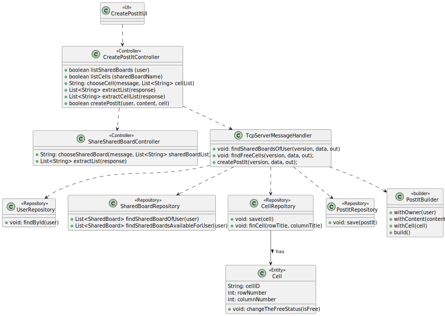
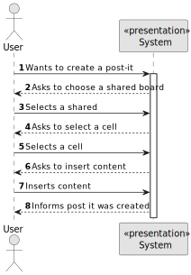
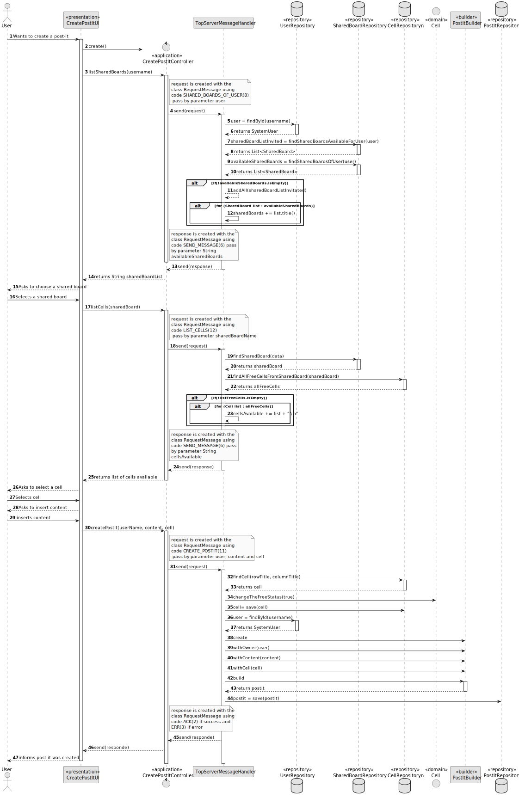

# US 3006 - As User, I want to create a post-it on a board

## 1. Context

Implement a functionality for a user to create a post-it on a board.

## 2. Requirements

US 3006 - As User, I want to create a post-it on a board

This US has some specific acceptance criterias related to SCOMP:
- This functional part of the system has very specific technical requirements, particularly some concerns about synchronization problems.
In fact, several clients will try to concurrently update boards.
As such, the solution design and implementation must be based on threads, condition variables and mutexes. Specific requirements will be provided in SCOMP.

## 3. Analysis

Regarding the business logic, every user that has write permission on the board
can create a post-it on that board

## 4. Design

### 4.1. Realization

This US was done on two different ways, in the normal menus, following EAPLI procedures, and in the shared board app,
following RCOMP/SCOMP procedures:
- EAPLI: The system accesses the SharedBoardInvitation repository to check which boards the user can view updates of, which, as said previously, is any board
in which he has any type of permission. The user then selects a board and the systme displays the history of updates.
- RCOMP/SCOMP: This US was implemented in the shared board app, with a different approach, regarding the necessities. 

#### 4.2.1. Class Diagram - CD



#### 4.2.2. System Sequence Diagram - SSD



#### 4.2.3. Sequence Diagram - SD



The key concepts behind this SD is the relation between the client, UI and Controller, and the Server, which is done trough codes.
The first step to create a post it is to list the shared boards available for the user. The controller must "connect" to the server
to do so. Then, the system must check which cells are free, which is also done through the server, and at last,
the system must ask the user the post it content and then connect to the server to create it and save on the repository.

### 4.4. Applied Patterns

* Controller

### 4.5. Tests

*It wasn't done any tests to repositories methods, only for the domain level, because of not
being required at this stage to do so.*

## 5. Implementation

**CreatePostItUI:**
```` java
private static final CreatePostItController theController = new CreatePostItController();

    @Override
    protected boolean doShow() {
        try {
            theController.listSharedBoards(SharedBoardClient.userName);
            if (SharedBoardClient.sharedBoard != null) {
                boolean b;
                b = theController.sendSharedBoard(SharedBoardClient.sharedBoard);
                if(b){return false;}

                System.out.println("To add a post-it insert:");

                String content = Console.readNonEmptyLine("Content: ", "You must put content!");
                while (content.length() <= 1 || content.length() > 500) {
                    System.out.println("Content must have characters but less than 500!");
                    content = Console.readNonEmptyLine("Content: ", "You must put content!");
                }

                try {
                    theController.createPostIt(SharedBoardClient.userName, content, SharedBoardClient.cell);
                } catch (IOException e) {
                    throw new RuntimeException(e);
                }
            }
        } catch (IOException e) {
            throw new RuntimeException(e);
        }

        return false;
    }
````

**CreatePostItControllerUI:**
```` java
    public boolean listSharedBoards(String user) throws IOException {
        String data = String.format("%s", user);

        RequestMessage request = new RequestMessage(version, MessageCode.SHAREDBOARDS_CREATE_INVITE, data);
        byte[] messageBytes = request.getBytes();
        SharedBoardClient.sOut.writeInt(messageBytes.length);
        sOut.write(messageBytes);

        // Receive the server response
        int responseLength = sIn.readInt();
        byte[] responseBytes = sIn.readNBytes(responseLength);
        RequestMessage response = new RequestMessage(responseBytes);

        if(response.code() == 6){
            List<String> sharedBoardList = shareSharedBoardController.extractList(response);
            shareSharedBoardController.chooseSharedBoard("Choose a Shared Board", sharedBoardList);
        }
        else if (response.code() == 3){
            throw new IllegalArgumentException(Convert.convertBytesToString(response.data()));
        }
        return false;
    }


    public boolean sendSharedBoard (String sharedBoardName) throws IOException {
        String data = String.format("%s", sharedBoardName);

        RequestMessage request = new RequestMessage(version, MessageCode.LIST_CELLS, data);
        byte[] messageBytes = request.getBytes();
        SharedBoardClient.sOut.writeInt(messageBytes.length);
        sOut.write(messageBytes);

        // Receive the server response
        int responseLength = sIn.readInt();
        byte[] responseBytes = sIn.readNBytes(responseLength);
        RequestMessage response = new RequestMessage(responseBytes);

        if(response.code() == 6){
            List<String> cellList = extractCellList(response);
            String c= chooseCell("Select a free Cell", cellList);
            if(c==null){return true;}
        }
        else if (response.code() == 3){
            throw new IllegalArgumentException(Convert.convertBytesToString(response.data()));
        }
        return false;
    }

    private String chooseCell(String message, List<String> cellList) {

        final SelectWidget<String> selector = new SelectWidget<>(message, cellList);
        selector.show();
        int selectedIndex = selector.selectedOption();

        if (selectedIndex == 0) {
            return null;
        } else if (selectedIndex > 0 && selectedIndex <= cellList.size()) {
            String cell = cellList.get(selectedIndex -1);
            SharedBoardClient.cell = cell;
            return cell;
        } else {
            System.out.println("Invalid Option!");
            return null;
        }
    }

    private List<String> extractCellList(RequestMessage response) {
        byte[] dataBytes = response.data();

        List<String> cellListString = List.of(Convert.convertBytesToString(dataBytes).split("\n"));
        return cellListString;
    }

    public boolean createPostIt(String user, String content, String cell) throws IOException{
        String data = String.format("%s;%s;%s", user, content, cell);

        RequestMessage request = new RequestMessage(version, MessageCode.CREATE_POSTIT, data);

        byte[] messageBytes = request.getBytes();
        SharedBoardClient.sOut.writeInt(messageBytes.length);
        sOut.write(messageBytes);

        // Receive the server response
        int responseLength = sIn.readInt();
        byte[] responseBytes = sIn.readNBytes(responseLength);
        RequestMessage response = new RequestMessage(responseBytes);

        if(response.code() == 2){
            System.out.println("Post-It Created!");
            return true;
        }
        else if (response.code() == 3){
            throw new IllegalArgumentException(Convert.convertBytesToString(response.data()));
        }
        return false;
    }
````

**TcpServerMessageHandler:**

```` java
/**
     * Sends to the user the list of shared boards available to him
     * Shared boards that he create and shared boards he was invite to
     *
     * @param version
     * @param data
     * @param out
     * @throws IOException
     */
    private void findSharedBoardsOfUser(byte version, String data, DataOutputStream out) throws IOException {
        if (data != null) {
            SystemUser user = userRepository.findById(Username.valueOf(data));
            if (user == null) {
                String error = String.format("Owner not found!");
                sendErrorResponse(version, error, out);
            } else {
                List<SharedBoard> sharedBoardListInvited = (List<SharedBoard>) sharedBoardInvitationRepository.findSharedBoardsAvailableForUser(user);
                List<SharedBoard> availableSharedBoards = (List<SharedBoard>) sharedBoardRepository.findSharedBoardOfUser(user);

                availableSharedBoards.addAll(sharedBoardListInvited);

                if (!availableSharedBoards.isEmpty()) {
                    String sharedBoards = "";
                    for (SharedBoard list : availableSharedBoards) {
                        sharedBoards += list.title() + "\n";
                    }
                    sendMessage(version, out, sharedBoards);
                } else sendErrorResponse(version, "You have no shared boards!", out);
            }
        } else {
            sendErrorResponse(version, "Null data", out);
        }
    }
    
     /**
     * Sends to the user the cells that don´t have any post it yet
     *
     * @param version
     * @param data
     * @param out
     * @throws IOException
     */
    private void findFreeCells(byte version, String data, DataOutputStream out) throws IOException {
        if (data != null) {
            SharedBoard sharedBoard = sharedBoardRepository.findSharedBoard(data);
            if (sharedBoard == null) {
                sendErrorResponse(version, "Shared board not found!", out);
            } else {
                List<Cell> allFreeCells = (List<Cell>) cellRepository.findAllFreeCellsFromSharedBoard(sharedBoard);
                if (allFreeCells != null) {
                    String cellsAvailable = "";
                    for (Cell list : allFreeCells) {
                        cellsAvailable += list + "\n";
                    }
                    sendMessage(version, out, cellsAvailable);

                } else {
                    sendErrorResponse(version, "There are no free cells!", out);
                }
            }
        } else {
            sendErrorResponse(version, "Null data Shared Board", out);
        }
    }
    
    private void createPostIt(byte version, String data, DataOutputStream out) throws IOException {
        String[] info = data.split(";");

        if (info[0] != null && info[1] != null && info[2] != null) {

            String content = info[1];
            String splitCell = info[2];
            String[] lala = splitCell.split(",");

            String rowTitle = lala[0];
            String columAndId = lala[1];

            String[] cellPos = columAndId.split("=>");
            String columTitle = cellPos[0];
            String cellId = cellPos[1];

            int c = Integer.parseInt(cellId);

            PostIt postIt = null;
            SharedBoardServer.addToLock(c);

            Map.Entry entry = SharedBoardServer.findEntry(c);
            synchronized (entry) {
                if (SharedBoardServer.lock.get(c).equals("Unlocked")) {

                    Cell cell = cellRepository.findCell(rowTitle, columTitle);

                    cell.changeTheFreeStatus(false);
                    cell = cellRepository.save(cell);
                    SystemUser user = userRepository.findById(Username.valueOf(info[0]));
                    if (user == null) {
                        sendErrorResponse(version, "Owner not found!", out);
                    }
                    postIt = new PostItBuilder()
                            .withOwner(user)
                            .withContent(content)
                            .withCell(cell)
                            .build();

                    postIt = postItRepository.save(postIt);


                } else {
                    System.out.println("That cell is currently occupied.");
                }

                if (postIt != null) {
                    System.out.println("Post-It Created!!");
                    sendSuccessResponse(version, out);
                } else {
                    sendErrorResponse(version, "Could not create the post-it!", out);
                }

                SharedBoardServer.lock.replace(c, "Locked");
            }
        } else {
            sendErrorResponse(version, "Data Null", out);
        }

    }
````

## 6. Integration/Demonstration

This demonstration below shows how this US is run by the client, if there is any shared board, which has cells
available to create post it's for.


## 7. Observations

*It is important to note that the diagrams did not represent the implementation of SCOMP, that is, all "locks" made and "synchronized" were ignored. 
However, they exist for program synchronization to work and for two users can successfully access the application simultaneously.*

*Access to the repository is always done in the same way.
For this reason, an example sequence diagram has been created to demonstrate this.
To exemplify, we list all existing questions in the repository of questions.*


*Like the repositories, the authentication part always follows the same order of ideas.
In this way, we perform a general SD that demonstrates the entire process. In the diagram, US 1008 is taken as an example,
as a Student, I want to request my enrollment in a course.*

