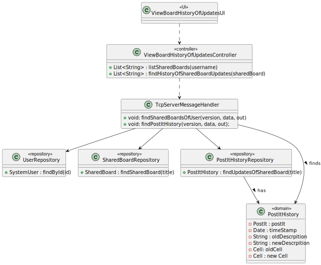
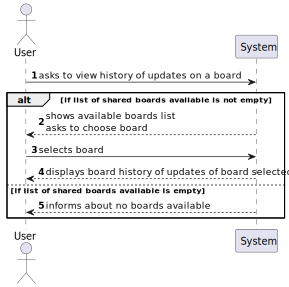
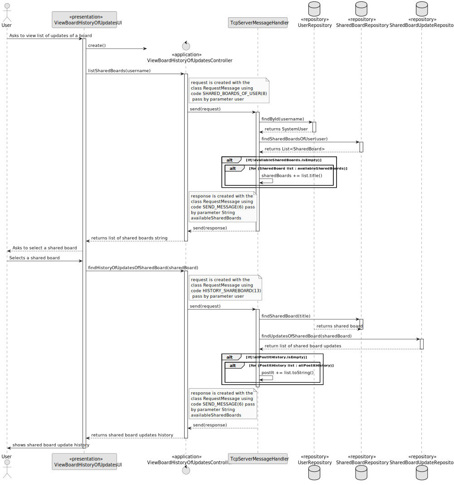

# US 3009 - As User, I want to view the history of updates on a board

## 1. Context

Implement a functionality for a user to view the history of updates on a board.

## 2. Requirements

US 3009 - As User, I want to view the history of updates on a board

This US has some specific acceptance criterias related to SCOMP:
- This functional part of the system has very specific technical requirements, particularly some concerns about synchronization problems.
In fact, several clients will try to concurrently update boards.
As such, the solution design and implementation must be based on threads, condition variables and mutexes. Specific requirements will be provided in SCOMP.

## 3. Analysis

Regarding the business logic, every user that has acess to the board, either write or read-only,
can view the list of updates of the board, which are every updates on each post it of the board.

## 4. Design

### 4.1. Realization

This US was done on two different ways, in the normal menus, following EAPLI procedures, which was not a must-do,
and in the shared board app, following RCOMP/SCOMP procedures:
- EAPLI: The system accesses the SharedBoardInvitation repository to check which boards the user can view updates of, which, as said previously, is any board
in which he has any type of permission. The user then selects a board and the systme displays the history of updates.
- RCOMP/SCOMP: This US was implemented in the shared board app, with a similar approach, but using the client-server communication. 

#### 4.2.1. Class Diagram - CD



#### 4.2.2. System Sequence Diagram - SSD



#### 4.2.3. Sequence Diagram - SD



The key concepts behind this SD is the relation between the client, UI and Controller, and the Server, which is done trough codes.
The first step is to list the shared board. The controller must "connect" to the server, which then acesses the repository to do so.
Then, the user selects a shared board and the system, once again through the server, acesses the post it history repository and
returns the list of updates on the shared board.

### 4.4. Applied Patterns

* Controller

### 4.5. Tests

*It wasn't done any tests to repositories methods, only for the domain level, because of not
being required at this stage to do so.*

## 5. Implementation

**ViewBoardHistoryOfUpdatesUI:**
```` java
    private static final ViewBoardHistoryOfUpdatesController controller = new ViewBoardHistoryOfUpdatesController();

    @Override
    public String headline() {
        return "View History of Updates of a Board";
    }

    @Override
    protected boolean doShow() {
        try {
            List<String> sharedBoardList = controller.listSharedBoards(SharedBoardClient.userName);

            chooseSharedBoard("Select a shared board:", sharedBoardList);

            List<String> data = controller.findHistoryOfUpdatesOfSharedBoard(SharedBoardClient.sharedBoard);
            System.out.printf("Shared Board History: %n");
            for (int i = 0; i < data.size(); i++) {
                System.out.println(data.get(i));
            }

        } catch (IOException e) {
            throw new RuntimeException(e);
        }

        return false;
    }

    public String chooseSharedBoard(String message, List<String> sharedBoardList) {
        List<String> options = new ArrayList<>();
        for (String sharedBoard : sharedBoardList) {
            options.add(sharedBoard);
        }

        final SelectWidget<String> selector = new SelectWidget<>(message, options);
        selector.show();
        int selectedIndex = selector.selectedOption();

        if (selectedIndex == 0) {
            return null;
        } else if (selectedIndex > 0 && selectedIndex <= sharedBoardList.size()) {
            String sharedBoardName = sharedBoardList.get(selectedIndex - 1);
            SharedBoardClient.sharedBoard = sharedBoardName;
            return sharedBoardName;
        } else {
            System.out.println("Invalid Option!");
            return null;
        }
    }
````

**ViewBoardHistoryOfUpdatesController:**
```` java
    ShareSharedBoardController shareSharedBoardController = new ShareSharedBoardController();

    byte version = 1;

    public List<String> listSharedBoards(String user) throws IOException {
        String data = String.format("%s", user);

        RequestMessage request = new RequestMessage(version, MessageCode.SHARED_BOARDS_OF_USER, data);
        byte[] messageBytes = request.getBytes();
        SharedBoardClient.sOut.writeInt(messageBytes.length);
        sOut.write(messageBytes);

        // Receive the server response
        int responseLength = sIn.readInt();
        byte[] responseBytes = sIn.readNBytes(responseLength);
        RequestMessage response = new RequestMessage(responseBytes);

        if(response.code() == 6){
            return shareSharedBoardController.extractList(response);
        }
        else if (response.code() == 3){
            throw new IllegalArgumentException(Convert.convertBytesToString(response.data()));
        }
        return null;
    }

    public List<String> findHistoryOfUpdatesOfSharedBoard (String sharedBoardName) throws IOException {
        String data = String.format("%s", sharedBoardName);

        RequestMessage request = new RequestMessage(version, MessageCode.HISTORY_SHAREBOARD, data);
        byte[] messageBytes = request.getBytes();
        SharedBoardClient.sOut.writeInt(messageBytes.length);
        sOut.write(messageBytes);

        // Receive the server response
        int responseLength = sIn.readInt();
        byte[] responseBytes = sIn.readNBytes(responseLength);
        RequestMessage response = new RequestMessage(responseBytes);

        if(response.code() == 6){
            return extractHistoryList(response);
        }
        else if (response.code() == 3){
            throw new IllegalArgumentException(Convert.convertBytesToString(response.data()));
        }
        return null;
    }

    protected List<String> extractHistoryList(RequestMessage response) {
        byte[] dataBytes = response.data();

        List<String> sharedBoardUpdateHistoryString = List.of(Convert.convertBytesToString(dataBytes).split("\n"));
        return sharedBoardUpdateHistoryString;
    }
````

**TcpServerMessageHandler:**
```` java
    private void findSharedBoardsOfUser(byte version, String data, DataOutputStream out) throws IOException {
        if (data != null) {
            SystemUser user = userRepository.findById(Username.valueOf(data));
            if (user == null) {
                String error = String.format("Owner not found!");
                sendErrorResponse(version, error, out);
            } else {
                List<SharedBoard> sharedBoardListInvited = (List<SharedBoard>) sharedBoardInvitationRepository.findSharedBoardsAvailableForUser(user);
                List<SharedBoard> availableSharedBoards = (List<SharedBoard>) sharedBoardRepository.findSharedBoardOfUser(user);

                availableSharedBoards.addAll(sharedBoardListInvited);

                if (!availableSharedBoards.isEmpty()) {
                    String sharedBoards = "";
                    for (SharedBoard list : availableSharedBoards) {
                        sharedBoards += list.title() + "\n";
                    }
                    sendMessage(version, out, sharedBoards);
                } else sendErrorResponse(version, "You have no shared boards!", out);
            }
        } else {
            sendErrorResponse(version, "Null data", out);
        }
    }
    
    private void findPostItHistory(byte version, String data, DataOutputStream out) throws IOException {
        if (data != null) {
            SharedBoard sharedBoard = sharedBoardRepository.findSharedBoard(data);
            if (sharedBoard == null) {
                sendErrorResponse(version, "Shared board not found!", out);
            } else {
                List<PostItHistory> allPostItHistory = (List<PostItHistory>) postItHistoryRepository.findUpdatesOfSharedBoard(sharedBoard);
                if (allPostItHistory != null) {
                    String postIt = "";
                    for (PostItHistory list : allPostItHistory) {
                        postIt += list.toString() + "\n";
                    }
                    sendMessage(version, out, postIt);

                } else sendErrorResponse(version, "There are no postIt history!", out);
            }
        } else {
            sendErrorResponse(version, "Null data Shared Board", out);
        }
    }
````

## 6. Integration/Demonstration

The execution of this US follows the steps shown below:


## 7. Observations

*Access to the repository is always done in the same way.
For this reason, an example sequence diagram has been created to demonstrate this.
To exemplify, we list all existing questions in the repository of questions.*


*Like the repositories, the authentication part always follows the same order of ideas.
In this way, we perform a general SD that demonstrates the entire process. In the diagram, US 1008 is taken as an example,
as a Student, I want to request my enrollment in a course.*

