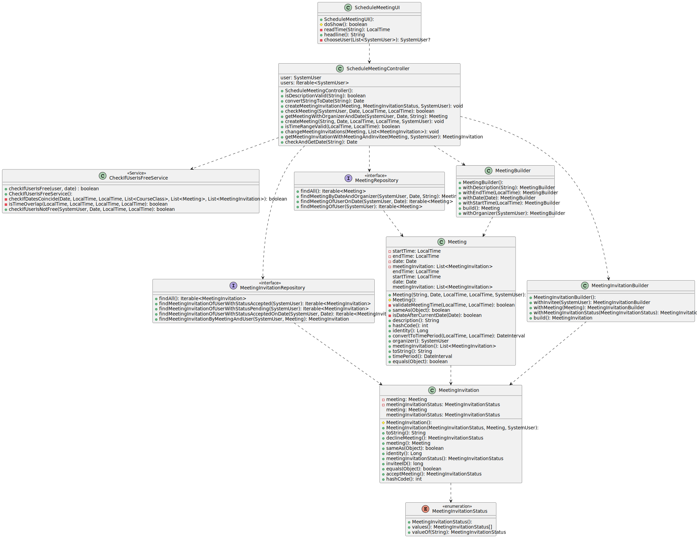
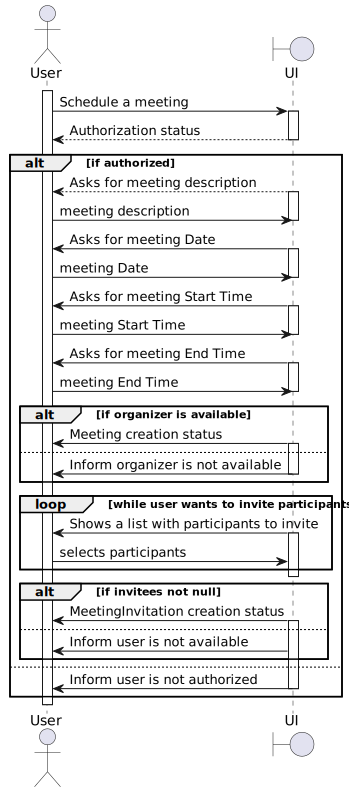
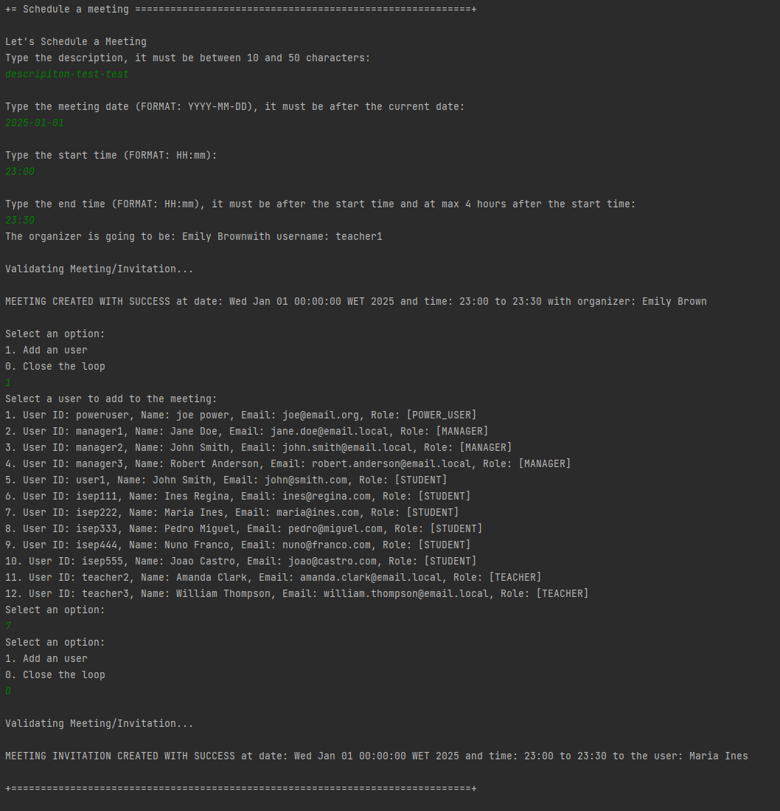
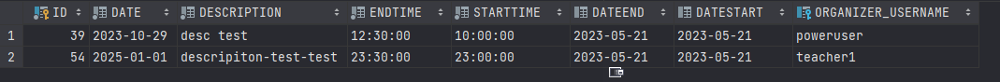
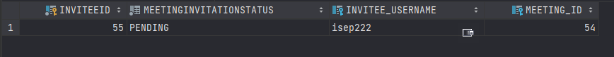

# US 4001 - As User, I want to schedule a meeting

## 1. Context

Implement a functionality for any user to schedule a meeting.

## 2. Requirements

This US description is "As User, I want to schedule a meeting.".
I need to have users created.

## 3. Analysis

To implement this US, we need to have any user logged in.
After that we need to ask him to input all necessary meeting information including date, time, description, etc..
We need to check if the organizer is free to schedule the meeting.
If so then he can invite other users to the meeting.
We need to check if the invited users are free to attend the meeting.

NOTES:
- The system has to validate all the classes and all the meetings any User has, and because of that it might take a while check.

## 4. Design

### 4.1. Realization

This US consists of some steps, first we need to add a description, then add a date and time.
The system will validate those dates and times and check if the user is free to schedule the meeting.
If the user is free then the Meeting will be created and the user will be the organizer, but without any invited users.
Then the user will be able to invite other users to the meeting.
The system will check if the invited users are free to attend the meeting.
If they are free then they will be added to the meeting.
If they are not free then the system will not add them to the meeting.

### 4.2. Diagrams

#### 4.2.1. Class Diagram - CD



#### 4.2.2. System Sequence Diagram - SSD



#### 4.2.3. Sequence Diagram - SD


### 4.3. Applied Patterns

Controller, Service and Builder.

### 4.4. Tests

**Utils:** *These were the variables used to create a meeting.*

```
final SystemUserBuilder userBuilder = UserBuilderHelper.builder();

    final SystemUser organizer = userBuilder
            .withUsername("Organizer")
            .withEmail("Organizer@email.com")
            .withPassword("Password1")
            .withName("OrganizertFstName", "OrganizertLstName")
            .withRoles(BaseRoles.STUDENT)
            .build();

    LocalDate today = LocalDate.now();
    LocalDate dateIn3Day = today.plusDays(3);
    Date date = Date.from(dateIn3Day.atStartOfDay().toInstant(java.time.ZoneOffset.UTC));

    Date dateNow = Date.from(today.atStartOfDay().toInstant(java.time.ZoneOffset.UTC));

    LocalTime now = LocalTime.now();
    LocalTime after = now.plusHours(1);

    LocalTime TenHours = LocalTime.of(10,0);
    LocalTime ElevenHours = LocalTime.of(11,0);
```

**Test 1:** *Ensures we can't create a meeting with invalid Time*

```
@org.junit.jupiter.api.Test
    void ensureCantCreateMeetingWithStartTimeAfterEndTime() {
        assertThrows(IllegalArgumentException.class, () -> new Meeting("description",date,after,now,organizer));
    }
````

**Test 2:** *Ensures we can't create a course a meeting before today*

```
@org.junit.jupiter.api.Test
    void ensureCantCreateMeetingWithDateBeforeToday() {
        LocalDate yesterday = today.minusDays(1);
        Date date = Date.from(yesterday.atStartOfDay().toInstant(java.time.ZoneOffset.UTC));
        assertThrows(IllegalArgumentException.class, () -> new Meeting("description",date,now,after,organizer));
    }
````

**Test 3:** *Ensures we can't create a meeting with equal time and date*

```
@org.junit.jupiter.api.Test
    void ensureCantCreateMeetingWithDateEqualsToday() {
        assertThrows(IllegalArgumentException.class, () -> new Meeting("description",dateNow,now,after,organizer));
    }
````

**Other tests:** *Ensure other attributes can't be null.*
```
@org.junit.jupiter.api.Test
    void ensureCantCreateMeetingWithNullDescription() {
        assertThrows(IllegalArgumentException.class, () -> new Meeting(null,date,now,after,organizer));
    }

    @org.junit.jupiter.api.Test
    void ensureCantCreateMeetingWithNullDate() {
        assertThrows(IllegalArgumentException.class, () -> new Meeting("description",null,now,after,organizer));
    }

    @org.junit.jupiter.api.Test
    void ensureCantCreateMeetingWithNullStartTime() {
        assertThrows(IllegalArgumentException.class, () -> new Meeting("description",date,null,after,organizer));
    }

    @org.junit.jupiter.api.Test
    void ensureCantCreateMeetingWithNullEndTime() {
        assertThrows(IllegalArgumentException.class, () -> new Meeting("description",date,now,null,organizer));
    }

    @org.junit.jupiter.api.Test
    void ensureCantCreateMeetingWithNullOrganizer() {
        assertThrows(IllegalArgumentException.class, () -> new Meeting("description",date,now,after,null));
    }
````

**Other tests:** *Ensure objects are Equal*
```
@org.junit.jupiter.api.Test
    void getDescription() {
        assertEquals("description",meeting.description());
    }

    @org.junit.jupiter.api.Test
    void getDate() {
        assertEquals(date,meeting.getDate());
    }

    @org.junit.jupiter.api.Test
    void getStartTime() {
        assertEquals(now,meeting.getStartTime());
    }

    @org.junit.jupiter.api.Test
    void getEndTime() {
        assertEquals(after,meeting.getEndTime());
    }

    @org.junit.jupiter.api.Test
    void getOrganizer() {
        assertEquals(organizer,meeting.organizer());
    }

    @org.junit.jupiter.api.Test
    void testEquals() {
        Meeting meeting2 = new Meeting("description",date,now,after,organizer);
        assertEquals(meeting,meeting2);
    }

    @org.junit.jupiter.api.Test
    void ensureMeetingIsNotEqualToNull() {
        assertNotEquals(meeting,null);
    }
````
## 5. Implementation

**ScheduleMeetingUI:**

```
@Override
    protected boolean doShow() {
        try {
            Scanner scanner = new Scanner(System.in);

            List<SystemUser> invitees = new ArrayList<>();

            List<MeetingInvitation> meetingInvitations = new ArrayList<>();

            String description = null;
            String dateString = null;
            LocalTime startTime = null;
            LocalTime endTime = null;

            if (authorizationService.isAuthenticatedUserAuthorizedTo(BaseRoles.TEACHER,BaseRoles.POWER_USER,
                    BaseRoles.STUDENT,BaseRoles.MANAGER)) {

                System.out.println("Let's Schedule a Meeting");

                while (true) {
                    description = Console.readLine("Type the description, it must be between 10 and 50 characters:");
                    if (theController.isDescriptionValid(description)) {
                        break;
                    } else {
                        System.out.println("Invalid description, try again! (Must be between 10 and 50 characters)");
                    }
                }

                while (true) {
                    dateString = Console.readLine("\nType the meeting date (FORMAT: YYYY-MM-DD), it must be after the current date:");
                    if (theController.checkAndGetDate(dateString) != null) {
                        break;
                    } else {
                        System.out.println("Invalid start date! Start date must be after the current date.");
                    }
                }

                while (true) {
                    startTime = readTime("\nType the start time (FORMAT: HH:mm): ");
                    endTime = readTime("\nType the end time (FORMAT: HH:mm), it must be after the start time and at max 4 hours after the start time:");
                    if (theController.isTimeRangeValid(startTime, endTime)) {
                        break;
                    } else {
                        System.out.println("Invalid time range! End time must be after the start time and the time range must be at max 4 hours, try again.");
                    }
                }

                Date date = theController.checkAndGetDate(dateString);
                SystemUser organizer = theController.getUser();

                if (organizer == null) {
                    System.out.println("You are not authorized to perform this action.");
                    return false;
                }

                System.out.println("The organizer is going to be: " + organizer.name().toString() + "with username: " + organizer.username().toString());

                if (theController.checkMeeting(organizer,date,startTime,endTime)) {
                    theController.createMeeting(description, date, startTime, endTime, organizer);
                    System.out.println("\nMEETING CREATED WITH SUCCESS at date: " + date + " and time: " + startTime + " to " + endTime + " with organizer: " + organizer.name().toString() + "\n");

                } else{
                    System.out.println("\nMEETING NOT CREATED");
                    System.out.println("The user " + organizer.name().toString() + " is already occupied at this time.");
                    return false;
                }

                Meeting meeting = theController.getMeetingWithOrganizerAndDate(organizer, date,description);

                if (meeting == null) {
                    System.out.println("Tried to query meeting from database but it returned null.");
                    return false;
                }

                List<SystemUser> users = (List<SystemUser>) theController.getUsers();

                if (users.isEmpty()) {
                    System.out.println("There are no users to invite.");
                    return false;
                }

                users.remove(organizer);

                boolean keepAddingUsers = true;

                while (keepAddingUsers) {
                    System.out.println("Select an option:");
                    System.out.println("1. Add an user");
                    System.out.println("0. Close the loop");

                    int option = scanner.nextInt();
                    scanner.nextLine(); // Consume the newline character

                    switch (option) {
                        case 1:
                            SystemUser user = chooseUser(users);
                            if (user != null) {
                                invitees.add(user);
                                users.remove(user);
                            }
                            break;
                        case 0:
                            keepAddingUsers = false;
                            break;
                        default:
                            System.out.println("Invalid option");
                    }
                }

                if (invitees.isEmpty()) {
                    System.out.println("You must invite at least one user.");
                    return false;
                }


                for (SystemUser invitee : invitees) {
                    if (theController.checkMeeting(invitee,date,startTime,endTime)) {
                        theController.createMeetingInvitation(meeting, MeetingInvitationStatus.PENDING, invitee);
                        MeetingInvitation meetingInvitation = theController.getMeetingInvitationWithMeetingAndInvitee(meeting, invitee);
                        meetingInvitations.add(meetingInvitation);

                        System.out.println("\nMEETING INVITATION CREATED WITH SUCCESS at date: " + date + " and time: " + startTime + " to " + endTime + " to the user: " + invitee.name().toString() + "\n");

                    } else{
                        System.out.println("\nIGNORED MEETING INVITATION for the user: " + invitee.name().toString() + "\n at date: " + date);
                        System.out.println("The user " + invitee.name().toString() + " is already occupied at this time.");
                    }
                }

                theController.changeMeetingInvitations(meeting, meetingInvitations);

            } else {
                System.out.println("You are not authorized to perform this action.");
                return false;
            }
        } catch (IntegrityViolationException | ConcurrencyException ex) {
            LOGGER.error("Error performing the operation", ex);
            System.out.println(
                    "Unfortunately there was an unexpected error in the application. Please try again and if the problem persists, contact your system administrator.");
        } catch (ParseException e) {
            throw new RuntimeException(e);
        }
        return true;
    }
```


**ScheduleMeetingController:**

```

/**
 * The type Schedule meeting controller.
 */
public class ScheduleMeetingController {

   
   /**
     * Create meeting meeting.
     *
     * @param description the description
     * @param date        the date
     * @param startTime   the start time
     * @param endTime     the end time
     * @param organizer   the organizer
     * @throws ParseException the parse exception
     */
    public void createMeeting(String description, Date date, LocalTime startTime, LocalTime endTime, SystemUser organizer) throws ParseException {

        Meeting newMeeting = new MeetingBuilder().withOrganizer(organizer).withDescription(description)
                .withDate(date).withStartTime(startTime).withEndTime(endTime).build();

        meetingRepository.save(newMeeting);

    }

    /**
     * Check meeting boolean.
     *
     * @param user          the user
     * @param dateOfMeeting the date of meeting
     * @param startTime     the start time
     * @param endTime       the end time
     * @return the boolean
     */
    public boolean checkMeeting(SystemUser user, Date dateOfMeeting, LocalTime startTime, LocalTime endTime) {

        System.out.println("\nValidating Meeting/Invitation...");

        if (checkIfUserIsFreeService.checkIfUserIsNotFree(user, dateOfMeeting, startTime, endTime)) {
            return false;
        } else {
            return true;
        }
    }

    /**
     * Is description valid boolean.
     *
     * @param description the description
     * @return the boolean
     */
    public boolean isDescriptionValid(String description) {
        int minLength = 10;
        int maxLength = 60;
        int length = description.length();

        return length >= minLength && length <= maxLength;
    }

    /**
     * Check and get date date.
     *
     * @param date the date
     * @return the date
     */
    public Date checkAndGetDate(String date) {
        LocalDate currentDate = LocalDate.now();
        Date parsedStartDate = null;

        SimpleDateFormat format = new SimpleDateFormat("yyyy-MM-dd");

        try {
            parsedStartDate = format.parse(date);
            String formattedStartDate = format.format(parsedStartDate);
            if (!formattedStartDate.equals(date)) {
                // Invalid format, startDate does not match the expected format "YYYY-MM-DD"
                return null; // Or throw an exception if desired
            }
        } catch (ParseException e) {
            // Invalid format, unable to parse startDate
            return null; // Or throw an exception if desired
        }

        if (parsedStartDate.toInstant().atZone(ZoneId.systemDefault()).toLocalDate().isAfter(currentDate)) {
            return parsedStartDate;
        } else {
            return null; // Or throw an exception if desired
        }
    }

    /**
     * Get meeting with organizer and date meeting.
     *
     * @param organizer   the organizer
     * @param date        the date
     * @param description the description
     * @return the meeting
     */
    public Meeting getMeetingWithOrganizerAndDate(SystemUser organizer, Date date, String description){
        return meetingRepository.findMeetingByDateAndOrganizer(organizer, date, description);
    }

    /**
     * Get meeting invitation with meeting and invitee meeting invitation.
     *
     * @param meeting the meeting
     * @param invitee the invitee
     * @return the meeting invitation
     */
    public MeetingInvitation getMeetingInvitationWithMeetingAndInvitee(Meeting meeting, SystemUser invitee){
        return meetingInvitationRepository.findMeetingInvitationByMeetingAndUser(invitee, meeting);
    }

    /**
     * Create meeting invitation meeting invitation.
     *
     * @param meeting                 the meeting
     * @param meetingInvitationStatus the meeting invitation status
     * @param user                    the user
     */
    @Transactional
    public void createMeetingInvitation(Meeting meeting, MeetingInvitationStatus meetingInvitationStatus, SystemUser user){

        final MeetingInvitation meetingInvitation = new MeetingInvitationBuilder().withMeeting(meeting)
                .withMeetingInvitationStatus(meetingInvitationStatus).withInvitee(user).build();

        meetingInvitationRepository.save(meetingInvitation);

    }

    /**
     * Convert string to date date.
     *
     * @param dateString the date string
     * @return the date
     * @throws ParseException the parse exception
     */
    public Date convertStringToDate(String dateString) throws ParseException {
        SimpleDateFormat format = new SimpleDateFormat("yyyy-MM-dd");
        return format.parse(dateString);
    }

    /**
     * Is time range valid boolean.
     *
     * @param startTime the start time
     * @param endTime   the end time
     * @return the boolean
     */
    public boolean isTimeRangeValid(LocalTime startTime, LocalTime endTime) {
        return endTime.isAfter(startTime) && Duration.between(startTime, endTime).toHours() <= 4;
    }

    /**
     * Get users iterable.
     *
     * @return the iterable
     */
    public Iterable<SystemUser> getUsers(){
        authorizationService.ensureAuthenticatedUserHasAnyOf(BaseRoles.TEACHER, BaseRoles.MANAGER,BaseRoles.STUDENT,BaseRoles.POWER_USER);
        return userRepository.findAll();
    }

    /**
     * Get user system user.
     *
     * @return the system user
     */
    public SystemUser getUser(){
        SystemUser systemUser;
        if (authorizationService.session().isPresent()) {
            systemUser = this.authorizationService.session().get().authenticatedUser();
            return systemUser;
        }
        return null;
    }

    /**
     * Change meeting invitations.
     *
     * @param meeting     the meeting
     * @param invitations the invitations
     */
    public void changeMeetingInvitations(Meeting meeting, List<MeetingInvitation> invitations){
        meeting.setMeetingInvitation(invitations);
        meetingRepository.save(meeting);
    }
```

**CheckIfUserIsFreeService:**

```
/**
     * Check if user is not free boolean.
     *
     * @param user      the user
     * @param date      the date
     * @param startTime the start time
     * @param endTime   the end time
     * @return the boolean
     */
    public boolean checkIfUserIsNotFree(SystemUser user, Date date, LocalTime startTime, LocalTime endTime) {
        List<CourseClass> courseClassList = new ArrayList<>();
        List<Meeting> meetingList = new ArrayList<>();
        List<MeetingInvitation> meetingInvitationList = new ArrayList<>();

        if (user.hasAll(BaseRoles.TEACHER)) {
            Optional<Teacher> optionalTeacher = teacherRepository.findBySystemUser(user);
            if (optionalTeacher.isPresent()) {
                Teacher teacher = optionalTeacher.get();
                courseClassList.addAll((Collection<? extends CourseClass>) courseClassRepository.findClassesOfTeacher(teacher));
                meetingList.addAll((Collection<? extends Meeting>) meetingRepository.findMeetingOfUser(teacher.user()));
                meetingInvitationList.addAll((Collection<? extends MeetingInvitation>) meetingInvitationRepository.findMeetingInvitationOfUserWithStatusAccepted(teacher.user()));
            } else {
                throw new IllegalArgumentException("TEACHER NOT FOUND WHEN CHECKING IF USER IS FREE");
            }
        }

        if (user.hasAll(BaseRoles.STUDENT)) {
            Student student = studentRepository.findBySystemUser(user);
            courseClassList.addAll((Collection<? extends CourseClass>) courseClassRepository.findClassesOfStudent(student));
            meetingList.addAll((Collection<? extends Meeting>) meetingRepository.findMeetingOfUser(student.user()));
            meetingInvitationList.addAll((Collection<? extends MeetingInvitation>) meetingInvitationRepository.findMeetingInvitationOfUserWithStatusAccepted(student.user()));
        }

        if (user.hasAny(BaseRoles.POWER_USER, BaseRoles.MANAGER)) {
            meetingList.addAll((Collection<? extends Meeting>) meetingRepository.findMeetingOfUser(user));
            meetingInvitationList.addAll((Collection<? extends MeetingInvitation>) meetingInvitationRepository.findMeetingInvitationOfUserWithStatusAccepted(user));
        }

        return checkIfDatesCoincide(date, startTime, endTime, courseClassList, meetingList, meetingInvitationList);
    }

    private boolean checkIfDatesCoincide(Date date, LocalTime startTime, LocalTime endTime,
                                         List<CourseClass> courseClassList, List<Meeting> meetingList,
                                         List<MeetingInvitation> meetingInvitationList) {
        for (CourseClass courseClass : courseClassList) {
            if (courseClass.getDateOfCourseClass().equals(date) && isTimeOverlap(startTime, endTime, courseClass.getStartTime(), courseClass.getEndTime())) {
                return true;
            }
        }

        for (Meeting meeting : meetingList) {
            if (meeting.getDate().equals(date) && isTimeOverlap(startTime, endTime, meeting.getStartTime(), meeting.getEndTime())) {
                return true;
            }
        }

        for (MeetingInvitation meetingInvitation : meetingInvitationList) {
            Meeting meeting = meetingInvitation.meeting();
            if (meeting.getDate().equals(date) && isTimeOverlap(startTime, endTime, meeting.getStartTime(), meeting.getEndTime())) {
                return true;
            }
        }

        return false;
    }

    private boolean isTimeOverlap(LocalTime startTime1, LocalTime endTime1, LocalTime startTime2, LocalTime endTime2) {
        return startTime1.isBefore(endTime2) && endTime1.isAfter(startTime2) ||
                startTime2.isBefore(endTime1) && endTime2.isAfter(startTime1) ||
                startTime1.equals(startTime2) && endTime1.equals(endTime2);
    }
```

**JpaMeetingRepository:**

```
@Override
    public Iterable<Meeting> findAll() {
        final TypedQuery<Meeting> query = entityManager().createQuery(
                "SELECT meeting FROM Meeting meeting",
                Meeting.class);

        return query.getResultList();
    }

    @Override
    public Meeting findMeetingByDateAndOrganizer(SystemUser organizer, Date date, String description) {
        final TypedQuery<Meeting> query = entityManager().createQuery(
                "SELECT meeting FROM Meeting meeting WHERE meeting.organizer = :organizer AND meeting.date = :date AND meeting.description = :description",
                Meeting.class);

        query.setParameter("organizer", organizer);
        query.setParameter("date", date);
        query.setParameter("description", description);

        return query.getSingleResult();
    }

    @Override
    public Iterable<Meeting> findMeetingOfUser(SystemUser user) {
        final TypedQuery<Meeting> query = entityManager().createQuery(
                "SELECT meeting FROM Meeting meeting WHERE meeting.organizer = :user",
                Meeting.class);

        query.setParameter("user", user);

        return query.getResultList();
    }

    @Override
    public Iterable<Meeting> findMeetingOfUserOnDate(SystemUser user, Date date) {
        final TypedQuery<Meeting> query = entityManager().createQuery(
                "SELECT meeting FROM Meeting meeting WHERE meeting.organizer = :user AND meeting.date = :date",
                Meeting.class);

        query.setParameter("user", user);
        query.setParameter("date", date);

        return query.getResultList();
    }
```
**JpaMeetingInvitationRepository:**
```
 @Override
    public Iterable<MeetingInvitation> findAll() {
        final TypedQuery<MeetingInvitation> query = entityManager().createQuery(
                "SELECT meetingInvitation FROM MeetingInvitation meetingInvitation",
                MeetingInvitation.class);

        return query.getResultList();
    }

    @Override
    public MeetingInvitation findMeetingInvitationByMeetingAndUser(SystemUser user, Meeting meeting) {
        final TypedQuery<MeetingInvitation> query = entityManager().createQuery(
                "SELECT meetingInvitation FROM MeetingInvitation meetingInvitation WHERE meetingInvitation.meeting = :meeting AND meetingInvitation.invitee = :user",
                MeetingInvitation.class);

        query.setParameter("meeting", meeting);
        query.setParameter("user", user);

        return query.getSingleResult();
    }

    @Override
    public Iterable<MeetingInvitation> findMeetingInvitationOfUserWithStatusAccepted(SystemUser user) {
        final TypedQuery<MeetingInvitation> query = entityManager().createQuery(
                "SELECT meetingInvitation FROM MeetingInvitation meetingInvitation WHERE meetingInvitation.invitee = :user AND meetingInvitation.meetingInvitationStatus = 'ACCEPTED'",
                MeetingInvitation.class);

        query.setParameter("user", user);

        return query.getResultList();
    }

    @Override
    public Iterable<MeetingInvitation> findMeetingInvitationOfUserWithStatusAcceptedOnDate(SystemUser user, Date date) {
        final TypedQuery<MeetingInvitation> query = entityManager().createQuery(
                "SELECT meetingInvitation FROM MeetingInvitation meetingInvitation WHERE meetingInvitation.invitee = :user AND meetingInvitation.meetingInvitationStatus = 'ACCEPTED' AND meetingInvitation.meeting.date = :date",
                MeetingInvitation.class);

        query.setParameter("user", user);
        query.setParameter("date", date);

        return query.getResultList();
    }

    @Override
    public Iterable<MeetingInvitation> findMeetingInvitationOfUserWithStatusPending(SystemUser user) {
        final TypedQuery<MeetingInvitation> query = entityManager().createQuery(
                "SELECT meetingInvitation FROM MeetingInvitation meetingInvitation WHERE meetingInvitation.invitee = :user AND meetingInvitation.meetingInvitationStatus = 'PENDING'",
                MeetingInvitation.class);

        query.setParameter("user", user);

        return query.getResultList();
    }
```

**MeetingBuilder:**

```
private String description;

    private List<MeetingInvitation> meetingInvitation;

    private SystemUser organizer;

    private Date date;

    private LocalTime startTime;

    private LocalTime endTime;

    /**
     * With description meeting builder.
     *
     * @param description the description
     * @return the meeting builder
     */
    public MeetingBuilder withDescription(String description) {
        this.description = description;
        return this;
    }

    /**
     * With meeting invitation meeting builder.
     *
     * @param meetingInvitation the meeting invitation
     * @return the meeting builder
     */

    /*
    public MeetingBuilder withMeetingInvitation(List<MeetingInvitation> meetingInvitation) {
        this.meetingInvitation = meetingInvitation;
        return this;
    }*/

    /**
     * With organizer meeting builder.
     *
     * @param organizer the organizer
     * @return the meeting builder
     */
    public MeetingBuilder withOrganizer(SystemUser organizer) {
        this.organizer = organizer;
        return this;
    }

    /**
     * With date meeting builder.
     *
     * @param date the date
     * @return the meeting builder
     */
    public MeetingBuilder withDate(Date date) {
        this.date = date;
        return this;
    }

    /**
     * With start time meeting builder.
     *
     * @param startTime the start time
     * @return the meeting builder
     */
    public MeetingBuilder withStartTime(LocalTime startTime) {
        this.startTime = startTime;
        return this;
    }

    /**
     * With end time meeting builder.
     *
     * @param endTime the end time
     * @return the meeting builder
     */
    public MeetingBuilder withEndTime(LocalTime endTime) {
        this.endTime = endTime;
        return this;
    }


    @Override
    public Meeting build() {
        Preconditions.nonNull(description, "Description must not be null");
        Preconditions.nonNull(organizer, "Organizer must not be null");
        Preconditions.nonNull(date, "Date must not be null");
        Preconditions.nonNull(startTime, "Start time must not be null");
        Preconditions.nonNull(endTime, "End time must not be null");

        return new Meeting(description, date,startTime,endTime, organizer);
    }
```
**MeetingInvitationBuilder:**
```
private Meeting meeting;
    private MeetingInvitationStatus meetingInvitationStatus;
    private SystemUser invitee;

    /**
     * With meeting meeting invitation builder.
     *
     * @param meeting the meeting
     * @return the meeting invitation builder
     */
    public MeetingInvitationBuilder withMeeting(Meeting meeting) {
        this.meeting = meeting;
        return this;
    }

    /**
     * With meeting invitation status meeting invitation builder.
     *
     * @param meetingInvitationStatus the meeting invitation status
     * @return the meeting invitation builder
     */
    public MeetingInvitationBuilder withMeetingInvitationStatus(MeetingInvitationStatus meetingInvitationStatus) {
        this.meetingInvitationStatus = meetingInvitationStatus;
        return this;
    }

    /**
     * With invitee meeting invitation builder.
     *
     * @param invitee the invitee
     * @return the meeting invitation builder
     */
    public MeetingInvitationBuilder withInvitee(SystemUser invitee) {
        this.invitee = invitee;
        return this;
    }

    @Override
    public MeetingInvitation build() {
        Preconditions.nonNull(meeting, "Meeting must not be null");
        Preconditions.nonNull(meetingInvitationStatus, "Meeting invitation status must not be null");
        Preconditions.nonNull(invitee, "Invitee must not be null");

        return new MeetingInvitation(meetingInvitationStatus, meeting, invitee);
    }
```
**Meeting:**

```
/**
     * Instantiates a new Meeting.
     *
     * @param description the description
     * @param date        the date
     * @param startTime   the start time
     * @param endTime     the end time
     * @param organizer   the organizer
     */
    public Meeting(final String description, final Date date, final LocalTime startTime,final LocalTime endTime, final SystemUser organizer) {
        Preconditions.noneNull(description, organizer,date,startTime,endTime);
        Preconditions.ensure(validateMeetingTime(startTime,endTime), "Meeting time is not valid");
        Preconditions.ensure(isDateAfterCurrentDate(date), "Meeting date is not valid");

        this.date = date;
        this.startTime = startTime;
        this.endTime = endTime;
        this.description = description;
        this.timePeriod = convertToTimePeriod(startTime, endTime);
        this.organizer = organizer;
    }
```
**MeetingInvitation**
```
/**
     * Instantiates a new Meeting invitation.
     *
     * @param meetingInvitationStatus the meeting invitation status
     * @param meeting                 the meeting
     * @param invitee                 the invitee
     */
    public MeetingInvitation(final MeetingInvitationStatus meetingInvitationStatus, final Meeting meeting,
                             final SystemUser invitee) {
        Preconditions.noneNull(meetingInvitationStatus);

        this.meetingInvitationStatus = MeetingInvitationStatus.PENDING;
        this.meeting = meeting;
        this.invitee = invitee;
    }
```
## 6. Integration/Demonstration

Below we are scheduling a meeting with the user teacher1 and inviting the user isep222.



You can see that the meeting was persisted in the database.



Checking the database...



As you can see the user isep222 was invited to the meeting, now has status pending.


