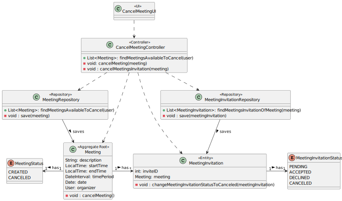
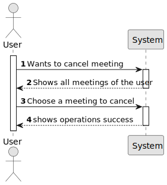
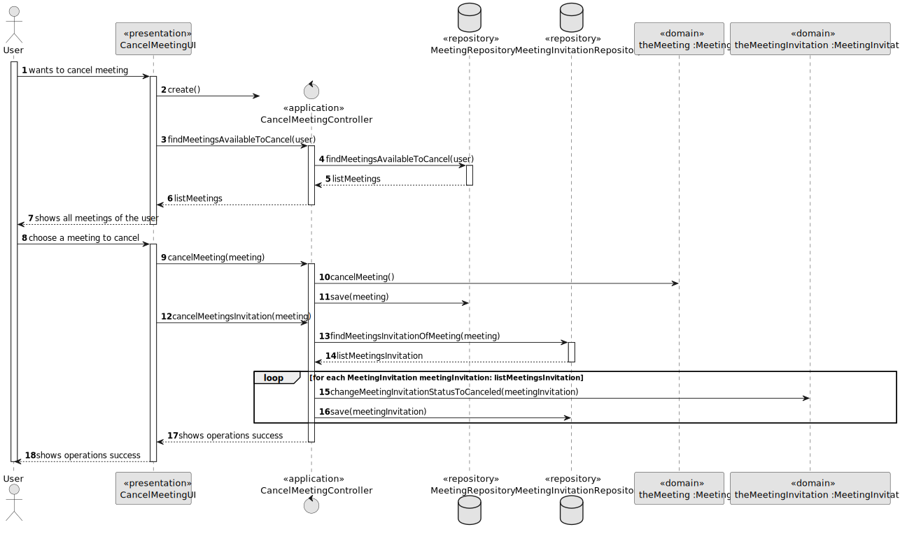
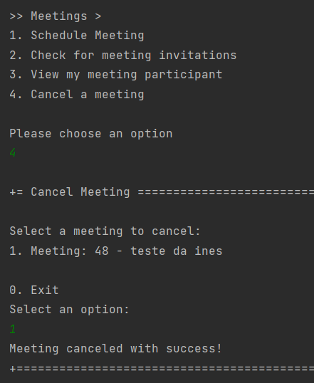
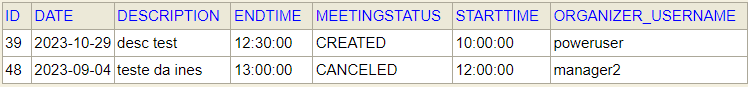
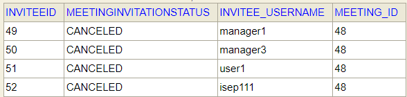

# US 4002 - As a User, I want to cancel a meeting

## 1. Context

*Implement a functionality that cancels a meeting.*

## 2. Requirements

**US 4002 -** As a User, I want to cancel a meeting

### 2.1 Dependencies
For this to happen the system may already have meetings in the database. <br>
This US has dependencies on US´s 4001 and 1001.


## 3. Analysis

To implement this US, it was decided to first search all the meetings of the user that are available to cancel and select one. After that it is necessary to cancel the meeting invitations of that meeting as well.
Notes:
* The meetings available are only the ones with status CREATED

## 4. Design

### 4.1. Realization
First it's listed the meetings of the user whose status is CREATED and has not started yet. <br>
After the selection of the meeting, the status of it is changed to "CANCELED". <br>
It's not over yet because it is necessary to cancel the meeting invitations too. For this, it is used a loop that iterates every meeting invitation of the meeting selected and changes the status to "CANCELED". <br>

*Notes:*
* We find the meetings available to cancel by comparing the date and hour of the meeting with the current date and hour. In addition, we also need to check if the status of the meeting is CREATED.
* Only the meeting invitations with status ACCEPTED or PENDING are going to change the status to CANCELED

### 4.2. Diagrams

#### 4.2.1 Class Diagram - CD



#### 4.2.2. System Sequence Diagram - SSD



#### 4.2.3 Sequence Diagram - SD



* In this US we search for the meetings of the user in the repository with the status CREATED. <br>
* After showing the list of meetings the user selects one. <br>
* To cancel a meeting we go to de domain class and change the status to CANCELED and then save/update the meeting in the repository (MeetingRepository). <br>
* It is also necessary to cancel the meeting invitations to conclude this. To do it, we search for all the meeting invitations (with status ACCEPTED or PENDING) of the selected meeting in the repository (MeetingInvitationRepository). <br>
* After getting the list, through a loop, we access to the domain class (MeetingInvitation) to change the status of the meeting invitation to CANCELED and then save/update it in the repository (MeetingInvitationRepository).

### 4.3. Applied Patterns

Controller

### 4.4. Tests

#### Meeting Tests
```` java
  @org.junit.jupiter.api.Test
    void ensureCanCancelMeetingWithStatusCreated() {
        meeting1.cancelMeeting();
        Assert.assertEquals(MeetingStatus.CANCELED, meeting1.meetingStatus());
    }

````
```` java
    @org.junit.jupiter.api.Test
    void ensureCantCancelMeetingWithStatusCanceled() {
        meeting1.cancelMeeting();
        // Verifica se o status da reunião permanece o mesmo (não é alterado)
        Assert.assertNotEquals(MeetingStatus.CANCELED, meeting.meetingStatus());
    }

````

#### Meeting Invitation Tests
```` java
    @org.junit.jupiter.api.Test
    void ensureCanCancelMeetingInvitationWithStatusAccepted() {
        meetingInvitation.setMeetingInvitationStatus(MeetingInvitationStatus.ACCEPTED);
        meetingInvitation.changeMeetingInvitationStatusToCanceled(meetingInvitation);
        Assert.assertEquals(MeetingInvitationStatus.CANCELED, meetingInvitation.meetingInvitationStatus());
    }
````
```` java
    @org.junit.jupiter.api.Test
    void ensureCanCancelMeetingInvitationWithStatusPending() {
        meetingInvitation.changeMeetingInvitationStatusToCanceled(meetingInvitation);
        Assert.assertEquals(MeetingInvitationStatus.CANCELED, meetingInvitation.meetingInvitationStatus());
    }
````
```` java
    @org.junit.jupiter.api.Test
    void ensureCantCancelMeetingInvitationWithStatusCanceled() {
        meetingInvitation.setMeetingInvitationStatus(MeetingInvitationStatus.CANCELED);
        meetingInvitation.changeMeetingInvitationStatusToCanceled(meetingInvitation);
        // Verifica se o status do convite permanece o mesmo (não é alterado)
        Assert.assertEquals(MeetingInvitationStatus.CANCELED, meetingInvitation.meetingInvitationStatus());
    }
````
```` java
   @org.junit.jupiter.api.Test
    void ensureCantCancelMeetingInvitationWithStatusDeclined() {
        meetingInvitation.setMeetingInvitationStatus(MeetingInvitationStatus.DECLINED);
        meetingInvitation.changeMeetingInvitationStatusToCanceled(meetingInvitation);
        // Verifica se o status do convite permanece o mesmo (não é alterado)
        Assert.assertNotEquals(MeetingInvitationStatus.CANCELED, meetingInvitation.meetingInvitationStatus());
    }
````

## 5. Implementation

As we can see in the images bellow, US 4002 has been implemented. </br>

**Cancel Meeting Controller:**

```` java
public class CancelMeetingController {
    private AuthorizationService authorizationService = AuthzRegistry.authorizationService();
    private MeetingInvitationRepository meetingInvitationRepository = PersistenceContext.repositories().meetingInvitationRepository();
    private MeetingRepository meetingRepository = PersistenceContext.repositories().meetingRepository();

    public Iterable<Meeting> findMeetingsAvailableToCancel(SystemUser user){
        return meetingRepository.findMeetingsAvailableToCancel(user);
    }

    public void cancelMeeting(Meeting meeting){
        meeting.cancelMeeting();
        meetingRepository.save(meeting);
    }

    public void cancelMeetingInvitations(Meeting meeting) {
        Iterable<MeetingInvitation> listMeetingsInvitation = meetingInvitationRepository.findMeetingsInvitationOfMeeting(meeting);
        for (MeetingInvitation meetingInvitation: listMeetingsInvitation){
            meetingInvitation.changeMeetingInvitationStatusToCanceled(meetingInvitation);
            meetingInvitationRepository.save(meetingInvitation);
        }
    }
}
````

**Cancel Meeting UI:**

```` java
public class CancelMeetingUI extends AbstractUI {

    private AuthorizationService authorizationService = AuthzRegistry.authorizationService();

    CancelMeetingController theController = new CancelMeetingController();

    @Override
    protected boolean doShow() {
        Iterable<Meeting> listMeetings = theController.findMeetingsAvailableToCancel(authorizationService.session().get().authenticatedUser());
        if (!listMeetings.iterator().hasNext()) {
            System.out.println("There are no available meetings for you!");
        } else {
            Meeting meeting = chooseMeeting("Select a meeting to cancel: ", listMeetings);
            if(meeting != null) {
                theController.cancelMeeting(meeting);
                theController.cancelMeetingInvitations(meeting);
                System.out.println("Meeting canceled with success!");
            }
        }
        return false;
    }

    private Meeting chooseMeeting(String message, Iterable<Meeting> meetingList) {
        final SelectWidget<Meeting> selector = new SelectWidget<>(message, meetingList);
        selector.show();
        return selector.selectedElement();
    }

    @Override
    public String headline() {
        return "Cancel Meeting";
    }
}
````

**Meeting Repository:**

```` java
 Iterable<Meeting> findMeetingsAvailableToCancel(SystemUser user);
````

**Jpa Meeting Repository:**

```` java
 @Override
    public Iterable<Meeting> findMeetingsAvailableToCancel(SystemUser user) {
        final TypedQuery<Meeting> query = entityManager().createQuery(
                "SELECT meeting FROM Meeting meeting" +
                        " WHERE meeting.organizer = :user" +
                        " AND meetingStatus = :meetingStatus" +
                        " AND (meeting.date > :currentDate" +
                        " OR (meeting.date = :currentDate AND meeting.startTime > :currentTime))",
                Meeting.class);
        query.setParameter("user", user);
        query.setParameter("meetingStatus", MeetingStatus.CREATED);
        query.setParameter("currentDate", Date.from(Instant.now()));
        query.setParameter("currentTime", LocalTime.now());
        return query.getResultList();
    }
````

**Meeting:**

```` java 
    public void cancelMeeting() {
        if (meetingStatus.equals(MeetingStatus.CREATED)) {
            this.meetingStatus = MeetingStatus.CANCELED;
        }
    }
````

**Meeting Invitation Repository:**

```` java
Iterable<MeetingInvitation> findMeetingsInvitationOfMeeting(Meeting meeting);
````

**Jpa Meeting Invitation Repository:**

```` java 
    @Override
    public Iterable<MeetingInvitation> findMeetingsInvitationOfMeeting(Meeting meeting) {
         final TypedQuery<MeetingInvitation> query = entityManager().createQuery(
                "SELECT meetingInvitation FROM MeetingInvitation meetingInvitation WHERE meetingInvitation.meeting = :meeting AND (meetingInvitation.meetingInvitationStatus = :statusA OR meetingInvitation.meetingInvitationStatus = :statusP )",
                MeetingInvitation.class);

        query.setParameter("meeting", meeting);
        query.setParameter("statusA", MeetingInvitationStatus.ACCEPTED);
        query.setParameter("statusP", MeetingInvitationStatus.PENDING);
        return query.getResultList();
    }
`````

**Meeting Invitation Repository:**

```` java 
    public void changeMeetingInvitationStatusToCanceled(MeetingInvitation meetingInvitation){
        if(meetingInvitation.meetingInvitationStatus == MeetingInvitationStatus.ACCEPTED || meetingInvitation.meetingInvitationStatus == MeetingInvitationStatus.PENDING){
            this.meetingInvitationStatus = MeetingInvitationStatus.CANCELED;
        }
    }
````

*In this section the team should present, if necessary, some evidences that the implementation is according to the design. It should also describe and explain other important artifacts necessary to fully understand the implementation like, for instance, configuration files.*

*It is also a best practice to include a listing (with a brief summary) of the major commits regarding this requirement.*

## 6. Integration/Demonstration

The image bellow shows a meeting being canceled.

 </br>

In the image bellow we can see the confirmation that the meeting was canceled.

 </br>

Next, it is the confirmation that the meeting invitation related with the meeting above was canceled.

 </br>

*In this section the team should describe the efforts realized in order to integrate this functionality with the other parts/components of the system*

*It is also important to explain any scripts or instructions required to execute an demonstrate this functionality*

## 7. Observations

Access to the repository is always done in the same way.
For this reason, an example sequence diagram has been created to demonstrate this. To exemplify, we list all existing questions in the repository of questions.


Like the repositories, the authentication part always follows the same order of ideas.
In this way, we perform a general SD that demonstrates the entire process. In the diagram, US 1008 is taken as an example,
as a Student, I want to request my enrollment in a course.


*This section should be used to include any content that does not fit any of the previous sections.*

*The team should present here, for instance, a critical prespective on the developed work including the analysis of alternative solutioons or related works*

*The team should include in this section statements/references regarding third party works that were used in the development this work.*