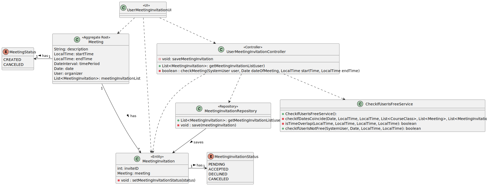
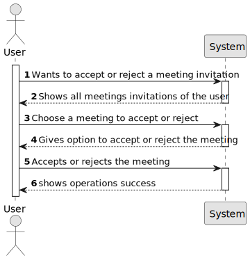

# US 4003 - As User, I want to accept or reject a meeting request

## 1. Context

Implement a functionality so that the user can accept or reject a meeting request.

## 2. Requirements

This US description is "As User, I want to accept or reject a meeting request".

• FRM03 Accept/Reject Meeting A user accepts or rejects an invitation to a meeting

## 3. Analysis

This US consists of an user being able to accept or reject a meeting request. To do this, the user must
choose a meeting request from a list of meeting requests that he owns. After choosing the meeting request the user
will accept or reject it, if he/she accepts it then the system will check if the user is available at the time of the meeting, if he/she is available then the system will accept the meeting request, if he/she is not available then the system will reject the meeting request. 
If the user rejects the meeting request then the system will reject the meeting request
without checking if the user is available.

## 4. Design

### 4.1. Realization

To do this US, the first step is to show the user all the meeting requests that he owns. 
After that he/she must choose a meeting request and then accept or reject it.


### 4.2. Diagrams

#### 4.2.1- Class Diagram - CD



#### 4.2.2. System Sequence Diagram - SSD



#### 4.2.3. Sequence Diagram - SD


#### 4.3. Applied Patterns

Controller and Service.

### 4.4. Tests

```
/**
     * Test equals.
     */
    @org.junit.jupiter.api.Test
    void testEquals() {
        Assert.assertEquals(meetingInvitationExpected,meetingInvitation);
    }

    /**
     * Invitee id.
     */
    @org.junit.jupiter.api.Test
    void inviteeID() {
        Assert.assertEquals(invited.identity(),meetingInvitation.invitee().identity());
    }

    /**
     * Meeting invitation status.
     */
    @org.junit.jupiter.api.Test
    void meetingInvitationStatus() {
        Assert.assertEquals(MeetingInvitationStatus.PENDING,meetingInvitation.meetingInvitationStatus());
    }

    /**
     * Meeting.
     */
    @org.junit.jupiter.api.Test
    void meeting() {
        Assert.assertEquals(meeting,meetingInvitation.meeting());
    }

    /**
     * Invitee.
     */
    @org.junit.jupiter.api.Test
    void invitee() {
        Assert.assertEquals(invited,meetingInvitation.invitee());
    }

    /**
     * Accept meeting.
     */
    @org.junit.jupiter.api.Test
    void acceptMeeting() {
        Assert.assertEquals(MeetingInvitationStatus.ACCEPTED,meetingInvitation.acceptMeeting());
    }

    /**
     * Decline meeting.
     */
    @org.junit.jupiter.api.Test
    void declineMeeting() {
        Assert.assertEquals(MeetingInvitationStatus.DECLINED,meetingInvitation.declineMeeting());
    }

    /**
     * Identity.
     */
    @org.junit.jupiter.api.Test
    void identity() {
        Assert.assertEquals(meetingInvitation.identity(),meetingInvitation.identity());
    }


    @org.junit.jupiter.api.Test
    void sameAs() {
        Assert.assertEquals(true,meetingInvitation.sameAs(meetingInvitationExpected));
    }

    /**
     * Sets meeting.
     */
    @org.junit.jupiter.api.Test
    void setMeeting() {
        meetingInvitation.setMeeting(meetingTest);
        Assert.assertEquals(meetingTest,meetingInvitation.meeting());

    }

    /**
     * Sets meeting invitation status.
     */
    @org.junit.jupiter.api.Test
    void setMeetingInvitationStatus() {
        meetingInvitation.setMeetingInvitationStatus(MeetingInvitationStatus.ACCEPTED);
        Assert.assertEquals(MeetingInvitationStatus.ACCEPTED,meetingInvitation.meetingInvitationStatus());

    }


    @org.junit.jupiter.api.Test
    void ensureCanCancelMeetingInvitationWithStatusAccepted() {
        meetingInvitation.setMeetingInvitationStatus(MeetingInvitationStatus.ACCEPTED);
        meetingInvitation.changeMeetingInvitationStatusToCanceled(meetingInvitation);
        Assert.assertEquals(MeetingInvitationStatus.CANCELED, meetingInvitation.meetingInvitationStatus());
    }

    @org.junit.jupiter.api.Test
    void ensureCanCancelMeetingInvitationWithStatusPending() {
        meetingInvitation.changeMeetingInvitationStatusToCanceled(meetingInvitation);
        Assert.assertEquals(MeetingInvitationStatus.CANCELED, meetingInvitation.meetingInvitationStatus());
    }


    @org.junit.jupiter.api.Test
    void ensureCantCancelMeetingInvitationWithStatusCanceled() {
        meetingInvitation.setMeetingInvitationStatus(MeetingInvitationStatus.CANCELED);
        meetingInvitation.changeMeetingInvitationStatusToCanceled(meetingInvitation);
        // Verifica se o status do convite permanece o mesmo (não é alterado)
        Assert.assertEquals(MeetingInvitationStatus.CANCELED, meetingInvitation.meetingInvitationStatus());
    }

    @org.junit.jupiter.api.Test
    void ensureCantCancelMeetingInvitationWithStatusDeclined() {
        meetingInvitation.setMeetingInvitationStatus(MeetingInvitationStatus.DECLINED);
        meetingInvitation.changeMeetingInvitationStatusToCanceled(meetingInvitation);
        // Verifica se o status do convite permanece o mesmo (não é alterado)
        Assert.assertNotEquals(MeetingInvitationStatus.CANCELED, meetingInvitation.meetingInvitationStatus());
    }

    @Test
    public void testSameAs() {
        Assertions.assertTrue(meetingInvitation.sameAs(meetingInvitationExpected));
        Assertions.assertTrue(meetingInvitation.sameAs(meetingInvitation));
        Assertions.assertFalse(meetingInvitation.sameAs("other"));
    }

    @Test
    public void testToString() {
        String expected = "Meeting - " + meeting;
        Assert.assertEquals(meetingInvitation.toString(), expected);
    }
````

## 5. Implementation

**UserMeetingInvitationUI:**
```
protected boolean doShow() {

        List<MeetingInvitation> meetingInvitationList = null;
        meetingInvitationList = theController.getMeetingInvitationList();

        if (!meetingInvitationList.isEmpty()) {
            System.out.println("You have the following meeting invitations:");
            for (int i = 0; i < meetingInvitationList.size(); i++) {
                MeetingInvitation meetingInvitation = meetingInvitationList.get(i);
                Meeting meeting = meetingInvitation.meeting();

                System.out.println("Invitation ID: " + meetingInvitation.identity());
                System.out.println("Meeting: " + meeting.identity() + " - " + meeting.description());
                System.out.println("Organizer: " + meeting.organizer().username());
                System.out.println("Start Date: " + meeting.getDate());
                System.out.println("Start Time: " + meeting.getStartTime());
                System.out.println("End Time: " + meeting.getEndTime());
                System.out.println("Status: " + meetingInvitation.meetingInvitationStatus());
                System.out.println("--------------------------------------------------");
            }

            // Prompt for invitation selection
            System.out.print("Enter the Invitation ID to accept or decline: ");
            Scanner scanner = new Scanner(System.in);
            String invitationId = scanner.nextLine();

            MeetingInvitation selectedInvitation = null;
            for (MeetingInvitation invitation : meetingInvitationList) {
                if (invitation.identity().toString().equals(invitationId)) {
                    selectedInvitation = invitation;
                    break;
                }
            }

            if (selectedInvitation != null) {
                // Prompt for status update
                System.out.println("Select an option:");
                System.out.println("1. Accept");
                System.out.println("2. Decline");
                System.out.print("Enter the option number: ");
                String optionInput = scanner.nextLine();

                MeetingInvitationStatus status = MeetingInvitationStatus.PENDING;

                if (optionInput.equals("1")) {
                    status = MeetingInvitationStatus.ACCEPTED;
                } else if (optionInput.equals("2")) {
                    status = MeetingInvitationStatus.DECLINED;
                } else {
                    System.out.println("Invalid option.");
                    return false;
                }

                if (status == MeetingInvitationStatus.ACCEPTED) {
                    // Check if user is free
                    if (theController.checkMeeting(theController.getUser(), selectedInvitation.meeting().getDate(), selectedInvitation.meeting().getStartTime(), selectedInvitation.meeting().getEndTime())) {
                        selectedInvitation.setMeetingInvitationStatus(status);
                        theController.saveMeetingInvitation(selectedInvitation);
                        System.out.println("Invitation status updated successfully to " + status + ".");
                    } else {
                        System.out.println("You are not free at the selected time.");
                    }
                } else {
                    selectedInvitation.setMeetingInvitationStatus(status);
                    theController.saveMeetingInvitation(selectedInvitation);
                    System.out.println("Invitation status updated successfully to " + status + ".");
                }


            } else {
                System.out.println("Invalid invitation ID.");
            }


        } else {
            System.out.println("You have no meeting invitations.");
            return false;
        }

        return true;
    }
```

**UserMeetingInvitationController:**
```
public List<MeetingInvitation>getMeetingInvitationList() {

        return (List<MeetingInvitation>) meetingInvitationRepository.findMeetingInvitationOfUserWithStatusPending(getUser());
    }

    public SystemUser getUser() {
        SystemUser systemUser;
        if (authorizationService.session().isPresent()) {
            systemUser = this.authorizationService.session().get().authenticatedUser();
            return systemUser;
        }
        return null;
    }

    public void saveMeetingInvitation(MeetingInvitation meetingInvitation) {
        meetingInvitationRepository.save(meetingInvitation);
    }

    public boolean checkMeeting(SystemUser user, Date dateOfMeeting, LocalTime startTime, LocalTime endTime) {

        System.out.println("\nValidating Meeting/Invitation...");

        if (checkIfUserIsFreeService.checkIfUserIsNotFree(user, dateOfMeeting, startTime, endTime)) {
            return false;
        } else {
            return true;
        }

    }
````

**CheckIfUserIsFreeService:**
```
public boolean checkIfUserIsNotFree(SystemUser user, Date date, LocalTime startTime, LocalTime endTime) {
        List<CourseClass> courseClassList = new ArrayList<>();
        List<Meeting> meetingList = new ArrayList<>();
        List<MeetingInvitation> meetingInvitationList = new ArrayList<>();

        if (user.hasAll(BaseRoles.TEACHER)) {
            Optional<Teacher> optionalTeacher = teacherRepository.findBySystemUser(user);
            if (optionalTeacher.isPresent()) {
                Teacher teacher = optionalTeacher.get();
                courseClassList.addAll((Collection<? extends CourseClass>) courseClassRepository.findClassesOfTeacher(teacher));
                meetingList.addAll((Collection<? extends Meeting>) meetingRepository.findMeetingOfUser(teacher.user()));
                meetingInvitationList.addAll((Collection<? extends MeetingInvitation>) meetingInvitationRepository.findMeetingInvitationOfUserWithStatusAccepted(teacher.user()));
            } else {
                throw new IllegalArgumentException("TEACHER NOT FOUND WHEN CHECKING IF USER IS FREE");
            }
        }

        if (user.hasAll(BaseRoles.STUDENT)) {
            Student student = studentRepository.findBySystemUser(user);
            courseClassList.addAll((Collection<? extends CourseClass>) courseClassRepository.findClassesOfStudent(student));
            meetingList.addAll((Collection<? extends Meeting>) meetingRepository.findMeetingOfUser(student.user()));
            meetingInvitationList.addAll((Collection<? extends MeetingInvitation>) meetingInvitationRepository.findMeetingInvitationOfUserWithStatusAccepted(student.user()));
        }

        if (user.hasAny(BaseRoles.POWER_USER, BaseRoles.MANAGER)) {
            meetingList.addAll((Collection<? extends Meeting>) meetingRepository.findMeetingOfUser(user));
            meetingInvitationList.addAll((Collection<? extends MeetingInvitation>) meetingInvitationRepository.findMeetingInvitationOfUserWithStatusAccepted(user));
        }

        return checkIfDatesCoincide(date, startTime, endTime, courseClassList, meetingList, meetingInvitationList);
    }

    private boolean checkIfDatesCoincide(Date date, LocalTime startTime, LocalTime endTime,
                                         List<CourseClass> courseClassList, List<Meeting> meetingList,
                                         List<MeetingInvitation> meetingInvitationList) {
        for (CourseClass courseClass : courseClassList) {
            if (courseClass.getDateOfCourseClass().equals(date) && isTimeOverlap(startTime, endTime, courseClass.getStartTime(), courseClass.getEndTime())) {
                return true;
            }
        }

        for (Meeting meeting : meetingList) {
            if (meeting.getDate().equals(date) && isTimeOverlap(startTime, endTime, meeting.getStartTime(), meeting.getEndTime())) {
                return true;
            }
        }

        for (MeetingInvitation meetingInvitation : meetingInvitationList) {
            Meeting meeting = meetingInvitation.meeting();
            if (meeting.getDate().equals(date) && isTimeOverlap(startTime, endTime, meeting.getStartTime(), meeting.getEndTime())) {
                return true;
            }
        }

        return false;
    }

    private boolean isTimeOverlap(LocalTime startTime1, LocalTime endTime1, LocalTime startTime2, LocalTime endTime2) {
        return startTime1.isBefore(endTime2) && endTime1.isAfter(startTime2) ||
                startTime2.isBefore(endTime1) && endTime2.isAfter(startTime1) ||
                startTime1.equals(startTime2) && endTime1.equals(endTime2);
    }
```

## 6. Integration/Demonstration

```
+= Base [ @isep111 ]
+==============================================================================+


1. My account >
2. Courses >
3. Shared Boards >
4. Enrollments >
5. Meetings >
6. Exams >
--------------
0. Exit

Please choose an option
5

>> Meetings >
1. Schedule Meeting
2. Check for meeting invitations
3. View my meeting participants
0. Return
4. Cancel a meeting

Please choose an option
2

+= User Meeting Invitation ====================================================+

You have the following meeting invitations:
Invitation ID: 82
Meeting: 81 - oifaihsaifsaihfajnfe
Organizer: manager1
Start Date: 2023-06-20
Start Time: 10:00
End Time: 10:50
Status: PENDING
--------------------------------------------------
Enter the Invitation ID to accept or decline: 82
Select an option:
1. Accept
2. Decline
   Enter the option number: 1

Validating Meeting/Invitation...
Invitation status updated successfully to ACCEPTED.
+==============================================================================+
```
**Database:**
```
82,ACCEPTED,isep111,81
83,ACCEPTED,manager2,81
85,DECLINED,manager2,84
86,CANCELED,user1,84
87,CANCELED,isep222,84
88,CANCELED,isep444,84
```
