# US 4004 - As User, I want to view a list of participants in my meeting and their status (accept or reject)

## 1. Context

*Implement a functionality that allows every user to view the list of participants in their meeting and their status (accept or reject).*

## 2. Requirements

**US 4004 -** As User, I want to view a list of participants in my meeting and their status (accept or reject)

## 3. Analysis

*This US has several dependencies. To be able to show your implementation, you will first need to create a meeting (US 4001 held in the last sprint)
and send invitations to desired participants. Recipients can accept, reject, or simply ignore (US 4003). With the previous steps, it is now possible 
for the user to view participants of his meeting, or meetings that he accepted the invitation.*

## 4. Design

### 4.1. Realization

To implement this US, it was decided that first the system would ask the user if he wanted to see the participants of a meeting that he created or that he was invited.
- If it was the first option, the system would display a list of all logged meetings created by the user. </br>
Then the user would choose the meeting they want to see the list of participants and their status.
In this list, the username will be shown and only if he accepted or declined the invitation. If the user has not yet responded to the invitation (pending), it will not be displayed.* </br>
This option uses two queries. Initially, we use one that returns the list of meetings that the logged-in user created, not including those that have already been canceled, so that he can then proceed to choose the meeting for which he wants to see the list of participants.
The second will return exactly what the US asks for, the participants of the previously chosen meeting whose invitation status is accepted or declined*

- If it is the second option, the system shows all the meetings in which the user accepted the invite, that is, if he was invited and declined the invitation, he will not have access to its participants. </br>
Therefore, he chooses the desired one and it will be the same logic as the first option, with the addition that the system will show the owner of the selected meeting.


### 4.2. Class Diagram

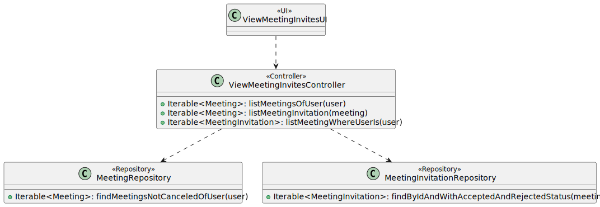

#### 4.2.2. System Sequence Diagram - SSD

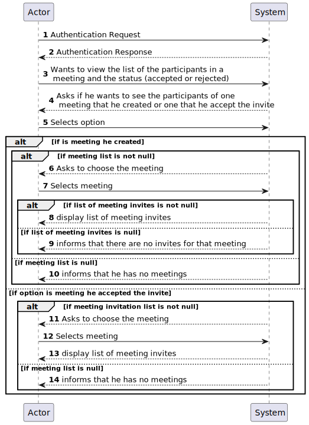

#### 4.2.3 Sequence Diagram - SD

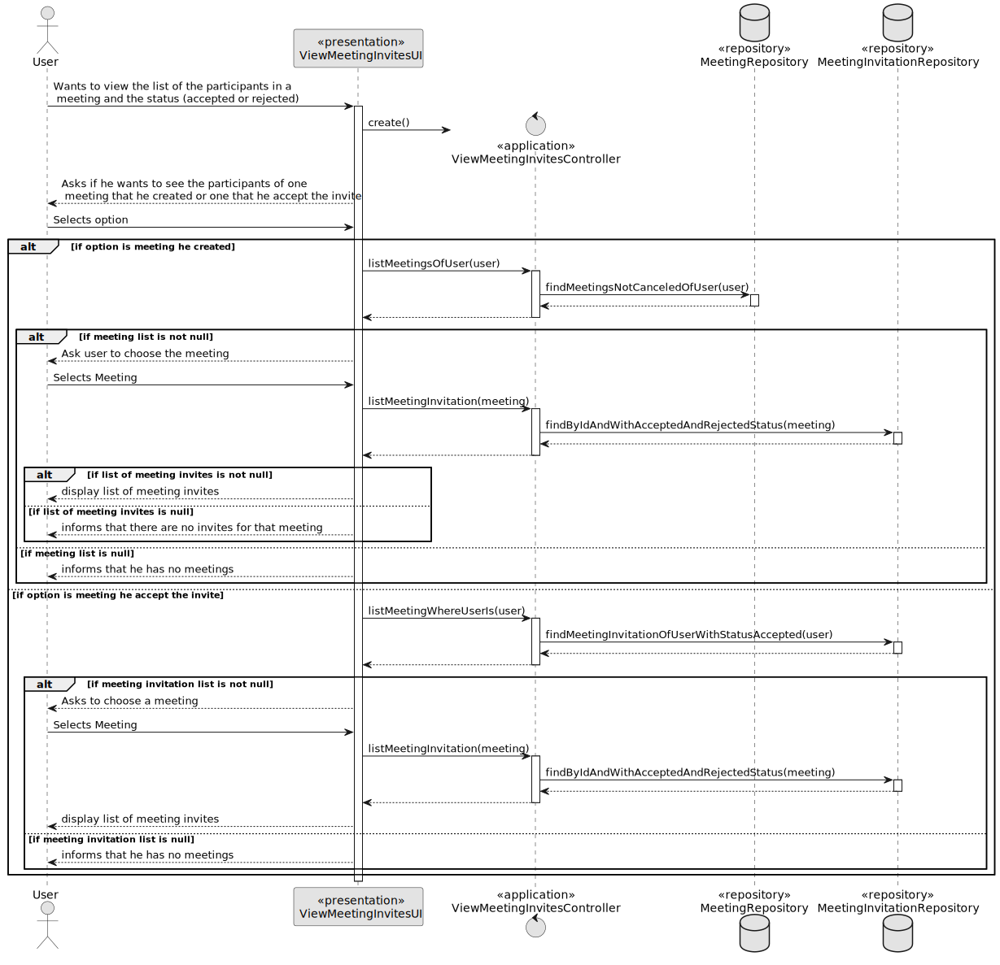
Initially, the user wants to see the list of participants of a meeting. The system asks if you want to see the list of a meeting that it created or that accepted the invitation.
- If it is the first option, the system will fetch from the meeting repository the list of meetings that the user has created and that have not been cancelled. He selects the desired one and the list of participants is shown, if any.
- If it is the second option, we see that there is a difference, since there will always be participants for the selected meeting, himself and the owner.

### 4.3. Applied Patterns

* Controller

### 4.4. Tests

*It wasn't done any tests to repositories methods, only at the domain level, because of not being required at this stage to do so.*

## 5. Implementation

**View Meeting Invites UI:**
In the UI of this functionality, first the user selects whether he wants to see the participants of meetings that he is the creator of or of meetings that he has accepted the invitation.
- If you select the first option, the user will have to choose a meeting and then the users who accepted or declined the invitation, if any, will be shown.
- If you select the second option, after selecting the desired meeting, the owner of the selected meeting will be indicated, as well as its participants.

```
    @Override
    protected boolean doShow() {
        System.out.println("You want to see the participants of your meeting or meeting you were invite?");
        System.out.println("1. My meetings");
        System.out.println("2. Meetings I was invite");
        System.out.println("0. Exit");

        final int option = Console.readOption(1, 2, 0);

        try {
            switch (option) {
                case 1:
                    System.out.println("Your meetings: \n");
                    Iterable<Meeting> meetingList = theController.listMeetingOfUser(authorizationService.session().get().authenticatedUser());
                    if (!meetingList.iterator().hasNext()) {
                        System.out.println("There are no available meetings for you!");
                    } else {
                        Meeting meeting = chooseMeeting("Select a meeting to see the participants: ", meetingList);

                        Iterable<MeetingInvitation> invitationList = theController.listMeetingInvitation(meeting);
                        if (!invitationList.iterator().hasNext()) {
                            System.out.println("This meeting has no participants!");
                        } else {
                            System.out.println("\nParticipants:");
                            for (MeetingInvitation invitation : invitationList) {
                                System.out.printf("User: %s"  + ", Status: %s\n", invitation.invitee().username(), invitation.meetingInvitationStatus());
                            }
                        }
                    }
                    break;
                case 2:
                    System.out.println("Meeting you were invite: \n");
                    Iterable<MeetingInvitation> meetingInvitationList = theController.listMeetingWhereUserIs(authorizationService.session().get().authenticatedUser());
                    if (!meetingInvitationList.iterator().hasNext()) {
                        System.out.println("There are no available meetings for you!");
                    } else {
                        MeetingInvitation meetingInvitation = chooseMeetingInvitation("Select a meeting to see the participants: ", meetingInvitationList);

                        Iterable<MeetingInvitation> invitationList = theController.listMeetingInvitation(meetingInvitation.meeting());

                        System.out.println("\nParticipants:\n");
                        System.out.printf("Owner: %s\n", meetingInvitation.meeting().organizer().username());
                        for (MeetingInvitation invitation : invitationList) {
                            System.out.printf("User: %s"  + ", Status: %s\n", invitation.invitee().username(), invitation.meetingInvitationStatus());
                        }
                    }
                    break;
                default:
                    System.out.println("No valid option selected.");
                    break;
            }
        } catch (IntegrityViolationException | ConcurrencyException ex) {
            LOGGER.error("Error performing the operation", ex);
            System.out.println(
                    "Unfortunately there was an unexpected error in the application. Please try again and if the problem persists, contact your system admnistrator.");
        }
        return true;
    }

    /**
     * Method used to show meeting list and select one meeting.
     *
     * @param message - message to be printed to the user, asking to select a meeting
     * @param meetingList - meeting list to choose from
     * @return meeting selected
     */
    private Meeting chooseMeeting(String message, Iterable<Meeting> meetingList) {
        final SelectWidget<Meeting> selector = new SelectWidget<>(message, meetingList);
        selector.show();
        return selector.selectedElement();
    }

    /**
     * Method used to show meeting (invitation) list and select one meeting associated with one meeting invitation.
     *
     * @param message - message to be printed to the user, asking to select a meeting
     * @param meetingInvitationList - meeting list to choose from
     * @return meeting selected
     */
    private MeetingInvitation chooseMeetingInvitation(String message, Iterable<MeetingInvitation> meetingInvitationList) {
        final SelectWidget<MeetingInvitation> selector = new SelectWidget<>(message, meetingInvitationList);
        selector.show();
        return selector.selectedElement();
    }

    @Override
    public String headline() {
        return "View Meeting Participants";
    }
}

````

**View Meetings Invites Controller:**

```
/**
     * This method returns the list of meetings that the user created.
     *
     * @param user the user who created the meeting
     * @return list of all meetings belonging to the user
     */
    @Transactional
    public Iterable<Meeting> listMeetingOfUser(SystemUser user) {
        return meetingRepository.findMeetingsNotCanceledOfUser(user);
    }


    /**
     * This method returns the list of meeting invitations with accept status of the user
     * @param user
     */
    @Transactional
    public Iterable<MeetingInvitation> listMeetingWhereUserIs(SystemUser user) {
        return meetingInvitationRepository.findMeetingInvitationOfUserWithStatusAccepted(user);
    }


    /**
     * This method returns the list of participants of a meeting that the user created.
     * Attendees whose invitation status is accepted or rejected will be shown.
     *
     * @param meeting the meeting that he wants to see the list
     * @return list of participants in the meeting and their status (accepted or declined)
     */
    @Transactional
    public Iterable<MeetingInvitation> listMeetingInvitation(Meeting meeting) {
        return meetingInvitationRepository.findByIdAndWithAcceptedAndRejectedStatus(meeting);
    }
````

**Jpa Meeting Repository:** *The query below will return all the meetings created by the user in question, except for the canceled ones.*
```
@Override
    public Iterable<Meeting> findMeetingsNotCanceledOfUser(SystemUser user) {
        final TypedQuery<Meeting> query = entityManager().createQuery(
                "SELECT meeting FROM Meeting meeting WHERE meeting.organizer = :user AND meeting.meetingStatus != :meetingStatus",
                Meeting.class);

        query.setParameter("user", user);
        query.setParameter("meetingStatus", MeetingStatus.CANCELED);

        return query.getResultList();
    }
````

**Jpa Meeting Invitation Repository:** *The first query will return all the meeting invites whose meeting corresponds to the one chosen 
by the user and will only show the participants who have already responded to the invitation, that is, who have accepted or rejected it.*
*The second query returns the meeting invites whose status is accepted from the user.*

```
@Override
    public Iterable<MeetingInvitation> findByIdAndWithAcceptedAndRejectedStatus(Meeting meeting) {
        TypedQuery<MeetingInvitation> meetingInvitation = entityManager().createQuery(
                "SELECT meetingInvitation FROM MeetingInvitation meetingInvitation WHERE meetingInvitation.meeting = :meeting" +
                        " AND (meetingInvitation.meetingInvitationStatus = :statusA OR meetingInvitation.meetingInvitationStatus = :statusB)",
                MeetingInvitation.class);
        meetingInvitation.setParameter("meeting", meeting);
        meetingInvitation.setParameter("statusA", MeetingInvitationStatus.ACCEPTED);
        meetingInvitation.setParameter("statusB", MeetingInvitationStatus.DECLINED);
        return meetingInvitation.getResultList();
    }
    
    
@Override
    public Iterable<MeetingInvitation> findMeetingInvitationOfUserWithStatusAccepted(SystemUser user) {
        final TypedQuery<MeetingInvitation> query = entityManager().createQuery(
                "SELECT meetingInvitation FROM MeetingInvitation meetingInvitation WHERE meetingInvitation.invitee = :user AND meetingInvitation.meetingInvitationStatus = 'ACCEPTED'",
                MeetingInvitation.class);

        query.setParameter("user", user);

        return query.getResultList();
    }
````

## 6. Integration/Demonstration
### List the participants of meetings that the User create

*Initially, manager1 created a meeting, in this case, "Manager 1 Meeting" and invited three teachers, teacher1, teacher2 and teacher3. 
Then, referring to US 4003, teacher1 accepted the invitation, teacher2 declined and teacher3 did not respond. In this way, for this meeting, 
it is expected that in its list of participants only the first two teachers with the corresponding status will appear. With the support of the last image, 
we see that the US has been implemented, since in fact, only the first two teachers appear with the status accepted and declined, respectively.* </br>

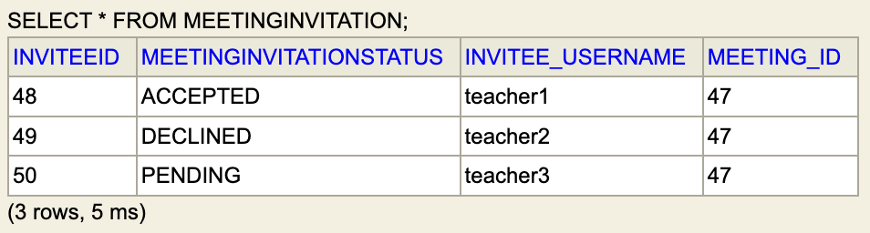 </br>

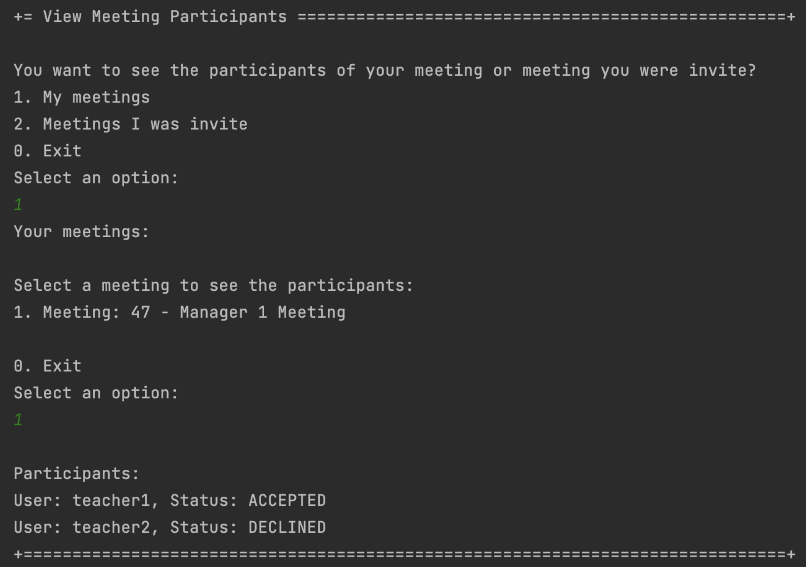 </br>

#### No Meetings
*If the user has not created any type of meeting, it will be indicated!*
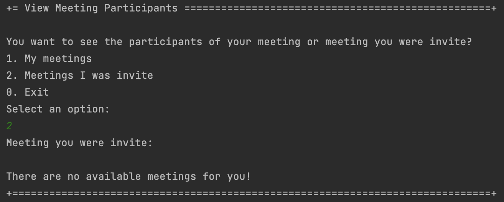 </br>

#### No participants
*If you have created meeting(s) but have not sent any invitations, you will be told that the selected meeting has no participants!*
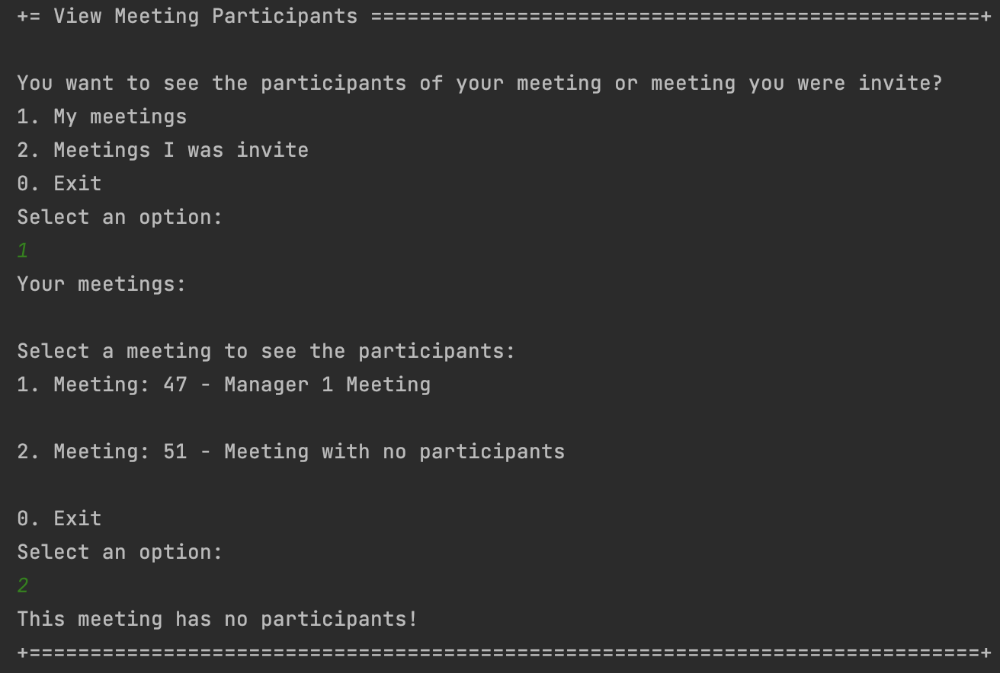 </br>


### Meeting Canceled
*In order to verify that, in fact, if the user cancels a meeting it will not be shown to him, we proceed to this situation.
In addition to the existing meetings, a third was created where two users, isep111 and isep222, were invited, in which they accepted and rejected, respectively. 
Before being cancelled, we can see that it appears available to its creator.* </br>
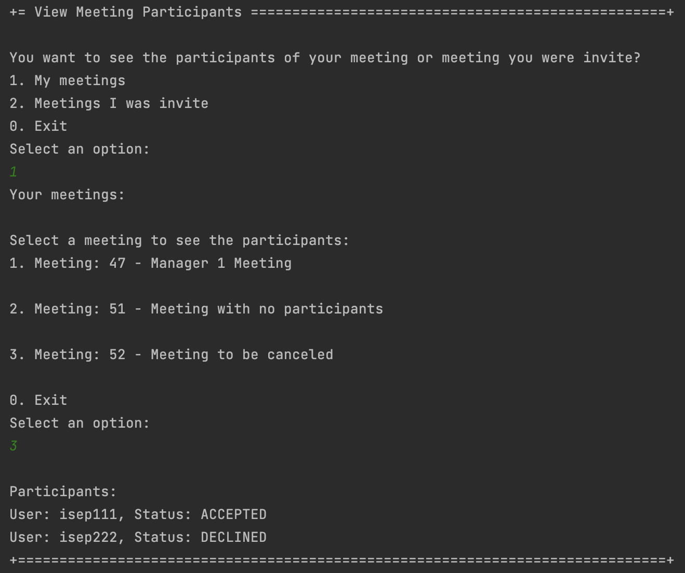 </br>

*The next step was to cancel one of the meetings, in the case of "Meeting to be canceled".*
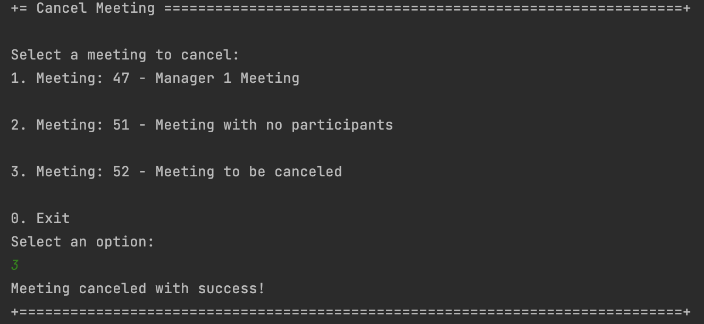 </br>

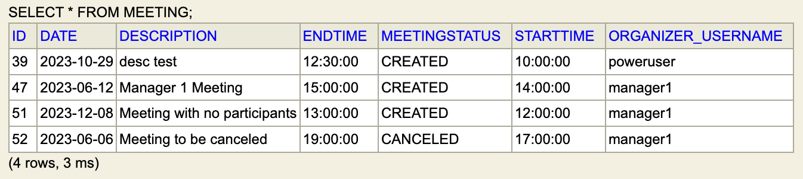 </br>
</br>
*In the image that we are seeing below, the list shown to the user is already updated, now the previously canceled meeting is no longer available.*
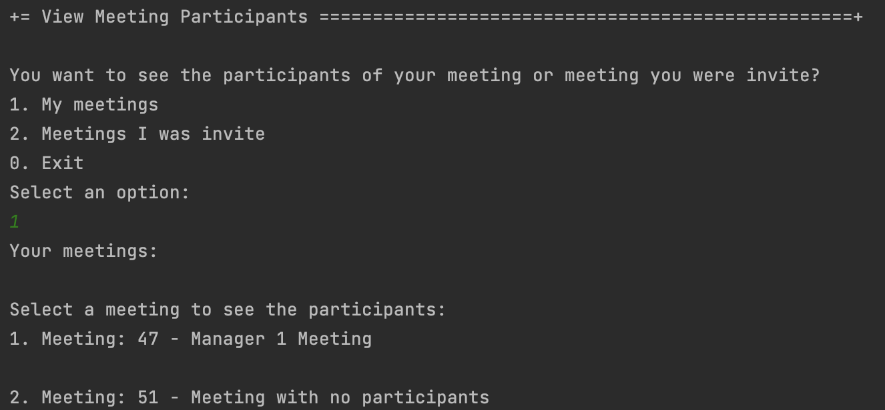 </br>


### List the participants of meetings that the User was invited

*In addition to being possible for meeting creators to see their participants, it is also possible for meeting participants to have access to the list. 
So teacher1 created one. meeting where she invited manager1, isep111, isep222 and isep333. manager1 and isep222 accepted and isep111 and isep333 refused, 
as you can see below.*
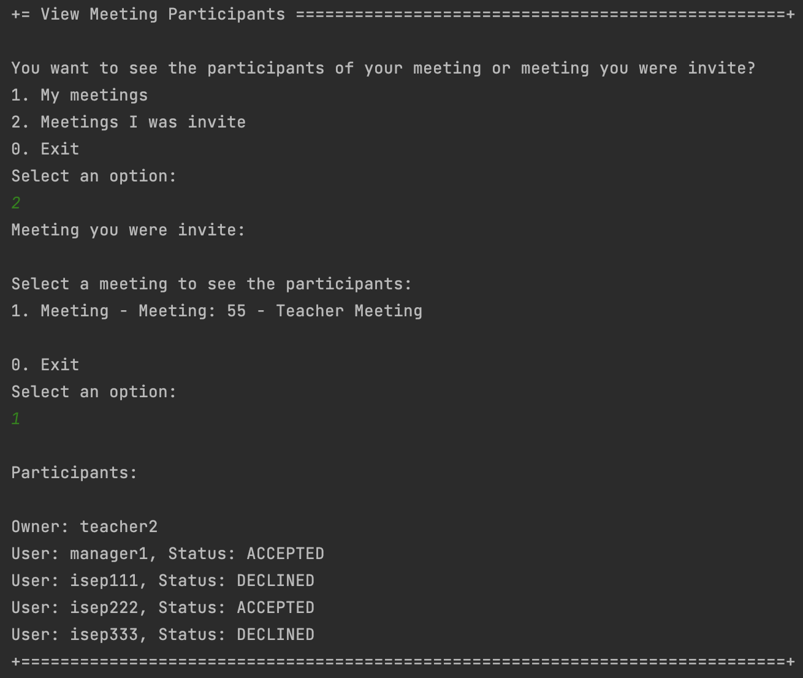

*However, as mentioned above, only those who accepted the invitation have access to this utility. This way, for example, isep333 will not have access to this meeting, as shown below.*
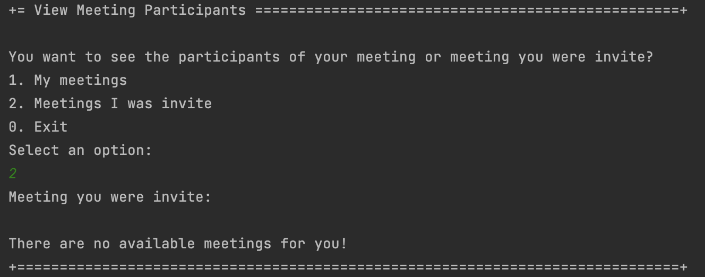


## 7. Observations

*The image below was taken from the forum and reinforces the idea already stated above. In addition to being able to see the participants of the meetings created by the user, 
it will also be possible for the user to see the participants of the meetings where he accepted the invite.*
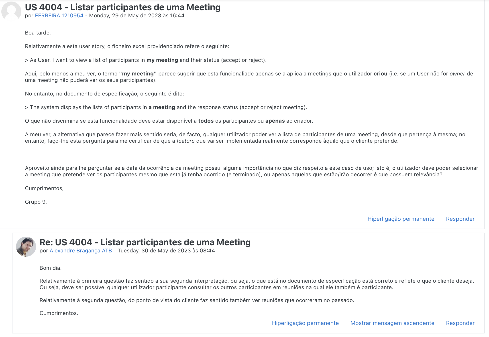

*The following question was addressed to the client:*
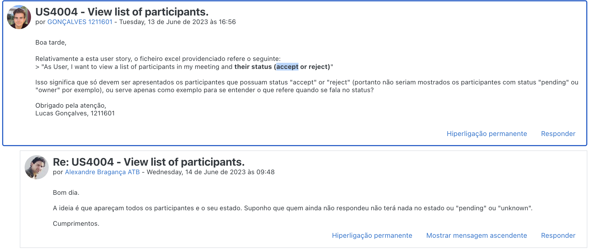
*Since this question was asked on deadline, we made a group decision to implement exactly what it says in the US, list the participants of a meeting and their status (accepted or rejected).*</br>

*Access to the repository is always done in the same way.
For this reason, an example sequence diagram has been created to demonstrate this. To exemplify, we list all existing questions in the repository of questions.*


*Like the repositories, the authentication part always follows the same order of ideas.
In this way, we perform a general SD that demonstrates the entire process. In the diagram, US 1008 is taken as an example,
as a Student, I want to request my enrollment in a course.*

