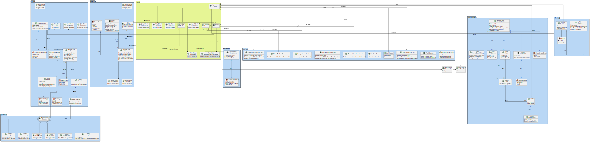

# US G002

## 1. Requirements

**US G002 -** As Project Manager, I want the team to elaborate a Domain Model using DDD.

- G002.1. A domain model must be created and maintained updated. 

- G002.2. The domain model should be included in the technical documentation of the repository.

## 2. Analysis

